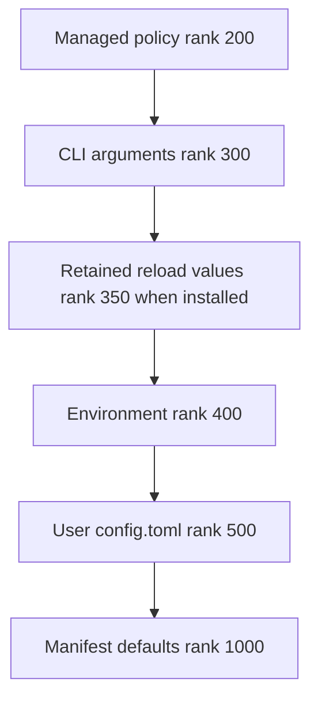
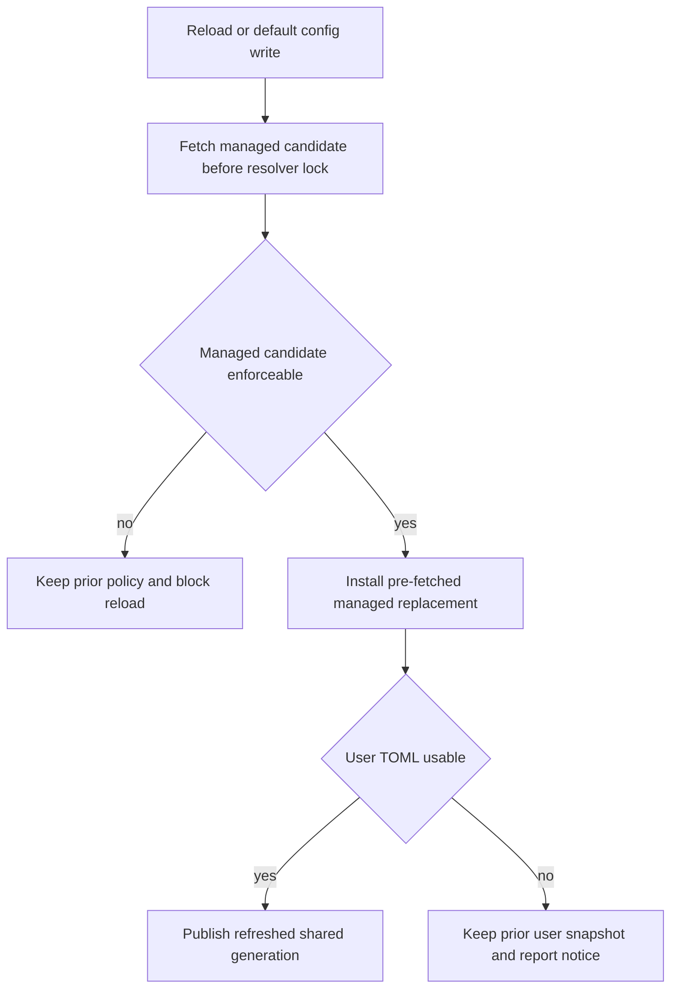
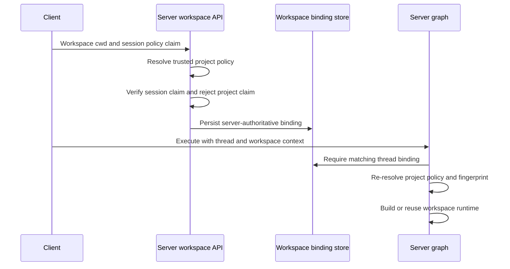

# dcode Configuration Layering

Deep Agents Code (`dcode`) resolves typed settings from ranked providers. Its consistency rule is to serve one coherent file-snapshot generation—even when that generation is stale—rather than expose an edit to only some readers. Managed policy has a stronger rule: a failed replacement must not drop a restriction and permit a lower-precedence value.

For model-specific settings, see [profiles and models](/openwiki/concepts/profiles-models.md). For the user-facing lifecycle, see [run a dcode session](/openwiki/workflows/run-dcode-session.md).

## Ranked sources

Configuration spans user, project, session, and runtime scopes: projects can supply shared defaults and integrations, while users retain personal credentials, preferences, skills, and local settings. The generic resolver is deliberately domain-neutral. Providers coerce their own inputs to `Found`, `Unset`, or `Invalid`; the resolver orders ranks, applies each option's merge strategy, and returns provenance and health.

For replacement settings, lower numeric rank wins:

The standard replacement precedence chain; the in-memory retained tier is installed only when reload continuity requires it.

Managed policy is the trust root and outranks the CLI, retained state, environment, and writable user file. `resolver_from_snapshots()` requires keyword-only `managed=` and `user=` arguments, preventing a same-typed snapshot transposition from assigning writable user data managed precedence. Provider ranks must be unique.

Every manifest option chooses `replace`, `union`, or `deep_merge`. Accumulating strategies combine valid tier contributions rather than behaving as replacement: this preserves deny-list restrictions and TOML sibling leaves. For those strategies the resolver excludes ordinary manifest defaults during combination, then applies a default fallback only if no tier supplied a value.

The parsed command line becomes an immutable `CliProvider` snapshot of the `argparse` namespace. The process accepts only one such provider, because one argv must produce one CLI tier. It may be installed without reading TOML for startup fast paths; an ad-hoc resolver has no CLI tier unless its caller explicitly supplies the installed provider.

## Shared generations and reload

`get_config_resolver()` owns the normal process-wide resolver cache, keyed by the default user-config and managed-policy paths. On first use it builds the chain from managed and user TOML snapshots, environment, manifest defaults, and any installed CLI provider. Ordinary readers through this resolver therefore observe one file generation. dcode does not watch configuration files: editing `config.toml` takes effect only after a generation advance.

There are three intentional read models:

- **Shared generation.** Managed and user TOML providers retain parsed snapshots. An edit becomes visible to shared readers only after refresh.
- **Direct snapshot.** A caller may parse a file itself when it needs the exact file health it inspected or precedence the shared chain cannot express. This is a per-caller exception, not a live-versus-cached decision for an individual option.
- **Active environment.** `EnvProvider` reads `active_environment()` on every resolution and is non-durable. It is normally live `os.environ`; `use_environment()` substitutes an immutable context-local mapping while a workspace is built.

A write through the in-app writer to the default config path refreshes the shared resolver, and `/reload` advances it as well. A write elsewhere does not. A committed write whose refresh fails leaves the old generation served until a later refresh or restart.

The managed candidate is acquired before the generation lock; only a usable replacement is installed under the lock.

`TomlFileProvider` keeps its last usable snapshot if a candidate is missing, unreadable, or malformed, while its status still reports the failed on-disk file. Consequently, an unparseable user `config.toml` retains earlier values and reload reports `Kept previous config.toml:`. A first failed read has no prior usable snapshot and falls through normally.

Managed policy is additionally validated for enforceability. Invalid enforced declarations, malformed known sections, and model values inconsistent with a managed allowed-model ceiling cannot replace the served policy. The managed candidate is fetched before locking and installed as an already-refreshed replacement, avoiding remote I/O while reads are locked and preventing a new user snapshot from getting ahead of policy. A policy failure blocks runtime reload rather than publishing lower-ranked settings.

For selected resolver-backed values that accepted runtime reload cannot reproduce, `_ReloadOverrideProvider` retains the accepted value in memory at rank 350. It is non-durable and atomically replaces its mapping; it is continuity state, not a persisted configuration source. Reload preview separately reads a fresh user candidate so it shows the edit under review, but deliberately does not refresh the managed-policy generation.

## Dotenv bootstrap and project trust

The dotenv environment is derived from an explicit mapping. Shell values win; the nearest enabled project `.env` and the profile global `.env` can fill absent keys. `resolve_read_project_dotenv()` runs before the project file is applied, so it parses configuration locally: it needs a trusted global-dotenv tier between process environment and user TOML that the shared resolver cannot represent, without turning dotenv bootstrap or each directory switch into a shared-generation side effect.

Project dotenv input is repository-controlled and cannot set user-level project-MCP allow/deny lists, Auto classifier model or timeout, forked-subagent mode, `LANGGRAPH_DEFAULT_RECURSION_LIMIT`, or `TERM_PROGRAM`. Trusted shell and global dotenv inputs remain eligible. If the global dotenv cannot be read while deciding whether to load the project file, dcode skips the project dotenv rather than losing a trusted opt-out. `resolve_env_var()` also gives a `DEEPAGENTS_CODE_`-prefixed credential or provider variable precedence over its canonical name; an explicitly empty prefixed variable suppresses the canonical one.

## Server configuration and workspace policy

The interactive client starts `langgraph dev` in a separate interpreter, so resolver memory is not shared. `ServerConfig` is the typed subprocess contract: the launcher derives it from CLI settings, normalizes relative paths before the process boundary, writes `DEEPAGENTS_CODE_SERVER_*` variables, and clears variables whose value is `None`. The server reconstructs the same dataclass from those variables. Its constructor fails early for invalid security-sensitive values, including an empty filesystem-tool allowlist or one that omits `read_file`.

A workspace has two deliberately distinct policy surfaces:

- **Client-held session claim:** CLI-derived fields for the invocation. The client may send this subset and its fingerprint, but the server requires exact agreement with its own resolved `ServerConfig`.
- **Server-trusted project policy:** MCP configuration, sandbox setup, extension paths, and project trust decisions. The client may never claim these fields; the server resolves them for the canonical workspace directory. For another project, inherited project policy is dropped rather than rediscovered or carried across the boundary.

The flow distinguishes a client claim checked for agreement from policy that only the server resolves and persists.

A durable SQLite binding records canonical workspace identity, a non-secret workspace policy JSON payload, and a configuration fingerprint for each thread. Binding rejects a different workspace or policy. During execution, `make_graph()` requires both a thread ID and workspace context, reads that binding, and rejects a changed project policy or server configuration fingerprint before selecting a runtime.

Workspace runtimes are cached by binding resource key in a 32-entry LRU cache. A configured sandbox is process-wide, so a second workspace cannot claim it. Before graph assembly, `_make_graphs()` derives the workspace dotenv mapping and `CredentialsSnapshot` in a worker thread, freezes the mapping, then runs construction in `use_environment(workspace_env)`. Resolver reads and credential-dependent assembly thus see that workspace snapshot rather than mutable server `os.environ`; an already-built runtime is not retroactively changed by later environment changes or parent reloads.

## Safe change checklist

1. Add source-specific coercion in a provider or manifest domain, not in the generic rank engine.
2. Choose rank and merge strategy deliberately; preserve managed precedence and keyword-only managed/user snapshot construction.
3. Use `get_config_resolver()` for ordinary reads. A direct snapshot needs an explicit reason and an explicit decision about whether to include the CLI tier.
4. Preserve last-usable semantics and test failed policy refreshes, so lower-ranked settings cannot become active.
5. Treat project `.env` as untrusted for user-level security controls and preserve explicit environment snapshots.
6. For a server-facing setting, extend the single `ServerConfig` serialization contract and decide whether it belongs to the client-held session claim or the server-trusted project policy.

Focused reload tests cover fresh previews, retained malformed user configuration, notices, and a single managed-policy read for a reload generation.
