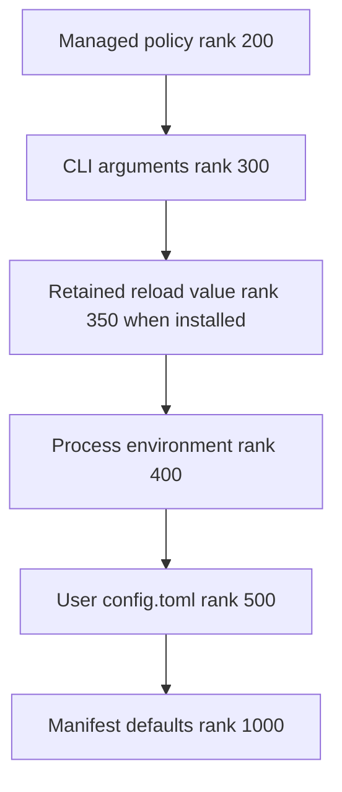
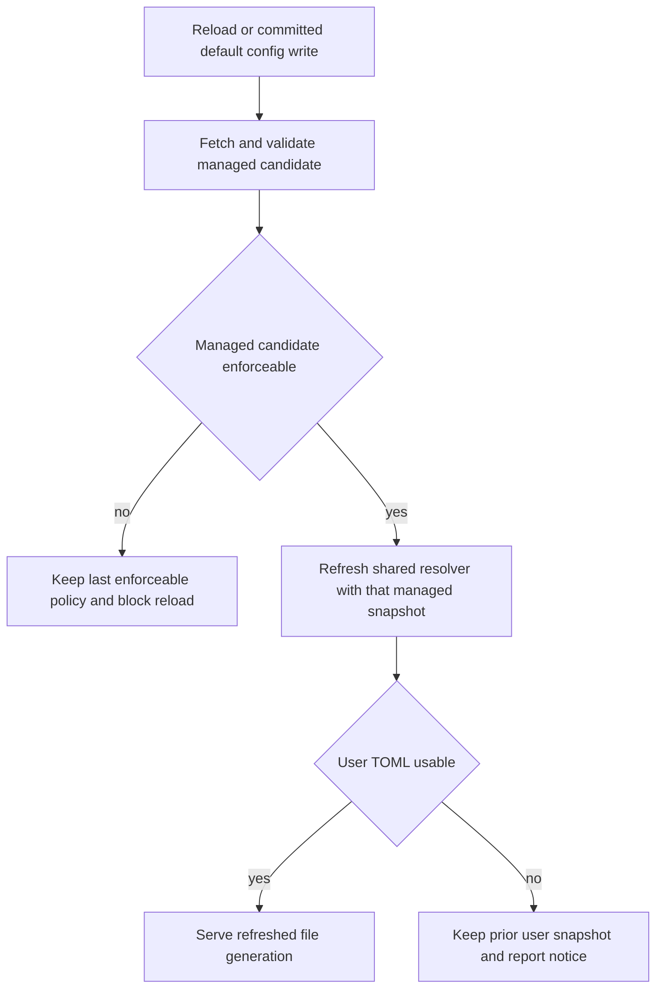

# dcode Configuration Model

Deep Agents Code (`dcode`) turns source-specific input into typed provider results and resolves ordinary process reads consistently. Its governing tradeoff is to serve a coherent, potentially stale file generation rather than partly apply an edit. Managed policy is protected more strongly: a failed or unenforceable replacement must not remove restrictions and let a lower tier win.

For session use, see [run a dcode session](/openwiki/workflows/run-dcode-session.md). For operational implications, see [security](/openwiki/operations/security.md), [cost and sessions](/openwiki/operations/cost-and-sessions.md), and [code agent architecture](/openwiki/architecture/code-agent.md).

## Scopes, providers, and precedence

Configuration spans user, project, session, and runtime scopes. This lets projects share defaults and integrations while users retain credentials, preferences, skills, and local settings. The resolver represents applicable sources as ranked providers; lower numeric rank has stronger precedence. Its standard file-backed chain is managed policy (200), CLI arguments (300), environment (400), user `config.toml` (500), then manifest defaults (1000). Runtime reload can additionally install a retained in-memory override tier at rank 350.

The rank order for replacement settings; the lowest eligible rank wins, and the reload-retention tier is conditional.

Managed policy is the trust root, ahead of parsed arguments, retained runtime values, environment, and the writable user file. Thus an environment variable overrides `config.toml`. `resolver_from_snapshots` requires named `managed=` and `user=` arguments: because both are the same snapshot type, keyword-only arguments prevent a positional swap from granting writable user content managed precedence.

The generic engine is deliberately unaware of the manifest, UI, models, theme, environment, and filesystem. Providers own domain reading and coercion, returning `Found`, `Unset`, or `Invalid`, while the engine records numeric-rank provenance and health. A `ResolvedValue` validates that rank-keyed status, health, diagnostics, and provenance are mutually usable by consumers.

Options select `replace`, `union`, or `deep_merge`. Accumulating strategies retain every valid contributing tier, which is important for deny lists and sibling mapping leaves; if a contribution cannot be combined, resolution falls back to the strongest provider. For replacement, a durable winning tier masks only lower-precedence non-durable results; it cannot hide an already stronger CLI or environment value.

## One shared generation and CLI lifecycle

`get_config_resolver()` owns the normal process-wide resolver cache. It has one entry keyed by `DEFAULT_CONFIG_PATH` and the managed-policy path. On a cache miss it reads the user TOML once and assembles managed, environment, user, and default providers from that file generation, adding the installed CLI provider when one exists. Readers through this resolver consequently do not independently see different file edits.

`CliProvider` snapshots the parsed `argparse` namespace. Startup installs it without building the resolver, preserving help-only fast paths that must not read TOML; the first real resolver read incorporates it. Replacing it with a different provider is rejected because one process argv must correspond to one CLI tier. One-off resolvers do not acquire that process tier automatically, so callers that require CLI provenance must pass it explicitly.

The environment is intentionally live rather than snapshotted. `EnvProvider` consults `os.environ` at resolution time and is non-durable, accommodating dotenv bootstrap and cwd changes while TOML providers continue to serve their cached generation.

## Reload, retention, and policy safety

There is no file watcher. An edit to `config.toml` has no effect on shared-resolver readers until a generation advance: an in-app write to `DEFAULT_CONFIG_PATH`, or `/reload`. A write to another path does not refresh the shared resolver, because it is not that resolver's user path; once the write has committed, refresh errors are logged rather than returned as a failed write.

The reload decision flow: policy is validated before publication, and an unusable user candidate retains the prior snapshot.

Each `TomlFileProvider` retains its last usable snapshot when a reload candidate is missing, unreadable, or corrupt, while reporting the failed on-disk status through diagnostics and health. A first failed read has no earlier snapshot, so it falls through. On `/reload`, a corrupt user file retains prior values and returns a `Kept previous config.toml` notice. A managed configuration error blocks runtime settings publication and is surfaced as a blocking notice.

Managed policy has an extra enforceability gate. A parseable document can still contain an invalid enforced value or malformed managed section; it is not allowed to replace the cached policy unless policy can enforce it. This prevents an administrator-side failure from erasing an already-enforced managed value and allowing a lower-ranked user value to take effect. The managed candidate is fetched before the resolver generation lock, then installed as an already-refreshed replacement. That avoids remote I/O while holding the resolver lock and prevents a user snapshot from advancing past the policy snapshot into a split generation.

Runtime reload also has a narrow, in-memory retention mechanism. After an accepted environment reload, `_ReloadOverrideProvider` can preserve reloadable resolver values that the refreshed resolver cannot reproduce; it is non-durable and sits at rank 350. Its values are atomically replaced, and its own rank is excluded when calculating the candidate used to decide which values must be retained. It is not a general user-config tier or an alternate policy channel.

## Independent snapshots are caller decisions

A caller may intentionally use its own file snapshots when it must report the exact generation and health it inspected, or when its required precedence cannot be expressed by the shared chain. These are per-caller exceptions, not an option-level policy that makes one setting live for one reader and cached for another.

- `get_config_sources()` loads a user snapshot and the current managed snapshot for reporting. If given an explicit `user_path`, it excludes managed policy so the result is clearly a single-file tooling or test inspection, not effective configuration.
- `dcode config`, `dcode doctor`, theme and sandbox-related diagnostic paths can build a resolver over their inspected snapshots when they need value and source/health from the same read. Ad-hoc snapshot resolvers must explicitly opt into the installed CLI provider if it matters.
- `update_check` reads managed and user snapshots itself and resolves exactly those snapshots, allowing its report to pair a result with the file health it just read rather than process cache state.
- `resolve_read_project_dotenv()` parses locally during dotenv bootstrap. It runs before project `.env` data is layered into `os.environ` and needs a trusted global dotenv tier between process environment and `config.toml`, which the shared resolver does not express. It therefore does not establish the shared generation as a bootstrap side effect.
- `resolve_startup_mode_with_source()` retains its own user parse because its `startup.recent` fallback needs the raw user table, which `ResolvedValue` does not expose.
- `/reload` preview reads a fresh user candidate so the dry run shows the edit under review, but does not refresh managed policy. It must not mutate the policy generation that the process is enforcing. Preview uses its explicit environment mapping rather than accepting an environment hit from the shared resolver, since that provider reads the already-live `os.environ`.

## Safe extension checklist

When adding configurable behavior:

1. Declare and coerce the option in its manifest/provider domain; do not teach the generic ranked engine about a subsystem.
2. Choose the merge strategy and rank deliberately. Preserve managed-policy precedence, and never swap managed and user snapshots.
3. Route ordinary reads through `get_config_resolver()` and expose ranked diagnostics for rejected values.
4. Treat independent parsing as a documented caller-level exception with a concrete reason; decide explicitly whether that resolver needs the installed CLI provider.
5. Preserve last-usable reload behavior. A failed managed candidate must not unmanage a session, and tests should prove a lower-ranked value cannot become effective after the failure.
