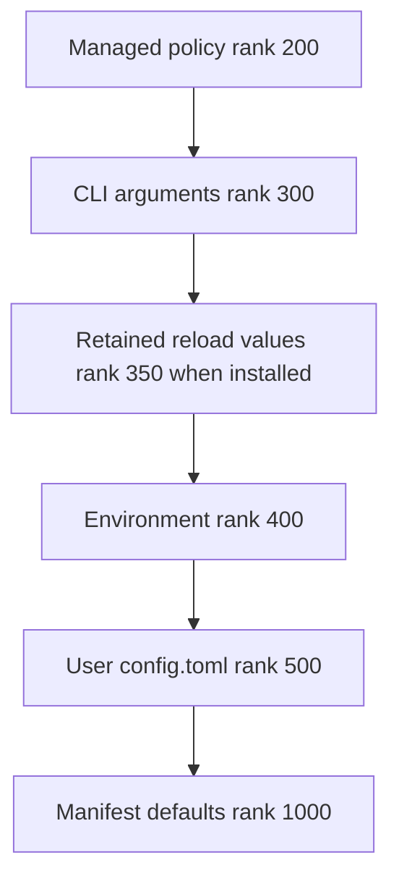
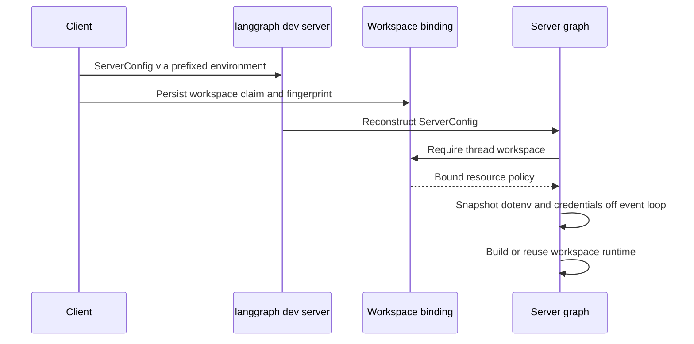

# dcode Configuration Layering

Deep Agents Code (`dcode`) resolves typed settings from ranked sources. Its central consistency choice is to serve one coherent file generation—even if it is stale—rather than mix an edit into only some reads. Managed policy is additionally fail-closed: a bad replacement must not remove a restriction and let a weaker source win.

For model-specific settings, see [profiles and models](/openwiki/concepts/profiles-models.md); for a session lifecycle, see [run a dcode session](/openwiki/workflows/run-dcode-session.md).

## Source model and precedence

Configuration is layered across user, project, session, and runtime scopes. That lets teams share project defaults while individual users keep their own credentials, preferences, skills, and local settings. The generic resolver deliberately knows only numeric ranks, provider health, and provider results (`Found`, `Unset`, or `Invalid`); providers perform domain-specific coercion.

For replacement settings, lower rank wins:

The standard replacement precedence chain, including the conditional in-memory reload-retention tier.

Managed policy is the trust root: it outranks CLI, runtime retention, environment, and the writable user file. `resolver_from_snapshots()` requires keyword-only `managed=` and `user=` arguments, preventing same-typed snapshots from being transposed and granting user data managed precedence. Providers must have unique ranks. Per-option merge strategies are `replace`, `union`, and `deep_merge`; accumulating strategies retain valid contributions rather than discarding policy restrictions or sibling table leaves.

The parsed command line becomes an immutable `CliProvider` snapshot of the `argparse` namespace. It can be installed before TOML is read, preserving command help and group fast paths. A different CLI provider is rejected: one process has one argv. An ad-hoc snapshot resolver has no CLI tier unless its caller explicitly supplies the installed provider.

## Shared resolver generations and reload

`get_config_resolver()` owns the normal process-wide resolver cache, keyed by the default user-config path and managed-policy path. On its first read it builds the chain from managed and user TOML snapshots, environment, manifest defaults, and any installed CLI provider. All ordinary readers using that resolver therefore observe one file generation; configuration files are not watched for edits.

There are three deliberate read models:

- **Shared generation:** managed and user TOML providers retain parsed snapshots. An edit is visible to shared readers only when the generation advances.
- **Direct snapshot:** a caller can inspect a file itself when it needs the exact file/health it read or precedence the shared chain cannot express. This is a caller-level exception, not a per-setting cache choice.
- **Active environment:** `EnvProvider` reads `active_environment()` on each resolution and is non-durable. Normally that is live `os.environ`; during workspace construction, `use_environment()` supplies an immutable context-local mapping.

A default-path in-app write refreshes the shared resolver, as does `/reload`; a write to another path does not. Since the write has already committed, a refresh failure is logged and the process continues to serve prior values until a later refresh or restart.

The refresh path preserves a coherent managed and user generation while handling failed candidates.

`TomlFileProvider` retains its last usable snapshot when a reload candidate is missing, unreadable, or malformed, but reports the failed on-disk status in diagnostics. Thus a malformed `config.toml` on reload leaves its earlier values effective and produces a `Kept previous config.toml:` notice. A first failed read has no usable prior snapshot and falls through.

Managed policy has an additional enforceability gate: invalid enforced declarations, malformed known sections, and inconsistent managed model ceilings cannot replace served policy. The managed candidate is fetched before the resolver lock and installed as an already-refreshed replacement. This avoids remote I/O while readers are locked out and prevents advancing the user tier beyond managed policy. A managed failure blocks runtime reload with a `Kept previous settings:` notice.

For the small set of resolver values that runtime reload owns, `_ReloadOverrideProvider` retains an accepted value the refreshed resolver cannot reproduce. It is non-durable, atomically replaces its mapping, and has rank 350; it is continuity state, not a persisted source. Reload preview reads a fresh user candidate so it can show the edit under review, but does not refresh the managed policy generation.

## Dotenv derivation and trust boundary

The dotenv stack is derived from an explicit environment mapping. Existing shell values win; enabled nearest-project and global-profile dotenv files can fill absent values. `resolve_read_project_dotenv()` runs before the project `.env` is applied, so it reads configuration locally: it must place a trusted global-dotenv value between process environment and user TOML, a tier the standard resolver cannot represent, without establishing the shared generation as a bootstrap side effect.

A repository-controlled project `.env` cannot inject project-MCP allow/deny lists, Auto classifier model or timeout, forked-subagent mode, `LANGGRAPH_DEFAULT_RECURSION_LIMIT`, or `TERM_PROGRAM`. Those decisions remain available from the shell and trusted global dotenv. Environment lookup helpers that use `resolve_env_var()` give `DEEPAGENTS_CODE_{NAME}` precedence over `{NAME}`; the presence of an empty prefixed value suppresses the canonical value.

## Server boundary and workspace isolation

The interactive client launches `langgraph dev` in a separate Python process and cannot share its resolver memory. `ServerConfig` is the typed boundary: the launcher derives it from CLI settings, normalizes relative paths against the captured project context, serializes it as `DEEPAGENTS_CODE_SERVER_*` variables, and clears a variable for `None` rather than serializing an empty string. The server reconstructs and validates the payload; in particular, an explicit filesystem-tool allowlist must be non-empty and include `read_file`.

The subprocess handoff and execution-time workspace binding are separate controls.

For an execution request, `make_graph()` requires a thread ID and valid workspace context, obtains the persisted binding, and builds or reuses a runtime by its resource key. Before selecting that runtime, the server resolves the current configuration for the binding's workspace and rejects a changed project policy or server-config fingerprint. Workspace runtimes use a bounded LRU cache; because a configured sandbox is process-wide, it can be claimed by only one workspace.

Before graph assembly, `_make_graphs()` creates the workspace-specific dotenv mapping and `CredentialsSnapshot` in a worker thread, freezes the mapping, and enters `use_environment(workspace_env)` for construction. Resolver reads and credential-dependent assembly consequently use the workspace snapshot rather than mutable server `os.environ`; later parent reloads or environment changes do not update an already-built runtime.

## Safe change checklist

1. Add source-specific coercion in a provider or manifest domain, not in the generic rank engine.
2. Choose rank and merge strategy deliberately; preserve managed precedence and keyword-only managed/user snapshot construction.
3. Use `get_config_resolver()` for ordinary process reads. Document a direct snapshot as a caller-level exception and decide whether it needs the CLI tier.
4. Preserve last-usable behavior and test failed managed refreshes so lower-ranked settings cannot become effective.
5. Treat project `.env` as untrusted for user-level security controls and preserve explicit environment snapshots.
6. When adding a server-facing setting, extend the shared `ServerConfig` serialization/deserialization contract and include resource-affecting values in workspace policy and fingerprint validation.

Focused tests in `test_configuration_resolution.py` exercise enforced managed-key failures and snapshot consistency; `test_reload.py` checks fresh previews, retained user configuration, and notices for rejected reload candidates.
