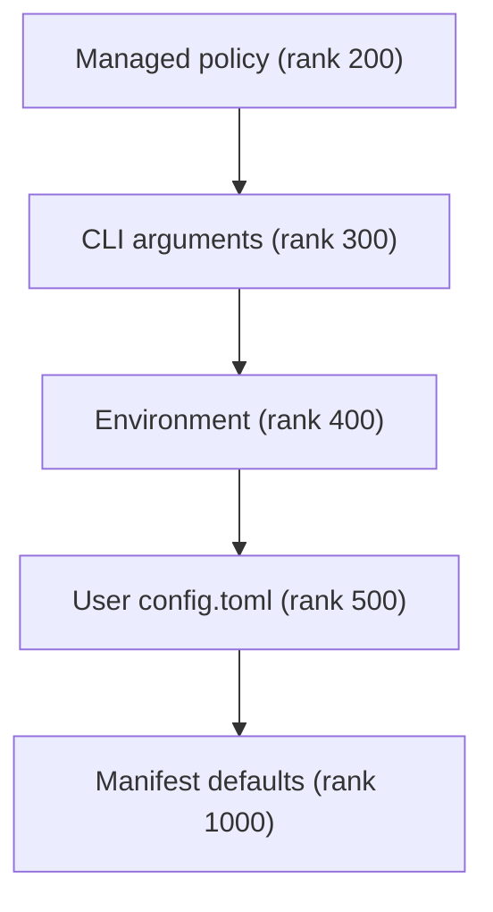

# dcode Configuration Model

Deep Agents Code (`dcode`) reads configuration from several scopes and merges
them into a single ranked resolution that every ordinary reader observes. This
page explains those tiers, the process-wide generation they build on first read,
why the app does not watch files, when the generation advances, and the handful
of callers that step outside the shared generation on purpose.

If you are running a session, see the
[run a dcode session workflow](/openwiki/workflows/run-dcode-session.md); for how
these settings interact with pricing and durable sessions, see
[cost and sessions operations](/openwiki/operations/cost-and-sessions.md). The
broader client/server split is covered in the
[code agent architecture](/openwiki/architecture/code-agent.md).

## Layered scopes

Configuration is layered across user, project, session, and runtime scopes so
that teams can share project defaults while individual users keep their own
credentials, preferences, skills, and local settings. Project material can
provide shared defaults and integrations, and each user layers personal
configuration on top.

Under the hood these scopes are realized as ranked *providers*. Lower numeric
ranks win. The standard chain, strongest to weakest, is managed policy, the
parsed command line, the live process environment, the user `config.toml`, and
the typed manifest defaults:

Precedence order of the standard provider chain; the lowest rank that supplies a value wins.

Two things about this order are worth internalizing. First, managed policy is the
strongest tier and is the trust root: the resolver builder is keyword-only
precisely so a positional transposition cannot load the writable user file at the
managed rank and let user data acquire managed precedence. Second, the process
environment (rank 400) is *stronger* than the user `config.toml` (rank 500), so
an env var overrides a value written in the user file.

The ranked engine is intentionally unaware of the manifest, UI, model, theme,
environment, or filesystem. Providers coerce their own domains into `Found`,
`Unset`, or `Invalid` results, and provenance and health inside the engine use
only numeric ranks; human-readable source labels live on `ProviderStatus`.

## One process-wide generation

Configuration files are read into a single process-wide *generation*, built on
the first read and reused after that. Readers that resolve through the shared
resolver all observe that one generation and cannot disagree about a setting.

The shared resolver is cached per process, keyed on the pair of file paths it was
built for: the user `DEFAULT_CONFIG_PATH` and the managed policy path. The cache
holds exactly one entry so that a populated key can never point at a missing or
stale resolver. When the cache misses, the user `config.toml` is loaded once and
`resolver_from_snapshots` assembles the managed, environment, user, and default
providers (plus the CLI provider when one is installed) from that single
file-snapshot generation.

The parsed command line is installed as a distinct CLI provider. `dcode`
snapshots the argparse namespace into a `CliProvider` and installs it into the
shared chain; one argv yields one CLI tier, so attempting to install a different
CLI provider for the same process is rejected rather than silently kept.

## No file watching, and when the generation advances

The app does not watch files for edits. An edit to `config.toml` while the app
runs has no effect on shared-resolver readers until the generation advances,
because a partly applied configuration is treated as a worse failure than a stale
one.

The generation advances in exactly two situations:

- **An in-app write to the default config path.** After a committed write to
  `DEFAULT_CONFIG_PATH`, `refresh_shared_resolver` refreshes the shared resolver
  (managed policy included). Only the default path is refreshed; a write to an
  override path is ignored here because the resolver is keyed on
  `DEFAULT_CONFIG_PATH`. Refresh failures are logged rather than returned,
  because the bytes are already on disk and reporting a stale in-process view as
  a failed write would send the user to re-edit a correct file.
- **`/reload`.** A real reload exists to pick up file edits made since the shared
  resolver's snapshot was taken, and it seeds later readers with the same
  generation it just validated.

Each source keeps its last usable snapshot, so a file that fails to parse leaves
that tier unchanged instead of erasing it. On reload the managed snapshot is
refreshed in place (`refresh=True`) rather than invalidated first: dropping the
cached snapshot before the reload would leave every other reader with an empty
managed table (read as "no policy") if the new file fails to parse. The
`TomlFileProvider` load path classifies missing, unreadable, and corrupt states
distinctly, and unusable reads retain the previously served snapshot. A managed
reload that cannot be enforced is surfaced to the user as a blocking notice, and
a user `config.toml` that fails to parse on reload is now surfaced with a
"Kept previous config.toml" notice rather than a silent "no changes detected".

Because managed policy is the trust boundary above the user tier, a refresh must
never let the user tier advance past the policy tier. `refresh_shared_resolver`
fetches the managed snapshot before taking the resolver's generation lock and
installs it as an already-refreshed replacement, so an in-app toggle still picks
up policy installed since startup without blocking ordinary event-loop reads on
remote I/O, and without opening a split-generation window.

## Readers outside the shared generation

Some readers deliberately sit outside the shared generation. These exceptions are
*per caller*, not per setting: a caller decides to snapshot a file itself. No
option is intended to be live for one reader and cached for another, which would
make the effective configuration unpredictable per option.

Two categories of caller take their own file snapshot:

- **Callers that inspect one file generation and report it next to its health.**
  `get_config_sources` loads one user snapshot and the current managed snapshot
  from a single generation; the `dcode config` command and the `dcode doctor`
  command build on the same kind of independent snapshot, with `dcode doctor`
  reading the managed file (refreshed) resolved against an empty user tier so its
  health reflects the file itself rather than process state.
- **Callers the shared generation cannot serve, which parse a file on each
  call.** `resolve_read_project_dotenv` runs before the project `.env` is layered
  into the environment and needs a tier (the trusted global dotenv) the resolver
  cannot express, so it parses locally rather than establishing the process
  generation as a side effect of dotenv bootstrap.
  `resolve_startup_mode_with_source` keeps its own parse because its
  `[startup].recent` fall-through inspects the raw user table that `ResolvedValue`
  does not expose. `update_check` reads the managed and user snapshots itself and
  resolves against that exact generation, because it reports the value next to
  the file health it just read. The `/reload` **preview** also reads the user
  file fresh, because a dry run must show the edit under review, and it
  deliberately does not refresh managed policy the process is enforcing.

## The environment tier is always live

The environment tier is the one provider that is never cached. `EnvProvider`
reads `os.environ` at resolution time and reports itself as never durable,
because the process changes the environment during dotenv bootstrap and on each
cwd switch. Treating it as live keeps the effective environment value correct as
those mutations happen, whereas the file tiers stay pinned to their snapshot
until the generation advances.

Because the env tier is live, callers previewing a `.env` edit deliberately do
*not* accept an env-tier hit from the shared resolver: the resolver's env
provider reads `os.environ` directly, so it would report the value already live
in the process rather than the one being previewed.
