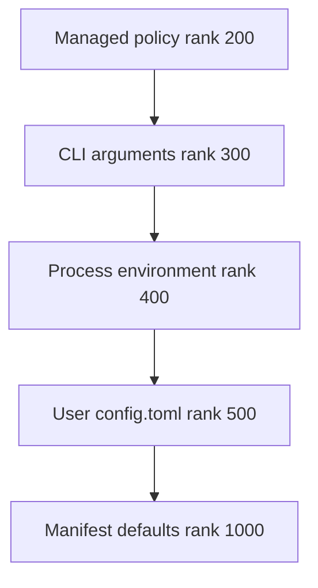
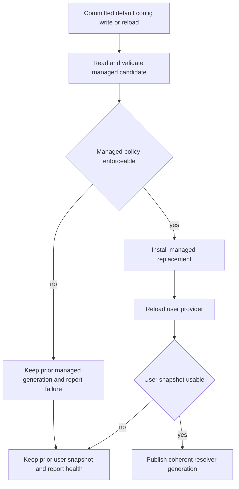

# dcode Configuration Model

Deep Agents Code (`dcode`) turns configuration sources into typed provider results and resolves them consistently for ordinary process readers. The model deliberately favors a coherent, potentially stale file generation over a partially applied edit. A few diagnostic and bootstrap callers read their own generation instead; those are caller-level exceptions, not settings that are selectively live.

For session use, see [run a dcode session](/openwiki/workflows/run-dcode-session.md). For operational consequences involving sessions and pricing, see [cost and sessions](/openwiki/operations/cost-and-sessions.md), and see [code agent architecture](/openwiki/architecture/code-agent.md) for the wider architecture.

## Scopes and precedence

Configuration spans user, project, session, and runtime scopes: projects can supply shareable defaults and integrations while users retain credentials, preferences, skills, and local settings. The implementation represents applicable sources as ranked providers. Lower numeric rank wins for replacement values:

The standard provider precedence chain; the lowest rank that supplies an eligible value wins.

Managed policy is therefore the trust root, ahead of a run's parsed CLI arguments, environment, and writable user file. In particular, an environment variable overrides `config.toml`. `resolver_from_snapshots` requires named `managed=` and `user=` arguments: because both are the same snapshot type, this prevents a positional swap from granting writable user content the managed rank.

The resolver itself does not know about the manifest, UI, models, themes, filesystems, or environment. Providers perform domain-specific reading and coercion, yielding `Found`, `Unset`, or `Invalid`; the engine retains rank-keyed health and provenance, while provider status supplies display labels. It supports `replace`, `union`, and `deep_merge` strategies. `union` and `deep_merge` retain all valid tier contributions; a non-combinable value falls back to the strongest provider rather than silently discarding restrictions or sibling mapping entries. For a replacement setting, a durable winning tier masks lower-ranked non-durable results, but never retroactively masks a stronger environment or CLI result.

## Shared generation and CLI lifecycle

The normal resolver is a process-wide cache with one entry, keyed by `DEFAULT_CONFIG_PATH` and the managed-policy path. On a cache miss it reads the user TOML once and builds the managed, environment, user, and defaults chain from those snapshots, adding the installed CLI provider when present. Readers using this resolver therefore share one file generation rather than independently observing edits.

`CliProvider` snapshots the parsed `argparse` namespace. Startup installs it without constructing the full resolver so help-only fast paths do not read TOML; the first real resolver read incorporates it. A different CLI provider cannot be installed later in the same process: one argv has one CLI tier. Ad-hoc resolvers do not acquire that tier automatically, so a caller that needs CLI provenance must explicitly pass it.

The environment is intentionally different from the file tiers. `EnvProvider` consults `os.environ` at resolution time and is non-durable. This accommodates dotenv bootstrap and cwd changes that mutate the process environment while file providers remain pinned to their served snapshot.

## Reload and failure invariants

There is no file watcher. Editing `config.toml` does not affect shared-resolver readers until the process advances the generation, because split or partly applied configuration is worse than serving the prior coherent generation.

Shared reload preserves last usable snapshots rather than replacing a tier with an empty failed table.

The normal generation-advance paths are an in-app write to `DEFAULT_CONFIG_PATH` and `/reload`. The writer refreshes only that default path—an override-path write cannot refresh the resolver keyed to a different file—and logs refresh failure rather than reporting the already-committed write as failed.

Reload safety is especially important for policy. `TomlFileProvider` distinguishes missing, unreadable, corrupt, and path-indeterminate sources. On an unusable reload, it keeps its last usable snapshot for resolution while recording the failed status for health and diagnostics; an initial failed read has no prior snapshot and falls through. Managed-policy refresh additionally accepts a candidate only when it is enforceable. This prevents a remote failure or a parseable but invalid policy from dropping restrictions and allowing a lower user value to win. The managed candidate is fetched before the resolver generation lock, then installed as an already-refreshed replacement, avoiding remote I/O under the lock and preventing the user tier from advancing beyond policy into a split generation.

A user TOML parse failure during reload retains the previous values and produces `Kept previous config.toml`. A managed failure blocks the reload and is surfaced as a blocking notice. Tests cover both retention outcomes, including a dead or unenforceable remote policy that must remain attributed to the managed tier after an in-app refresh.

## Intentional independent snapshots

Independent reads are exceptions chosen by the caller, not an option-level cache policy. They are necessary when a surface must describe the exact file generation and health it inspected, or when its precedence cannot be expressed by the shared chain.

- `get_config_sources()` reads a user snapshot and a managed snapshot for reporting. With an explicit `user_path`, it deliberately excludes managed policy: that is a single-file tooling/test inspection, not effective configuration.
- `dcode doctor` uses an independent, refreshed managed-policy read so reported policy health reflects the file rather than the shared process state.
- `update_check._resolve_update_setting()` reads managed and user snapshots itself and calls `resolver_from_snapshots` on exactly those snapshots. The update subsystem can consequently report a setting beside health from the same read rather than a possibly older shared cache.
- `resolve_read_project_dotenv()` parses locally during dotenv bootstrap. It runs before the project `.env` is added to `os.environ` and must place a trusted global dotenv tier between process environment and `config.toml`, a precedence the standard resolver does not express. This prevents bootstrap and cwd switches from establishing the shared generation as a side effect.
- `resolve_startup_mode_with_source()` reads the raw user table itself because its `startup.recent` fallback requires data that `ResolvedValue` does not expose.
- `/reload` preview reads the user file afresh so it can show the edit under review, but keeps the current managed snapshot: a dry run must not refresh policy being enforced.

A preview also cannot accept a shared-resolver environment hit as the proposed `.env` value. Since `EnvProvider` reads live `os.environ`, that hit would describe the currently loaded process environment rather than the supplied preview mapping. Preview logic uses its explicit environment mapping while retaining managed, CLI, and suitable file results from resolver snapshots.

## Safe extension checklist

When adding a configurable behavior:

1. Declare and coerce the option in the manifest/provider domain; do not make the generic ranked engine understand a new subsystem.
2. Choose rank and merge strategy deliberately. Do not weaken managed policy or swap managed and user snapshots.
3. Route ordinary reads through `get_config_resolver()` and emit ranked diagnostics for rejected values.
4. If a reader needs independent files, make it a documented caller-level snapshot with a reason, and decide whether it needs the installed CLI tier.
5. Preserve last-usable behavior during reload. Do not invalidate managed policy before validating a replacement, and test that a failed candidate cannot make a lower-precedence value effective.
