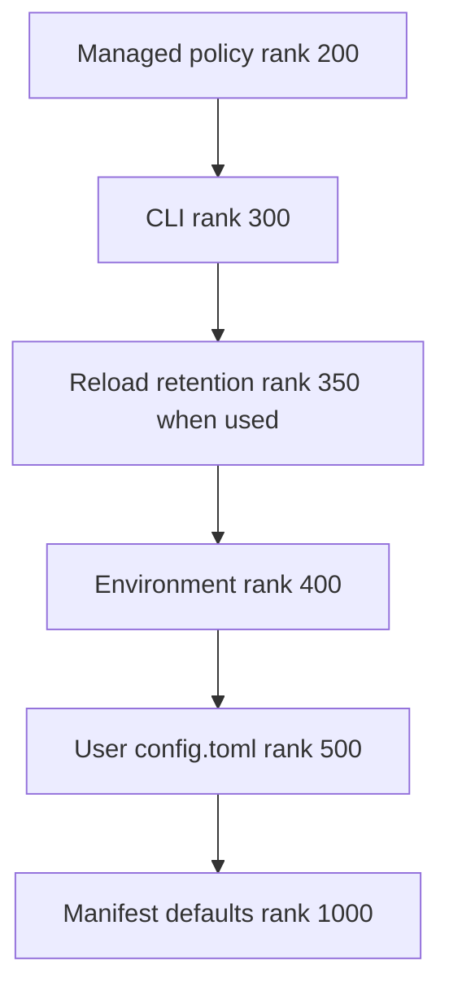
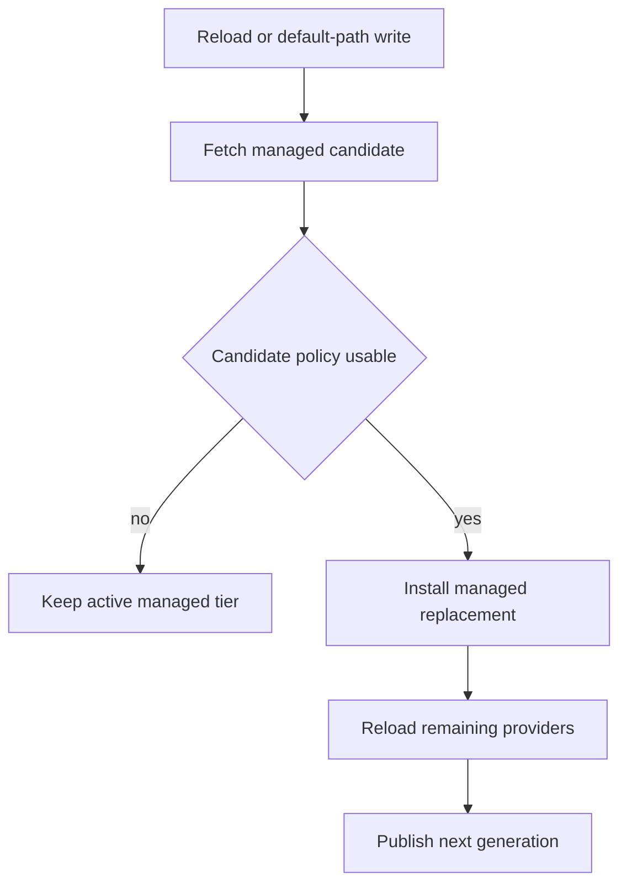
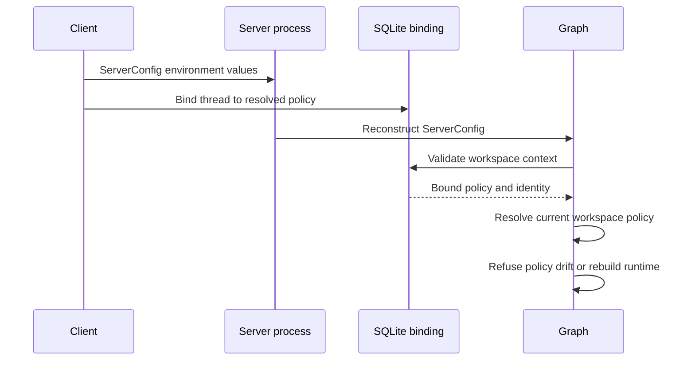

# Deep Agents Code Configuration Layering

Deep Agents Code (`dcode`) resolves typed settings through a ranked provider chain rather than treating configuration as one file. This keeps administrator policy stronger than user choices, while still allowing a process invocation, environment, and user configuration to supply ordinary defaults. The same design also separates project-provided inputs—which are potentially untrusted—from user-controlled credentials and trust decisions.

For model-specific configuration, see [Profiles and models](/openwiki/concepts/profiles-models.md). For the integration-facing MCP overview, see [MCP](/openwiki/integrations/mcp.md).

## Resolution model and precedence

The generic resolver is intentionally domain-neutral: providers coerce an option to `Found`, `Unset`, or `Invalid`, and the resolver applies rank, merge strategy, health, and provenance. Lower rank is stronger. The standard shared chain has these tiers:

```mermaid
flowchart TD
    M["Managed policy rank 200"] --> C["CLI rank 300"]
    C --> R["Reload retention rank 350 when used"]
    R --> E["Environment rank 400"]
    E --> U["User config.toml rank 500"]
    U --> D["Manifest defaults rank 1000"]
```

The ranked configuration sources for a replacement option. The reload-retention tier is installed only by reload-aware callers.

For a replacement option, the strongest usable result wins. A durable value can mask a weaker non-durable value. For a `union` or `deep_merge` option, valid contributions are retained across tiers, with leaf-level provenance; manifest defaults remain fallback rather than a normal accumulated contribution. This matters particularly for deny lists: replacing a managed denial with a user list would be fail-open.

`resolver_from_snapshots()` takes `managed=` and `user=` as keyword-only arguments so equal-typed snapshots cannot accidentally be swapped and give user content managed precedence. The normal `get_config_resolver()` cache serves one provider generation to process readers. It builds managed and user TOML snapshots with environment and manifest providers, and it will not install a different parsed CLI provider in the same process. An ad-hoc resolver does not implicitly gain the process CLI tier.

The configuration manifest is the source of truth for option types, typed defaults, TOML paths, and environment-variable names. Invalid scalar values are rejected at their provider and resolution falls through to a weaker valid tier; structured and credential-bearing tables use dedicated typed readers and are redacted from configuration introspection.

## Reloading and writing safely

File edits do not continuously change the cached generation. A reload or a successful write to the default user path advances it deliberately. This avoids a resolution pass observing part of one edit and part of another.

```mermaid
flowchart TD
    A["Reload or default-path write"] --> B["Fetch managed candidate"]
    B --> C{"Candidate policy usable"}
    C -->|"no"| K["Keep active managed tier"]
    C -->|"yes"| I["Install managed replacement"]
    I --> J["Reload remaining providers"]
    J --> P["Publish next generation"]
```

A managed candidate is fetched before the shared resolver replacement, preventing remote I/O from holding the resolver lock and preventing a broken policy refresh from weakening active restrictions.

A TOML provider retains its last usable snapshot if a reload candidate is unreadable or malformed; a first failed read instead falls through. A managed candidate is checked for enforceable declarations, known-section shape, and model-policy consistency before replacement. Thus an unusable managed refresh cannot silently disappear and allow CLI, environment, or user settings to take over. Source diagnostics are reset per generation so a continuing error can be reported again on a subsequent reload.

`update_user_config()` is the supported user-file transaction: it serializes read-modify-write operations under a reentrant lock, refuses the managed path, refuses to overwrite unreadable or malformed TOML, writes a temporary file beside the target, and atomically replaces the target. A committed default-path write attempts to refresh the shared resolver, but reports a refresh failure as stale in-process state rather than falsely reporting that the already-landed write failed.

## Environment, dotenv, and credentials

The environment provider reads `active_environment()`: normally live `os.environ`, or an immutable context-local snapshot inside `use_environment()`. `DEEPAGENTS_CODE_{NAME}` has precedence over `{NAME}`. Presence is significant: an empty prefixed value suppresses a non-empty canonical value, which can intentionally block a canonical credential or setting.

Project dotenv construction begins with an explicit environment mapping. Shell values win; the nearest project `.env` and the profile-global dotenv file only fill missing keys. The trusted global file also governs whether the project file is read. If that global toggle cannot be read, project dotenv loading is skipped rather than assuming an untrusted project file is acceptable.

A repository-provided project `.env` cannot set project-MCP trust lists, Auto classifier model or deadline, MCP tool timeout, forked-subagent behavior, the upstream recursion fallback, or terminal tracing metadata. These remain available through shell exports and the user-controlled global dotenv where appropriate. This prevents a cloned checkout from changing authorization or reducing the controls that review its own tool actions.

At workspace construction, the server derives a dotenv mapping and credential snapshot off the event loop, freezes the mapping, and uses it for graph construction. This prevents later mutations of server `os.environ` from changing an already-built workspace runtime. LangSmith tracing is process-wide SDK state, so runtimes sharing one server must agree on its tracing selectors and secret-redaction setting. If tracing is uploading and redaction was requested, failure to install the redacting client disables tracing instead of permitting an unredacted upload.

## MCP-specific controls

MCP server `command`, `url`, `args`, `env`, and `headers` support only `${VAR}` and `${VAR:-default}` interpolation against the active environment. The default form applies when the variable is unset or empty. A malformed braced expression, unset required variable, or wrong supported-field shape is rejected before the resolved configuration is used; unsupported fields are copied without interpolation.

Disabled MCP server names are an accumulating policy. User configuration stores them at `[mcp].disabled_servers` (with legacy input compatibility), while managed and user denials union. Filtering occurs before validation, connection, and tool exposure. If a managed deny list is unreadable or invalid, callers fail closed by treating candidates as disabled rather than interpreting the error as an empty deny list.

## Client-to-server handoff and workspace scope

The interactive client and `langgraph dev` server are separate processes, so they cannot share the resolver cache. `ServerConfig` is their typed boundary. The client serializes fields into `DEEPAGENTS_CODE_SERVER_*` variables; `None` means remove the variable rather than write an empty string. The server reconstructs the dataclass and validates sensitive controls, including filesystem-tool allowlists, so malformed handoff data cannot become unrestricted access.

```mermaid
sequenceDiagram
    participant Client
    participant Server as Server process
    participant Binding as SQLite binding
    participant Graph
    Client->>Server: ServerConfig environment values
    Client->>Binding: Bind thread to resolved policy
    Server->>Graph: Reconstruct ServerConfig
    Graph->>Binding: Validate workspace context
    Binding-->>Graph: Bound policy and identity
    Graph->>Graph: Resolve current workspace policy
    Graph->>Graph: Refuse policy drift or rebuild runtime
```

The process handoff, durable thread binding, and execution-time drift check are separate safeguards.

A binding canonicalizes an existing workspace directory, persists server-resolved non-secret policy and separate policy/runtime fingerprints in SQLite, and atomically rejects a request that changes workspace identity or access policy. A runtime-only identity change, such as a compatible model change, updates runtime identity and causes a rebuild without discarding the binding or its checkpoints.

Project-scoped grants are not client assertions. MCP configuration, sandbox setup, extension paths, and project trust are retained only when the target is the launch project. For a different or unresolvable project, `resolve_workspace()` drops those grants and re-evaluates extension trust. On every execution, the server compares the currently resolved project and durable policy with the binding; policy drift or revoked extension trust refuses execution, while runtime-only drift is a rebuild condition.

## Diagnostics and safe changes

Bindings retain a bounded, allowlisted snapshot for explaining policy conflicts. It records only reportable scalar and list-style policy values. Paths, credentials, environment values, model data, and prompts are excluded from diagnostic persistence and logs. A conflict can report safe changed values when both snapshots permit it; otherwise it reports the field change with values unavailable. This preserves an actionable refusal path without making diagnostics another secret store.

When adding or changing a setting:

1. Define its type, source mappings, default, and merge strategy in the manifest or its dedicated structured loader.
2. Preserve managed precedence and decide whether an invalid value may fall through or must make the managed policy unenforceable.
3. Treat project dotenv as untrusted for security-sensitive settings; use workspace environment snapshots for runtime construction.
4. Extend `ServerConfig` and workspace policy/runtime classification for server-facing settings.
5. Add diagnostic snapshot fields only when their stored and displayed values are demonstrably safe.
6. Test the decision boundary: rank and merge behavior, reload retention, authorization failure, handoff validation, or policy/runtime drift—not only parsing.

Focused resolver tests cover rank and merge behavior, CLI installation, cached generations, and failed refresh behavior. Configuration tests cover dotenv reload and credential/tracing handling. Workspace and server-graph tests cover canonical binding, project scoping, policy refusal, runtime rebuilding, and safe diagnostics.
