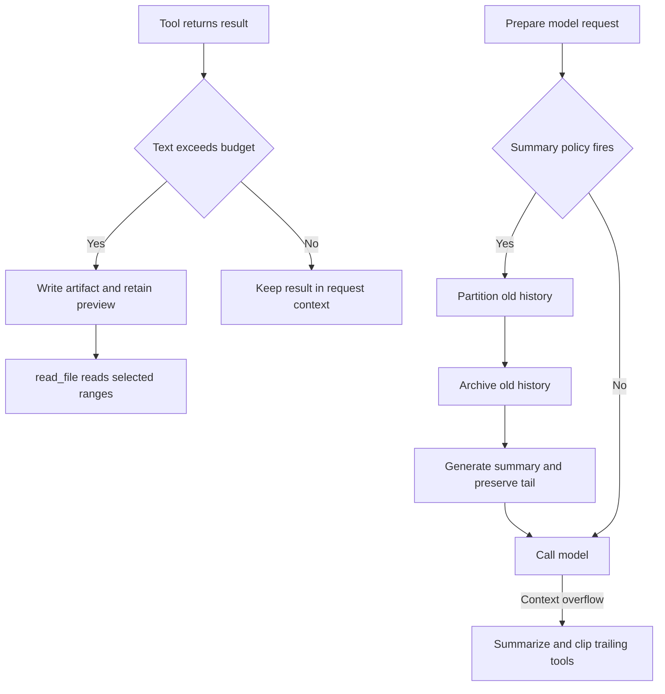
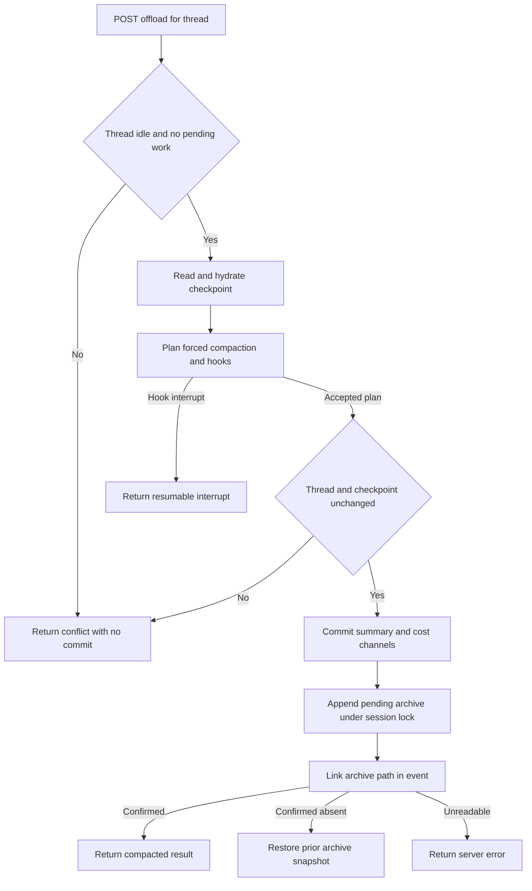

# Context Management and Offload

Long-running agent threads have separate pressures: injected prompt material consumes every request, a tool can return excessive text, and conversation history can exceed a provider window. The SDK manages the latter two with **large-tool-result eviction**, **summarization**, and an overflow-only tail-clipping fallback. dcode adds local-environment context, diagnostics, hook-aware automatic compaction, and a server-owned `/offload` operation.

These controls change what a model receives; they are **not durable memory** and do not delete the raw conversation checkpoint. Summarization stores an event that reconstructs an effective request history, while archives are a best-effort recovery aid in the SDK path. Memory files such as `AGENTS.md` are separately injected prompt content, not a substitute for offloaded history. See [State Persistence](/openwiki/concepts/state-persistence.md) for checkpoint lifecycle and [Cost and Sessions](/openwiki/operations/cost-and-sessions.md) for session accounting.

Caption: The source-verified SDK path evicts a single oversized result independently of compaction; compaction changes the model request while checkpointed raw messages remain available.

## Large tool results: evict text, retain a recovery path

`FilesystemMiddleware` uses the shared eviction helper for tool results over its configured budget. The helper extracts text blocks, writes them to `{large_tool_results_prefix}/{sanitized_tool_call_id}`, and replaces the `ToolMessage` with `TOO_LARGE_TOOL_MSG`. The replacement has a numbered head-and-tail preview and directs the model to use `read_file` with `offset` and `limit`. It preserves message identity and non-text blocks; media therefore remains model-visible. If the backend write fails, callers keep the original result rather than presenting an unusable pointer.

The summarizer derives history and large-result prefixes from its backend. A `CompositeBackend` places them under `artifacts_root`; another backend uses `/conversation_history` and `/large_tool_results`. Consequently, the backend serving `read_file` must resolve the path shown in model-visible context. See [Tools and Filesystem](/openwiki/concepts/tools-filesystem.md) for that tool boundary.

## SDK summarization and overflow recovery

`SummarizationMiddleware.wrap_model_call` reconstructs effective messages from a prior summarization event, counts them with the system message and tool schemas, and can truncate old oversized tool arguments. It evaluates the configured trigger. With a positive cutoff, it partitions old and retained messages, attempts to archive the old portion, creates an LLM summary, and invokes the model with the summary plus the preserved tail. The returned `ExtendedModelResponse` carries a `Command` that updates the event and session id.

If automatic summarization is not indicated, the middleware first tries the ordinary model request. A `ContextOverflowError` changes to the same compaction path. Archive failure emits a warning but does not prevent a useful in-context summary; its event has `file_path=None`, so older detail is not recoverable from that archive.

### Conversation archive lifecycle

A session uses one markdown archive at `{artifacts_root}/conversation_history/{session_id}.md`; each compaction appends a timestamped `## Summarized at` XML-rendered section rather than replacing earlier material. Previous summary messages are filtered out because they summarize data already archived. `_summarization_session_id` is reused from state, or a UUID-derived `session_...` id is generated and persisted for later turns.

Before archival, inline base64 media is uploaded under the history media prefix and rewritten to path references for both the archive and summary input. Failed uploads become placeholders; when the archive succeeds, the middleware warns that the original media is unrecoverable.

### Overflow tail clipping

Only after overflow-triggered compaction, `_clip_overflow_tail` examines a **trailing consecutive** `ToolMessage` batch in the retained suffix. It acts when the batch reaches the keep-derived token threshold: the explicit token budget, a known model-limit fraction, or `5,000` tokens for message-based keep or an unknown limit. Generic results use the normal offload helper. A `read_file` result instead retains roughly 4,000 leading characters and points at the original file, avoiding a redundant write. Replacement ids let the messages reducer overwrite the checkpoint entries; failed writes leave messages unchanged.

## dcode compaction and server-owned `/offload`

`CLICompactionMiddleware` retains the SDK model-initiated `compact_conversation` tool and adds a `PreCompact` gate before threshold compaction and provider-overflow recovery. If the gate declines normal automatic compaction, dcode continues the normal model call. If a provider has already overflowed and the gate blocks recovery, it re-raises the original `ContextOverflowError`. Its asynchronous automatic and model-initiated paths serialize archive read-append-rewrite cycles with a process-local lock keyed by summarization session.

Forced compaction is a server operation, not a client checkpoint mutation. `OffloadOperation` plans summary state from hydrated checkpoint messages and dispatches a synthetic forced `compact_conversation` through `PreCompact` and `PreToolUse`. A hook interrupt returns to the client without a state write; resume invokes the operation again from the beginning with accumulated responses. The forced call id is derived from the attempt checkpoint namespace, stable across resume rounds but different across attempts. Missing hook outcome data fails closed.

Caption: The server-owned compaction/offload path reserves allowed state before its archive side effect, then verifies the archive link or rolls the artifact back.

### Commit, conflicts, and cancellation

The HTTP boundary locks an idle thread, rejects active, interrupted, or pending graph work, then verifies idleness and checkpoint identity again after planning. If the checkpoint advanced during compaction, it reports that no state was committed, although summary work and cost may have occurred. The update allowlist contains only `_summarization_event`, `_summarization_session_id`, and `_session_cost_usd`, never `messages`; this prevents an offload from overwriting concurrent conversation writes.

For an archive-bearing plan, `_PendingArchive` is appended only after summary state is reserved. It snapshots existing content first. If the subsequent archive-path link is confirmed absent, `_ArchiveAppend.rollback` restores that snapshot or removes a new file. An unreadable link is indeterminate rather than reported as successful. The HTTP handler joins its deferred commit task even if cancelled, then re-raises the original cancellation after settlement.

The agent publishes `OffloadOperation` on its `CompositeBackend`; attachment rejects a compaction summarizer associated with a different backend. This keeps the forced operation, archive, and `read_file` route on the same backend. Integration coverage constructs a production-style server agent, runs `/offload`, verifies unchanged checkpoint message identities and an advancing cutoff, and reads the resulting archive through the agent's own `read_file` tool. A race test similarly asserts that a concurrent user turn survives whether offload commits or conflicts.

## Local context and diagnostics

`LocalContextMiddleware` is prompt enrichment, not memory or archive recovery. On the first interaction it runs a bounded backend-side shell detection script and caches its output in private state. The script observes the environment where the agent runs, so the same mechanism works with a local shell or remote sandbox; it reports items such as current directory, git state, project markers, package managers, runtimes, test command, and a bounded file/tree view. The cached snapshot is appended to the system prompt with static MCP and tracing metadata when present.

Caching avoids volatile git and filesystem facts changing the system-prompt prefix on every request, which would reduce provider prompt-cache hits. After a summarization event, the middleware detects again. If output changed, it appends an internal `HumanMessage` marked as local-context data, with escaped contents, a fingerprint, and a cutoff-specific id; it tells the model that the facts supersede earlier local context and are untrusted data rather than instructions. Detection failure or empty output simply omits that context.

`/context-doctor` is an operational estimate, not a context limit or persistence mechanism. It reports estimated fresh-session contributions for the base system prompt, `AGENTS.md` memory, skills index, built-in tool schemas, and each MCP server's schemas; it separately displays conversation history and provider-reported context when available. Estimates use approximately four characters per token and expose the unexplained delta against provider usage. For custom or remote agents, unavailable components are labelled rather than guessed. The suggested remediation is to reduce skills or disable an MCP server and run the command again.

## Local storage and operations

In local mode conversation archives live under `DEEPAGENTS_HOME` (default `~/.deepagents`) in `conversation_history`. If that location cannot be prepared or written, dcode uses private temporary storage and records it through `offload_storage_is_ephemeral`; it may not survive restart. The dedicated archive directory is ownership-checked and hardened to `0o700`, while the shared profile root permissions remain unchanged.

Large-result artifacts normally use a hardened per-user system temporary directory. If it is unavailable, dcode exposes the stable `/dcode-artifacts-fallback` prefix and routes it to a private unique directory, preserving resolvable model-visible paths.

`sweep_offloaded_history` removes local markdown archives older than `history.retention_days`; zero disables deletion. It rechecks a regular archive through an open descriptor immediately before unlinking to avoid racing a refresh. `delete_offloaded_history` is best-effort local cleanup, rejects a thread id that could escape the archive directory, and does not remove server- or sandbox-owned archives.

See [Run a dcode Session](/openwiki/workflows/run-dcode-session.md) for interactive use and [Runtime Behavior](/openwiki/architecture/runtime-behavior.md) for the broader execution model.
