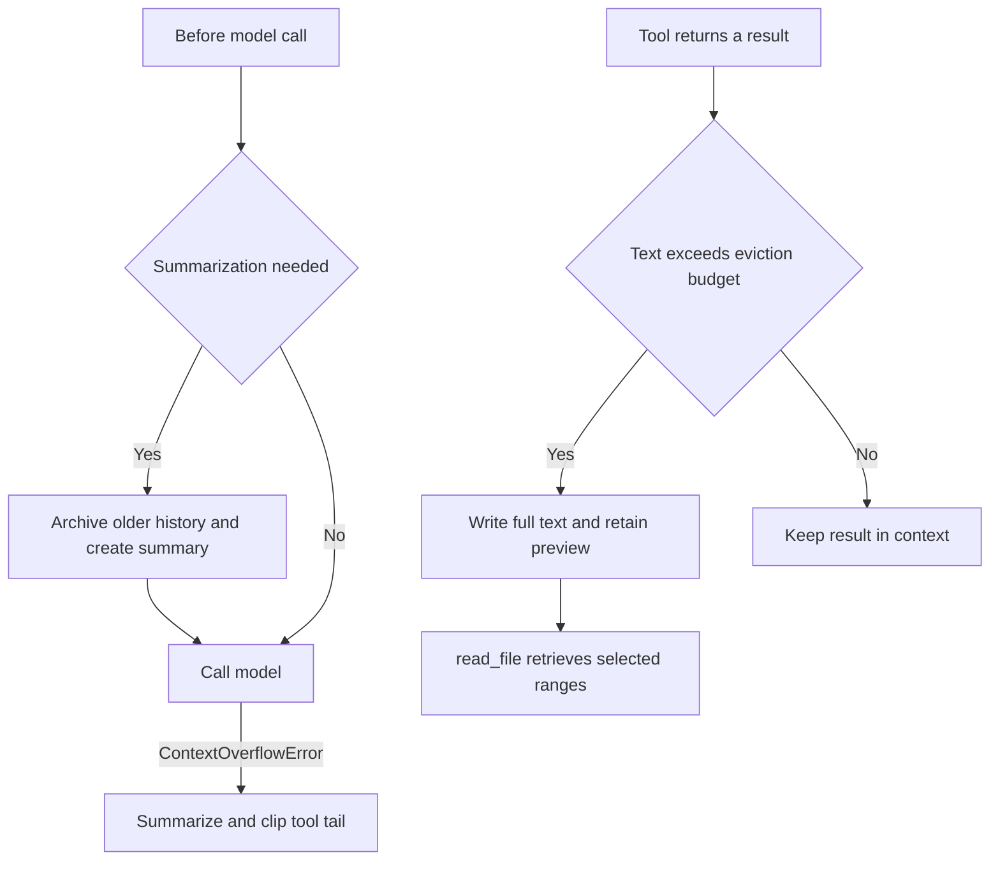
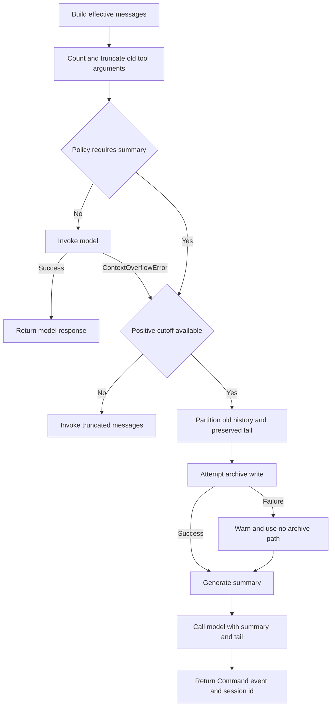
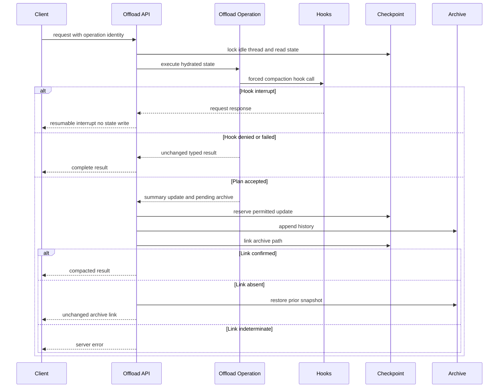

# Context Management

Long-running agent threads have two separate context pressures: one tool can
return too much text, and a conversation can exceed a provider's input window.
The SDK addresses them with **large-tool-result eviction**, **summarization**,
and an overflow-only tail-clipping fallback. dcode layers hook-aware automatic
compaction and a server-owned `/offload` operation over the same compaction
engine.

These controls change the history presented to a model; they are **not** normal
durable-thread checkpoint persistence. SDK summarization carries its effective
history through summarization state and modifies the model request. An archive
write failure can therefore leave a successful in-context summary without a
recoverable external copy of older messages. The server `/offload` boundary has
stricter state/archive commit handling. See [State
Persistence](/openwiki/concepts/state-persistence.md) for checkpoint lifecycle.

Caption: Proactive eviction replaces a single oversized result, while threshold
or overflow compaction changes the next model request.

## Large tool results: evict text, retain a recovery path

`FilesystemMiddleware` uses the shared eviction helper for tool results over its
configured budget. The helper extracts text blocks, writes that text to
`{large_tool_results_prefix}/{sanitized_tool_call_id}`, and replaces the
`ToolMessage` with `TOO_LARGE_TOOL_MSG`. The replacement contains a numbered
head-and-tail preview and tells the model to use `read_file` with `offset` and
`limit`; it retains the message identity and any non-text blocks. If the backend
write fails, the helper returns no replacement, so callers retain the original
result instead of emitting an unusable pointer.

The summarizer derives its history and large-result prefixes from the supplied
backend. For a `CompositeBackend`, they are under its `artifacts_root`;
otherwise they use `/conversation_history` and `/large_tool_results`. Recovery
therefore depends on the backend route that serves `read_file` resolving the
path written into model-visible context. [Tools and Filesystem](/openwiki/concepts/tools-filesystem.md)
describes that tool boundary.

## SDK summarization and overflow recovery

`SummarizationMiddleware.wrap_model_call` first reconstructs effective messages
from any earlier event, counts them with the system message and tools, and
optionally truncates old oversized tool arguments. It checks the configured
summarization policy; when it fires and a positive cutoff is available, it
partitions old and retained messages, archives the old portion, creates an LLM
summary, and calls the model with the summary plus the preserved tail. Its
`ExtendedModelResponse` returns a `Command` that records the event and session
id. If the normal provider call instead raises `ContextOverflowError`, the same
summarization path is attempted reactively.

Caption: SDK compaction is request-level context control; an archive failure is
non-fatal but explicitly removes the recovery pointer.

### Conversation archive lifecycle

Older history is appended, rather than overwritten, to one markdown file per
summarization session at `{artifacts_root}/conversation_history/{session_id}.md`.
Each event contributes a timestamped `## Summarized at` section rendered as XML.
Previous summary messages are excluded, avoiding archival of summaries of content
already archived. `_summarization_session_id` is reused from state on later turns;
otherwise a full UUID-derived id is generated and returned in the state update.

Before archival, inline base64 media is uploaded below the history media prefix
and rewritten to path references so the archive and summary see the same
reference. Failed uploads are represented as failed placeholders; if the history
archive succeeded, the middleware warns that the original media cannot be
recovered. A failed history write likewise warns and continues with
`file_path=None`, rather than claiming that checkpointed thread data was deleted.

### Overflow tail clipping

Only after overflow-triggered compaction, `_clip_overflow_tail` considers a
**trailing consecutive** `ToolMessage` batch in the preserved suffix. It acts
when the batch reaches the keep-derived token threshold: the explicit token
budget, a known model-limit fraction, or `5_000` for message-based keep (and for
an unknown fraction limit). Generic tool results are offloaded through the same
large-result helper. A `read_file` result is instead reduced to about 4,000
leading characters and points to its existing `file_path`, avoiding a redundant
write. Replacement ids allow the message reducer to overwrite the corresponding
state entries; failed writes leave their messages unchanged.

## dcode compaction: hooks and server ownership

`CLICompactionMiddleware` retains the SDK model-initiated compact tool but adds a
`PreCompact` gate before automatic threshold compaction and provider-overflow
fallback. A denied automatic compaction continues to the normal call. If the
provider already overflowed and the hook blocks recovery, dcode re-raises that
original overflow. Its asynchronous automatic path serializes archive
read-append-rewrite cycles per summarization session with a process-local lock.

Forced compaction is not a client-side checkpoint mutation. `OffloadOperation`
receives server-read state and dispatches a synthetic forced
`compact_conversation` call through `PreCompact` and `PreToolUse`. A hook can
return an interrupt to the client; a resume reruns the operation from the top
with accumulated responses. The operation identity supplies a checkpoint
namespace used to derive a forced call id that is stable through these resume
rounds and distinct between attempts. Missing hook outcome data fails closed,
and denial or hook failure returns a typed unchanged result.

Caption: `/offload` owns checkpoint access and settles its archive side effects;
a hook interrupt performs no checkpoint write and resumes by replaying the
operation.

### Commit, conflict, and cancellation boundaries

The server operation can write only `_summarization_event`,
`_summarization_session_id`, and `_session_cost_usd`, never `messages`. It stages
the archive as `_PendingArchive`: after the summary state is reserved it appends
under a per-session lock, then links the archive path in the event. Before
append, it captures the exact prior archive content; if the path link is
confirmed absent after an update error, rollback restores that snapshot (or
deletes a newly created archive). If the link cannot be checked, the operation
reports an indeterminate error rather than a confirmed compaction.

The HTTP boundary locks the thread, requires it to be idle without pending graph
work, then rechecks idleness and checkpoint identity after planning. A changed
checkpoint produces a conflict stating that no state was committed; summary work
and its cost may already have occurred. It also rejects any unexpected update
channel, protecting concurrent message updates from an unattributed `/offload`
write. Commit runs in a task that is joined even when the request is cancelled,
so settlement completes before the original cancellation is re-raised.

The agent publishes `OffloadOperation` on its `CompositeBackend`. Attachment
rejects an operation whose summarizer is bound to another backend, ensuring
forced compaction writes through the same routed backend as the agent.

## Local storage and operations

In local mode conversation archives use `DEEPAGENTS_HOME` (default
`~/.deepagents`) and its `conversation_history` subdirectory. If it cannot be
prepared or written, dcode falls back to private temporary storage and exposes
that fact through `offload_storage_is_ephemeral`; those archives may not survive
a restart. The dedicated archive directory is ownership-checked and hardened to
`0o700`, while the shared profile root's permissions are deliberately untouched.

Large-result artifacts normally use a hardened per-user system-temporary
directory. If that is unavailable, dcode routes the stable
`/dcode-artifacts-fallback` virtual prefix to a private unique directory, so
stored tool paths still resolve through the configured route.

`sweep_offloaded_history` removes local markdown archives older than
`history.retention_days`; zero disables sweeping. It checks a candidate through
an open descriptor immediately before unlinking, avoiding deletion of an archive
that a concurrent refresh has rewritten. `delete_offloaded_history` is
best-effort and only removes local archives; server or sandbox archives belong to
their backend.

For session accounting see [Cost and Sessions](/openwiki/operations/cost-and-sessions.md).
Focused regression coverage is in `libs/code/tests/unit_tests/test_offload.py`
and `libs/code/tests/unit_tests/test_offload_api.py`; SDK behavior is covered
alongside middleware tests. See [Run a dcode Session](/openwiki/workflows/run-dcode-session.md)
for the interactive lifecycle.
