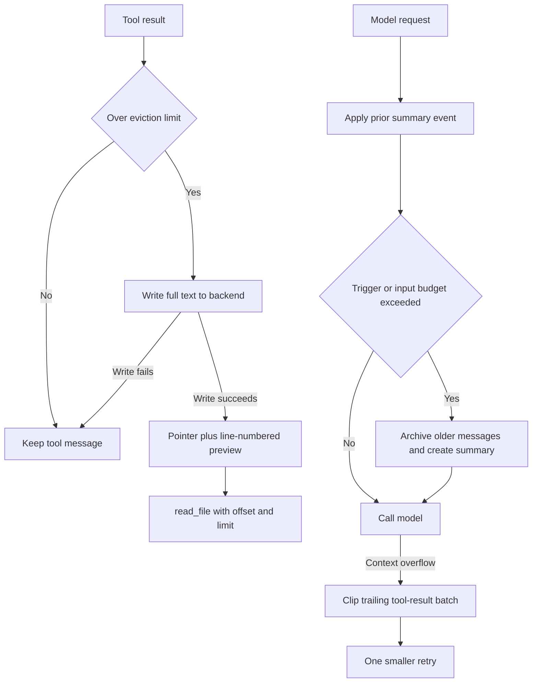

# Context Management

Long-running agents have two related but different context problems: an individual tool result or user message can be too large to send, and a conversation can outgrow the model's input budget. Deep Agents handles these at different lifecycle points:

- `FilesystemMiddleware` proactively replaces oversized tool output with a recoverable filesystem pointer and makes oversized human input a request-time preview.
- `SummarizationMiddleware` preserves raw message state, but records an event that reconstructs the model-visible history as a summary plus a recent suffix.
- A provider context failure or a known over-budget request can invoke one bounded tail-clipping fallback before the model is tried again.

The filesystem is therefore part of the context contract: a model-visible path must be readable through the same backend's `read_file` tool. See [Tools and Filesystem](/openwiki/concepts/tools-filesystem.md) for tool behavior and [State Persistence](/openwiki/concepts/state-persistence.md) for checkpoint lifecycle.

Caption: eviction reduces an individual message, whereas compaction changes the effective conversation sent to the model while retaining raw history in state.

## Proactive eviction: full data remains recoverable

`FilesystemMiddleware` defaults `tool_token_limit_before_evict` to 20,000 and treats the limit as characters via `NUM_CHARS_PER_TOKEN`; set the option to a false value to disable this path. It extracts only text blocks for the size decision. When the threshold is exceeded, the shared helper writes the complete text to `{artifacts_root}/large_tool_results/{sanitized_tool_call_id}` and replaces the `ToolMessage` text with a pointer and preview. A missing tool-call id receives a UUID-derived `unknown-...` filename, avoiding collisions. If the backend returns an error or `None`, no replacement is made: the original result remains available rather than advertising a non-existent recovery path.

The replacement is intentionally not a lossy message rewrite in every respect. It retains the tool-call id, message id, name, artifact, status, and message metadata. For mixed content, all text becomes the stub but non-text blocks remain visible, so eviction does not silently remove image, audio, or other media context. The middleware applies this to direct `ToolMessage` results and to `Command` message updates; command handling preserves a leading `REMOVE_ALL_MESSAGES` sentinel and non-tool updates. Stable ids matter because reducers use them to replace the checkpointed tool message rather than append duplicates.

### Previews are navigational, not a substitute for the result

A stub tells the model to retrieve selected ranges with `read_file(file_path, offset, limit)`. Its preview is line-numbered and normally shows five lines from the head and five from the tail. If it omits middle lines it inserts an explicit truncation marker; independently, each shown line is capped at 1,000 characters. The explanatory sentence is derived from flags recorded while constructing the preview, so it describes only losses that actually occurred. A literal marker in source content cannot be mistaken for middleware truncation.

`CompositeBackend.artifacts_root` prefixes both large-result and conversation-history paths; non-composite backends use root-level `/large_tool_results` and `/conversation_history`. Configure routing so the `read_file` tool resolves these paths to the backend where they were written. This is an operational invariant, not just a naming convention.

## Large human messages: preserve state, reduce only the request

Human-message eviction has different ownership semantics. If the newest untagged `HumanMessage` exceeds `human_message_token_limit_before_evict` (50,000 by default, using the same character approximation), `FilesystemMiddleware` writes its full text to a UUID-named file under `conversation_history`. It retains the original full content in checkpointed messages, adds `additional_kwargs["lc_evicted_to"]`, and sends the model a head-and-tail preview instead. On later turns, every tagged human message is previewed again for the outgoing request.

On a successful new eviction the state update contains only a same-id tagged copy of the human message. This lets the message reducer replace that checkpoint entry without deleting an `AIMessage` produced in the same graph super-step. A write failure neither adds the tag nor truncates what the model receives. Consequently, do not treat human eviction like tool eviction: tool-message text is replaced in state, while human-message text remains in state and is only transformed at the model boundary.

## Summary events and archived history

`SummarizationMiddleware` holds its compaction state in `_summarization_event` and `_summarization_session_id`. A prior event reconstructs effective messages as its `summary_message` followed by raw messages from `cutoff_index`; it does not delete the raw message list. The event also contains an optional archive `file_path`, which is `None` if archival failed.

Before deciding whether to compact, the middleware counts effective messages together with the system message and—when supported by the configured counter—tool schemas. It can first truncate old `write_file` and `edit_file` arguments. Summarization occurs if its configured trigger fires or if the complete request already exceeds the calculated input budget. Triggers may be a size tuple, an ANDed dictionary of conditions, or a list of ORed clauses; `keep` determines the recent suffix retained verbatim.

For a positive cutoff, older messages are partitioned from the preserved suffix. Inline `data:` media in the old partition is uploaded once to `{artifacts_root}/conversation_history/media/{sha256-prefix}.{ext}`, deduplicated by content hash, and replaced by typed path references before both archiving and summary generation. Decode or upload failures become explicit failed-offload placeholders and are warned about rather than silently discarded. The archive appends XML-rendered, non-summary messages to one session file under `conversation_history`, headed by `## Summarized at ...`; the internally generated session id is persisted and reused across turns. Archive failure is non-fatal: a usable in-context summary is still emitted without a path.

## Overflow fallback: strict reduction and one retry

A normal request is tried when compaction is not indicated. The middleware recognizes `ContextOverflowError` and selected context-limit language on 400, 413, and 422 errors, but propagates unrelated bad requests. It also computes an input budget from the model profile: 95% of `max_input_tokens`, less the largest configured output reservation. This avoids sending a request known to exceed input capacity because of system prompt, tools, or output allocation.

On pressure, the fallback examines only a trailing consecutive batch of `ToolMessage` values. In the budget-retry path it uses `keep=("tokens", 1)`, making clipping aggressive enough to form a strictly smaller retry. Generic tool results are persisted through the same large-result eviction helper. A `read_file` result is special: because the full source already exists at the tool call's original `file_path`, the fallback keeps roughly 4,000 leading characters and a notice pointing to that path instead of writing a duplicate artifact. Replacements retain ids and are returned in a `Command` update, so checkpoint state also reflects the recovered representation.

The retry rules prevent futile loops: a reduced request must be smaller than a rejected request, must fit a known budget, and is sent at most once. If tail clipping cannot reduce an overflowing request—for example, because the write failed or there is no eligible trailing batch—the original rejection becomes terminal. If irreducible system, tool, or output overhead already exceeds budget, the provider is not called. A second recognized overflow becomes `ContextOverflowError` with the provider error as its cause.

## Configuration and safe changes

- Tune `tool_token_limit_before_evict`, `human_message_token_limit_before_evict`, summary `trigger`, `keep`, and optional old-argument truncation as a system: lower thresholds trade tool/file reads and summary calls for smaller model requests.
- Ensure `read_file` remains exposed—`FilesystemMiddleware` rejects a tool allowlist that omits it—because all pointer-based recovery depends on it.
- Preserve tool-call/result pairing and stable message ids when altering reductions. Clipping only the trailing contiguous tool-result batch avoids breaking provider tool-call ordering.
- Keep sync and async implementations behaviorally aligned: they use `write`/`awrite`, archive methods, and concurrent async tail clipping respectively.
- Treat an archive path as conditional. A summary can be valid even when its archive is absent, but an advertised result pointer must only be emitted after a successful write.

## Focused verification

The middleware tests cover proactive result eviction, command-update handling, sanitized and missing call ids, preservation of mixed content and message metadata, and preview notices for omitted versus clipped lines. End-to-end tests verify large human input remains complete in state while the model sees a preview, and that tagged input is previewed across later turns. The overflow tests verify both special `read_file` clipping without duplicate artifacts and generic tool-result offload, while recovery tests assert a reduced request, no retry of unrelated bad requests, no known-over-budget provider call, and a terminal error after the single smaller retry.
