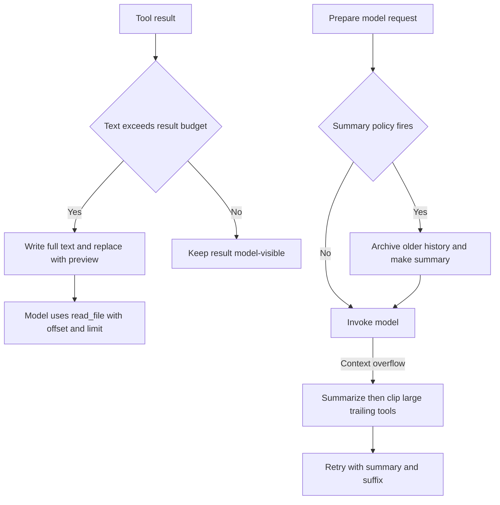
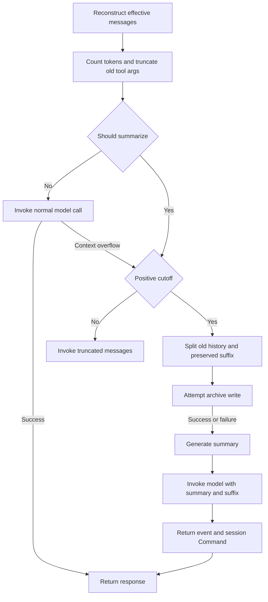
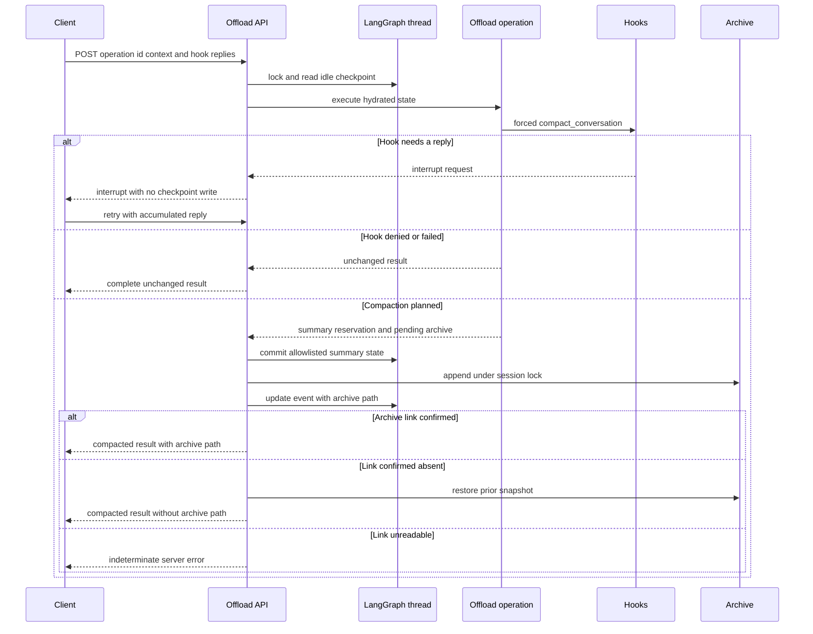

# Context Management

Long-running agent threads face two different pressures: a single tool can return too much text, or the conversation can exceed a model input window. The SDK addresses them with **large-result eviction**, **summarization**, and an overflow-only tail-clipping fallback. dcode adds hook-aware automatic compaction and a server-owned `/offload` operation.

These mechanisms primarily change what the next model call sees. They must not be confused with durability:

- **Model-visible compaction** replaces older effective history with a summary and retains a recent suffix. Large-result eviction replaces text with a preview and a `read_file` recovery instruction.
- **Archive recoverability** is a separate backend file write. A summary can still be usable when archive writing fails, but there is then no external recovery pointer for the compacted raw history.
- **LangGraph checkpoint persistence** retains the thread's `messages` channel and may persist summarization metadata. SDK auto-summarization returns a `Command` for `_summarization_event` and `_summarization_session_id`; it does not rewrite the full message channel merely to compact the request. Server `/offload` also owns a narrowly allowlisted checkpoint update. See [State Persistence](/openwiki/concepts/state-persistence.md) for checkpoint lifecycle.

Caption: SDK controls either one oversized tool result or the effective history supplied to a model; an overflow enables the additional tail-clipping fallback.

## Large tool results: evict text, preserve retrieval

`FilesystemMiddleware` uses the shared eviction helper for an oversized tool result. The helper extracts text blocks, writes the text to `{large_tool_results_prefix}/{sanitized_tool_call_id}`, and substitutes `TOO_LARGE_TOOL_MSG`. The substitute includes a line-numbered head-and-tail preview and directs the model to call `read_file` with `offset` and `limit`. It preserves the `ToolMessage` identity fields and non-text content blocks, so media remains visible. If the backend write returns an error or `None`, there is no substitute and the original result remains visible rather than producing a broken pointer.

The selected backend matters: the resulting path must be readable through the same agent filesystem route. In particular, the summary middleware derives its history and large-result roots from the supplied backend; a `CompositeBackend` uses its `artifacts_root`. See [Tools and Filesystem](/openwiki/concepts/tools-filesystem.md) for the filesystem boundary.

## SDK summarization and overflow recovery

`SummarizationMiddleware.wrap_model_call` reconstructs effective messages from a prior event, counts them with the system message and tools, and can truncate old tool arguments. It checks `_should_summarize`; with a positive `_determine_cutoff_index`, it partitions old and retained messages, attempts to archive the old portion, creates an LLM summary, and invokes the model with the summary plus preserved tail. The resulting `ExtendedModelResponse` carries a `Command` update for the event and session id. The original checkpointed message list is not removed by this request-level compaction.

If the policy does not call for a summary, the middleware first makes the normal model call. A `ContextOverflowError` switches to the same summarization path. If there is no positive cutoff, it retries with the truncated messages rather than emitting an event. Archive failure logs and warns, but does not prevent summary generation; the event's `file_path` is `None`, accurately signaling that older history is not externally recoverable.

Caption: Archive persistence is best effort in SDK summarization, while the summary event controls the compacted model request.

### Archive lifecycle and media

Pre-summary history is appended to one per-session markdown file at `{artifacts_root}/conversation_history/{session_id}.md`. Each compaction adds a timestamped `## Summarized at` section whose messages are XML-rendered; previous summary messages are filtered to avoid recursively archiving summaries. The middleware reuses `_summarization_session_id` from state, or generates one and returns it in the update.

Inline base64 media in the compacted region is first uploaded under the history-media prefix and rewritten as path references for both archive and summary. Failed uploads become failed placeholders. If the archive was written but media uploads failed, the middleware warns that the original media cannot be recovered.

### Overflow tail clipping

Only an overflow-triggered summarization invokes `_clip_overflow_tail`. It examines only a trailing consecutive `ToolMessage` batch in the preserved suffix and clips it when its combined tokens reach the keep-derived threshold: the token keep budget, the fraction of a known input limit, or 5,000 tokens for message-based keep or an unknown fraction limit.

A trailing `read_file` result is reduced to about 4,000 leading characters plus a pointer to its original `file_path`; no redundant backend write is needed. Other tool results use the generic eviction helper. Replacements retain ids so the message reducer can overwrite corresponding state entries. A failed offload leaves that message unchanged.

## dcode compaction: hooks and server ownership

`CLICompactionMiddleware` keeps the SDK's model-initiated `compact_conversation` tool, but gates automatic threshold compaction and provider-overflow recovery with `PreCompact`. If the automatic gate denies a threshold compaction, the normal call proceeds. If a provider call has already overflowed and the gate blocks recovery, dcode re-raises the original `ContextOverflowError`. The asynchronous automatic and tool paths serialize archive read-append-rewrite cycles for a session with a process-local archive lock.

The server-owned `/offload` path is different: `OffloadOperation` is published on the agent's `CompositeBackend`, is bound to the agent's compaction middleware and hooks, and operates on state read by the HTTP service. Attachment rejects a summarizer bound to another backend. This prevents a forced compaction archive from routing somewhere different from the agent filesystem.

Before planning, forced offload dispatches a synthetic forced `compact_conversation` through `PreCompact` and `PreToolUse`. Hooks can deny it, fail it, or interrupt for client fulfillment; a missing hook outcome channel fails closed. An interrupt does not write checkpoint state. The client sends accumulated replies on a subsequent request, which re-executes the operation from the top; the per-attempt `operation_id` becomes `dcode_offload:{operation_id}` checkpoint namespace, producing a forced call id that is stable across resume rounds but distinct across attempts.

Caption: The HTTP operation owns checkpoint access and archive settlement; hook interrupts are resumed by replay rather than a server-held coroutine.

### Checkpoint commit, conflicts, and cancellation

The server operation allowlists only `_summarization_event`, `_summarization_session_id`, and `_session_cost_usd`; it never writes `messages`. It plans a `_PendingArchive` rather than writing history while creating the summary. It first reserves the summary event with `file_path=None`, then appends the archive under the per-session lock, and finally updates the event with its path.

Before append, `_PendingArchive` captures the exact old archive content. If the archive-path update errors and readback confirms the path is absent, `_ArchiveAppend.rollback` restores that content or deletes a newly created archive. If readback confirms the link landed, the archive path is reported. If it cannot be read back, the operation reports an indeterminate error rather than claiming a confirmed result. An archive append failure after summary reservation leaves the summary checkpointed with no archive path; raw thread messages remain in LangGraph state, but the effective context uses the summary.

The HTTP boundary serializes each local thread id, rejects active or interrupted threads and pending graph work, and rechecks idleness plus checkpoint identity after planning. If the checkpoint advanced, it reports a conflict that no offload state was committed, though the summary model call and its cost may already have occurred. The boundary also validates request shape and uses checkpointed model configuration rather than a client-selected model transport for the server-owned operation.

Cost records are settled with the commit: a write failure with an unchanged checkpoint rolls them back; an advanced or unreadable checkpoint is indeterminate and keeps them claimed to avoid double charging. Commit runs in a task that is joined even if cancellation arrives, then the original cancellation is re-raised. The routes are `POST /dcode/threads/{thread_id}/offload` and `POST /dcode/threads/{thread_id}/offload/{operation_id}/cancel`; completed and hook-interrupt rounds are 200, request errors are 422, thread conflicts 409, unavailable runtime 503, and indeterminate or unexpected faults 500.

## Local storage and operations

In local mode conversation archives use `DEEPAGENTS_HOME` (default `~/.deepagents`) and its `conversation_history` subdirectory. If it cannot be prepared or written, dcode falls back to private temporary storage and exposes that through `offload_storage_is_ephemeral`; those archives may not survive restart. The dedicated archive directory is ownership-checked and hardened to `0o700`, while the shared profile root permissions remain untouched. In server or sandbox mode, archive persistence belongs to the backend, not the local client directory.

Large-result artifacts normally use a hardened per-user system-temporary directory. If that predictable directory is unavailable, dcode maps the stable `/dcode-artifacts-fallback` virtual root to a unique private directory, preserving a usable agent-visible route.

`sweep_offloaded_history` removes local markdown archives older than `history.retention_days`; zero disables the sweep. It opens and rechecks a regular archive immediately before unlinking to avoid racing a concurrent archive refresh. `delete_offloaded_history` is best effort and applies only to local archives.

## Validation and related material

Focused server coverage in `libs/code/tests/integration_tests/test_offload_server_side.py` constructs the production server-backed configuration, verifies `/offload` persists a summarization event, and reads the archive through the agent's own `read_file` tool. `libs/code/tests/unit_tests/test_offload_api.py` covers channel allowlisting, conflict and indeterminate writes, archive-link settlement, hook interrupts and reply replay, cancellation, and the HTTP routes. SDK behavior is covered with the middleware tests.

See [Middleware Catalog](/openwiki/concepts/middleware-catalog.md) for placement, [Cost and Sessions](/openwiki/operations/cost-and-sessions.md) for accounting, and [Runtime Behavior](/openwiki/runtime-behavior.md) for execution context.
