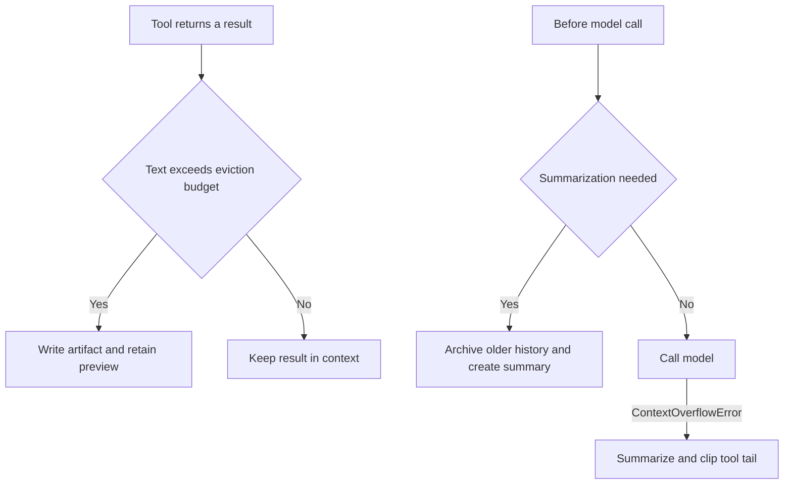
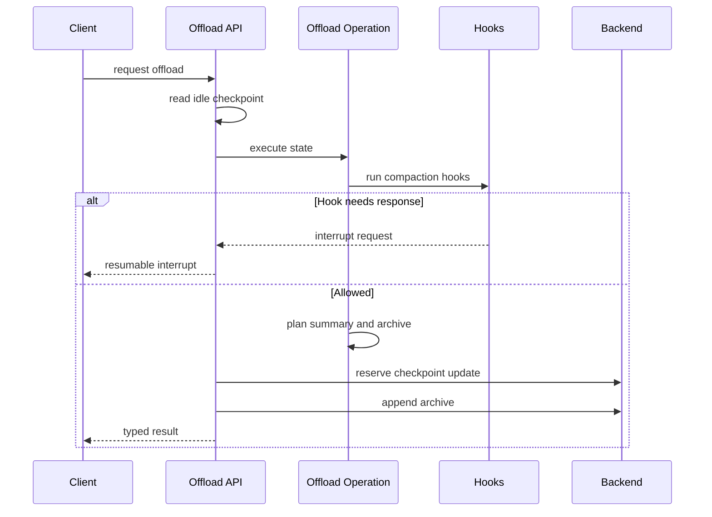

# Context Management

Long-running agent threads have two different context pressures: a single tool can
return too much text, and a conversation can grow beyond a model's usable input
window. The SDK addresses them with **large-tool-result eviction**,
**summarization**, and an overflow-only tail-clipping fallback. dcode adds a
hook-aware `compact_conversation` implementation and a server-owned `/offload`
operation.

These mechanisms manage what is sent to the model; they are not durable thread
checkpointing. A summary event changes the effective message history used for a
model call, while normal checkpoint persistence is the separate responsibility of
the graph/server. In particular, a failed archive write does not by itself erase a
checkpoint. It can leave a successful in-context compaction without a recoverable
external copy of the older content; the SDK warns and records `file_path=None`.
The server operation has stricter commit/conflict handling described below. See
[State Persistence](/openwiki/concepts/state-persistence.md) for checkpoint
lifecycle.

Caption: Proactive tool eviction and threshold compaction share backend storage, while provider overflow activates the recovery path.

## Large tool results: evict text, retain a recovery path

`FilesystemMiddleware` runs its interception after a tool completes in both
`wrap_tool_call` and `awrap_tool_call`. It skips configured exclusions and does
nothing when `_tool_token_limit_before_evict` is `None`. Otherwise it measures
extracted text against `NUM_CHARS_PER_TOKEN * _tool_token_limit_before_evict`;
`NUM_CHARS_PER_TOKEN` is `4`, so this is a character approximation rather than an
exact tokenizer limit.

An over-budget result is written to
`{large_tool_results_prefix}/{sanitized_tool_call_id}` and replaced by a
`TOO_LARGE_TOOL_MSG` notice. The notice includes a numbered head-and-tail preview
and directs the model to recover selected portions with `read_file` plus `offset`
and `limit`. It preserves the original tool-message identity and non-text blocks,
so images and audio remain model-visible while only text is moved. A failed backend
write returns no replacement, leaving the original tool result in context rather
than a dangling pointer.

The prefix is `{artifacts_root}/large_tool_results` (or `/large_tool_results` for
an artifacts root of `/`). It must resolve through the same backend that serves
`read_file`; otherwise a pointer emitted into context would not lead to the saved
content. [Backends](/openwiki/concepts/backends.md) describes routed backend paths.

## Automatic summarization and archive lifecycle

`SummarizationMiddleware` wraps sync and async model calls. It first derives the
effective history from any previous summary event, counts it (including the system
message and tools), and can truncate old oversized tool-call arguments when
configured. It then tests the configured `trigger`. When a cutoff is available,
it partitions older messages from the preserved tail, offloads the older portion,
creates an LLM summary, and calls the model with the summary followed by the tail.
A `Command` records the summary event and session id for later turns.

`trigger` and `keep` are `ContextSize` policies. `keep` defaults to
`("messages", 20)` and `trim_tokens_to_summarize` defaults to `4000`; callers can,
for example, express token or fraction policies. If the threshold has not fired,
the middleware makes the normal provider call. A `ContextOverflowError` from that
call instead enters the same summarization path as a reactive fallback.

The `SummarizationToolMiddleware` exposes `compact_conversation`, allowing the
model or a human-in-the-loop workflow to request the same engine on demand. The
CLI tool describes proactive use when the conversation is becoming long.

### Archive contents and failure semantics

Pre-summary history is appended, not overwritten, to one session markdown archive
at `{artifacts_root}/conversation_history/{session_id}.md`. Each event adds a
timestamped `## Summarized at` section containing XML-rendered messages; prior
summary messages are excluded so a chain does not archive summaries of summaries.
`_summarization_session_id` is persisted and reused across turns, while a new
full-entropy UUID session id scopes each graph invocation, including subagents.

Inline base64 media is stored separately beneath `conversation_history/media` and
replaced by a path reference before archival and summary generation. The default
summary prompt asks the model to preserve those reference tags. If media upload
fails after the history archive succeeds, the saved history carries a failed
placeholder and the original media is not recoverable from that archive.

Archive failure is deliberately non-fatal in the SDK path: it logs and warns that
older messages are not recoverable, but still generates the summary with no archive
path. This is a recoverability failure, not an assertion that durable thread data
was deleted. Operators should treat it as an actionable storage/backend failure.

### Overflow tail clipping

After an overflow-triggered compaction, `_clip_overflow_tail` examines only a
trailing consecutive batch of `ToolMessage`s in the preserved suffix. It clips only
when their combined tokens reach the keep-derived threshold: the keep token value,
a fraction of the model maximum when known, or `5_000` for message-based keep.

A `read_file` result is sliced to roughly 4,000 leading characters and points back
to the original `file_path`; the full content already exists there. Other results
are offloaded through the usual large-result helper and become `TOO_LARGE_TOOL_MSG`
stubs. Replacement messages reuse ids so the `add_messages` reducer overwrites the
state entries. A failed write retains that message unchanged.

## dcode compaction: hooks, forced offload, and one backend

`CLICompactionMiddleware` uses the SDK summarizer but adds dcode policy. Automatic
threshold compaction and provider-overflow fallback run the `PreCompact` hook first.
A denial prevents compaction; when the provider has already overflowed, the wrapper
re-raises that original overflow rather than pretending recovery succeeded. The CLI
also serializes automatic and tool-initiated archive appends per session with a
process-local `asyncio.Lock`, protecting the read-append-rewrite archive cycle.

Forced offload is server-owned rather than a client-side checkpoint mutation. The
HTTP operation reads an idle thread's checkpoint, invokes `PreCompact` and
`PreToolUse` through a synthetic forced `compact_conversation` call, and can return
a resumable hook interrupt. Resume requests replay already supplied hook responses
under the same operation identity. A denial or hook failure becomes a typed outcome;
no checkpoint state is written while a hook response is outstanding.

Caption: Server-owned forced offload gates compaction through hooks and coordinates checkpoint and archive side effects.

The operation permits only summary/session/cost channels in its checkpoint update,
never `messages`. It stages an archive append and commits it only after reserving
the checkpoint summary; rollback can restore the previous archive snapshot. The
archive read guard fails closed after a non-not-found read error so a later
truncating write cannot overwrite history whose prior content was not safely read.
`OffloadResult` reports `compacted`, `empty`, `noop`, `denied`, or `failed`; denied
and failed outcomes include a reason.

The shared-backend invariant is explicit: the `OffloadOperation` is attached to the
same `CompositeBackend` used by the agent's compaction middleware, and attachment
rejects an operation bound to another backend. In local mode, agent construction
routes conversation history to its dedicated storage backend and ensures artifact
and fallback paths resolve consistently. This prevents a summary pointer or archive
write from silently landing in a different backend or project tree.

An HTTP offload also rejects active/pending threads and verifies that the checkpoint
has not advanced before commit. If it changes, the already-paid summary is discarded
and no state is committed. An indeterminate checkpoint write is reported as a server
failure rather than being represented as a confirmed compacted result.

## Local storage, retention, and operations

In local mode, conversation archives live under
`DEEPAGENTS_HOME` (default `~/.deepagents`) in `conversation_history`. If that
profile location cannot be made writable, dcode uses a private temporary directory
and reports it through `offload_storage_is_ephemeral`; it may not survive a restart.
The dedicated archive directory is ownership-checked and hardened to `0o700`, while
the shared profile root's permissions are not changed.

Large tool artifacts use a stable hardened per-user directory under the system temp
directory. If it is unusable, dcode uses a private unique directory behind the
stable `/dcode-artifacts-fallback` virtual root. The stable virtual name lets stored
paths continue to match their route.

`sweep_offloaded_history` removes local markdown archives older than
`history.retention_days`, defaulting to 30 days; zero disables sweeping. The sweeper
rechecks an open file's metadata immediately before unlinking, avoiding deletion of
an archive that a concurrent refresh has just rewritten. `delete_offloaded_history`
best-effort removes one local archive and returns true only when it removed a file;
in server or sandbox mode the archive belongs to the sandbox backend, so there is no
local archive to remove.

For session cost and operation accounting, see [Cost and Sessions](/openwiki/operations/cost-and-sessions.md). Focused coverage for eviction, summaries, overflow behavior, hooks, and server offload belongs in the [Testing Guide](/openwiki/testing/testing-guide.md). A complete interactive lifecycle is described in [Run a dcode Session](/openwiki/workflows/run-dcode-session.md).
