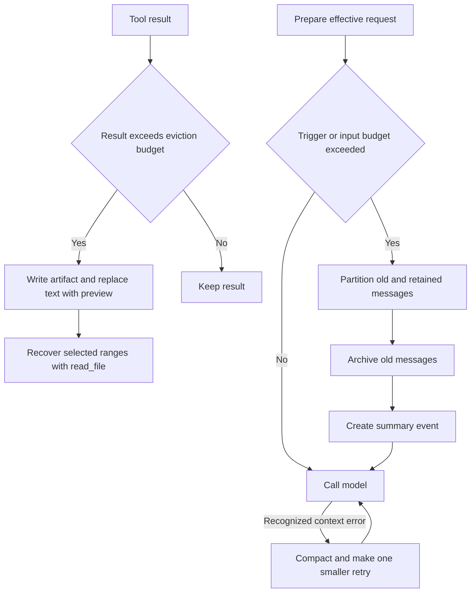
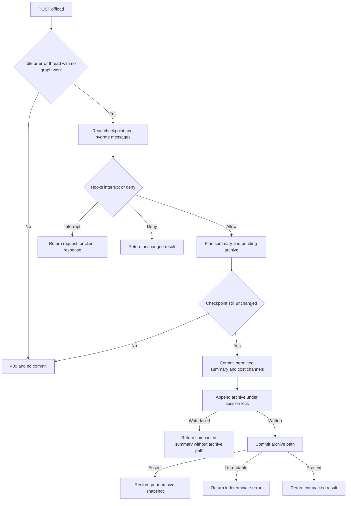

# Context Management and Offloading

Long-running threads face two different pressures: a single tool result can be too large to keep in a request, and accumulated messages plus system prompt, tool schemas, and output reservation can exceed the model input budget. Deep Agents addresses them with **result eviction**, **summarization events**, and a one-retry overflow recovery. dcode layers policy hooks and a server-owned `/offload` operation on that mechanism.

These mechanisms primarily change the **effective messages sent to the model**. SDK summarization retains raw `messages` and records `_summarization_event` and `_summarization_session_id`; the event reconstructs a summary plus the retained suffix on later calls. This is distinct from durable memory files and checkpoint lifecycle; see [State Persistence](/openwiki/concepts/state-persistence.md) and [Runtime Behavior](/openwiki/architecture/runtime-behavior.md).

Caption: Result eviction is independent of conversation compaction; compaction preserves raw messages while changing the model-visible history.

## Result eviction and recovery paths

`FilesystemMiddleware` proactively offloads oversized tool-result text through the shared helper. It writes extracted text to `{large_tool_results_prefix}/{sanitized_tool_call_id}` and replaces text with `TOO_LARGE_TOOL_MSG`: a line-numbered head-and-tail preview that tells the model to call `read_file` with `offset` and `limit`. A failed backend write returns no replacement, so the original result remains. The replacement preserves `tool_call_id`, message id, metadata, artifact, status, and non-text content blocks; an image or other media remains model-visible. This wrapper processes both a direct `ToolMessage` and tool-produced `Command` message updates, retaining a leading `REMOVE_ALL_MESSAGES` sentinel and every non-tool update message.

`human_message_token_limit_before_evict` is a separate, request-time path. When the newest `HumanMessage` exceeds its character-derived threshold, the middleware writes its text to a new UUID-named markdown file under `conversation_history`, tags the checkpointed full message with `additional_kwargs["lc_evicted_to"]`, and supplies a head-and-tail `TOO_LARGE_HUMAN_MSG` preview to the model. On later requests every tagged human message is previewed again from the full checkpointed content. The tag update reuses the original message id and is emitted by itself so the message reducer replaces it without deleting the model response written in the same super-step; a failed write neither tags nor truncates the new message. Non-text blocks remain in the model-visible preview message.

For sandbox `execute`, capture-at-source is another distinct optimization: it is attempted only when the execution backend is a `BaseSandbox` and the large-result path resolves to that same default backend. `execute_with_offload` can then write output directly to the recovery path and return the tool-result stub. Its capture result explicitly says when the saved file is incomplete because the capture size limit truncated output; otherwise execution falls back to ordinary execution and post-result eviction.

The summarizer uses `CompositeBackend.artifacts_root` when available, producing paths under its artifact root; a non-composite backend uses `/conversation_history` and `/large_tool_results`. A displayed path is useful only when the same backend exposed to `read_file` can resolve it. See [Tools and Filesystem](/openwiki/concepts/tools-filesystem.md).

## SDK compaction and recovery

`SummarizationMiddleware.wrap_model_call` first reconstructs the effective messages from the prior event, counts messages together with system prompt and tools, and optionally truncates old `write_file` and `edit_file` arguments. It summarizes when its configured trigger fires **or** the measured request is already above the calculated input budget. A trigger can be a size tuple, an ANDed dictionary clause, or ORed clauses; `keep` determines the retained suffix.

For a positive cutoff, it partitions messages, rewrites inline data media, archives the old partition, creates an LLM summary, and calls the model with summary plus retained messages. Its `Command` writes the summary event and session id; it writes replacement tail messages only when overflow clipping produced replacements. A summary archive failure warns and leaves `file_path=None`, but does not discard a usable in-context summary.

Provider recovery is intentionally bounded. In addition to `ContextOverflowError`, the middleware recognizes context-limit wording in 400, 413, and 422 errors, but does not retry unrelated bad requests. It attempts normal execution when compaction is not indicated, then falls back to compaction on a recognized context error. It rejects a known over-budget reduced request and never sends an unchanged rejected request; after recovery it permits at most one strictly smaller retry, otherwise raises `ContextOverflowError` with the original provider error as cause.

### Archive, media, and session lifecycle

Each summarization session appends XML-rendered old messages to one markdown file, `{artifacts_root}/conversation_history/{session_id}.md`, under a timestamped `## Summarized at` heading. Earlier summary messages are filtered from subsequent archive sections. The session id is reused from state or generated as `session_<uuid>`, then persisted so later turns append to the same file.

Before both archive rendering and summary generation, inline `data:` media is uploaded under `conversation_history/media` and replaced by typed path references. Content-hash deduplication avoids repeated uploads. Decode or upload failure becomes a failed-offload placeholder; if the archive itself succeeds, the middleware warns that the original media cannot be recovered.

### Tail clipping after pressure

The overflow fallback can reduce a trailing consecutive batch of `ToolMessage` values. The helper’s threshold derives from `keep` (tokens, a fraction of a known model limit, or a 5,000-token fallback), but the SDK budget-retry path invokes it with `keep=("tokens", 1)` whenever it must make the recovery request. Generic tool results are persisted through the eviction helper. For a `read_file` result, clipping instead retains about 4,000 leading characters and points to the already-existing source path, avoiding a redundant write. Replacement messages retain ids so the messages reducer overwrites their checkpoint entries; failed writes leave originals unchanged.

## dcode: policy-aware compaction and `/offload`

`CLICompactionMiddleware` exposes model-initiated `compact_conversation` and runs `PreCompact` before automatic threshold compaction and overflow recovery. A denied threshold compaction falls through to the normal call. If a provider has already returned `ContextOverflowError` and the gate blocks recovery, dcode re-raises that overflow rather than proceed without the required reduction. Async automatic and model-initiated archive updates use a process-local asyncio lock keyed by summarization session to serialize the archive read-append-rewrite cycle.

`OffloadOperation` is the server-side forced form. It reads hydrated checkpoint state, applies any existing event to calculate effective history, dispatches a synthetic forced `compact_conversation` through `PreCompact` and `PreToolUse`, and plans a summary update. Hook interrupts return to the client with no state write. A resume request re-executes the operation from the beginning with accumulated hook responses; the forced call id derives from that attempt’s checkpoint namespace, so it is stable across resume rounds and changes between attempts. A missing hook-outcome channel fails closed.

Caption: Server offload reserves checkpoint state before its archive side effect and checks that the resulting archive link landed.

### HTTP boundary, state, and failure semantics

The endpoint obtains `thread_id` from the URL and requires a non-empty `operation_id`, context, and hook-response mapping. It permits only idle or error-status threads, rejects pending graph work, serializes a thread locally, and rereads checkpoint identity before commit. An `(thread_id, operation_id)` registry rejects duplicate active and remembered terminal attempts; the cancellation endpoint cancels an active operation and waits for a terminal result.

The route is deliberately not a message-rewrite API. `OffloadStateUpdate` permits only `_summarization_event`, `_summarization_session_id`, `_session_cost_usd`, and `_session_cost_breakdown`; a runtime allowlist rejects `messages` or any future unapproved channel. If the checkpoint advanced while the summary model was running, no offload state is committed. This prevents overwriting a concurrent turn, though the discarded summary work can still have incurred model cost.

For an archive-bearing plan, `_PendingArchive` snapshots the prior archive and is written only after the summary reservation commits. An append failure is logged but does not undo that already-reserved summary: the completed result has no archive path. When an append succeeds, the follow-up event update links its path. If that update is confirmed absent, `_ArchiveAppend.rollback` restores the exact previous content or removes a newly created file; if its outcome cannot be read back, the operation reports an indeterminate error rather than success. Cancellation waits for the deferred settlement task, then re-raises the original cancellation.

### Focused verification

`test_offload_api.py` exercises the boundary’s failure-sensitive seams: a changed checkpoint makes the operation perform neither a state write nor an archive append; a forbidden channel is rejected before state persistence and returns drained cost records; a failed archive-path link rolls back its append; and cancellation waits for settlement. The same unit suite verifies that request-supplied model transport cannot replace checkpointed trusted settings. These are the regression cases to preserve when changing the commit order or HTTP payload.

Model selection is server-owned at this HTTP trust boundary. Client-supplied model, `model_params`, and `summarization_model` are discarded; trusted main-model settings are restored from checkpoint when present, while the summary model uses server launch configuration. Transport, proxy, client, and header parameters are stripped so a client cannot redirect a credentialed summary request to a chosen endpoint.

The agent publishes its `OffloadOperation` on the same `CompositeBackend` used by compaction; attachment rejects a summarizer bound to another backend. This makes the archive pointer returned by compaction recoverable through the agent’s own filesystem tools. Server integration tests cover a forced cutoff advance without replacing checkpointed messages, archive reading through `read_file`, concurrent-turn preservation, and restart/resume with a client that owns no backend.

## Local storage and operational controls

In local mode, conversation archives are kept in `DEEPAGENTS_HOME` (default `~/.deepagents`) under `conversation_history`. If this cannot be created or written, dcode falls back to private temporary storage and reports the condition through `offload_storage_is_ephemeral`; such history may not survive restart. The dedicated archive directory is ownership-checked and hardened to `0o700`, while the shared profile root’s permissions are left unchanged.

Large tool-result artifacts normally use a hardened per-user temporary directory. If that predictable location is unavailable, dcode exposes `/dcode-artifacts-fallback` and routes it to a private unique directory, retaining a stable model-visible prefix. `sweep_offloaded_history` applies `history.retention_days` to local markdown archives; zero disables sweeping, and the deletion path rechecks an open regular-file descriptor immediately before unlinking to avoid deleting an archive concurrently refreshed by compaction. `delete_offloaded_history` is best-effort local cleanup, rejects path-escaping thread ids, and does not delete sandbox- or server-owned archives.

## Safe changes checklist

- **Preserve recovery:** alter trigger/keep logic only with tests that prove the reduced request is smaller, valid tool-call/result pairs remain intact, and irreducible system/tool/output overhead never reaches the provider.
- **Preserve artifact routing:** changing `artifacts_root`, archive names, or fallback routes requires validating `read_file` against every backend that can receive the pointer. For execute capture, also prove that its path routes to the same sandbox that ran the command.
- **Keep state ownership distinct:** tool-result eviction replaces checkpointed tool text; human-message eviction deliberately retains the full checkpointed message and only makes it model-visible as a preview; SDK summary events preserve raw history; `/offload` must never write `messages`.
- **Treat archive failure separately from summary failure:** SDK compaction may continue without an archive; server offload has ordered reservation, append, verification, and rollback semantics that must not be collapsed into one write.
- **Keep the HTTP allowlist and model trust boundary:** do not permit `messages` writes or client-selected model transport in `/offload` without reworking concurrency and credential-threat assumptions.
- **Test both sync and async paths:** recovery and eviction have separate sync/async implementations; include replay coverage for tagged human-message updates and capture-at-source failure/truncation paths. dcode’s archive serialization specifically applies to asynchronous paths.
