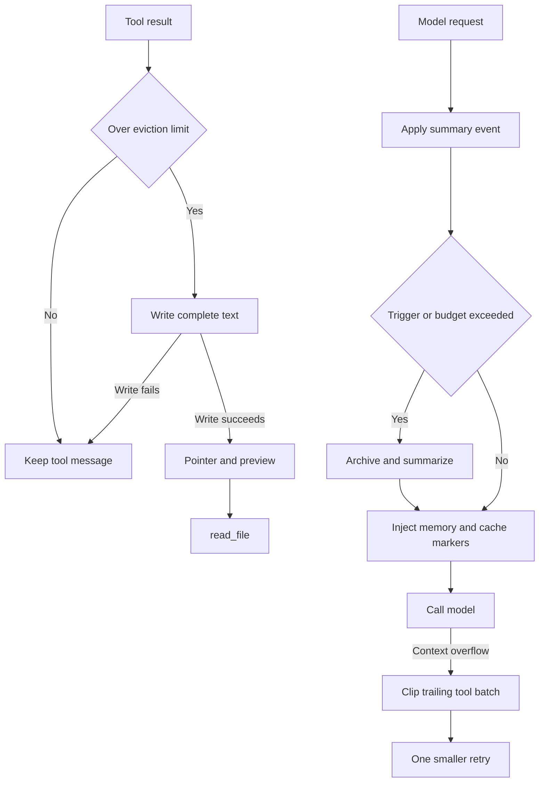
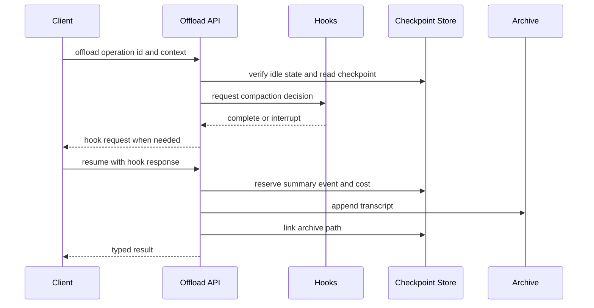

# Context Management

Long-running agents have two different context pressures: a single message or tool result can be too large, and accumulated history can exceed a model's input budget. Deep Agents addresses these at model-request boundaries without treating the checkpointed conversation as disposable:

- `FilesystemMiddleware` offloads oversized tool results and makes large human input model-visible as a recoverable preview.
- `SummarizationMiddleware` retains raw messages and records a summary event that reconstructs the effective conversation from a summary and retained suffix.
- `MemoryMiddleware` loads durable `AGENTS.md` context into the system prompt, while provider prompt-caching middleware makes stable prompt prefixes reusable.
- A known-over-budget request or recognized provider context overflow gets at most one strictly smaller recovery request.
- In dcode, `/offload` is a server-owned, checkpoint-aware compaction operation, rather than a client-side message rewrite.

Filesystem artifacts are part of the context contract: an advertised path must resolve through the configured backend's `read_file` tool. See [State Persistence](/openwiki/concepts/state-persistence.md), [Runtime Behavior](/openwiki/architecture/runtime-behavior.md), [Cost and Sessions](/openwiki/operations/cost-and-sessions.md), and [Run a dcode Session](/openwiki/workflows/run-dcode-session.md).

```mermaid
flowchart TD
    Result["Tool result"] --> ResultLimit{"Over eviction limit"}
    ResultLimit -->|No| KeepResult["Keep tool message"]
    ResultLimit -->|Yes| StoreResult["Write complete text"]
    StoreResult -->|Write fails| KeepResult
    StoreResult -->|Write succeeds| ResultStub["Pointer and preview"]
    Request["Model request"] --> Effective["Apply summary event"]
    Effective --> Budget{"Trigger or budget exceeded"}
    Budget -->|Yes| Compact["Archive and summarize"]
    Budget -->|No| Memory["Inject memory and cache markers"]
    Compact --> Memory
    Memory --> Model["Call model"]
    Model -->|Context overflow| Clip["Clip trailing tool batch"]
    Clip --> Retry["One smaller retry"]
    ResultStub --> Recover["read_file"]
```

Caption: result eviction makes individual content recoverable, whereas compaction changes the effective model history while preserving raw checkpoint messages.

## Artifact roots and proactive eviction

`CompositeBackend` defaults `artifacts_root` to `/`, routes by longest matching prefix, and preserves the public full path while delegating a stripped path to the selected backend. `FilesystemMiddleware` derives large-result and conversation-history locations below that root when it is available, otherwise at root-level paths. Route the chosen artifact root to storage exposed by `read_file`; changing only the root can make a model-visible recovery pointer unusable.

| Artifact | Path below effective root | Producer |
| --- | --- | --- |
| Generic large tool result | `large_tool_results/{sanitized-tool-call-id}` | eviction or overflow clipping |
| Large human input | `conversation_history/{uuid}.md` | `FilesystemMiddleware` |
| Archived conversation | `conversation_history/session_{uuid}.md` | summarization |
| Offloaded media | `conversation_history/media/{sha256-prefix}.{ext}` | summarization |

`FilesystemMiddleware` proactively evicts only text exceeding its configured character-derived threshold. It writes the complete content under a sanitized tool-call path and substitutes a pointer and preview only after a successful backend write; failure leaves the original message intact. The replacement preserves `ToolMessage` identity and non-text blocks. Its text preview is a line-numbered head-and-tail view that distinguishes omitted middle lines from individually clipped long lines.

Large human messages deliberately follow another ownership model. Full content remains in checkpoint state, but successful offload tags the same-id `HumanMessage` with `lc_evicted_to` and replaces it with a preview only in model requests. A same-id update avoids overwriting an AI response from the same graph step. If the write fails, the message is neither tagged nor truncated. These behavior paths have equivalent sync and async semantics using `write`/`awrite`.

## Summary events, media, and overflow recovery

`SummarizationMiddleware` does not delete raw history. `_summarization_event` stores a cutoff, a summary message, and optionally an archive path; model-visible messages are reconstructed from that summary and the retained raw suffix. The persisted `_summarization_session_id` names the per-session archive so later compactions append to it.

Before archival and summary generation, inline `data:` media is uploaded once by content hash below `conversation_history/media` and rewritten to path references. Decode or upload failures become explicit failed-offload placeholders, not silent omissions. Older non-summary messages are then rendered into timestamped Markdown history. Archive writes are best effort: summary compaction remains useful in context even when `file_path` is absent, but the old material is not storage-recoverable.

Compaction counts the entire request, including system prompt and, where the counter supports it, tool schemas. It runs when the configured trigger fires or the calculated input budget is exceeded; `keep` controls the raw suffix. Automatic and explicit `compact_conversation` use the same summary-event/session-id representation, so manual compaction is an extension point rather than a competing history format.

If a provider returns a recognized context-limit failure, recovery only clips a trailing consecutive `ToolMessage` batch, preserving tool-call/result ordering. A `read_file` result retains a short leading excerpt and points to its original source path; generic tool output is persisted with normal large-result eviction. Unrelated bad requests are not reclassified as overflow. The retry is bounded to one request that is strictly smaller than the failed request and, when known, within budget; exhausted recovery raises `ContextOverflowError`.

`UnsupportedContentMiddleware` is request-local capability filtering, not offload. It substitutes unsupported image, audio, video, and file blocks only in `HumanMessage` and `ToolMessage` model requests, leaving original graph state intact for a later capable model.

## Persistent memory and prompt caching

`MemoryMiddleware` loads configured `AGENTS.md` sources once per agent state, storing path-to-content in private `memory_contents`. Missing sources are ignored, but other download errors fail loading. At request time, configured sources are concatenated in source order, HTML comments are stripped, and the result is appended to the system prompt. Memory is reference material rather than trusted hidden instructions: its injected guidelines direct the agent to prefer explicit user requests and verified tool evidence when they conflict.

The middleware can use `system_prompt=None` to load state without injection. On an active `ChatAnthropic` request, `add_cache_control=True` tags the final system content block with ephemeral cache control. This second boundary keeps the memory portion cacheable independently from the static prompt. Graph construction appends provider-specific caching middleware for Anthropic and, when installed, Bedrock and Fireworks, then adds memory after it; memory's boundary follows runtime model selection and is a no-op for non-Anthropic wrappers.

## Dcode server-owned offload

Dcode turns manual offload into an HTTP operation over server-read checkpoint state. Agent construction creates a composite backend, routes `conversation_history` to local private storage in local mode, creates `CLICompactionMiddleware`, and publishes an `OffloadOperation` on that same backend. The operation uses the agent's existing compaction and hook policy, but its allowed update type excludes `messages`.

```mermaid
sequenceDiagram
    participant Client
    participant API as Offload API
    participant Hooks
    participant Store as Checkpoint Store
    participant Archive
    Client->>API: offload operation id and context
    API->>Store: verify idle state and read checkpoint
    API->>Hooks: request compaction decision
    Hooks-->>API: complete or interrupt
    API-->>Client: hook request when needed
    Client->>API: resume with hook response
    API->>Store: reserve summary event and cost
    API->>Archive: append transcript
    API->>Store: link archive path
    API-->>Client: typed result
```

Caption: a server operation re-executes for hook resumes, commits only after checkpoint checks, and links an archive after reserving the summary state.

`RemoteAgent.aoffload` ensures a remote thread exists, mints one `operation_id`, and posts it repeatedly while fulfilling hook interrupts. The operation id is retained across rounds so the forced compaction call id and hook invocation remain stable; a 32-fulfillment limit prevents an unbounded transport loop. It validates completed result fields before callers render them.

The server serializes each thread operation, refuses active/interrupted threads or pending graph work, reads the checkpoint itself, and rechecks the checkpoint id before commit. It trusts checkpointed main-model settings rather than client-supplied model and summarization overrides. A handoff summarizes all source messages for a new thread and saves a recovery transcript, but does not write a summary event to the source thread.

For normal offload, commit first reserves the summary event and cost state, then appends the archive under its session lock, and finally links the archive path. The archive helper refuses a truncating write after a non-not-found prerequisite read error. If linking demonstrably fails, it rolls back the archive append; if link status cannot be determined, it reports an indeterminate operation instead of asserting safe recovery. If a checkpoint write is uncertain after a thread advance, cost records remain claimed to avoid double charging and the user must inspect context before retrying.

### Local storage and lifecycle

In local mode, conversation history prefers `~/.deepagents/conversation_history`, creates and hardens its dedicated directory to `0o700`, verifies it is writable, and marks the storage ephemeral when it must fall back to a private temporary location. Startup retention sweeps only expired regular Markdown archives and treats failure as best effort. Thread deletion removes the per-thread archive and handoff snapshots, refuses suspicious path-escaping ids, and never blocks deletion on cleanup failure.

### Cancellation and remote recovery

Cancelling an in-flight client offload is not merely local task cancellation. `RemoteAgent` posts an operation-specific cancel request and defers repeated caller cancellation until the server acknowledges `cancelled` or `finished`, with a ten-second bound. The server cancels the active task and waits for its terminal outcome. Commit settlement similarly runs a started commit to completion before re-raising cancellation, avoiding a half-settled operation.

Separately, remote state recovery handles a 409 update conflict by concurrently cancelling pending and running server runs, waiting at most ten seconds per run, and retrying the update once. `aabandon_pending_work` closes only unanswered tool calls in the trailing turn with error `ToolMessage`s before clearing graph work; this preserves the provider-required adjacency of tool uses and results. A remaining pending snapshot is terminally reported rather than silently ignored.

## Operational invariants and focused tests

When changing this subsystem:

1. Never emit a recovery pointer until its write succeeds, and keep `read_file`, artifact root, and backend routing aligned.
2. Preserve message ids and trailing tool-call/result ordering; do not broaden overflow clipping.
3. Treat a summary with no archive as valid but not storage-recoverable.
4. Keep server `/offload` from writing `messages`, and revalidate checkpoint identity before state commit.
5. Maintain stable per-attempt hook identities across resume rounds and confirm server cancellation before abandoning a client operation.
6. Tune eviction limits, summarization trigger/`keep`, output reservation, memory size, and provider cache boundaries together: every injected system block consumes budget even if cached.

Focused tests cover artifact-root normalization in sync and async paths, successful-write-only eviction, mixed content and metadata preservation, media/archive failures, `read_file` clipping without duplicate artifacts, strict single-retry overflow recovery, and manual compaction state reuse. Memory tests cover ordered loading, comment stripping, request-only injection, error propagation, and Anthropic cache markers. For dcode, test the HTTP offload protocol, hook resume identity, checkpoint conflicts, archive rollback/link uncertainty, cancellation acknowledgement, and remote state-conflict recovery.
