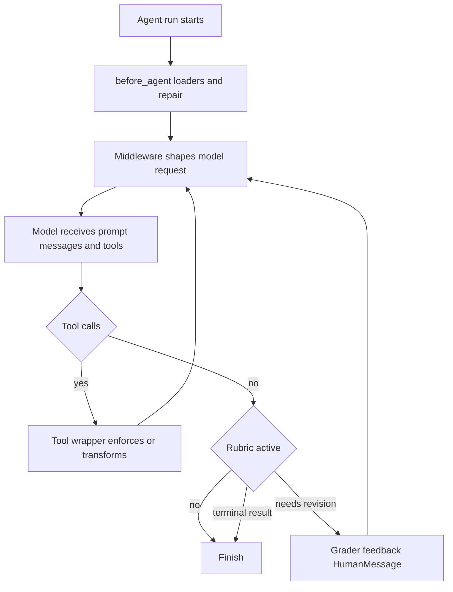

# Middleware Capability Catalog

`deepagents.middleware` is the public import surface for SDK middleware. Use middleware when a capability must influence every model request: an `AgentMiddleware` hook can alter the system prompt, tools, messages, or cross-turn state before the LLM runs. A callable supplied in `tools=` instead runs only after the model selects it. The package exports filesystem, memory, skills, synchronous and asynchronous delegation, summarization, and rubric APIs; underscore-prefixed modules are assembly helpers rather than that consumer surface.

This is a capability lookup, not a construction guide. See [Middleware stack](../architecture/middleware-stack.md), [Context management](context-management.md), [Subagents and skills](subagents-skills.md), [Filesystem tools](tools-filesystem.md), and [Permissions and HITL](permissions-hitl.md) for their respective designs.

## Capability-to-owner lookup

| Need | Owner and visible entrypoint | State and lifecycle boundary |
| --- | --- | --- |
| File operations, sandbox execution, and large-output retrieval | `FilesystemMiddleware` | Registers filesystem tools; wraps model and tool calls. |
| Automatic context compaction | `SummarizationMiddleware` / `create_summarization_middleware` | Keeps raw messages and records a private summarization event. |
| Model-invoked compaction | `SummarizationToolMiddleware` / `create_summarization_tool_middleware` | Registers `compact_conversation`; shares the summarization event. |
| Persistent project instructions | `MemoryMiddleware` | Loads sources once into private `memory_contents`; injects per request. |
| Progressive-disclosure workflows | `SkillsMiddleware` | Discovers metadata once into private skills state; advertises paths. |
| Blocking specialist delegation | `SubAgentMiddleware` | Registers `task` and strips configured private parent state. |
| Remote background delegation | `AsyncSubAgentMiddleware` | Registers start/check/update/cancel/list tools; persists `async_tasks`. |
| Definition-of-done loop | `RubricMiddleware` | Grades at natural stop and may jump back to `model`. |
| Interrupted tool-call repair | `PatchToolCallsMiddleware` | Runs in `before_agent`; rewrites malformed history. |
| Filesystem approvals | `_fs_interrupt` plus graph assembly | Converts interrupt rules to HITL `when` predicates. |
| Provider cache hints | `append_prompt_caching_middleware` | Adds supported provider middleware before memory. |
| Harness tool presentation | `_ToolExclusionMiddleware` | Filters request tools and rejects excluded dispatches. |

## Request lifecycle

The diagram shows the important ownership boundaries: `before_agent` populates or repairs state, request wrappers run before every LLM call, and tool wrappers can transform or reject dispatch. The rubric uses the natural-stop boundary rather than an ordinary tool call to form a revision loop.

Private fields need special care at a subagent boundary. `_state.private_state_field_names` resolves `PrivateStateAttr` annotations across schemas; if a schema's annotations cannot be resolved, it warns and skips it, meaning its nominal private fields are forwarded. Graph assembly computes these names from the main state and middleware schemas, then gives them to the synchronous subagent middleware.

## Filesystem, results, and permissions

`FilesystemMiddleware` exposes `ls`, `read_file`, `write_file`, `edit_file`, `delete`, `glob`, `grep`, and—only for a sandbox-capable backend—`execute`. A list-valued allowlist must include `read_file`; naming unsupported `execute` or `delete` is a no-op. Its default `StateBackend()` is ephemeral, while a backend implementing `SandboxBackendProtocol` is required for execution. The constructor also rejects backend factories and invalid execute-timeout or grep-cap values.

Large tool text is stored at `<artifacts_root>/large_tool_results/{tool_call_id}` and replaced with a line-numbered head-and-tail preview that tells the model to retrieve it with `read_file`; non-text blocks are retained. If the backend write fails, the original message remains. The shared eviction helper is also used by summarization's overflow recovery. Video reads are optional: `_video` imports PyAV lazily, interprets `read_file` offset and limit as seconds, and returns sampled timestamp-and-image blocks.

Permissions have distinct owners. Filesystem tool implementations enforce deny rules. Graph assembly turns `interrupt` rules into `HumanInTheLoopMiddleware` configuration: exact tools match their path; bulk searches interrupt when their subtree can overlap an interrupt rule, including pathless searches conservatively. A deny preceding an interrupt rule wins for exact calls. Backends that support execution reject unscoped permission setups because execute-level permission enforcement is not implemented. Tool exclusion is presentation/dispatch consistency, not authorization.

## Context, memory, and caching

`SummarizationMiddleware` persists evicted history on the configured backend before presenting a summary and retained suffix. It tracks this in private `_summarization_event` rather than rewriting the raw `messages`, so replay and a manual-compaction tool can share the log. `create_summarization_middleware` selects thresholds from the resolved model profile when possible. It also supports pre-compaction clipping of older write/edit arguments and an overflow fallback that summarizes and retries after a recognized context-window error.

Overflow recovery can shrink a sufficiently large trailing batch of `ToolMessage`s. A `read_file` result is head-sliced and points to its original path; other tool output is offloaded and stubbed. `SummarizationToolMiddleware` itself never compacts automatically: `compact_conversation` must be invoked, is gated against premature use, and shares `_summarization_event` with automatic compaction.

`MemoryMiddleware` loads configured sources in order only when `memory_contents` is absent. Missing files are skipped, other download errors fail the run, and HTML comments are stripped for prompt presentation. Its template is injected into each request by default; `system_prompt=None` suppresses injection but not loading. When enabled, its cache marker applies only to a `ChatAnthropic` request model.

`SkillsMiddleware` uses progressive disclosure: it loads skill metadata through backend APIs, injects names, descriptions, allowed tools, and `SKILL.md` paths rather than full instructions, and lets the agent use `read_file` on demand. Sources may be paths or `(path, label)` pairs; later duplicate names win. Discovery is skipped when checkpointed `skills_metadata` exists; load failures are logged and carried as explicitly untrusted prompt diagnostics when the prompt fragment is enabled.

Provider cache assembly always appends Anthropic prompt caching with unsupported models ignored, and conditionally appends Bedrock and Fireworks implementations if their optional packages are importable. In the default graph stack this comes before optional memory, so memory can establish its cache breakpoint.

## Delegation and quality gates

`SubAgentMiddleware` validates that it has at least one definition and provides the blocking `task` tool. It can compile raw `SubAgent` specifications or use a caller-owned `CompiledSubAgent`; the middleware appends task-use instructions when configured. The key safe seam is the state boundary: graph assembly supplies computed private keys, and the task tool strips them before invoking the child.

`AsyncSubAgentMiddleware` is separate remote delegation machinery for Agent Protocol servers through the LangGraph SDK. It requires nonempty, uniquely named definitions and returns task identifiers immediately; tracked task records are reduced into `async_tasks`. Its tools start, check, update, cancel, and list those tasks. A local ASGI transport without a URL requires `ainvoke`; synchronous invocation requires a reachable URL.

`RubricMiddleware` activates only when invocation state supplies `rubric`; otherwise it is a no-op. At a natural stop it invokes a separate, lazily constructed grader. Only a `needs_revision` verdict appends feedback as a `HumanMessage` and jumps to the model. The grader's verdict vocabulary is `satisfied`, `needs_revision`, and `failed`; `max_iterations_reached` and `grader_error` are middleware terminal statuses. On non-satisfied termination the main response is left intact, so callers that need to branch must inspect status, callback, or stream event.

`PatchToolCallsMiddleware` makes resumed histories structurally valid before the run. For every valid or invalid AI tool call lacking a matching `ToolMessage`, it appends an error result describing cancellation/interruption or malformed arguments, then replaces the message list.

Finally, profile exclusions are applied after custom middleware. `_ToolExclusionMiddleware` removes excluded names from the model request and rejects them at dispatch, preventing a custom request wrapper from re-advertising them while making clear that the mechanism is not a security boundary.

## Safe customization and focused tests

Use a plain tool for isolated consumer-specific work. Use middleware for per-request shaping, cross-turn state, or an SDK-wide capability. Preserve both sync and async behavior, put non-propagating data behind private state markers, and retain a recoverable path when an offload fails. Keep filesystem deny enforcement, HITL assembly, and profile exclusion separate.

Focused unit coverage lives in `tests/unit_tests/middleware/`: filesystem initialization and video behavior, memory and skills sync/async behavior, compaction and recovery, rubric iterations, subagent initialization, tool exclusion, and tool schemas. Changes to graph assembly should additionally exercise the relevant stack, permissions, profile, and delegation coverage under `tests/unit_tests/`.
