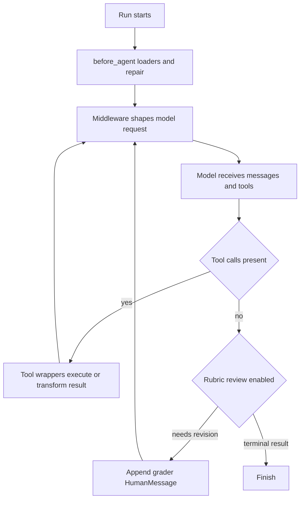

# Middleware Capability Catalog

`deepagents.middleware` is the consumer-facing import surface for the SDK's public middleware and supporting types. Use **middleware** when a capability must participate in the agent lifecycle: it can intercept every model request, alter the system prompt or advertised tools, transform messages, and retain typed state across turns. A callable supplied through `tools=` is instead dispatched only after the model chooses it; it is the better fit for isolated, consumer-specific work.

This is a capability lookup. For stack ordering see [Middleware stack](../architecture/middleware-stack.md); for the detailed contracts see [Context management](context-management.md), [Subagents and skills](subagents-skills.md), and [Filesystem tools](tools-filesystem.md).

## Capability-to-owner lookup

| Need | Owner and entrypoint | Important boundary |
| --- | --- | --- |
| Backend file access, optional shell execution, and result eviction | `FilesystemMiddleware` | Adds filesystem tools and wraps model and tool calls. |
| Automatic context compaction | `SummarizationMiddleware` / `create_summarization_middleware` | Replaces the *effective request* with a summary while retaining the raw log in state. |
| Model-requested compaction | `SummarizationToolMiddleware` / `create_summarization_tool_middleware` | Offers `compact_conversation`; it does not compact until called. |
| Persistent project instructions | `MemoryMiddleware` | Loads sources before a run and appends formatted memory at request time. |
| Progressive-disclosure workflows | `SkillsMiddleware` | Discovers skill metadata before a run, then advertises skill locations and metadata. |
| Blocking local delegation | `SubAgentMiddleware`, `SubAgent`, `CompiledSubAgent` | The `task` tool waits for a child result. |
| Background remote delegation | `AsyncSubAgentMiddleware`, `AsyncSubAgent` | Starts a LangGraph SDK remote run and returns a task id. |
| Definition-of-done review | `RubricMiddleware` | Intercepts a natural stop and can return the main loop to the model. |
| Resumed-history repair | `PatchToolCallsMiddleware` | Repairs missing tool results in `before_agent`. |
| Filesystem approval configuration | `_fs_interrupt` plus graph assembly | Converts interrupt permission rules to HITL predicates; it does not enforce denial. |
| Provider prompt caching | `append_prompt_caching_middleware` | Adds provider-specific request middleware during assembly. |
| Harness-profile tool filtering | `_ToolExclusionMiddleware` | Hides excluded tools from the model and rejects excluded tool calls. |

`PatchToolCallsMiddleware` is deliberately internal to the package export surface even though graph assembly installs it. Other underscore-prefixed modules are implementation and assembly helpers, not the normal import API.

## Request lifecycle and ownership

This is the hook-level lifecycle: loaders initialize state before the agent, `wrap_model_call`/`awrap_model_call` shape each request, and tool wrappers enforce or transform calls and results. A plain tool belongs only in the `Tools` step and cannot implement the preceding request-wide responsibilities.

Middleware state that must not cross a child boundary should use `PrivateStateAttr`. During graph construction, `private_state_field_names` finds such fields across state schemas and gives them to `SubAgentMiddleware` for stripping. A schema whose annotations cannot be resolved is warned about and skipped, which means its intended private fields can be forwarded; ensure annotation names exist at runtime.

## Filesystem, eviction, and permissions

`FilesystemMiddleware` owns `ls`, `read_file`, `write_file`, `edit_file`, `delete`, `glob`, `grep`, and `execute`. Its default backend is `StateBackend()`. An explicit `tools` allowlist must include `read_file`; names outside the list never reach the dispatchable tool node. `execute` is visible only with an execution-capable backend, and `delete` likewise remains capability-gated. Constructor validation rejects a backend factory, nonpositive execution timeout, and nonpositive `grep_max_count`; the default grep cap is 1,000 and can be overridden per call or disabled with `None`.

At request time the middleware removes unsupported capability-gated tools, appends configured filesystem or host-routing prompt material, orders media results after tool results, and replaces unsupported multimodal blocks. It can also persist an oversized latest `HumanMessage`, tag the state message, and use a preview only in the model request.

### Large-result previews

The shared eviction helper extracts and joins text blocks, retains non-text blocks in the replacement, and writes the complete text to `<artifacts_root>/large_tool_results/{sanitized_tool_call_id}`. The prefix comes from `CompositeBackend.artifacts_root` (default `/`); both `FilesystemMiddleware` and `SummarizationMiddleware` strip a trailing slash before adding their artifact directories. Other backend types use `/`.

The file-name component is deliberately distinct from the model-visible identifier. `sanitize_tool_call_id` replaces `.`, `/`, and `\\` with `_`; when the UTF-8 component would exceed 128 bytes, it uses `call-` plus the SHA-256 hex digest of the original ID. The offload notice keeps the actual tool-call identity but exposes at most its first 32 characters followed by `...`; a missing ID receives an `unknown-` UUID component for storage. These rules avoid traversal-like components, path-length failures, and an unbounded identifier in the model context.

Only a successful `write`/`awrite` produces a replacement. It points the model to `read_file` and includes a line-numbered preview: all short content, or five head and five tail lines separated by an explicit middle-omission marker. Shown lines are each capped at 1,000 characters. `ContentPreview` records omitted middle lines separately from clipped shown lines, so the explanatory note reports only loss that occurred. A `None` or error write result leaves the original `ToolMessage` intact.

Filesystem's **proactive** `wrap_tool_call`/`awrap_tool_call` eviction happens after the underlying tool returns and only when `tool_token_limit_before_evict` is enabled and the text exceeds its character approximation. It deliberately excludes `ls`, `glob`, `grep`, `read_file`, `edit_file`, `write_file`, and `delete`: searches have their own truncation/refinement behavior, reads already paginate, and mutation replies are expected to be small. The generic path therefore principally protects execution output; tool exceptions propagate rather than becoming eviction results.

### Overflow fallback is not normal eviction

`SummarizationMiddleware` invokes the same helper only as **reactive recovery**: a locally over-budget request or recognized provider `ContextOverflowError` first enters compaction, then `_call_with_budget`/`_acall_with_budget` tries to shrink the preserved suffix. It considers a suffix only when it ends in consecutive `ToolMessage` objects. The recovery call supplies a one-token clipping threshold, so any nonempty qualifying trailing batch reaches the per-message clipping decision.

A `read_file` result is special only when the matching originating tool call has a nonempty string `file_path`: its text is head-sliced to about 4,000 characters and points back to that existing file, so no additional artifact is written. Every other tail result uses the generic offload-and-preview path. Successful replacements retain their message IDs (or receive one if absent) and are returned in a `Command` update so the message reducer overwrites the originals; a failed write is omitted from that update and remains unchanged. The retry must be strictly smaller than the rejected request, and recovery allows at most one such smaller retry before raising `ContextOverflowError` with operational guidance to reduce input, tools, or output tokens.

Filesystem policy has separate owners. `FilesystemMiddleware` directly enforces matching `deny` rules in filesystem tool implementations. Graph assembly translates `interrupt` rules into `HumanInTheLoopMiddleware` configuration with path-aware `when` predicates, including conservative handling of pathless or escaping search patterns. Approval is not authorization. With an execution-capable backend, unscoped filesystem permissions are rejected because execute-level permissions are not implemented.

## Context, memory, and caching

`SummarizationMiddleware` reconstructs effective messages from its private summary event, counts prompt messages and available tools, and can truncate old large tool arguments before deciding whether to summarize. When triggered, it uploads older history—by default under `/conversation_history/{session_id}.md`—then builds a summary plus retained suffix for the request. Raw `state["messages"]` is not wholesale rewritten; the event and session id support later turns, replay, and the manual compaction tool. Inline media is separately offloaded and referenced. If history persistence fails, summarization still proceeds but warns that older material is not recoverable.

`SummarizationToolMiddleware` reuses a summarization engine and shared event state to expose `compact_conversation`. It never runs automatically and rejects early requests until reported usage reaches roughly half the automatic trigger. The `create_summarization_tool_middleware` factory resolves a model string if necessary, creates the engine using model-aware defaults, and returns the tool layer; register automatic middleware separately when automatic compaction is wanted.

`MemoryMiddleware` loads configured `AGENTS.md` sources once into private `memory_contents`. Missing files are ignored, other download errors fail loading, and HTML comments are removed for presentation. Its default prompt template injects that persistent context on each call; `system_prompt=None` suppresses injection, not loading. When configured by graph construction, its final system block gets Anthropic ephemeral cache control only for a `ChatAnthropic` request model.

`SkillsMiddleware` implements progressive disclosure through backend APIs: it lists each configured source, discovers direct-child `SKILL.md` files, parses YAML metadata, and tells the model where it may use `read_file` to obtain full instructions. Sources are processed in order and the last duplicate name wins. A checkpointed list, even an empty list, skips discovery; `None` asks for reload. Loading failures become logged, explicitly untrusted prompt diagnostics rather than instructions.

`append_prompt_caching_middleware` always appends Anthropic prompt caching with unsupported models ignored, and conditionally appends Bedrock and Fireworks equivalents when their integration packages are installed. Assembly places provider caching before optional memory so memory can set its Anthropic breakpoint.

## Delegation contracts

`SubAgentMiddleware` requires at least one named `SubAgent` or `CompiledSubAgent`, exposes one `task` tool, and inserts available-agent descriptions into its prompt when configured. Calls are synchronous from the parent's perspective: a child completes before its `ToolMessage` is returned. Structured child output is JSON-serialized; otherwise the parent receives the final nonempty AI text. Independent task calls can execute concurrently, but private state is stripped at the boundary.

The default isolated mode gives a child the delegated description. Experimental `mode="fork"` continues effective parent conversation and prompt context, excludes the previous structured response and summarization session data, forbids child-defined skills, and refuses recursive delegation. A compiled child must provide a messages-compatible state schema; it does not inherit a caller's `create_deep_agent(state_schema=...)` automatically.

`AsyncSubAgentMiddleware` is a different, remote contract: it uses LangGraph SDK clients for Agent Protocol servers, starts runs without waiting, stores tracked task records in state, and supplies task-management tools. It is appropriate for background work rather than a replacement for synchronous `task` delegation.

## Quality, repair, profiles, and assembly

`RubricMiddleware` is active only when a caller supplies a rubric. At a natural stop it sends a bounded, sanitized transcript to a separate grader agent. The grader itself can return `satisfied`, `needs_revision`, or `failed`; only `needs_revision` injects feedback as a synthetic `HumanMessage` and resumes the main loop. `max_iterations_reached` and `grader_error` are middleware-created terminal outcomes, not grader verdicts.

`PatchToolCallsMiddleware` makes persisted history structurally safe before the agent runs. For each valid or invalid AI tool call with an id lacking a matching `ToolMessage`, it inserts an error result describing either an unfinished call or malformed/truncated arguments, then replaces the message history.

Profiles may exclude tools. `_ToolExclusionMiddleware` is installed last, after custom middleware, so it strips even middleware-injected tools from the request and rejects a matching emitted call at the dispatch boundary. This preserves advertisement/execution consistency but is not a security boundary.

`create_deep_agent` builds the core stack from skills when configured, filesystem, inline subagents when configured, automatic summarization, and tool-call repair; it then adds asynchronous subagents when configured. Profile middleware, provider caching, optional memory, HITL configuration, and consumer middleware are layered afterward before final tool exclusion. Keep request-shaping middleware and ordinary tools separate, preserve sync/async parity, and test the relevant focused filesystem, summarization, middleware-stack, and subagent unit coverage when changing these contracts.
