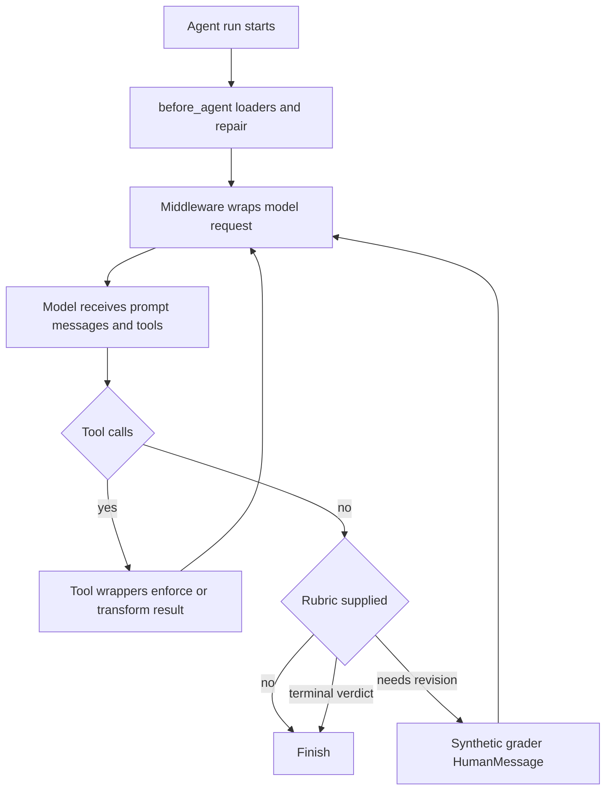

# Middleware Capability Catalog

`deepagents.middleware` is the public import surface for the SDK's built-in middleware. Choose middleware when a capability must affect *every* model request: an `AgentMiddleware` wrapper can shape the system prompt, advertised tools, messages, and typed cross-turn state before the LLM is called. A consumer callable passed in `tools=` instead runs only after the model selects it.

This page is a capability lookup, not a complete construction guide. See [Middleware stack](../architecture/middleware-stack.md) for ordering, [Context management](context-management.md) for compaction details, [Subagents and skills](subagents-skills.md) for delegation design, and [Filesystem tools](tools-filesystem.md) for tool contracts.

## Capability-to-owner lookup

| Need | Owner and entrypoint | Lifecycle / boundary |
| --- | --- | --- |
| Backend-backed file tools and large-result control | `FilesystemMiddleware` | Supplies the filesystem tools; shapes requests and intercepts tool results. |
| Automatic or model-invoked conversation compaction | `SummarizationMiddleware`; `SummarizationToolMiddleware`; `create_summarization_tool_middleware` | Creates a private summarization event and recoverable backend history. |
| Always-available project instructions | `MemoryMiddleware` | Loads `AGENTS.md` before the run, then normally injects it for each model call. |
| Discoverable, on-demand workflows | `SkillsMiddleware` | Discovers `SKILL.md` metadata before a run and advertises metadata, not full instructions, in the prompt. |
| Inline specialist delegation | `SubAgentMiddleware`, `SubAgent`, `CompiledSubAgent` | Provides blocking `task` calls to local/compiled child agents. |
| Remote background delegation | `AsyncSubAgentMiddleware`, `AsyncSubAgent` | Provides start/check/update/cancel/list tools and persists task records. |
| Validate a natural-stop response against a definition of done | `RubricMiddleware` | Calls a structured-output grader after the main loop would stop; can jump back to the model. |
| Repair interrupted message history | `PatchToolCallsMiddleware` | Runs at `before_agent` and completes dangling call/result pairs. |
| Filesystem approval conversion | `_fs_interrupt` plus graph assembly | Translates interrupt-mode rules to HITL predicates; it is separate from filesystem deny enforcement. |
| Prompt-cache optimization | `append_prompt_caching_middleware` | Adds provider middleware during graph assembly before memory. |
| Harness/profile tool consistency | `_ToolExclusionMiddleware` | Filters tools at model-call time and rejects excluded call names at dispatch. |

The package re-exports the public filesystem, context, memory, skills, delegation, and rubric classes and associated supporting types from `deepagents.middleware`. Underscore-prefixed modules are assembly helpers rather than the stable consumer import surface.

## Request and state lifecycle

This shows the principal hook boundaries: loaders and repair run before the agent, model wrappers change the request before each LLM call, and tool wrappers can transform results. `RubricMiddleware` uses the natural-stop boundary to create a controlled revision loop.

Middleware-owned state should be marked `PrivateStateAttr` when it must not cross a subagent or appear in public agent I/O. `_state.private_state_field_names` resolves those annotations at runtime; an unresolvable schema is warned about and skipped, so its nominally private fields can be forwarded. Keep synchronous and async hooks behaviorally aligned when extending a capability.

## Filesystem and permissions

`FilesystemMiddleware` owns `ls`, `read_file`, `write_file`, `edit_file`, `delete`, `glob`, `grep`, and optionally `execute`. An explicit `tools` allowlist must include `read_file`; unsupported `execute` and `delete` entries are not made usable merely by naming them. The default backend is `StateBackend()`, whereas execution requires a backend with the relevant sandbox capability. The constructor rejects a backend factory, nonpositive execution timeout, and a nonpositive configured grep cap.

At model-call time, it applies its prompt, filters unavailable tools, normalizes media ordering, scrubs unsupported multimodal blocks, and can offload an oversized latest human message. At tool-call time it offloads oversized text output to `<artifacts_root>/large_tool_results/{tool_call_id}`, replacing text with a line-numbered head-and-tail preview and retrieval instructions while retaining non-text blocks. Backend write failure retains the original message; exceptions from the tool itself deliberately propagate. Video `read_file` support is optional: `_video` lazily probes/imports PyAV and treats offset and limit as seconds, returning sampled text-and-image frame blocks.

Filesystem permissions have two distinct owners. `FilesystemMiddleware` enforces deny rules in tool implementations. During graph assembly, `_fs_interrupt` converts `interrupt` rules to `HumanInTheLoopMiddleware` configuration with path-aware `when` predicates: exact operations match their call path, while bulk operations protect overlapping subtrees and conservatively interrupt pathless searches. Execution-capable backends reject unscoped permission configurations because execute-level permissions do not exist; approval is not an authorization feature supplied by tool exclusion.

## Context, memory, and caching

`SummarizationMiddleware` counts the effective prompt—including tool schemas when its counter supports them—and may truncate old large tool arguments before compaction. When configured thresholds are crossed, it offloads older messages and generates a summary; its private event reconstructs subsequent effective requests as the summary plus retained recent messages. The session identifier persists so history appends to one `/conversation_history/{session_id}.md` file. Inline media is stored separately and referenced from that history.

If a normal request raises `ContextOverflowError`, summarization is attempted even when the ordinary trigger did not fire. The fallback clips a sufficiently large trailing `ToolMessage` batch: `read_file` is head-sliced with a pointer to its original file, while other results are offloaded and stubbed. Failed history offload does not prevent summarization, but the summary has no recovery path and a warning is emitted.

`SummarizationToolMiddleware` registers `compact_conversation`, reusing the automatic middleware's engine and event state. It is only invoked as a tool call, and its eligibility gate prevents premature compaction. The factory produces both layers with defaults derived from the resolved model profile.

`MemoryMiddleware` loads configured `AGENTS.md` sources once into private `memory_contents`; sources are ordered, missing files are skipped, other download errors fail loading, and HTML comments are stripped before presentation. By default it appends that persistent reference material to the system prompt; `system_prompt=None` suppresses only injection. With `add_cache_control=True`, the last system block receives Anthropic ephemeral cache control only when the request model is `ChatAnthropic`.

`append_prompt_caching_middleware` always adds Anthropic prompt caching with unsupported models ignored, and conditionally adds Bedrock and Fireworks equivalents if their optional integration packages are importable. Graph construction places this provider caching before optional memory so the latter can establish its second Anthropic breakpoint.

## Skills and delegation

`SkillsMiddleware` implements progressive disclosure: each source is listed through backend APIs, direct child directories' `SKILL.md` files are downloaded, parsed for YAML metadata, and shown in the system prompt with a path for later `read_file`. It supports path or `(path, label)` sources and processes them in order, so the last skill with a duplicate name wins. Discovery is stored privately and skipped when checkpointed state already contains `skills_metadata`; source failures are recorded and logged rather than silently turning into instructions.

`SubAgentMiddleware` owns the `task` tool. It validates that there is at least one subagent and creates an ephemeral child call that blocks until completion. Isolated children receive the delegated description; experimental `mode="fork"` continues effective parent conversation and prompt context but forbids child-defined skills and refuses recursive delegation. A child returns structured output as JSON when present, otherwise its final nonempty AI text. Graph assembly calculates private-state keys across schemas and supplies them to this middleware so they can be stripped across the child boundary.

`AsyncSubAgentMiddleware` is separate remote machinery for Agent Protocol servers. It requires nonempty uniquely named definitions and uses cached LangGraph SDK clients keyed by URL and headers. `start_async_task` creates a remote thread and run, immediately returns its task id, and saves an `async_tasks` record in agent state. The check, update, cancel, and list tools operate only on those tracked records. A URL-less local ASGI transport requires asynchronous parent invocation; the synchronous path requires a reachable URL.

## Rubric, repair, and profile enforcement

`RubricMiddleware` is inert without a caller-supplied `rubric`. At a natural agent stop it sends a bounded, sanitized transcript to a lazily built separate grader agent, whose `GraderResponse` is constrained to `satisfied`, `needs_revision`, or `failed` and criterion-level consistency. Only `needs_revision` appends tagged grader feedback as a synthetic `HumanMessage` and jumps back to the model. `max_iterations_reached` and `grader_error` are middleware terminal results, not grader verdicts; non-satisfied terminal outcomes preserve the main agent's last response, so callers must inspect private state, events, or the callback to branch. Grader transcript contents are explicitly treated as untrusted observation, while the rubric defines done.

`PatchToolCallsMiddleware` makes resumed history structurally safe before the agent starts. For every valid or invalid AI tool call whose id has no `ToolMessage`, it inserts a synthetic cancelled response—or a malformed-arguments response for invalid calls—and rewrites the complete message list.

Profiles may omit middleware and tools. `_ToolExclusionMiddleware` is deliberately appended after custom middleware: it removes excluded tools from the model request and rejects an excluded name at the tool-call boundary, preventing a custom request wrapper from re-advertising it. This aligns advertised and executable tools; it is not a security boundary.

## Change and test guidance

Add a plain tool for isolated, consumer-specific work; add middleware only when request shaping, stack-wide availability, or persistent state is required. Keep storage behind `BackendProtocol`, keep sensitive or non-propagating values private, and preserve recovery behavior when a backend offload fails. Keep filesystem policy enforcement distinct from profile presentation filtering and HITL assembly.

Focused coverage is in `tests/unit_tests/middleware/`: filesystem initialization and video behavior, memory and skills sync/async behavior, compaction and summarization factory behavior, rubric iteration, subagent initialization, tool exclusion, and tool schemas. Also run the relevant integration coverage under `tests/unit_tests/` for permissions, synchronous/async subagents, middleware stack construction, and profiles when changing an assembly boundary.
