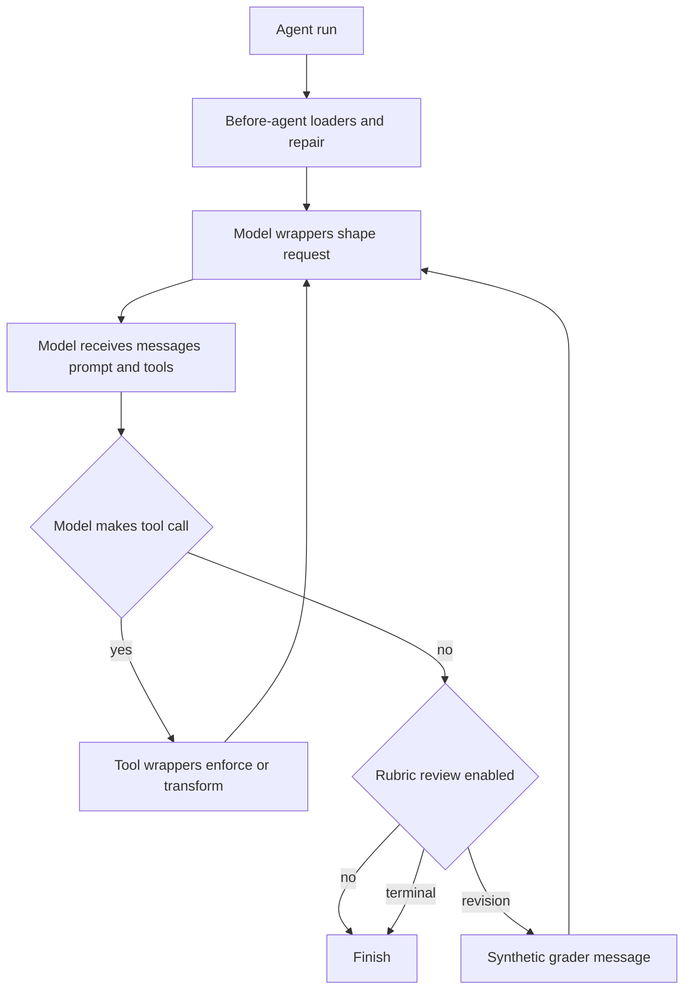

`deepagents.middleware` is the consumer import surface for SDK-provided request-time behavior. Middleware subclasses `AgentMiddleware` and can intercept each model request, modify its prompt, messages, or advertised tools, and maintain typed state across turns. In contrast, a caller's plain callable in `tools=` runs only after the model selects it. The package re-exports the public filesystem, memory, skills, subagent, async-subagent, summarization, and rubric classes and their supporting types; underscore-prefixed modules below are graph-assembly helpers, not public caller tools.

Use this catalog to find the correct seam. For detailed contracts, see [Middleware stack](../architecture/middleware-stack.md), [Context management](context-management.md), [Permissions and HITL](permissions-hitl.md), [Subagents and skills](subagents-skills.md), and [Filesystem tools](tools-filesystem.md).

## Capability map

| Responsibility | Select | State and request-time contribution |
| --- | --- | --- |
| Files, search, writes, optional shell execution | `FilesystemMiddleware` | Registers filesystem tools, filters capability-dependent tools, and controls oversized content. |
| Automatic or model-invoked compaction | `SummarizationMiddleware`, `SummarizationToolMiddleware`, `create_summarization_tool_middleware` | Keeps a private summary event and puts evicted history in backend storage. |
| Persistent project instructions | `MemoryMiddleware` | Loads `AGENTS.md` content into private state and normally appends it to every system prompt. |
| Discoverable on-demand workflows | `SkillsMiddleware` | Discovers skill metadata before a run and advertises locations in the system prompt. |
| Blocking specialist delegation | `SubAgentMiddleware` | Adds the synchronous `task` tool. |
| Remote background delegation | `AsyncSubAgentMiddleware` | Adds asynchronous task-management tools and persists task records. |
| Definition-of-done review | `RubricMiddleware` | Grades a natural stop and may add a revision message that resumes the main loop. |
| Resumption-history repair | `PatchToolCallsMiddleware` | Runs before the agent and supplies missing tool results. |
| Filesystem approval policy | `_fs_interrupt` plus graph assembly | Converts interrupt permissions into HITL predicates; it is separate from deny enforcement. |
| Provider prompt caching | `append_prompt_caching_middleware` | Appends provider-specific cache middleware during graph assembly. |
| Harness/profile tool consistency | `_ToolExclusionMiddleware` | Removes tools from requests and rejects excluded calls at dispatch. |

## Lifecycle and extension boundary

This flow shows the relevant extension seams: `before_agent` initializes or repairs state; model-call wrappers alter the outgoing request on every turn; tool-call wrappers govern execution/results. A plain tool participates only at the tool-call node. `RubricMiddleware` alone uses the natural-stop boundary to re-enter the loop.

Private middleware state must use `PrivateStateAttr` when it must not be propagated to subagents or public agent output. `private_state_field_names` resolves the annotations at runtime. If a schema cannot resolve its annotations, the helper warns and skips that schema, so those intended-private fields may be forwarded; import annotation names at runtime rather than only under `TYPE_CHECKING`.

## Filesystem, result retention, and permissions

`FilesystemMiddleware` supplies `ls`, `read_file`, `write_file`, `edit_file`, `delete`, `glob`, `grep`, and optionally `execute`. Its default is ephemeral `StateBackend()` storage. A tool allowlist must contain `read_file`; naming `execute` or `delete` does not override the backend capability check. Command execution requires a `SandboxBackendProtocol` backend, and an execution-capable backend rejects unscoped filesystem permissions because execute-level permission rules are not implemented.

Large-result retention is a middleware responsibility, not a property of a caller tool. The shared `_message_eviction` helper writes oversized text tool output to a backend location and replaces text with a line-numbered head-and-tail preview and instructions to retrieve it, retaining non-text blocks. If the write fails, the original message remains. Filesystem eviction is proactive; summarization's overflow fallback shares the preview helper but clips the preserved trailing `ToolMessage` batch. In that fallback, a `read_file` result is head-sliced and points to its original path, whereas other results are offloaded to `/large_tool_results/{tool_call_id}` and stubbed.

Video reads are an optional extension at the filesystem boundary. `_video` imports PyAV lazily, so installations without the `[video]` extra do not import it. For video, `read_file` interprets `offset` and `limit` as seconds and returns sampled frames as interleaved timestamp text and image blocks.

Permissions have deliberately separate owners. `FilesystemMiddleware` enforces deny rules in its implementations. Graph assembly turns interrupt-mode rules into a `HumanInTheLoopMiddleware` mapping through `_fs_interrupt`. Exact tools are checked against their path; bulk search tools interrupt when their search subtree overlaps a rule, and a pathless bulk call is conservatively interruptible. Thus HITL approval is an assembly-time control, not an authorization behavior of profile tool exclusion.

## Context, memory, skills, and caching

The summarization module offers `SummarizationMiddleware` for threshold-triggered compaction, `SummarizationToolMiddleware` for an on-demand `compact_conversation` tool, and `create_summarization_tool_middleware` to construct the paired layers. Automatic compaction summarizes older messages and offloads history to `/conversation_history/{session_id}.md`; the event and session id are private state. On `ContextOverflowError`, it also takes the tail-clipping fallback described above.

`MemoryMiddleware` loads configured `AGENTS.md` sources into private `memory_contents` state before an agent run, and normally injects formatted memory into the system prompt. Passing `system_prompt=None` disables injection but does not disable loading. Missing files are skipped; other download failures raise an error. With cache control enabled, it applies the Anthropic ephemeral breakpoint only when the runtime request model is `ChatAnthropic`.

`SkillsMiddleware` follows progressive disclosure: it obtains skill metadata from configured backend sources and injects a catalog and read locations, rather than full skill instructions, into the system prompt. It loads source order, so a later duplicate name wins. A state value of `skills_metadata` that is a list—including an empty list—suppresses rediscovery after checkpoint resume; `None` requests a reload. Failures are recorded and logged as diagnostics rather than being treated as instructions.

`append_prompt_caching_middleware` always appends Anthropic prompt caching and conditionally appends Bedrock and Fireworks cache middleware when their optional packages are installed. Graph construction places this before optional memory, and appends tool exclusion after custom middleware, so memory can add its cache breakpoint while custom wrappers cannot restore excluded tool advertisements.

## Delegation, review, and repair

`SubAgentMiddleware` provides the synchronous `task` tool for subagent delegation: the caller blocks until the child completes. Declarative subagents are isolated by default and receive the delegated description. Experimental `mode="fork"` instead continues parent context, forbids child-defined skills, and refuses recursive delegation. During graph assembly, discovered private-state keys are passed to subagent middleware so they can be stripped across the child boundary.

`AsyncSubAgentMiddleware` is distinct remote machinery: it launches Agent Protocol background runs through the LangGraph SDK and returns a task id immediately. It persists `async_tasks` state records, and its task-management tools operate on those tracked records. An async parent entrypoint is required for URL-less local ASGI transport; synchronous invocation requires a reachable server URL.

`RubricMiddleware` invokes a separate grader whenever the agent would otherwise finish. The grader can return `satisfied`, `needs_revision`, or `failed`; only `needs_revision` injects grader feedback as a synthetic `HumanMessage` and resumes the loop. `max_iterations_reached` and `grader_error` are middleware-generated terminal statuses, not grader verdicts. The grader receives a bounded transcript and treats it as untrusted observation; the caller-provided rubric defines done.

`PatchToolCallsMiddleware` runs in `before_agent`. For an AI tool call—valid or invalid—with no matching `ToolMessage`, it rewrites the history with a synthetic error result: cancelled/interrupted for a valid call and malformed-arguments for an invalid one. This makes resumed histories structurally complete before the model sees them.

`_ToolExclusionMiddleware` belongs late in the stack. It filters excluded names from the model request and returns an error rather than dispatching an excluded call, keeping execution aligned with what the model was told. This is profile presentation consistency, not a security boundary.

## Verification and safe changes

Use a plain caller tool for local, stateless consumer behavior. Add middleware only when behavior must shape requests, be injected across SDK consumers, intercept tool calls, or own turn-persistent state. Keep sync and async hook behavior aligned, keep backend I/O behind the backend protocol, and preserve the original message when an offload write fails.

The focused unit test module exercises stack registration: a filesystem middleware agent exposes filesystem tools, a subagent middleware agent exposes `task`, and both coexist in one stack. When changing a capability, add tests at its actual hook boundary as well: state loading/reload, model-request shaping, tool dispatch, offload failure, and graph ordering are separate behaviors.
