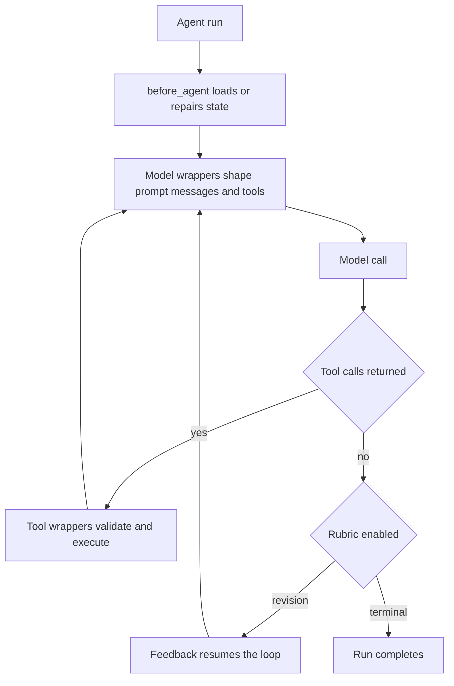

# Middleware Catalog

`deepagents.middleware` is the public import surface for the SDK layers and their supporting types. It exports filesystem, summarization, skill (including `SkillToolResolver`), subagent, async-subagent, memory, rubric, and unsupported-content APIs. Assembly helpers such as `PatchToolCallsMiddleware` are used by `create_deep_agent` but are not package exports.

## Ordinary tools versus middleware

A plain callable supplied through `create_deep_agent(..., tools=[...])` is an **ordinary tool**: it is registered in the agent's tool set and runs only after the model emits its tool call. It is appropriate for self-contained, consumer-specific work.

Middleware is different: an `AgentMiddleware` can load and retain typed state, intercept every model request with `wrap_model_call`, change messages or the system prompt, add or remove advertised tools, wrap execution, or resume a loop that would otherwise end. Use it when a feature must affect request-time context, the model-visible tool set, cross-turn state, or lifecycle control—not merely implement one callable.

```mermaid
flowchart TD
    Start["Agent run"] --> Load["before_agent loads or repairs state"]
    Load --> Request["Model wrappers shape prompt messages and tools"]
    Request --> Model["Model call"]
    Model --> Decision{"Tool calls returned"}
    Decision -->|"yes"| Execute["Tool wrappers validate and execute"]
    Execute --> Request
    Decision -->|"no"| Review{"Rubric enabled"}
    Review -->|"revision"| Feedback["Feedback resumes the loop"]
    Feedback --> Request
    Review -->|"terminal"| Finish["Run completes"]
```

This is the middleware lifecycle; an ordinary tool participates only at **Execute**.

Middleware state may declare `PrivateStateAttr`. During graph construction, private fields are collected and withheld from synchronous subagents; resolvable state annotations are therefore important to state isolation.

## Public middleware catalog

| Responsibility | Entrypoint | Request-time or state contribution |
| --- | --- | --- |
| Files and shell | `FilesystemMiddleware`, `FilesystemPermission` | Supplies filesystem tools, applies policy, filters unavailable capabilities, and manages large/binary results. |
| Automatic context compaction | `SummarizationMiddleware` | Summarizes history at a threshold, offloads evicted history, and recovers recognized overflow. |
| Manual compaction | `SummarizationToolMiddleware`, `create_summarization_tool_middleware` | Adds the ordinary `compact_conversation` tool without requiring automatic compaction. |
| Persistent instructions | `MemoryMiddleware` | Loads `AGENTS.md` into private state and normally injects it into the system prompt. |
| Skills and skill tools | `SkillsMiddleware`, `SkillMetadata`, `SkillsState`, `SkillToolResolver` | Loads a progressive-disclosure index, injects it into the prompt, and can disclose tools only after the corresponding skill is read. |
| Synchronous delegation | `SubAgentMiddleware`, `SubAgent`, `CompiledSubAgent` | Offers blocking `task` delegation. |
| Background delegation | `AsyncSubAgentMiddleware`, `AsyncSubAgent` | Starts and monitors remote Agent Protocol tasks. |
| Completion review | `RubricMiddleware` | Grades a proposed natural stop and can feed revision work back into the loop. |
| Model compatibility | `UnsupportedContentMiddleware` | Replaces unsupported multimodal human and tool blocks only in the outgoing request. |

## Filesystem, permissions, and storage

`FilesystemMiddleware` builds an allowlisted suite from `ls`, `read_file`, `write_file`, `edit_file`, `delete`, `glob`, `grep`, and `execute`. An explicit allowlist must retain `read_file`; `execute` and `delete` still depend on backend capability. Deny policy is enforced in this middleware, while `_fs_interrupt` translates `interrupt` permission rules into path-aware `HumanInTheLoopMiddleware` predicates during assembly. Approval is not an authorization grant.

`CompositeBackend.artifacts_root` defaults to `/`. Filesystem and summarization storage derive `large_tool_results` and `conversation_history` prefixes from that normalized root. The shared eviction helper writes complete text under a sanitized, bounded tool-call ID and replaces it with a line-numbered head-and-tail preview, preserving non-text blocks; write failure preserves the original message. Filesystem evicts oversized results after calls but excludes its own listed filesystem tools. Summarization uses tail clipping only for input-budget or provider-overflow recovery; one smaller retry is allowed before `ContextOverflowError` is raised.

With `offload_binary_content=True`, valid base64 `read_file` blocks are content-addressed at `{artifacts_root}/blobs/<sha256>` and become `deepagents_blob` references. On model wrapping, eligible user media after the most recent AI response may likewise be replaced in state; references are rehydrated for the outgoing model request. Upload failure leaves inline data intact; unavailable, malformed, or digest-invalid blobs become a text notice. The private untracked `_blob_payloads` cache is not checkpointed, and offload disables with a warning when the blobs route resolves to `StateBackend`.

The optional `_video` boundary lazily imports PyAV, keeping installations without `[video]` lightweight. Its video `read_file` interpretation treats `offset` and `limit` as seconds and returns sampled frames interleaved with text.

## Context, instructions, delegation, and review

`MemoryMiddleware` loads configured `AGENTS.md` sources into private `memory_contents`; `system_prompt=None` prevents injection but not loading. `SkillsMiddleware` uses backend APIs only, loads sources in order with later same-name skills winning, and caches metadata in `skills_metadata` per thread. Set that field to `None` to request reload. It exposes the index and `read_file` workflow in the system prompt unless its `system_prompt` is `None`.

### Skill-tool disclosure is middleware behavior

Skill tools are **not ordinary agent tools registered up front**. A skill declares space-separated `metadata.include_tools` names in its `SKILL.md`; `SkillsMiddleware(..., tools=[...])` keeps those tools off its public `tools` attribute so the agent tool node cannot invoke them before disclosure. A resolver may map an include name to runtime-dependent tools, including a family of tools.

A successful `read_file` of a loaded skill's `SKILL.md` anchors its listed tools in visible history. On each later model request, the middleware resolves unclaimed names, discloses the resulting schemas only while that read remains in context, and records the gated names in private `_skill_tools_disclosed` state. A call before the read—or in the same turn as the read—remains an invalid-tool error. At tool time it resolves again and attaches only the tool disclosed to the latest model call; if the resolver no longer returns it, the call fails rather than running a stale definition. Compaction that removes the anchoring read withdraws disclosure.

For models without mid-conversation tool additions, disclosed tools are appended to the outgoing `tools` binding. Supported Anthropic and OpenAI Responses models receive provider-native inline disclosure blocks at a stable point after the reading tool-result batch, preserving a cacheable prefix. A normally registered tool named by a skill is unchanged; a registered tool marked `extras={"defer_loading": True}` is disclosed after the read but is not gated as a skill-owned tool. Resolver results must be stable within a thread and cheap or cached because resolution happens on each relevant model and tool call.

`SubAgentMiddleware` exposes blocking `task` work. `AsyncSubAgentMiddleware` launches remote LangGraph SDK work and returns a task ID immediately for monitoring. `RubricMiddleware` calls a separate grader at a natural stop; `needs_revision` supplies a `HumanMessage` and resumes until a terminal result or `max_iterations`. `PatchToolCallsMiddleware` repairs histories by adding error results for unmatched valid or malformed AI tool calls.

## Assembly order and extension points

`create_deep_agent` constructs a core stack of filesystem, optional synchronous subagents, summarization, tool-call repair, and optional async subagents. New caller middleware is inserted after that core (or replaces a same-name middleware in place). The tail is harness-profile middleware, optional skills, provider prompt caching, optional memory, HITL, and `UnsupportedContentMiddleware`; `_ToolExclusionMiddleware` is appended last when a profile excludes tools.

Skills intentionally sit after user/profile fallback or routing middleware and after summarization, but before caching: skill disclosure therefore observes both the compacted conversation and the model actually called. A caller middleware inserted in the normal slot cannot see freshly loaded skills state in `before_agent` or edit the skill prompt section in its wrapper; replacing `SkillsMiddleware` by name is the extension point. `UnsupportedContentMiddleware` must be last when used directly, and tool exclusion filters both advertised tools and tool calls so an excluded name cannot be executed after being hidden. Required filesystem and synchronous-subagent scaffolding cannot be removed by a harness profile.

Prompt-caching assembly always adds Anthropic caching and adds Bedrock or Fireworks caching when their integration packages are installed. Keep synchronous and asynchronous hooks aligned in custom middleware, and test ordering changes against the focused skills-tool, filesystem/blob, summarization, memory, subagent, rubric, and tool-exclusion tests: wrapper ordering changes the final model request and can change which tools are callable.
