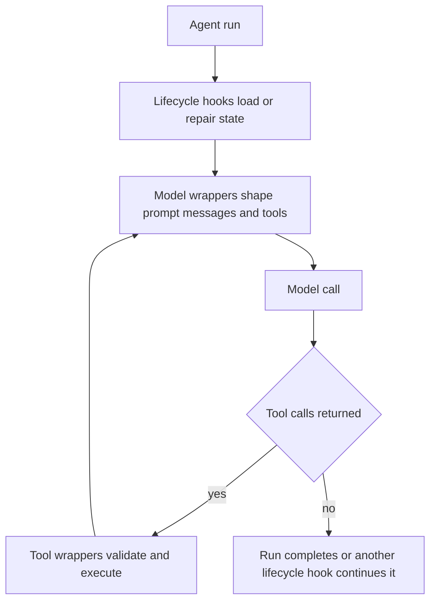
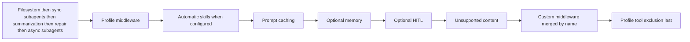

# Middleware Catalog

`deepagents.middleware` is the public import surface for Deep Agents middleware and supporting types. It includes filesystem, summarization, skills (including `SkillToolResolver`), synchronous and asynchronous subagents, memory, rubric, and unsupported-content APIs. The graph builder also uses internal assembly helpers such as `PatchToolCallsMiddleware`.

## Middleware is request-time control, not just a tool

A callable supplied through `create_deep_agent(..., tools=[...])` is an ordinary tool: the model can select it, and it runs after that selection. An `AgentMiddleware` instead participates in the agent lifecycle. Its model and tool wrappers can shape each outgoing request, add system-prompt context, alter the tools advertised to the model, validate execution, and read or update state across turns. Use middleware when behavior depends on the current request, conversation, selected model, or durable agent state; use an ordinary tool for a self-contained callable.

```mermaid
flowchart TD
    Run["Agent run"] --> Setup["Lifecycle hooks load or repair state"]
    Setup --> Request["Model wrappers shape prompt messages and tools"]
    Request --> Model["Model call"]
    Model --> Choice{"Tool calls returned"}
    Choice -->|"yes"| Tool["Tool wrappers validate and execute"]
    Tool --> Request
    Choice -->|"no"| Done["Run completes or another lifecycle hook continues it"]
```

This shows the request-time boundary: an ordinary tool participates only at tool execution, whereas middleware can act before every model call and around tools.

## Public catalog

| Responsibility | Primary entrypoint | Observable effect |
| --- | --- | --- |
| Files and shell | `FilesystemMiddleware`, `FilesystemPermission` | Provides file and execution tools, filters capabilities that a backend cannot support, applies filesystem policy, and manages oversized or binary results. |
| Context management | `SummarizationMiddleware`; `SummarizationToolMiddleware` | Automatically compacts history or offers the `compact_conversation` tool for caller-directed compaction. |
| Persistent instructions | `MemoryMiddleware` | Loads configured `AGENTS.md` material and, by default, appends it to the system prompt. |
| Skills and conditional skill tools | `SkillsMiddleware`, `SkillMetadata`, `SkillsState`, `SkillToolResolver` | Lists skill metadata in the prompt, loads it from backend sources, and conditionally exposes tools after the relevant instructions are read. |
| Synchronous delegation | `SubAgentMiddleware`, `SubAgent`, `CompiledSubAgent` | Provides a blocking `task` tool that delegates to declarative or precompiled workers. |
| Background delegation | `AsyncSubAgentMiddleware`, `AsyncSubAgent` | Provides tools for remote Agent Protocol work that can be launched and monitored without blocking. |
| Completion review | `RubricMiddleware` | Evaluates a proposed natural stop and can return feedback that continues the agent loop. |
| Provider compatibility | `UnsupportedContentMiddleware` | Replaces unsupported multimodal human and tool blocks in the outgoing request only. |

`FilesystemMiddleware` is also where filesystem permission rules are enforced. Approval configured from an `interrupt` rule pauses a tool call; it does not turn an otherwise disallowed operation into authorization. With `offload_binary_content=True`, valid base64 `read_file` payloads are content-addressed under `{artifacts_root}/blobs/<sha256>` and stored blocks become `deepagents_blob` references; the request wrapper rehydrates verified payloads. A failed upload remains inline, while missing, malformed, tampered, or unavailable blobs become a text notice rather than silently fabricated media.

## Skills: backend-loaded instructions and gated tools

`SkillsMiddleware` implements progressive disclosure. It discovers `SKILL.md` metadata through backend APIs rather than direct filesystem access; sources load in order and a later skill with the same name wins. Metadata is cached in `skills_metadata` for a thread—an empty list is a completed empty load, while setting it to `None` requests a reload. The normal prompt fragment tells the model which skills exist and to read the selected `SKILL.md`; setting `system_prompt=None` keeps loading state but suppresses that prompt addition.

A skill may declare space-separated `metadata.include_tools`. Those skill-owned tools are deliberately **not** registered in the ordinary agent tool set. After a successful `read_file` result for a loaded skill's `SKILL.md` remains in history, the middleware resolves the named tools and presents their schemas. If the anchor is compacted away, disclosure ends. A model cannot validly call a gated tool before the read or in the same model turn that requested the read.

The resolver may be a tool list or a `SkillToolResolver`, allowing an include name to represent runtime-specific tools or several tools. It is invoked for relevant model calls and again at execution, so it must be cheap or appropriately cached and return stable results within a thread. The middleware records precisely the tool names disclosed for the latest model request in private `_skill_tools_disclosed` state; tool execution re-resolves only the recorded include name. Thus a tool not disclosed to that request—or no longer returned by the resolver—falls through as invalid instead of executing a stale or hidden capability.

For models without inline tool additions, disclosure augments outgoing tool bindings. Supported Anthropic and OpenAI Responses models instead receive provider-native inline blocks after the reading tool-result batch. A normally registered agent tool named in `include_tools` remains normally callable; a registered deferred tool is disclosed after a read but is not skill-gated.

## Subagents and skill sourcing

`SubAgentMiddleware` builds the main agent's `task` interface from named subagent specifications. Declarative subagents receive an independently assembled default stack; compiled subagents supply their own runnable and schema. A declarative worker normally has isolated delegated-task context. The experimental `mode="fork"` continues the parent's effective conversation and inherited prompt-producing behavior, but rejects a separate `skills` field to avoid a divergent skill set. Private middleware state, including skill metadata and latest disclosure records, is excluded from ordinary parent/subagent state exchange.

Skill sources are deliberately scoped rather than copied indiscriminately:

- `create_deep_agent(skills=[...])` supplies the automatically assembled main stack and default general-purpose subagent. A declarative subagent uses its own `skills` sources instead of the parent's; a fork inherits the top-level sources.
- A custom `SkillsMiddleware` in `middleware=` is a valid source of skills even when `skills=None`. If it has the standard name `SkillsMiddleware` and an automatic skills entry exists, it replaces that entry in the skills slot. For a declarative subagent, its own standard-named `SkillsMiddleware` also supplies the sources used to build that slot; when several are supplied, normal same-name replacement leaves the last one.
- A differently named skills subclass is ordinary custom middleware, not the reserved skills slot. It is therefore placed according to normal custom middleware ordering. In particular, a fork does not infer top-level `skills` from a parent custom middleware; give the fork its own standard-named middleware when it needs different sources or resolver behavior.

This split prevents a worker from accidentally receiving the parent's skill registry or resolver. The default general-purpose worker does receive the explicit top-level skill configuration, while an explicitly declared isolated worker must opt in with `skills` or its own middleware.

## Assembly, replacement, and the final filter

`create_deep_agent` starts the main stack with filesystem middleware, synchronous subagents when present, summarization, tool-call repair, and asynchronous subagents when configured. It then adds harness-profile middleware, automatic skills, prompt caching, optional memory, optional HITL, and unsupported-content adaptation. Profile exclusions are applied around custom merging, and a profile's `_ToolExclusionMiddleware` is appended **last**.

```mermaid
flowchart LR
    Core["Filesystem then sync subagents then summarization then repair then async subagents"] --> Profile["Profile middleware"]
    Profile --> Skills["Automatic skills when configured"]
    Skills --> Cache["Prompt caching"]
    Cache --> Memory["Optional memory"]
    Memory --> Hitl["Optional HITL"]
    Hitl --> Content["Unsupported content"]
    Content --> Custom["Custom middleware merged by name"]
    Custom --> Filter["Profile tool exclusion last"]
```

This diagram shows the assembled main-stack landmarks. Custom middleware that matches an existing middleware `.name` replaces it in place; a new name is inserted after the core stack, ahead of the profile and caching tail. Consequently, a standard-named custom `SkillsMiddleware` can replace the generated skills layer without changing its placement, while a novel middleware runs outside the tail. The general-purpose subagent inherits only main-agent middleware that overrides one of its default slots; separately declared subagents use their own stacks.

Skill middleware is positioned after core compaction and user or profile routing/fallback middleware but before prompt caching. It therefore sees the compacted messages and the model that will actually receive the request. Replacing the skills layer by name—not adding a second wrapper—is the reliable extension point for changing its sources, prompt template, or resolver.

Finally, the profile-controlled tool exclusion filter runs after custom middleware in both main and assembled subagent stacks. It removes excluded names at request time after other middleware has added or modified tools, so a custom wrapper cannot restore a profile-excluded tool merely by advertising it earlier. This is a visibility and execution guard, distinct from filesystem permissions and HITL approval.

## Focused regression coverage

The graph tests cover name-based replacement versus novel insertion, skills placement after fallback/routing middleware and before caching, custom skills sourcing in main, declarative, and forked stacks, and the invariant that profile tool exclusion is final. Skill-tool tests cover the read anchor, same-turn rejection, compaction withdrawal, resolver re-resolution, and provider-specific disclosure. When changing assembly order, exercise those focused tests because a wrapper's position changes the final prompt, model selection, and callable tool set.
