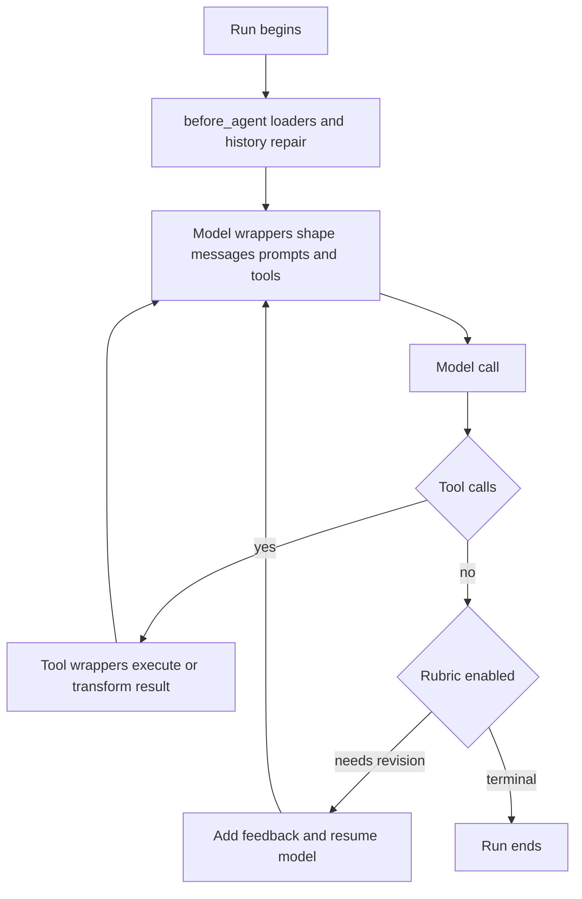

# Middleware Catalog and Composition Rules

`deepagents.middleware` is the consumer-facing import surface for the SDK middleware and supporting types. Middleware subclasses `AgentMiddleware`: unlike a callable passed in `tools=`, it can initialize and update typed state, transform every model request, wrap tool execution, and continue an otherwise complete loop. Use a plain tool for self-contained, consumer-specific work; use middleware when behavior must change messages, prompts, the advertised tools, state, or control flow.

For the broader stack architecture, see [Middleware stack](../architecture/middleware-stack.md). See [Backends](backends.md), [Context management](context-management.md), [Filesystem tools](tools-filesystem.md), and [Build a Deep Agent](../workflows/build-a-deep-agent.md) for adjacent contracts.

## Lifecycle and ownership boundaries

```mermaid
flowchart TD
    Begin["Run begins"] --> Before["before_agent loaders and history repair"]
    Before --> Request["Model wrappers shape messages prompts and tools"]
    Request --> Model["Model call"]
    Model --> Calls{"Tool calls"}
    Calls -->|"yes"| Tool["Tool wrappers execute or transform result"]
    Tool --> Request
    Calls -->|"no"| Review{"Rubric enabled"}
    Review -->|"needs revision"| Feedback["Add feedback and resume model"]
    Feedback --> Request
    Review -->|"terminal"| Done["Run ends"]
```

The agent lifecycle: middleware can load or repair state before the run, shape each request, wrap a selected tool, and resume a natural stop for review. A `tools=` callable participates only at tool execution.

Middleware state schemas may mark fields with `PrivateStateAttr`. Graph assembly resolves those fields and configures synchronous subagent middleware to withhold them. If annotation resolution fails, the schema is skipped with a warning, so its supposedly private fields can cross the subagent boundary; runtime-resolvable annotations are therefore required for this isolation.

## Public catalog

| Capability | Entrypoint | Material behavior |
| --- | --- | --- |
| Filesystem and optional shell access | `FilesystemMiddleware`, `FilesystemPermission` | Supplies the filesystem suite, enforces deny rules, filters request tools by capability, and manages oversized or binary content. |
| Automatic compaction | `SummarizationMiddleware` | Compacts history at its threshold and recovers from recognized context overflow. |
| On-demand compaction | `SummarizationToolMiddleware`, `create_summarization_tool_middleware` | Provides the `compact_conversation` tool without automatic compaction. |
| Persistent instructions | `MemoryMiddleware` | Loads `AGENTS.md` sources into private state and injects context into model requests. |
| Progressive-disclosure skills | `SkillsMiddleware`, `SkillMetadata`, `SkillsState` | Lists loaded skills in the prompt and directs the model to read full instructions only when needed. |
| Blocking delegation | `SubAgentMiddleware`, `SubAgent`, `CompiledSubAgent` | Exposes synchronous `task` delegation. |
| Background delegation | `AsyncSubAgentMiddleware`, `AsyncSubAgent` | Starts and manages remote Agent Protocol tasks. |
| Definition-of-done review | `RubricMiddleware` and rubric result types | Grades a natural stop and can return the loop for revision. |
| Compatibility filtering | `UnsupportedContentMiddleware` | Replaces model-incompatible multimodal input blocks only in the request. |

`PatchToolCallsMiddleware` is built into graph construction but is intentionally not in `deepagents.middleware.__all__`; underscore-prefixed modules are assembly or implementation helpers rather than the ordinary import API.

## Filesystem middleware: tools, policy, and content storage

`FilesystemMiddleware` allowlists `ls`, `read_file`, `write_file`, `edit_file`, `delete`, `glob`, `grep`, and `execute`. A custom list must include `read_file`; names left out are not exposed. `execute` and `delete` remain conditional on backend capabilities. The default is `StateBackend()`, and invalid backend factories, nonpositive execution timeouts, and invalid `grep_max_count` values fail at construction.

Permission enforcement is separate from human approval. The middleware applies matching `deny` rules and redacts denied bulk results. `_fs_interrupt` turns `interrupt` rules into path-aware `HumanInTheLoopMiddleware` predicates during graph assembly; approval is not an authorization grant. Rules are evaluated in declaration order for ordinary path operations. With an execution-capable backend, unscoped filesystem permissions are rejected because tool-level `execute` permissions are not implemented.

### Text-result eviction

`CompositeBackend.artifacts_root` defaults to `/`; filesystem and summarization derive `large_tool_results` and `conversation_history` below that root after trimming its trailing slash. The shared text offload helper writes complete text using a sanitized, bounded tool-call ID, then substitutes a line-numbered head-and-tail preview while retaining non-text content blocks. A failed write leaves the original message unchanged. Dots and path separators become underscores, over-128-byte IDs become a SHA-256-derived component, and notices abbreviate IDs longer than 32 characters.

Filesystem eviction occurs after a tool returns and excludes the filesystem tool names themselves (`ls`, `glob`, `grep`, `read_file`, `edit_file`, `write_file`, and `delete`). Summarization instead tail-clips only for input-budget or provider-overflow recovery. In that fallback, a `read_file` result with an original `file_path` is head-sliced and points to the already-stored file; another tool result is offloaded. Only one strictly smaller retry is permitted before `ContextOverflowError` directs the caller to reduce request size.

### Optional content-addressed binary offload

Set `offload_binary_content=True` on `FilesystemMiddleware` when binary `read_file` blocks should not be retained as base64 in message history or checkpoints. The middleware uploads each distinct valid base64 payload to `{artifacts_root}/blobs/<sha256>` and replaces its block with a `deepagents_blob` digest reference. This applies only to `read_file` results, including every message carried by a `Command` result; other tool results remain inline.

On the next model wrapper pass, the middleware also offloads eligible `HumanMessage` media added after the latest AI response, records replacements in state, and rehydrates all blob references for the outbound model request. The `_blob_payloads` digest-to-base64 cache is private and untracked, so it is never checkpointed. Blob bytes are verified against their reference digest before use. Missing, malformed, tampered, or download-failed blobs become a text notice asking the agent to re-read the file rather than injecting untrusted bytes. Upload failures are best-effort: their original payload stays inline.

This feature is useful when `blobs/` routes to durable or sandbox-backed storage. It disables itself with a warning if that path resolves to `StateBackend`, because such bytes would still be checkpointed. It does not make binary content available to an incompatible model: `UnsupportedContentMiddleware`, which runs later in the assembled stack, can replace rehydrated unsupported blocks in the request while retaining the original thread state.

The optional video reader follows the same filesystem boundary. `_video` lazily imports PyAV so installations without the `[video]` extra remain lightweight; for video reads, `offset` and `limit` are seconds and output interleaves timestamp text and sampled image frames.

## Context, instructions, delegation, and review

`SummarizationMiddleware` automatically compacts history and offloads evicted history to the backend. `SummarizationToolMiddleware` supplies the on-demand `compact_conversation` alternative, and `create_summarization_tool_middleware` creates that manual layer. `MemoryMiddleware` loads configured `AGENTS.md` sources into private `memory_contents` and injects persistent context by default; `system_prompt=None` suppresses injection but not loading. `SkillsMiddleware` implements progressive disclosure through backend APIs: later sources override earlier skill names, and the prompt directs the model to fetch full instructions with `read_file`.

`SubAgentMiddleware` exposes blocking synchronous `task` work. `AsyncSubAgentMiddleware` is a separate remote Agent Protocol contract: it launches a LangGraph SDK run, records work in `async_tasks`, and returns a task ID for later monitoring rather than blocking. `RubricMiddleware` invokes a separate grader when the agent would otherwise finish; a `needs_revision` verdict adds a `HumanMessage` and resumes the model until the outcome is terminal or the iteration cap is reached. `PatchToolCallsMiddleware` repairs resumed histories by appending error results for AI tool calls that lack matching tool results.

Provider prompt caching is assembled before optional memory: the helper always adds Anthropic caching and adds Bedrock or Fireworks caching when their packages are installed. `UnsupportedContentMiddleware` reads the active request model profile and replaces unsupported human and tool multimodal blocks only for that request; direct users must put it last so it sees the final model selection.

## Construction order and safe extension

`create_deep_agent` starts with configured skills, filesystem middleware, synchronous subagents when present, automatic summarization, and tool-call repair, then optional asynchronous subagents. New caller middleware is inserted after this core segment (or replaces an entry with the same middleware name in place). The tail is profile middleware, provider caching, optional memory, optional HITL, and `UnsupportedContentMiddleware`. Profile exclusions are applied around custom insertion; protected filesystem and synchronous-subagent scaffolding cannot be excluded. Finally, `_ToolExclusionMiddleware` is appended when configured, so it removes excluded names after all tool-injecting request wrappers and rejects calls to those names at the tool boundary. It maintains advertised-versus-executable consistency; it is not a security boundary.

Keep sync and async hook behavior aligned when extending middleware. Test ordering changes against the focused filesystem, blob-offload, summarization, skills, memory, subagent, rubric, and tool-exclusion tests: changing wrapper order can alter the final model request even if every individual middleware remains correct.
