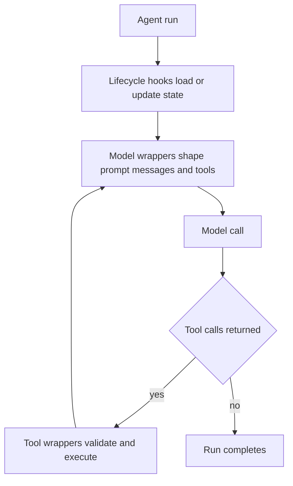
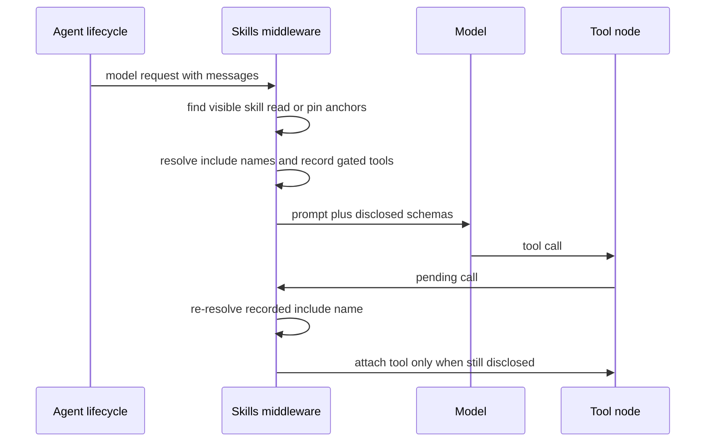
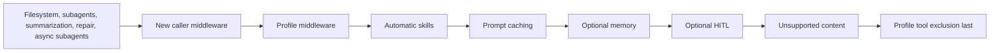

# Middleware Catalog

`deepagents.middleware` is the public import surface for filesystem, summarization, skills, synchronous and asynchronous subagents, memory, rubric, and unsupported-content middleware, plus their key types. `create_deep_agent()` assembles those layers around LangChain's agent lifecycle; it also uses internal layers such as `PatchToolCallsMiddleware`, prompt caching, and the final tool-exclusion filter.

## Why middleware rather than an ordinary tool?

A callable passed as `tools=[...]` is selected and invoked *after* the model requests it. An `AgentMiddleware` participates before and around the model and tool boundaries. In particular, `wrap_model_call()` can change every outbound request's system message, messages, selected tools, or behavior based on state and the resolved model; tool wrappers can validate or replace a pending tool call. Use middleware for request-sensitive behavior, cross-turn state, or policy. Use an ordinary tool for a self-contained capability.

```mermaid
flowchart TD
    Run["Agent run"] --> Setup["Lifecycle hooks load or update state"]
    Setup --> Request["Model wrappers shape prompt messages and tools"]
    Request --> Model["Model call"]
    Model --> Choice{"Tool calls returned"}
    Choice -->|"yes"| Tool["Tool wrappers validate and execute"]
    Tool --> Request
    Choice -->|"no"| Finish["Run completes"]
```

This lifecycle shows why middleware has control before every model request while an ordinary tool runs only after the model selects it.

## Public catalog

| Responsibility | Primary entrypoint | State and request or tool effect |
| --- | --- | --- |
| Files, shell, and file policy | `FilesystemMiddleware`, `FilesystemPermission` | Supplies file and execution tools, adapts capabilities to the backend, enforces filesystem rules, and manages large or binary read results. |
| Context management | `SummarizationMiddleware`, `SummarizationToolMiddleware` | Compacts history automatically or through `compact_conversation`. |
| Persistent instructions | `MemoryMiddleware` | Loads configured `AGENTS.md` sources into state and normally appends their content to the system prompt. |
| Skills and conditional tools | `SkillsMiddleware`, `SkillMetadata`, `SkillsState`, `SkillToolResolver` | Loads a skill index, adds progressive-disclosure instructions, and exposes skill tools only when their instruction anchor is present. |
| Synchronous delegation | `SubAgentMiddleware`, `SubAgent`, `CompiledSubAgent` | Provides the blocking `task` tool for declarative or precompiled workers. |
| Background delegation | `AsyncSubAgentMiddleware`, `AsyncSubAgent` | Provides Agent Protocol task launch and management without blocking the parent. |
| Completion review | `RubricMiddleware` | Grades a proposed completion and can append revision feedback and return control to the model. |
| Provider compatibility | `UnsupportedContentMiddleware` | Replaces model-unsupported human and tool content blocks in the outbound request only. |

### Filesystem, memory, and compatibility seams

Filesystem permissions are evaluated in declaration order and the first matching rule wins; unmatched operations are allowed. `deny` returns a permission error, whereas `interrupt` contributes an approval rule to `HumanInTheLoopMiddleware` (with caller-supplied `interrupt_on` taking precedence for a tool). These rules apply to built-in filesystem tools, not direct backend use. Subagents inherit parent permissions unless their specification supplies a replacement list.

With `offload_binary_content=True`, `FilesystemMiddleware` content-addresses valid base64 `read_file` payloads under `{artifacts_root}/blobs/<sha256>`, stores `deepagents_blob` references, and rehydrates verified payloads for a model request. A failed upload remains inline; missing, malformed, tampered, or unavailable blobs become a text notice.

`MemoryMiddleware` loads sources once when `memory_contents` is absent, strips HTML comments before prompt injection, and permits `system_prompt=None` when callers want state without injected instructions. In the assembled graph it requests an Anthropic-only cache-control breakpoint after the generic caching middleware. `UnsupportedContentMiddleware` must be late: it evaluates the *actual request model* and replaces unsupported multimodal blocks only in a copied request, preserving the original thread for a later capable model.

## Skills: progressive disclosure and a per-request gate

`SkillsMiddleware` enumerates `SKILL.md` files through backend APIs. It loads sources in order, with the last duplicate name winning, and caches the result in per-thread `skills_metadata`: a list, including `[]`, suppresses another load; missing or `None` reloads. Load diagnostics are recorded privately in `skills_load_errors` and logged. The default prompt lists metadata and asks the model to `read_file` the selected skill; `system_prompt=None` suppresses only that prompt addition.

`pinned_skills` is an explicit alternative to waiting for a read. Before the next model call, each known, readable named skill is appended as a `HumanMessage` containing its `SKILL.md` body without frontmatter, then the pending names are cleared. Parallel writes accumulate; unknown or unreadable names are skipped. Pinning is therefore both an instruction-delivery mechanism and a valid anchor for its tools.

A skill may declare space-separated `metadata.include_tools`. Tools owned by the skills middleware are intentionally omitted from ordinary agent registration. A successful `read_file` result for the loaded skill's `SKILL.md`—or a pinned skill message—anchors disclosure only while it remains in the request messages. A call cannot use a gated tool before that anchor, including in the same model turn that requested the read; compaction that removes the anchor withdraws it.

```mermaid
sequenceDiagram
    participant Agent as Agent lifecycle
    participant Skills as Skills middleware
    participant Model as Model
    participant Tools as Tool node
    Agent->>Skills: model request with messages
    Skills->>Skills: find visible skill read or pin anchors
    Skills->>Skills: resolve include names and record gated tools
    Skills->>Model: prompt plus disclosed schemas
    Model->>Tools: tool call
    Tools->>Skills: pending call
    Skills->>Skills: re-resolve recorded include name
    Skills->>Tools: attach tool only when still disclosed
```

This sequence shows that visibility is determined for one request and execution is checked again at the tool boundary.

A `SkillToolResolver` may map one include name to several runtime-specific tools. The middleware records only gated tools from the latest model call in private `_skill_tools_disclosed`, mapping tool name to include name, and re-resolves that include name at execution. An undisclosed call, a malformed old record, or a tool the resolver no longer returns remains an invalid tool instead of executing a hidden or stale capability. Resolver output should consequently be stable for a request and inexpensive or cached.

Existing request tools named by an include are already callable. If such a tool is marked `extras={"defer_loading": True}`, reading or pinning the skill reveals its schema but does not gate execution. For ordinary models, disclosure augments request tool bindings. Specific Anthropic models and exact `ChatOpenAI` Responses models support provider-native, mid-conversation additions after the tool-result batch; schemas rejected by Anthropic are withheld so the recorded gate remains consistent with what the model saw.

## Subagents, state boundaries, and skill sources

A declarative `SubAgent` receives an independently assembled middleware stack; a `CompiledSubAgent` supplies its own runnable. Isolated workers receive only the delegated task by default. Experimental `mode="fork"` instead continues the parent's effective, compacted conversation, rebuilds inherited prompt-producing behavior, and prevents recursive delegation. A fork cannot declare its own `skills`: it inherits the top-level sources so its skill registry does not diverge.

Ordinary parent/subagent exchange excludes `skills_metadata`, `pinned_skills`, and the last skill-tool disclosure, as well as fields marked `PrivateStateAttr`; this prevents a worker's skill loading and per-call authorization record from leaking across agents. A custom state schema whose annotations cannot be resolved at runtime is a risk boundary: its private fields cannot be discovered and are forwarded with a warning.

Skill configuration is scoped deliberately:

- `create_deep_agent(skills=[...])` populates the automatic main and default general-purpose stacks. A declared isolated worker must use its own `skills` or its own standard-named `SkillsMiddleware`; a fork inherits the top-level sources.
- A custom `SkillsMiddleware` named `SkillsMiddleware` takes the reserved skills slot. When `skills=None`, its sources also supply the automatic stack and general-purpose worker; replacements with the same name keep the slot, and the last replacement wins.
- A differently named `SkillsMiddleware` subclass is ordinary custom middleware. It does not create or replace the automatic skills slot.
- The default general-purpose worker mirrors only caller middleware that replaces one of its own default slots. New caller middleware stays main-agent-only.

## Assembly order and safety-critical replacement

The main stack starts with `FilesystemMiddleware`, synchronous subagents when available, summarization, `PatchToolCallsMiddleware`, and asynchronous subagents when configured. New caller middleware is inserted immediately after that core. Profile middleware, automatic skills, prompt caching, optional memory, optional HITL, and unsupported-content adaptation form the tail; profile tool exclusion is appended last.

```mermaid
flowchart LR
    Core["Filesystem, subagents, summarization, repair, async subagents"] --> Custom["New caller middleware"]
    Custom --> Profile["Profile middleware"]
    Profile --> Skills["Automatic skills"]
    Skills --> Cache["Prompt caching"]
    Cache --> Memory["Optional memory"]
    Memory --> Hitl["Optional HITL"]
    Hitl --> Content["Unsupported content"]
    Content --> Filter["Profile tool exclusion last"]
```

This is the normal main-stack assembly; absent optional entries are simply skipped.

Name controls replacement. A custom middleware whose `.name` remains present replaces the corresponding layer in place; otherwise it is inserted after the last core layer and before the tail. Thus replacing `SkillsMiddleware` by name preserves its placement, while adding a second, novel skills layer changes wrapper interactions. Profile `excluded_middleware` is applied during assembly; it rejects an unmatched, ambiguous, private-name, or protected-scaffolding exclusion rather than silently creating a degraded agent. `FilesystemMiddleware` and `SubAgentMiddleware` are protected scaffolding.

Skills belongs after compaction and routing or fallback middleware, but before caching, so it sees compacted messages and the actual model. The final `_ToolExclusionMiddleware` removes excluded tool names from the request **and** rejects matching tool calls at execution. It prevents later custom wrappers from restoring profile-excluded tools, but is explicitly a visibility and consistency guard rather than a security boundary; filesystem permissions are the authorization mechanism.

## Focused regression coverage

When changing this stack, test the ordering rather than only individual methods: name replacement versus new insertion; protected and final profile filtering; placement of skills after fallback or routing and before caching; default, declarative, and forked skill sourcing; and general-purpose inheritance. Skill-tool coverage should exercise read and pin anchors, same-turn rejection, compaction withdrawal, resolver re-resolution, deferred tools, and provider-specific inline disclosure. These tests protect the invariant that the model's advertised tools, the selected model, and tool-time execution agree.
