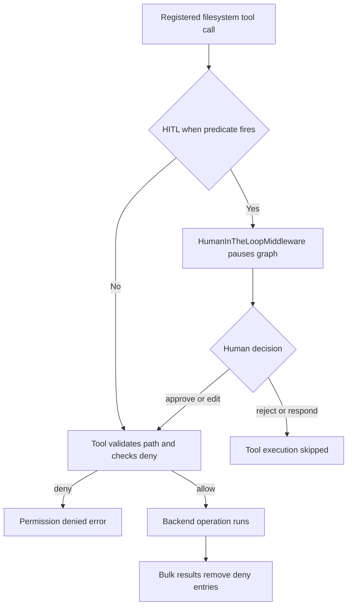

# Permissions & Human-in-the-Loop

This page distinguishes four often-confused boundaries: whether a tool is
**registered for dispatch**, visible to the model, permitted to produce an
effect, and paused for a human decision. See [filesystem tools](/openwiki/concepts/tools-filesystem.md)
for the tools themselves, [middleware catalog](/openwiki/concepts/middleware-catalog.md)
for their position in the stack, [code agent architecture](/openwiki/architecture/code-agent.md)
for dcode assembly, and [security operations](/openwiki/operations/security.md)
for deployment posture.

## Security posture and control boundaries

deepagents follows a “trust the LLM” model: an agent can do what its exposed
tools allow, so boundaries belong at the tool and sandbox layers rather than in
instructions asking the model to self-police. Human-in-the-loop (HITL) is an
opt-in control around selected dangerous actions, not a default guarantee. In
particular, the default `StateBackend` has no shell execution capability;
`LocalShellBackend` is an explicit opt-in.

### Registration, visibility, enforcement, and approval

These controls answer different questions:

| Boundary | Owner and outcome |
| --- | --- |
| **Dispatchability** | `FilesystemMiddleware(tools=...)` creates only selected filesystem tools. An omitted name is not merely hidden: it is absent from `self.tools` and cannot reach the dispatchable tool node. `None` selects the default set and `"all"` selects all filesystem tool names. |
| **Model visibility** | A registered tool can be supplied in the model’s tool schema, subject to other tool-exclusion middleware. Visibility is not an authorization decision. |
| **Permission enforcement** | A registered file tool validates its path and checks the ordered `FilesystemPermission` rules before its backend operation. `deny` returns an error and prevents that operation; bulk read results are filtered too. |
| **Approval** | An `interrupt` rule is translated into a pre-execution HITL predicate. It pauses an intersecting call for an approver rather than granting it automatically. |

Therefore permissions are enforcement, not tool creation or a universal
concealment mechanism. If a tool remains registered, the model may attempt a
denied call and receives its error. Conversely, removing it through `tools=` is
the appropriate boundary when the tool must not be dispatchable at all.

There is also an important scope limit: filesystem permissions do **not**
provide execute-tool authorization. When configured permissions are used with
a backend whose default supports command execution, middleware rejects the
combination unless every permission path is scoped to a `CompositeBackend`
route. That route-scoped exception permits file-tool rules on routed storage,
but does not implement permissions for `execute`; deployers must use the
sandbox and shell controls appropriate to commands.

## Filesystem permissions

`FilesystemPermission` is one path-level rule with `operations` (`read` and/or
`write`), absolute glob `paths`, and a `mode`:

- `allow` is the default and permits a matching operation;
- `deny` produces a permission-denied tool error; and
- `interrupt` delegates the decision to `HumanInTheLoopMiddleware` after graph
  assembly converts the rule into an interrupt configuration.

Patterns must start with `/`; `..` components are rejected after normalizing
backslashes, and `~` is rejected as unsupported. At execution, tools validate
call paths before checking permissions, preventing traversal from bypassing an
otherwise simple glob match.

`_check_fs_permission` scans rules in declaration order, skips a rule that does
not cover the operation, and returns the first matching rule’s mode. No match
means `allow`. Rule ordering is thus policy: put a narrow exception before a
broader catch-all when that exception must win.

### Tool-time enforcement and result filtering

The `ls`, `read_file`, `glob`, and `grep` wrappers check read permission; the
`write_file`, `edit_file`, and `delete` wrappers check write permission. A
denial is returned before the corresponding backend read, write, edit, or
delete. Sync and async wrappers implement the same check.

Bulk reads need a second layer because a permitted root can contain protected
children. `_filter_paths_by_permission`, `_filter_file_infos_by_permission`,
and `_filter_grep_matches_by_permission` remove only entries resolved to
`deny`. Interrupt-mode entries remain: an interrupt has already occurred
before an approved tool runs, so dropping those entries afterward would make an
approved listing misleadingly empty. A pathless `grep` has no root to reject
up front, but its matches still undergo this deny filtering.

### Recursive delete is deliberately stricter

Deleting a directory can mutate every descendant. For a target that may have
descendants, `_find_delete_deny_patterns` blocks if any write-deny pattern
could overlap the target subtree, independent of first-match order. This is
fail-closed: an earlier `allow` cannot establish that all descendants are safe.
Wildcard overlap handles both patterns inside the target and patterns matching
an ancestor, while preserving genuinely disjoint siblings.

The implementation can use ordinary first-match resolution only after backend
probing confirms a plain leaf file. Ambiguous or unsupported `ls` behavior is
conservative; empty directories are still treated as potentially recursive.
This distinction preserves a narrow allow-before-catch-all exception for a
file without making recursive deletion unsafe.

## Converting `interrupt` permissions to HITL

`FilesystemMiddleware` enforces deny and filtering but has no direct HITL
knowledge. `_build_interrupt_on_from_permissions` is the bridge: it returns no
mapping without an `interrupt` rule, otherwise creates one `InterruptOnConfig`
per relevant filesystem tool. The configuration offers `approve`, `edit`,
`reject`, and `respond` and has a per-call `when` predicate.

`create_deep_agent` separately supplies raw permissions to each
`FilesystemMiddleware`, merges the permission-derived map with caller-provided
`interrupt_on`, and adds `HumanInTheLoopMiddleware` when the resulting main
map is non-empty. The same merge is applied to the general-purpose subagent;
an explicit subagent can supply its own permissions.

### Scope-aware predicates

The bridge classifies `read_file`, `write_file`, and `edit_file` as **exact**:
the normalized target must resolve to `interrupt`. Because this uses the normal
first-match resolver, a preceding matching `deny` produces a tool error rather
than an approval prompt.

`ls`, `glob`, `grep`, and recursive `delete` are **bulk**: their root can reach
a subtree, so the predicate asks whether that subtree overlaps the literal
anchor of any interrupt pattern for the operation. Bulk checks intentionally
close several bypass routes:

- an omitted path is treated as unlocalizable and interrupts;
- `.`, `""`, and `./` normalize to the effective root before overlap testing;
- `glob` separately examines its `pattern`, since an absolute pattern can ignore
  its `path`, and a relative pattern containing `..` may escape that root; and
- a pattern with no literal leading anchor collapses to `/`, conservatively
  interrupting every overlapping bulk call.

Use literal leading anchors such as `/secrets/**` where practical. They yield
both narrower approval prompts and a policy that is easier to audit.

Caption: The permission-derived HITL route for a registered filesystem call.
Exact-scope denial can prevent the pause through its first-match predicate;
bulk calls may pause before their own root-level deny check.

An approval is not a bypass token for filesystem policy. `approve` and `edit`
re-enter the tool, which validates and checks deny before the backend call;
`respond` skips execution. This preserves the human as the authorization gate
while retaining hard deny rules as the final tool-time boundary.

## dcode session approval modes

dcode applies a separate session policy to its gated tool map. `ApprovalMode`
has three modes:

- **Manual** — every gated call pauses. Invalid values and untrusted state
  resolve here.
- **Auto** — bypasses dcode HITL only where the graph has an eligible
  classifier-backed Auto path; an ineligible graph treats a live Auto setting
  as Manual.
- **YOLO** — bypasses dcode HITL for gated calls.

`next_approval_mode` implements the Shift+Tab progression Manual → Auto → YOLO
→ Manual. It omits Auto when ineligible, omits YOLO when
`startup.yolo_switcher` disables it, and always exits YOLO to Manual. Entering
YOLO still requires explicit acknowledgement and retains a persistent status
indicator; suppressing its recurring warning is cosmetic rather than consent.

The live mode is a server-side, per-thread LangGraph Store record in
`("deepagents_code", "approval_mode")`. The key is the SHA-256 of the thread
ID, avoiding raw thread IDs as Store keys. Missing store access, an invalid key,
a malformed item, and read failures return no trusted mode; callers interpret
that as Manual.

### Runtime routing and gated tools

`_add_interrupt_on` registers dcode’s side-effecting or external-access tools:
`execute`, file mutations, `delete`, web search, URL fetch, task delegation,
async-subagent actions, and non-read-only MCP tools. Each uses
`_should_interrupt_tool_call` and permits only `approve` or `reject` (with an
optional gated `compact_conversation` configuration).

That predicate first honors a trusted hook decision, then uses the transient
async routing result when present or resolves the live Store policy. YOLO does
not interrupt; Auto bypasses only in an eligible graph; Manual and failures
interrupt. Typed Auto and YOLO values without a validated live Store key do not
authorize bypass; legacy compatibility is intentionally constrained.

`AsyncApprovalHITLMiddleware` exists because the server Store is asynchronous.
After a model response it re-reads the live mode and passes a private
`_RoutingDecision` only in a shallow state copy to stock HITL routing. The
marker is neither checkpointed nor trusted after serialization, so graph input
cannot forge autonomous mode. A synchronous invocation warns and falls back to
Manual behavior.

Patch-Tool-Calls (PTC) host-bridge calls are outside `interrupt_on`; dcode uses
a separate budget for them rather than claiming per-call HITL coverage.

## `ask_user`: a different kind of interrupt

`AskUserMiddleware` is not authorization for a dangerous tool. It exposes an
`ask_user` tool so the agent can ask one or more text, multiple-choice, or
multi-select questions during a run. The tool constructs an `AskUserRequest`
and calls LangGraph `interrupt()` inside tool execution; resuming the graph
produces a Q&A `ToolMessage`.

`_parse_answers` makes resume handling explicit. An answered response must
supply exactly one answer per question; a count mismatch is an error rather
than padding or truncating and misattributing answers. Cancellation generates
`(cancelled)` answers with success status, whereas malformed payloads, unknown
status, invalid answer containers, and declared errors produce explicit error
answers and error status. Non-string answers are rendered through `str()` but
are not trusted as authorization.

`interrupt()` raises `GraphInterrupt` through `ToolNode`’s
`wrap_tool_call` chain. Middleware that catches exceptions must re-raise
`GraphBubbleUp`, or it will accidentally consume the user-interaction pause.

### Authorization receipts

For Auto-mode authorization, an answered transcript can carry an
`AskUserAuthorizationReceipt`, but only if answers are bounded strings, counts
match, and trusted runtime identities agree: execution and context thread IDs,
tool-call IDs, and active/context turn IDs. Cancellations, coercions, malformed
answers, and errors receive no receipt. The receipt is therefore evidence of a
specific validated human answer, not evidence merely that an `ask_user` tool
was called.

## Tests that protect the boundaries

`libs/deepagents/tests/unit_tests/test_permissions.py` covers rule validation,
first-match behavior, sync/async prechecks, denied bulk-result filtering,
path traversal, the pathless/current-directory/absolute-glob HITL bypass
regressions, permission inheritance, and the recursive-delete overlap matrix.
It also verifies that `delete` is bulk-scoped for interrupt generation and that
filesystem permissions reject unsupported execution-backend combinations.

`libs/code/tests/unit_tests/test_approval_mode.py` covers Store payload shapes,
missing and failing Stores, hashed-key use, async writes, and local notice/
acknowledgement state. Broader dcode agent tests exercise live mode changes,
forged routing-marker resistance, Auto eligibility, async revalidation, and
the gated-tool map. When changing any policy, test both the decision result and
whether the operation was actually prevented: a prompt, an error, and an absent
dispatchable tool are distinct outcomes.
