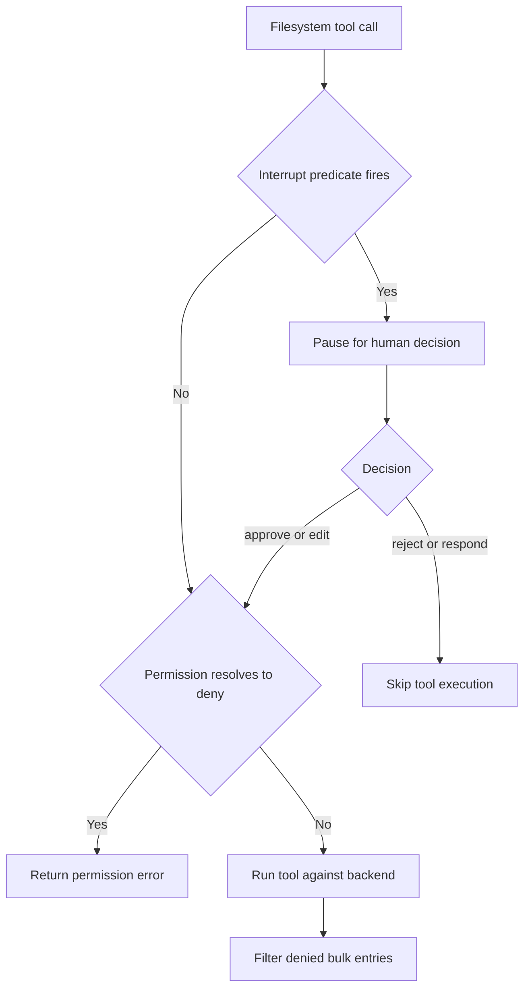
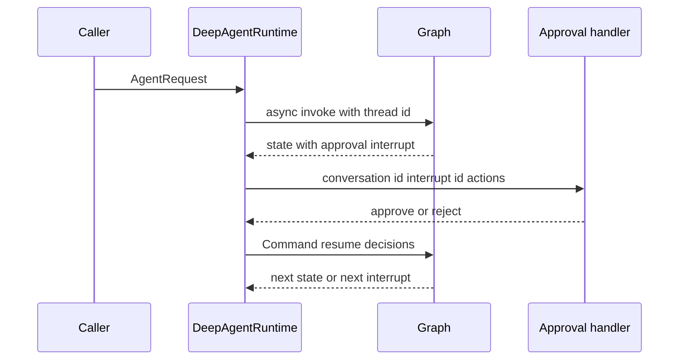

# Permissions and Human-in-the-Loop

Permissions, tool visibility, and approval are different controls. A model can be offered a tool but have a call rejected at execution; an `interrupt` can require a decision before an otherwise possible call; and neither replaces a backend or operating-system boundary. See [backends](/openwiki/concepts/backends.md), [filesystem tools](/openwiki/concepts/tools-filesystem.md), [runtime behavior](/openwiki/architecture/runtime-behavior.md), [Talon](/openwiki/integrations/talon.md), and [security](/openwiki/operations/security.md).

## Security boundary

Deep Agents follows a **trust-the-LLM** model: the agent can do whatever its installed tools allow. Enforce containment in the tool, backend, sandbox, process identity, and deployment—not by asking the model to self-police. Human-in-the-loop (HITL) is opt-in routing for configured calls, not containment and not a substitute for sandboxing.

The safe default is material: `StateBackend` does not provide command execution, so the `execute` tool is not exposed unless an execution-capable backend is explicitly selected. `LocalShellBackend` executes commands with the process owner's authority; an `interrupt_on={"execute": True}` gate is available but is not installed by default.

| Question | Control | Where it acts |
| --- | --- | --- |
| Is a filesystem effect permitted on this path? | `FilesystemPermission` | Filesystem tool implementation before backend access |
| Must a person decide before a configured call? | `HumanInTheLoopMiddleware` and `interrupt_on` | Graph routing before tool execution |
| Can a shell command be run at all? | Backend capability and tool exposure | `FilesystemMiddleware` construction |
| Does Talon prompt for this exact tool name? | Persisted Talon approval snapshot | Graph construction for an invocation |

A denied call is enforcement, not invisibility: the model may see its proposed call and the returned error. Bulk filesystem results instead omit individual denied entries. This prevents the effect or disclosure through the result while still letting the agent receive an error and adapt.

## Filesystem permission rules

`FilesystemPermission` has `operations` (`read` and/or `write`), absolute glob `paths`, and a `mode`.

| Mode | Meaning |
| --- | --- |
| `allow` | Permit the matching operation. This is also the no-match default. |
| `deny` | Return a permission-denied tool error without performing the operation. |
| `interrupt` | Generate path-aware HITL routing during agent construction. |

Patterns must start with `/`; after normalizing backslashes, `..` is forbidden and `~` raises `NotImplementedError`. Rules are ordered: the first matching rule for the requested operation wins, while rules for the other operation are skipped. Put narrow exceptions before broad rules.

Filesystem tools validate their path and test for `deny` before accessing the backend. Result filters for `ls`, `glob`, and `grep` remove entries individually denied for the relevant read operation; they deliberately retain interrupt-mode entries because the configured approval occurs before the tool runs.

### Recursive delete fails closed

Deletion has a stricter rule than a single-file write. If the target may have descendants, any write-deny pattern that can overlap the target subtree blocks the delete irrespective of rule order. This makes deletion all-or-nothing and prevents an earlier broad allow from defeating a later protected descendant. A backend listing is used to establish whether the target is a confirmed plain file; unavailable support, errors other than `not_a_directory`, and ambiguity are treated conservatively. Only a confirmed leaf falls back to ordinary first-match resolution.

This overlap logic can allow a demonstrably disjoint sibling such as `/work/notes.txt` under a deny pattern of `/work/*.log`, but blocks wildcard patterns that might cover the target, an ancestor, or a descendant.

### Execution-capable backend boundary

Filesystem path permissions do **not** police shell command arguments. Therefore `FilesystemMiddleware` rejects configured permissions with an execution-capable backend unless every permission path is scoped to routes of a `CompositeBackend`; otherwise `execute` would be an unimplemented bypass. Do not interpret path permissions as a shell sandbox.

## Turning interrupt rules into HITL

`FilesystemMiddleware` enforces denial but does not itself pause. `_build_interrupt_on_from_permissions` is the bridge: it returns `{}` when there are no interrupt rules, otherwise creates an `InterruptOnConfig` for each affected filesystem tool with `approve`, `edit`, `reject`, and `respond` decisions plus a per-call `when` predicate.

`create_deep_agent` builds this derived map independently of `FilesystemMiddleware`, merges it with caller-supplied `interrupt_on`, and lets the caller's entry win on duplicate tool names. It does this for the main agent and the automatic general-purpose subagent, installing `HumanInTheLoopMiddleware` only when the resulting mapping is non-empty.

- **Exact-path tools**—`read_file`, `write_file`, and `edit_file`—interrupt only when normal first-match permission resolution yields `interrupt`. A preceding deny means no prompt; the tool returns denial.
- **Bulk-scope tools**—`ls`, `glob`, `grep`, and `delete`—interrupt when their search tree can overlap an interrupt-rule anchor. A missing path fires conservatively, and current-directory aliases that validate to `/.` are collapsed to `/` so they cannot bypass the gate.
- `glob` additionally inspects `pattern`: an absolute pattern can escape the provided search path, and a relative pattern containing `..` cannot be safely localized, so it is gated.

Caption: HITL routes an applicable call before execution; the tool's own denial check remains the final filesystem enforcement point.

Approval does not override denial. An approved or edited call re-enters the tool and is checked again; `respond` skips execution. This ordering is intentional: a human authorizes a proposed call, but cannot turn a configured deny into an allowed filesystem effect through the approval UI.

## dcode approval mode and persistence

`ApprovalMode` selects a per-thread dcode policy: `manual` pauses every gated call, `auto` permits an eligible classifier-backed route, and `yolo` bypasses the approval gate. Invalid values coerce to `manual`. Shift+Tab cycles through available modes—normally Manual → Auto → YOLO → Manual—omitting Auto when ineligible and YOLO when disabled; exiting YOLO always returns to Manual.

The live value is stored under `("deepagents_code", "approval_mode")` using a SHA-256 hash of the thread ID as the key. Missing stores, invalid keys, malformed items, unavailable `get`, and read failures return `None`, which consumers must interpret as Manual. This is a fail-closed control record rather than a permission grant embedded in the checkpoint.

For remote dcode, `RemoteAgent.aput_store_item` deliberately propagates a failed Store write. Approval-mode callers rely on that failure to discard the live key and return to interruption rather than continue auto-approval based on state that could not be persisted. Remote state snapshots retain the server's serialized form; callers must treat queued nodes, tasks, or interrupts as pending work when recovering or abandoning a thread.

## Talon persisted tool-approval policy

Talon uses a different policy layer: `ToolApprovalStore` manages a per-assistant `tools.json` mapping of exact tool names to booleans. Enabled names produce approve/reject-only `interrupt_on` entries; an unspecified or `false` entry does not prompt. `false` disables prompting—it is not operator authorization to execute a tool.

The store validates a bounded JSON object: names must be trimmed, nonempty exact names without glob characters or control characters, and values must be booleans. It refuses symlinks and non-regular files, writes via a temporary file and replacement, and identifies each byte-level revision with SHA-256. Updates use a lock plus compare-and-swap against `expected_revision`, returning conflict rather than overwriting concurrent changes.

At startup Talon materializes default gated tools only if the file is absent. At each invocation it rereads the policy; a changed snapshot rebuilds the graph before the call. The active snapshot is held in a context variable, so saved edits are explicitly **next invocation** behavior and cannot change the decision surface mid-run. The `update_tool_approvals` tool is itself usable only when the request has trusted operator metadata and an active snapshot.

## Talon interrupt and resume lifecycle

`DeepAgentRuntime` invokes its graph with the conversation ID as LangGraph's thread ID. When graph state contains `__interrupt__`, it asks the request's approval handler for each usable interrupt, converts the decision into per-action `Command(resume=...)` payloads, and invokes again. It allows at most `DEFAULT_MAX_APPROVAL_ROUNDS` (50); absent IDs are skipped and an all-unresumable batch raises rather than implicitly continuing.

Scheduled (`trigger == "cron"`) work, background delivery, and a request with no approval handler fail closed to rejection with an explanatory tool result. Otherwise the handler receives the conversation ID, interrupt ID, and action requests. The runtime records approval interrupt and resolution events using a stable conversation reference.

Caption: Talon resumes a checkpointed graph only with explicit decisions for usable interrupt identifiers, repeating within a fixed approval-round limit.

## Operational guidance and focused tests

- Use literal-leading interrupt anchors such as `/secrets/**`; a leading wildcard anchors at `/` for bulk overlap and can prompt nearly every bulk operation.
- Test direct calls and bulk roots, including no path, `.`, absolute glob patterns, and `..` inside a relative glob. Test a directory delete separately from a confirmed leaf.
- Pair approval with backend isolation, process permissions, and deployment controls. Do not rely on filesystem permissions to constrain `execute`, and do not treat approval as a sandbox.
- In Talon, protect the assistant home and `tools.json`, handle revision conflicts rather than retrying blind overwrites, and expect policy changes to take effect on the next invocation.

`libs/deepagents/tests/unit_tests/test_permissions.py` covers rule precedence, pathless/current-directory and glob-pattern HITL bypasses, permission filtering, recursive-delete overlap, leaf behavior, and rejection of unsupported execution-backend configurations. Talon's `ToolApprovalStore` is designed around validation, no-follow file access, revision conflicts, immutable snapshots, and operator-only updates; the runtime bounds and fails closed in its approval resume loop.
