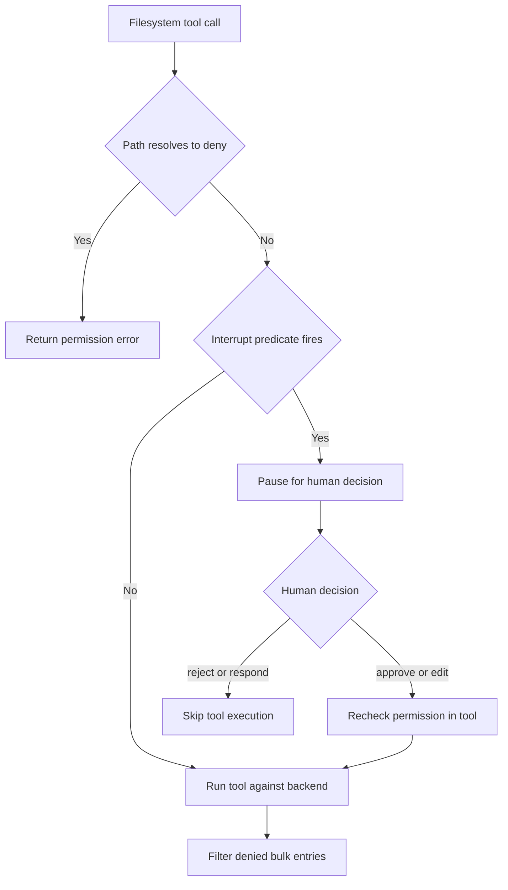
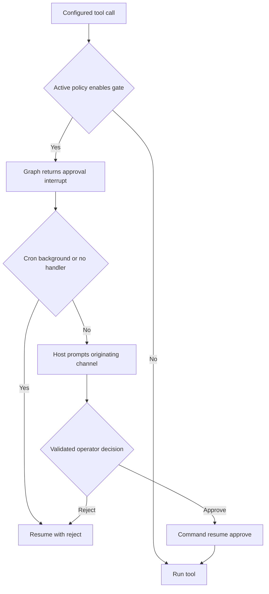

# Permissions and Human Approval

Permissions, approval prompts, and tool availability are related but distinct controls. A tool schema can be available to the model while a particular call is rejected at execution time; an interrupt can pause an otherwise permitted call; and an approval is not a general sandbox boundary. See [filesystem tools](/openwiki/concepts/tools-filesystem.md), [configuration layering](/openwiki/concepts/config-layering.md), [Talon](/openwiki/integrations/talon.md), and [security](/openwiki/operations/security.md).

## Boundary model and enforcement locations

Deep Agents follows a **trust-the-LLM** model: an agent can do anything its installed tools permit. Meaningful containment therefore belongs in the tool implementation, backend, or sandbox—not in prompt instructions asking the model to behave. HITL is opt-in and only covers calls configured to interrupt. In particular, `StateBackend` cannot execute shell commands; `LocalShellBackend` is an explicit opt-in with substantially more power.

| Question | Control | Enforcement point |
| --- | --- | --- |
| Can the model propose a call? | Tool visibility / installed schemas | Agent construction |
| May a filesystem operation affect this path? | `FilesystemPermission` | `FilesystemMiddleware` and filesystem tool execution |
| Must a person decide before a configured call proceeds? | `HumanInTheLoopMiddleware` / `interrupt_on` | Graph routing before tool execution |
| May a dcode shell command run without an interactive pause? | Approval mode or `ShellAllowListMiddleware` | dcode HITL routing or inline tool-call middleware |
| How is a Talon decision obtained? | `ToolApprovalHandler` | Channel host and runtime resume loop |

A denied tool call may still be visible in the model transcript: it returns an error instead of performing its effect, so the model can adapt. For bulk filesystem reads, individual denied result entries are removed; the control is still execution/result enforcement rather than schema hiding.

## SDK filesystem permissions

A `FilesystemPermission` rule contains read and/or write `operations`, absolute glob `paths`, and a `mode`:

| Mode | Effect |
| --- | --- |
| `allow` | The matching operation proceeds; it is the default. |
| `deny` | The tool returns a permission-denied error without doing the operation. |
| `interrupt` | Graph assembly arranges a human approval interruption for a matching call. |

Patterns must begin with `/`; `..` is forbidden after backslash normalization; and `~` is rejected as unsupported. Resolution is ordered and first-match-wins: rules for another operation are skipped, and no match is `allow`. Put a more-specific exception before a broad rule.

Filesystem tools validate paths and perform their permission check before calling the backend. `FilesystemMiddleware` itself only enforces denial and filters results—it does not pause execution. The separate interrupt bridge is important: an approval cannot override a tool-level `deny`, because a resumed or edited call re-enters the tool and is checked again.

### Bulk reads and deletion

`ls`, `glob`, and `grep` can return many paths. Their result filters exclude entries whose individual read permission is `deny`; entries with `interrupt` pass through because the relevant approval occurs before the tool runs. A direct operation rooted at a denied path returns an error rather than silently becoming a partial operation.

Deletion is stricter because it may be recursive. When a target may have descendants, every deny-write pattern that could match the target or its subtree blocks deletion irrespective of declaration order. This prevents an earlier broad allow from defeating a later protected descendant. The code uses backend listings to distinguish a confirmed leaf file from a possible directory; unavailable or ambiguous backend information is treated conservatively. Once a target is confirmed as a leaf, ordinary first-match resolution applies. Wildcard-overlap logic permits demonstrably separate siblings, such as deleting `/work/notes.txt` under a deny for `/work/*.log`, but fails closed when overlap is possible.

## Permission-derived HITL

`_build_interrupt_on_from_permissions` converts interrupt-mode filesystem rules into the `interrupt_on` mapping used by `HumanInTheLoopMiddleware`. It returns `{}` if no rule requests interruption. For each filesystem tool that could be affected, it creates an `InterruptOnConfig` with `approve`, `edit`, `reject`, and `respond` and a per-call `when` predicate.

`create_deep_agent` merges this derived mapping with caller-provided `interrupt_on` for both the main agent and its general-purpose subagent. It installs a single `HumanInTheLoopMiddleware` only when the merged map is non-empty, while independently giving the original rules to `FilesystemMiddleware`.

- **Exact-path tools**—`read_file`, `write_file`, and `edit_file`—interrupt only when normal first-match resolution says `interrupt`. A prior matching `deny` wins, so no unnecessary prompt is displayed.
- **Bulk tools**—`ls`, `glob`, `grep`, and `delete`—interrupt when their search subtree can overlap an interrupt-rule anchor. A missing bulk path fires conservatively. `.` and other current-directory aliases normalized as `/.` are treated as `/` to prevent a bypass.
- For `glob`, the predicate also considers `pattern`: an absolute pattern can redirect the search root, while a relative pattern containing `..` cannot be safely localized and is gated.

Caption: Filesystem denial is enforced by the tool, while path-scoped approval is graph routing before it.

## dcode approval modes and shell policy

`ApprovalMode` is a per-session policy: `manual` pauses every gated call, `auto` enables classifier-backed review for an eligible graph, and `yolo` bypasses the approval gate. Invalid or non-string inputs coerce to `manual`. The Shift+Tab cycle is Manual → Auto → YOLO → Manual when available; Auto is omitted when ineligible, YOLO when `startup.yolo_switcher` is disabled, and exiting YOLO always returns to Manual.

The live value is a per-thread LangGraph Store record in `("deepagents_code", "approval_mode")`, keyed by a SHA-256 hash of the thread ID. Missing stores, malformed records, bad keys, and read errors return `None`, which callers interpret as Manual. This makes loss or corruption of control state fail closed rather than silently enabling autonomous execution.

`_add_interrupt_on` registers dcode's side-effecting or external-access tools—`execute`, write/edit/delete, web tools, `task`, async-subagent controls, and non-read-only MCP tools—with a shared approval predicate and approve/reject decisions. The predicate honors a prior trusted hook decision, bypasses for YOLO, and allows an Auto bypass only for an Auto-eligible graph; otherwise it interrupts. `AsyncApprovalHITLMiddleware` asynchronously rereads the live mode after the model response and passes stock HITL a transient `_RoutingDecision`. That private, in-process marker is neither checkpointed nor forgeable through serialized graph input; synchronous use warns and falls back to Manual.

Auto is not a blanket allowlist. `AutoModeHITLMiddleware` applies deterministic policy followed by classifier review: classifier-allowed calls can continue, policy-denied or classifier-unavailable calls become error messages, and `require_human` calls escalate to an approval prompt. Its deterministic shell allowance is deliberately narrow: it permits fixed repository commands or configured command entries only after rejecting shell control syntax and broad executables or wildcard entries.

For non-interactive dcode operation, `interrupt_shell_only=True` disables HITL only when a restrictive shell allow-list is available, then installs `ShellAllowListMiddleware`. It checks `execute` before execution and returns an error `ToolMessage` for a command outside the list, avoiding an interrupt/resume cycle. If no restrictive list can be resolved, dcode logs a warning and retains normal HITL; an empty list is invalid, and the unrestricted `SHELL_ALLOW_ALL` sentinel must use `auto_approve=True` instead. `auto_approve=True` disables all HITL interruptions. Patch Tool Calls from the code interpreter bypass `interrupt_on`/HITL altogether, so `InterpreterConfig.ptc` is their effective control.

## Talon: persisted policy and channel-mediated approval

Talon's approval configuration is an exact-name policy, separate from a graph invocation. `ToolApprovalStore` persists `tools.json` as a bounded, regular, non-symlink JSON mapping from tool name to boolean and gives each byte representation a SHA-256 revision. The initial file contains gates for `update_tool_approvals`, `delete_conversations`, `update_mcp_server`, and `start_async_task`. An enabled entry produces an approve/reject-only `interrupt_on` entry; an unspecified or `false` entry produces no prompt. **That absence is not operator authorization**—it merely selects whether the graph pauses.

Updates are compare-and-swap operations under a file lock: the caller must supply the current persisted revision, and conflicts, malformed input, unsafe files, or write failures leave the previous policy intact. The runtime reads a snapshot when it starts and before each invocation; if it changed, it rebuilds the graph. An in-flight invocation keeps its captured snapshot, and a successful update reports that it is available on the next invocation. This prevents a call from changing the policy by which that same invocation is being authorized.

`get_tool_approvals` exposes both the active snapshot and the saved file. `update_tool_approvals` additionally requires both an active invocation snapshot and the `APPROVAL_OPERATOR` context flag. The runtime sets that flag only for metadata whose `tool_approval_operator` is literally `True`, and clears it for cron and background delivery. Channel routing derives that metadata from trusted channel exposure configuration rather than accepting route/message metadata as a grant.

`DeepAgentRuntime` invokes the graph asynchronously, detects `__interrupt__` values, obtains one decision for each interrupt, builds LangGraph `Command(resume=...)` payloads for every action request, and repeats for at most `DEFAULT_MAX_APPROVAL_ROUNDS` (50). A missing interrupt ID or an all-unresumable batch is an error rather than an implicit approval. For an approval interruption, cron runs, background delivery, and requests with no handler receive a reject decision. Otherwise, the handler receives the conversation ID, interrupt ID, and pending action requests.

For a channel turn, `TalonHost` passes an approval callback through `AgentRequest`. The host retains a pending future per agent conversation, posts the action information, and completes it from an approve/reject reply or a thumbs-up/thumbs-down reaction. A text reply is accepted only from the sender that started the run when that identity is known. A reaction additionally must match the provider, conversation, exact approval-prompt message, and sender. Invalid replies re-prompt; mismatches are ignored and logged.

Caption: Talon first selects a gate from its invocation snapshot, then fails closed unless an interactive channel handler supplies a validated approval.

### Talon security boundaries

A persisted boolean policy is neither a sandbox nor a durable authorization credential. It controls which exact tool names yield graph approval interrupts; unprompted tools still rely on their own implementation and backend controls. Likewise, `approval_handler` is a runtime callback for a live channel turn, while `authorization_handler` is a distinct callback used for authorization events outside model context (for example, MCP authorization). Do not treat either callback as a general identity system or use request metadata from an untrusted caller to manufacture authority.

The approval store is deliberately fail-closed operationally: an invalid stored policy prevents graph refresh/invocation rather than overwriting it or falling back to a less restrictive policy. Its active snapshot and `APPROVAL_OPERATOR` context are scoped to the invocation and reset afterwards; detached/background work cannot inherit the operator's authority.

## `ask_user` is not an approval gate

`AskUserMiddleware` supplies an `ask_user` tool for text, multiple-choice, and multi-select questions. The tool calls LangGraph `interrupt()` during tool execution and resumes into a `ToolMessage`; it does not approve another tool call. Answer parsing rejects mismatched counts, represents cancellation as successful `(cancelled)` answers, and converts malformed data to explicit error answers.

Only genuinely answered, bounded string responses with trusted thread, turn, and tool-call identity receive an `AskUserAuthorizationReceipt`; coercions, cancellations, and errors do not. Auto mode requires that receipt instead of treating arbitrary text as authorization. Middleware that catches exceptions around tool calls must re-raise `GraphBubbleUp`, because swallowing the `GraphInterrupt` would break the interaction.

## Operational checklist and tests

- Use absolute, literal-leading protected anchors such as `/secrets/**`; leading-wildcard interrupt patterns anchor at `/` for bulk overlap and can prompt nearly every bulk call.
- Test direct paths and bulk roots, including omitted paths, `.`, absolute glob patterns, and `..` in a relative glob pattern. Test directory deletion separately from a confirmed leaf.
- Treat `interrupt_on` as selective approval routing, not a replacement for backend sandboxing or filesystem denial. Review interpreter PTC separately.
- For Talon deployments, review `tools.json` as an exact-name gate policy, use the returned revision when changing it, and expect a saved change to apply only to the next invocation. Ensure channels provide stable message/sender identities for reaction approvals, and expect cron, background, and no-handler execution to deny gated calls.

Focused coverage includes `libs/deepagents/tests/unit_tests/test_permissions.py` for validation, precedence, bulk bypass protection, and delete overlap; `libs/code/tests/unit_tests/test_approval_mode.py` for fail-closed Store behavior; `libs/talon/tests/unit_tests/test_tool_approvals.py` for store validation, atomic compare-and-swap, snapshots, and operator checks; and Talon's tool-approval runtime/authorization tests for snapshot isolation, handler stripping, channel-origin authority, and cron/background denial.
