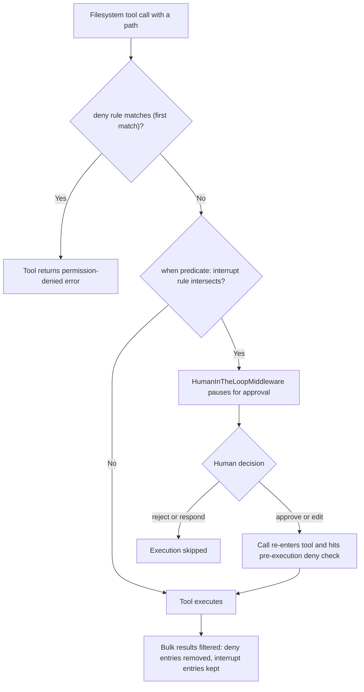
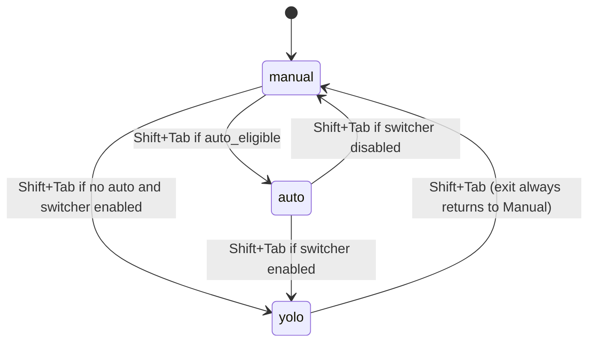

# Permissions & Human-in-the-Loop

This page explains how the deepagents SDK and the dcode agent decide whether a
tool call is allowed, denied, or paused for a human decision. It covers the
`FilesystemPermission` model, how those rules are translated into
`HumanInTheLoopMiddleware` interrupt configuration, dcode's Manual / Auto / YOLO
approval modes, and the interactive `ask_user` flow. For the broader security
posture see [operations/security](/openwiki/operations/security.md) and the
generated `THREAT_MODEL.md`; for where these pieces sit in the runtime see the
[code agent architecture](/openwiki/architecture/code-agent.md), the
[filesystem tools](/openwiki/concepts/tools-filesystem.md), and a
[dcode session walkthrough](/openwiki/workflows/run-dcode-session.md).

## Security model: trust the LLM, enforce at the tool/sandbox level

deepagents deliberately does not rely on the model to police itself. The README
states the posture directly: the agent "can do anything its tools allow," and
callers should "enforce boundaries at the tool/sandbox level, not by expecting
the model to self-police." Every mechanism on this page is an *enforcement*
control layered around the tools, not a request to the model to behave.

The `THREAT_MODEL.md` document reinforces this: the default `StateBackend` cannot
execute shell commands at all, `LocalShellBackend` must be explicitly opted into
and carries documented warnings, and human-in-the-loop is described as an
opt-in control that a deployer configures around dangerous tools rather than a
default guarantee.

A key consequence is that **permissions are enforcement, not visibility**. A
denied tool call may still be *presented to the model* and only rejected when the
tool runs — the model can see denied paths in listings' shapes and receives a
permission-denied error message it can read and react to. The controls stop the
*effect*, not the model's awareness that it tried.

## FilesystemPermission: path-level rules

`FilesystemPermission` is a dataclass describing a single access rule: a list of
`operations` (`read` / `write`), a list of absolute glob `paths`, and a `mode`
that is one of `allow` (default, the call proceeds), `deny` (the tool returns a
permission-denied error), or `interrupt` (the call is paused for human approval
via `HumanInTheLoopMiddleware`).

Path patterns are validated on construction: they must start with `/`, must not
contain `..`, and `~` is explicitly rejected as not implemented. This keeps rule
patterns anchored and prevents traversal tricks in the rule set itself.

`_check_fs_permission` resolves a `(operation, path)` against the ordered rule
list using first-match-wins semantics: it scans rules in declaration order,
skips rules that do not include the operation, and returns the `mode` of the
first rule whose patterns glob-match the path. If nothing matches, the default is
`allow`.

The filesystem tools call `_check_fs_permission` before executing and turn a
`deny` result into an error rather than performing the operation. This deny check
runs for reads (`read_file`, `ls`, `glob`, `grep`) and writes (`write_file`,
`edit_file`, `delete`) alike, evaluated against the validated absolute path.

### Deny is also a result filter

Bulk read tools (`ls`, `glob`, `grep`) can surface many paths, so denial also
acts as a result filter: `_filter_paths_by_permission`,
`_filter_file_infos_by_permission`, and `_filter_grep_matches_by_permission`
drop entries whose path is `deny` for the operation, so a denied file never
appears in a listing the model receives. Interrupt-mode entries deliberately
pass through this filter unchanged, because the interrupt fires *before* the tool
runs; filtering an approved listing afterward would silently empty the result the
user just authorized.

### Recursive delete is fail-closed

`delete` gets special treatment because a recursive delete removes a whole
subtree. `_find_delete_deny_patterns` blocks a delete whenever any deny-write
pattern could match the target *or anything in its subtree*, regardless of rule
order — an earlier `allow` cannot vouch for every descendant. Only once the
backend confirms the target is a plain leaf file (via
`_delete_target_may_have_descendants`) does delete fall back to the same
first-match resolution used by `write_file`/`edit_file`
(`_find_delete_deny_patterns_for_leaf`). Wildcard overlap is handled by
`_wildcard_delete_overlap`, which also blocks deleting an ancestor whose glob
matches while still allowing siblings that can never contain a match.

## From permissions to interrupts: `_fs_interrupt`

`FilesystemMiddleware` only knows how to *enforce* deny rules and filter denied
results; it does not know about HITL. The bridge is
`_build_interrupt_on_from_permissions` in
`deepagents/middleware/_fs_interrupt.py`, which the graph-assembly code in
`deepagents.graph` calls to convert `interrupt`-mode permissions into an
`interrupt_on` mapping for `HumanInTheLoopMiddleware`.

If no rule uses `interrupt` mode, the function returns an empty mapping and no
HITL is wired for permissions. Otherwise it emits one `InterruptOnConfig` per
filesystem tool whose operation could be triggered by an interrupt-mode rule.
Each config offers the approver the full decision set
(`approve`, `edit`, `reject`, `respond`) and carries a `when` predicate that
decides *per call* whether that specific call intersects an interrupt-mode rule.

### Scope-aware `when` predicates

The predicate depends on the tool's path-argument *scope*, captured in the
`_FS_TOOL_PATH_ARGS` table:

- **`exact` scope** (`read_file`, `write_file`, `edit_file`): the call operates
  on exactly the named path. `_make_exact_when_predicate` validates the path
  argument and fires only when `_check_fs_permission` returns `interrupt` for it.
  Because it reuses first-match precedence, a preceding `deny` rule wins and the
  interrupt does not fire — the tool returns a permission-denied error instead.
- **`bulk` scope** (`ls`, `glob`, `grep`, and `delete`): the path argument names
  a search root and the call may surface any descendant.
  `_make_bulk_when_predicate` fires whenever the call's search subtree could
  intersect an interrupt-mode rule's anchored prefix (via `_paths_overlap`).

Bulk predicates handle several bypass paths deliberately: a pathless bulk call
such as `grep(path=None)` cannot be localized, so it fires unconditionally for
any interrupt-mode rule on the operation. Current-directory aliases like `.`,
`""`, and `./` (which `validate_path` normalizes to `/.`) collapse to `/` so they
overlap everything, preventing `path="."` from slipping past HITL. For `glob`,
the `pattern` argument can redirect the search root independently of `path`, so
`_bulk_pattern_fires` additionally gates on the pattern: an absolute pattern is
matched from its own anchor, and a relative pattern containing `..` is treated as
firing because it can climb out of `path`.

Interrupt rules work best with a literal leading anchor (e.g. `/secrets/**`);
a fully unanchored pattern collapses to `/` and conservatively over-fires for
every bulk call.

Caption: How a filesystem tool call is resolved against permissions — deny check,
scope-aware interrupt predicate, human decision, and result filtering.

The human always remains the authorization gate: `approve`/`edit` decisions
re-enter the tool and still hit its pre-execution deny check, while `respond`
skips execution entirely.

### Where interrupts are assembled in the graph

`create_deep_agent` merges the permission-derived interrupt map with any
caller-supplied `interrupt_on` (via `_merge_fs_interrupt_on`) for both the main
agent and the general-purpose subagent, then appends a single
`HumanInTheLoopMiddleware(interrupt_on=...)` when the merged map is non-empty.
`FilesystemMiddleware` receives the raw `_permissions` list separately so it can
run the deny checks and result filtering independently of HITL.

## dcode approval modes

dcode wraps the same interrupt machinery in a session-level policy called an
**approval mode**, defined by the `ApprovalMode` enum with three values:

- **`manual`**: every gated tool call pauses for human approval. This is the
  fail-closed default — `coerce_approval_mode` maps any invalid or unknown value
  to `manual`, and an unreadable approval-mode store record must be interpreted
  as `manual`.
- **`auto`**: a classifier-backed mode where read-only or otherwise-safe calls
  bypass approval while risky calls still interrupt. Auto is only offered where
  the classifier is eligible (`auto_eligible`); ineligible runtimes (for example
  a remote sandbox) treat Auto as Manual.
- **`yolo`**: unrestricted mode where gated calls bypass approval entirely. YOLO
  requires an explicit acknowledgement to enter (a TUI modal or a console prompt
  for `--yolo`), honors an org/user `startup.yolo_switcher` setting, and shows a
  persistent status-bar indicator the whole time it is active.

`next_approval_mode` defines the Shift+Tab cycle Manual -> Auto -> YOLO ->
Manual, omitting Auto when the classifier is ineligible and omitting YOLO when
the switcher entry is disabled; exiting YOLO always returns to Manual.

Caption: The dcode approval-mode cycle driven by `next_approval_mode`.

### Live approval mode lives in the LangGraph Store

The active mode is a per-thread control record stored server-side in the
LangGraph Store under the `("deepagents_code", "approval_mode")` namespace, keyed
by a SHA-256 hash of the thread id (`approval_mode_key`) so the raw thread id is
never exposed as a key. `read_approval_mode_from_store` / the async
`aread_approval_mode_from_store` read it; both fail closed to `None` (interpreted
as `manual`) whenever the store is missing, the key is invalid, or the record is
malformed. Writes go through an agent's remote store client via
`awrite_approval_mode`.

### Approval mode drives the interrupt predicate

On the dcode side, `_add_interrupt_on` registers every side-effecting tool
(`execute`, `write_file`, `edit_file`, `delete`, `web_search`, `fetch_url`,
`task`, the async-subagent tools, and mutating MCP tools) with an
`InterruptOnConfig` whose `when` predicate is `_should_interrupt_tool_call`.
That predicate resolves the live mode — preferring a per-call async routing
marker, otherwise reading it from the runtime context/Store — and decides:
`YOLO` never interrupts, `AUTO` interrupts only when the classifier is not
eligible for that graph, and everything else interrupts. A prior hook decision
that already granted permission (`hook_decided_permission`) also short-circuits
to no interrupt.

Because the live mode is read from an async Store, dcode uses
`AsyncApprovalHITLMiddleware`, which re-reads the mode after the model responds
and threads a transient `_RoutingDecision` marker into the stock HITL routing.
That marker is never checkpointed and is only honored via a process-local type
identity, so external graph input cannot forge an autonomous mode. If the
middleware is driven synchronously it warns and fails closed to Manual, since the
synchronous Store read is rejected on the event loop.

Some paths deliberately sit outside `interrupt_on` entirely: Patch-Tool-Calls
(PTC) host-bridge calls bypass `interrupt_on`/HITL approval, which is why dcode
enforces a separate budget for them rather than a per-call approval.

## The `ask_user` flow

`AskUserMiddleware` (in `deepagents_code`) is a distinct interactive mechanism:
instead of gating a dangerous tool, it lets the agent *proactively ask the human
questions* mid-run. It registers an `ask_user` tool that accepts one or more
questions (`text`, `multiple_choice`, or `multi_select`) and injects a system
prompt instructing the model to use it sparingly.

Control flow: the tool builds an `AskUserRequest` and calls LangGraph's
`interrupt()` from inside tool execution, pausing the graph until the client
resumes with a payload. `_parse_answers` normalizes that resume payload into a
`ToolMessage` carrying the Q&A transcript, with explicit status handling:

- `answered`: consumes the provided answers, but an answer count that does not
  match the question count is rejected as an error rather than padded or
  truncated (which would misattribute answers to questions);
- `cancelled`: synthesizes `(cancelled)` answers and is still reported as a
  user choice, not a failure;
- `error`: synthesizes explicit `(error: ...)` answers.

Malformed payloads (non-dict, missing `answers`, non-list answers, unknown
status) are converted into explicit error answers rather than silently defaulting
to a "no answer", and the resulting `ToolMessage` carries a `status` field
(`"error"` for a failed prompt, otherwise `"success"`) that downstream consumers
depend on.

Because `interrupt()` raises a `GraphInterrupt` from inside `ToolNode`'s
`wrap_tool_call` chain, any middleware that catches exceptions must re-raise
`GraphBubbleUp`; a broad `except Exception` would swallow the interrupt and break
`ask_user`. The middleware also logs argument-validation rejections that
`ToolNode` converts into error `ToolMessage`s, since `ToolNode` itself logs
nothing.

### Authorization receipts

When a prompt is genuinely `answered` with string answers whose count matches
the questions and whose lengths are within bounds, and the runtime thread and
turn identities can be trusted (execution thread id equals context thread id and
the tool-call ids match; context turn id equals the active turn), `ask_user`
attaches an `AskUserAuthorizationReceipt` to the `ToolMessage`. This receipt is a
trust artifact that Auto mode requires before it will treat an answer as an
authorization — it is deliberately withheld for coerced/non-string answers,
cancellations, and errors, so a cancelled or failed prompt carries no receipt to
trust.

## Invariants and failure semantics

- **Fail closed.** Invalid approval-mode values, unreadable store records, and a
  synchronously-driven async HITL middleware all resolve to Manual (interrupt).
- **Deny precedes interrupt.** For exact-scope calls a matching `deny` rule wins
  over an `interrupt` rule by first-match ordering, so a denied path errors
  rather than prompting.
- **Human stays the gate.** Even after approval or an edited call, the tool
  re-enters and re-runs its pre-execution deny check.
- **Enforcement, not visibility.** Denied calls can still be issued by the model
  and produce an error message the model reads; the interrupt/deny logic controls
  effects, not what the model attempts.
- **Interrupt-mode results survive filtering.** Deny filtering removes entries
  from bulk results, but interrupt-mode entries pass through because approval
  already happened before execution.
