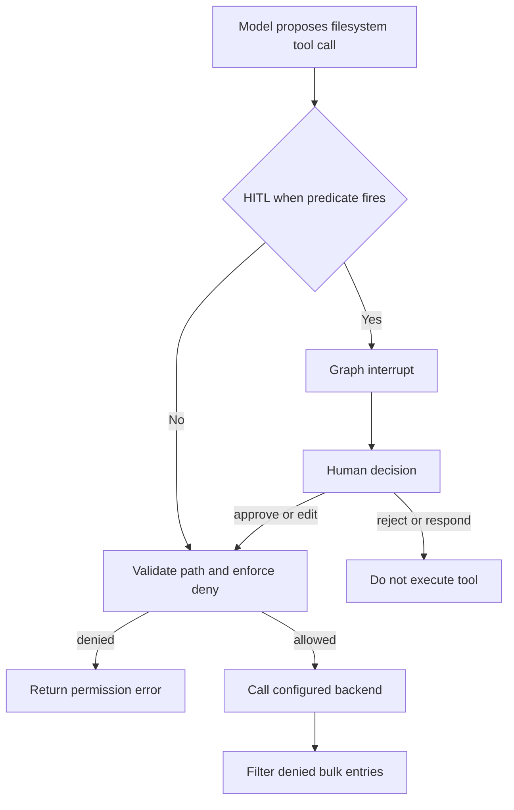
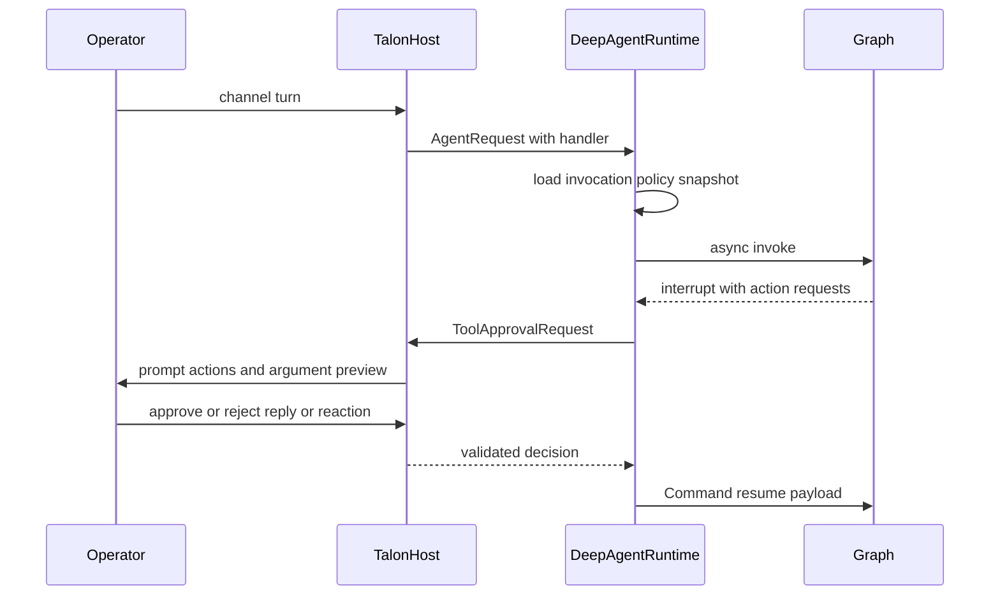

# Permissions and Human Approval

Permissions, approval prompts, and tool availability are related but different controls. A model may see and propose a tool call that will later be rejected at execution; an interrupt may pause an otherwise permitted call; neither is an OS or sandbox isolation boundary. See [backends](/openwiki/concepts/backends.md), [filesystem tools](/openwiki/concepts/tools-filesystem.md), [runtime behavior](/openwiki/architecture/runtime-behavior.md), [Talon](/openwiki/integrations/talon.md), and [security](/openwiki/operations/security.md).

## Control boundaries

Deep Agents follows a **trust-the-LLM** model: the agent can do what its installed tools allow. Put durable containment in tool implementations, backend configuration, and sandbox or OS permissions—not in a prompt asking the model to self-police. HITL is opt-in and applies only to configured calls. The default `StateBackend` cannot execute shell commands; using `LocalShellBackend` is an explicit, more-powerful opt-in.

| Question | Control | What it does—and does not do |
| --- | --- | --- |
| Can the model propose the operation? | Tool visibility / installed schema | Excluded filesystem tools are not dispatchable. Visibility does not authorize a particular argument. |
| May an operation affect a filesystem path? | `FilesystemPermission` | The filesystem tool validates and enforces its path policy at execution. It is not OS-level confinement. |
| Must a person decide first? | `HumanInTheLoopMiddleware` / `interrupt_on` | Pauses configured calls in graph routing. It mediates execution; it does not make an unsafe backend safe. |
| Can a command touch host resources outside virtual paths? | Backend sandbox and OS identity | This is the isolation boundary. In particular, shell execution needs separate backend and deployment controls. |
| Who can resolve a Talon prompt or edit its approval policy? | Channel identity checks and operator context | Mediates a channel decision and policy mutation; it is not equivalent to filesystem or sandbox authorization. |

A denied call can remain visible in the model transcript because it produces an error rather than its intended effect. Bulk filesystem reads similarly omit denied entries from results. These are enforcement and result-filtering controls, not secrecy or schema-hiding controls.

## SDK filesystem permissions

A `FilesystemPermission` contains read and/or write `operations`, absolute glob `paths`, and an `allow`, `deny`, or `interrupt` `mode`.

| Mode | Effect |
| --- | --- |
| `allow` | The matching operation proceeds; this is also the no-match default. |
| `deny` | The tool returns a permission-denied error without doing the operation. |
| `interrupt` | Graph construction creates a matching HITL pause before the tool runs. |

Patterns must start with `/`; `..` is rejected after backslash normalization; and `~` is unsupported. Rules are ordered: rules not covering the requested operation are skipped, and the first matching rule wins. Put a specific exception before a broader rule.

`FilesystemMiddleware` validates a tool path and checks `deny` before it calls the backend. It does not itself pause calls. `FilesystemPermission` is currently unsupported with an execution-capable sandbox backend unless every permission path is scoped to `CompositeBackend` routes, because the middleware has no execute-tool permission implementation. This is an important boundary: filesystem rules do not police arbitrary shell commands.

### Bulk reads and recursive deletion

`ls`, `glob`, and `grep` can return many entries. Their filters remove entries individually denied for reading; `interrupt` entries remain because any applicable approval was handled before the tool executed. Direct calls rooted at a denied path return an error instead of silently degrading into a partial operation.

Deletion is deliberately stricter. If the target may have descendants, any deny-write pattern that could match the target or its subtree blocks deletion irrespective of rule order. Backend `ls` information is used to establish whether a target is a confirmed leaf; missing support or ambiguous information is treated as potentially recursive. Only a confirmed leaf falls back to normal first-match resolution. The overlap logic allows demonstrably separate siblings, such as deleting `/work/notes.txt` with a deny for `/work/*.log`, but blocks when a match is possible.

## Permission-derived HITL

`_build_interrupt_on_from_permissions` is the bridge from interrupt-mode filesystem rules to `HumanInTheLoopMiddleware`; `FilesystemMiddleware` remains independent of HITL. It returns an empty map if there are no interrupt rules. Otherwise it configures each relevant filesystem tool with `approve`, `edit`, `reject`, and `respond`, plus a per-call `when` predicate.

`create_deep_agent` merges the derived map with caller-supplied `interrupt_on` for the main agent and default general-purpose subagent. It adds one `HumanInTheLoopMiddleware` only when the main merged map is non-empty, while passing the raw permission list separately to each `FilesystemMiddleware`.

- **Exact-path tools**—`read_file`, `write_file`, and `edit_file`—interrupt only if ordinary first-match resolution produces `interrupt`. A preceding matching `deny` therefore avoids an unnecessary prompt.
- **Bulk tools**—`ls`, `glob`, `grep`, and `delete`—interrupt when their search subtree could overlap an interrupt-rule anchor. A missing path fires conservatively, and current-directory aliases normalized to `/.` are treated as `/` to avoid a bypass.
- `glob` additionally gates its `pattern`: an absolute pattern can redirect the search root independently of `path`, and a relative pattern containing `..` cannot be localized safely.

Caption: Approval is graph-level mediation before execution; the tool still enforces denial after an approved or edited resume, while backend and OS isolation are separate controls.

Approval cannot override denial: an approved or edited call re-enters the tool and repeats its pre-execution check. `respond` skips execution altogether.

## dcode approval modes and shell policy

`ApprovalMode` is a per-thread policy: `manual` pauses every gated call, `auto` permits classifier-backed routing only in an eligible graph, and `yolo` bypasses the approval gate. Invalid or non-string input coerces to `manual`. Shift+Tab cycles Manual → Auto → YOLO → Manual when both alternatives are available; Auto is omitted when ineligible, YOLO when `startup.yolo_switcher` is disabled, and leaving YOLO always returns to Manual.

The live mode is a LangGraph Store record under `("deepagents_code", "approval_mode")`, keyed by the SHA-256 hash of the thread ID rather than the raw ID. Missing stores, invalid keys, malformed records, and read errors produce `None`, which callers treat as Manual. Thus unavailable control state does not silently enable autonomy.

`_add_interrupt_on` gates dcode tools with side effects or external access: `execute`, write/edit/delete, web tools, `task`, async-subagent controls, and MCP tools that are not coherently read-only. Each uses an approve/reject decision set and the same routing predicate. A trusted hook decision bypasses the gate; otherwise YOLO does not interrupt, Auto bypasses only in an eligible graph, and Manual—or ineligible Auto—interrupts.

`AsyncApprovalHITLMiddleware` re-reads the live mode after the model response and passes stock HITL a transient `_RoutingDecision`. The private in-process type is not checkpointed and serialized graph input cannot forge it. If invoked synchronously, the middleware warns and falls back to Manual.

Auto is not a general allowlist. `AutoModeHITLMiddleware` applies deterministic policy and classifier review: classifier-allowed calls can proceed, policy-denied or classifier-unavailable calls become errors, and `require_human` calls escalate for review. In non-interactive dcode operation, `interrupt_shell_only=True` replaces a shell pause with `ShellAllowListMiddleware` only when a restrictive shell allow-list is available; it rejects commands outside the list before execution. Without such a list, normal HITL remains. `auto_approve=True` disables all HITL interruptions, while Patch Tool Calls from the interpreter bypass `interrupt_on` and are controlled by `InterpreterConfig.ptc`.

## Talon: invocation policy and channel approvals

Talon adds two distinct mechanisms over the Deep Agents interrupt model:

1. An exact-name, per-assistant tool-prompt policy stored in `tools.json` determines which tools receive an approve/reject `interrupt_on` entry for an invocation. Enabled names are gated; unspecified or `false` names need no prompt. Turning off a prompt is **not** operator authorization.
2. When the graph emits one of those interrupts, the runtime obtains an approve/reject decision through the originating channel and resumes the graph.

`ToolApprovalStore` validates a bounded JSON object of exact tool names and Boolean values, rejects duplicate, wildcard, control-character, or malformed entries, and reads only a regular non-symlink policy file. It materializes default gates for `update_tool_approvals`, `delete_conversations`, `update_mcp_server`, and `start_async_task` when absent. Updates use a byte-hash revision compare-and-swap under a lock and write a replacement file; busy, invalid, or I/O failures return a conflict or error rather than accepting a partial update.

Each graph receives an immutable `ApprovalSnapshot`. At invocation start, `DeepAgentRuntime` rereads the policy and rebuilds the graph if its snapshot changed, then exposes that snapshot through `ACTIVE_APPROVALS`. A successful `update_tool_approvals` affects the **next invocation**, not the graph already running. The update tool additionally requires `APPROVAL_OPERATOR` and an active snapshot; the runtime grants that context only for an explicit `tool_approval_operator=True` channel turn, never cron or background delivery. This prevents an unprompted tool-policy change from becoming authority to alter future gates.

Caption: Talon mediates a configured graph interrupt through its initiating channel; policy snapshotting, channel identity validation, and the underlying tool or sandbox boundary remain separate controls.

`DeepAgentRuntime` processes `__interrupt__` values, creates a `Command(resume=...)` decision payload for each usable interrupt ID, and repeats for at most `DEFAULT_MAX_APPROVAL_ROUNDS` (50). It raises instead of implicitly resuming if no interrupt has a usable ID. Malformed action requests are ignored when building the displayed request; a decision still produces enough entries to reject or approve the interrupt safely.

Cron, background delivery, and a request with no approval handler are fail-closed: Talon returns reject decisions with an explanatory message. Otherwise the handler receives the conversation ID, interrupt ID, and action requests. Interrupt and resolution events log action count and names, a stable conversation reference, interrupt ID, trigger, decision, and resolution.

### Channel-mediated decision boundary

For channel turns, `TalonHost` stores one pending future per agent conversation, posts a prompt containing tool names and an argument preview, and resolves it from an approval reply or reaction. A text reply is accepted only from the initiating sender when that sender identity is known. A reaction must also match the channel provider, channel conversation, exact approval-prompt message, and sender; unsupported or mismatched reactions are ignored and logged. An invalid text response re-prompts rather than resolving the future. Default logs use stable identifier references; `DEEPAGENTS_TALON_APPROVAL_LOG_RAW_IDS=true` additionally records raw channel and prompt IDs.

Fresh local Talon subagents retain only enabled policy entries for tools actually attached to that subagent. A dynamically compiled task that reaches an approval interrupt reports that its protected action has not run rather than obtaining a channel approval on its own. Background work likewise has no operator authority.

## `ask_user` is not tool approval

`AskUserMiddleware` provides an `ask_user` tool for text, multiple-choice, and multi-select questions. It pauses through LangGraph `interrupt()` inside tool execution and resumes as a `ToolMessage`; it does not approve another tool call. Parsing rejects answer-count mismatches, represents cancellation as successful cancelled answers, and turns malformed payloads into explicit errors.

Only answered, bounded string responses with trusted thread, turn, and tool-call identity receive an `AskUserAuthorizationReceipt`; coercions, cancellations, and errors do not. Auto mode requires this receipt rather than accepting arbitrary text as authorization. Middleware that catches exceptions around tools must re-raise `GraphBubbleUp`, or it could swallow the `GraphInterrupt` that implements the interaction.

## Operations and focused tests

- Use literal-leading, absolute protected anchors such as `/secrets/**`. Fully unanchored interrupt patterns can conservatively prompt nearly every bulk operation.
- Test exact paths and bulk roots, including omitted paths, `.`, absolute glob patterns, and relative glob patterns containing `..`; test directory deletion separately from a confirmed leaf.
- Treat `interrupt_on` as selective mediation, not as a replacement for filesystem denial, sandboxing, or OS-level confinement. Review interpreter Patch Tool Calls separately.
- For Talon, protect and validate `tools.json`, use the returned revision for updates, and verify policy changes on a new invocation. Ensure the channel supplies stable sender and message identities if reaction approval is enabled; expect cron, background delivery, and handler-less requests to reject gated actions.

Focused coverage includes `libs/deepagents/tests/unit_tests/test_permissions.py` for path validation, precedence, bulk bypass protection, and delete overlap; `libs/code/tests/unit_tests/test_approval_mode.py` for fail-closed Store behavior; and `libs/talon/tests/unit_tests/test_tool_approval_runtime.py` for immutable invocation snapshots, policy reload failures, CAS conflict, detached-operator rejection, and background denial.
