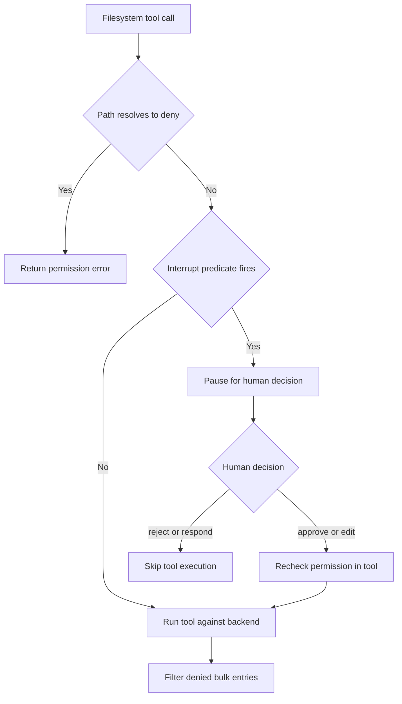
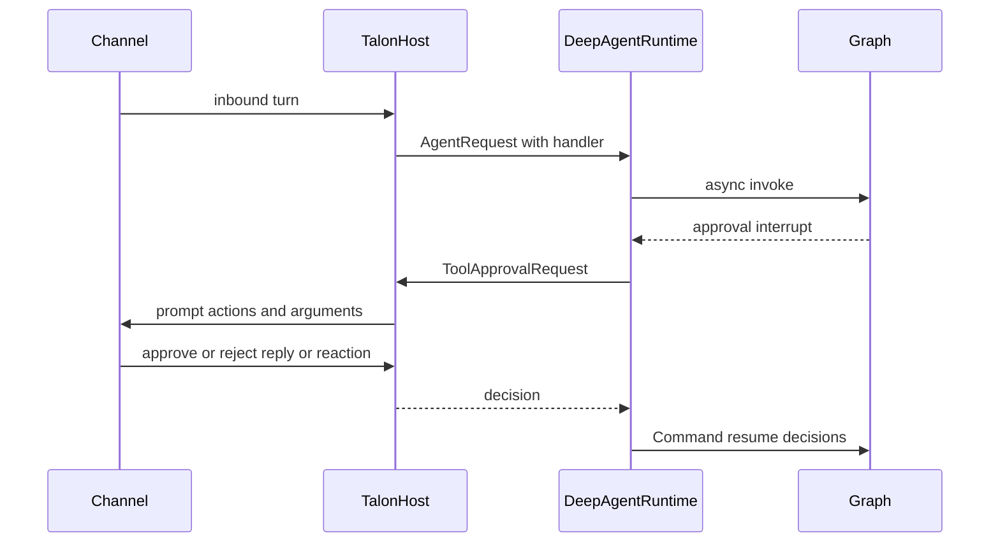

# Permissions and Human Approval

Permissions, approval prompts, and installed tool schemas are separate controls. A model may propose a visible tool call that is later rejected at execution; an interrupt may pause a call that filesystem policy otherwise permits; neither is a substitute for sandboxing. See [filesystem tools](/openwiki/concepts/tools-filesystem.md), [middleware stack](/openwiki/architecture/middleware-stack.md), [Talon](/openwiki/integrations/talon.md), and [security](/openwiki/operations/security.md).

## Boundaries and enforcement layers

Deep Agents follows a **trust-the-LLM** model: the agent can do what its installed tools allow. Enforce meaningful boundaries in the tool implementation, backend, or sandbox rather than expecting the model to self-police. Human-in-the-loop (HITL) is opt-in routing around configured calls, not a default security guarantee. The default `StateBackend` cannot expose shell execution; using `LocalShellBackend` is explicit opt-in.

| Question | Control | Enforcement location |
| --- | --- | --- |
| Can the model propose a call? | Installed tool schema | Agent construction |
| May a filesystem operation affect a path? | `FilesystemPermission` | Filesystem tool execution |
| Must a person decide before a configured tool proceeds? | `HumanInTheLoopMiddleware` and `interrupt_on` | Graph routing |
| Which Talon tool names require a prompt this request? | `ApprovalSnapshot.interrupt_on` | Talon's per-invocation graph |
| Who can change Talon's persisted approval policy? | `APPROVAL_OPERATOR` plus active invocation | `update_tool_approvals` |

A deny is enforcement rather than visibility: the model can receive the error from a denied call and adapt, but the effect is not performed. For bulk filesystem reads, denied entries are removed from results rather than hiding the tool schema.

## Filesystem policy

A `FilesystemPermission` has read and/or write `operations`, absolute glob `paths`, and one of three modes:

| Mode | Effect |
| --- | --- |
| `allow` | The matching operation proceeds; it is also the no-match default. |
| `deny` | The tool returns a permission-denied error without performing the operation. |
| `interrupt` | Graph assembly can pause a matching call for human approval. |

Construction rejects patterns that do not begin with `/`, contain a `..` path component after slash normalization, or contain `~` (unsupported). Normal resolution is ordered: rules without the requested operation are skipped and the first matching rule wins. Therefore place a narrow exception before a broad rule.

Filesystem tools check policy before using the backend. `FilesystemMiddleware` does not itself implement HITL; it enforces deny rules and filters results. Approval cannot override a deny: an approved or edited call re-enters the tool and receives the same pre-execution check; a `respond` decision does not execute it.

### Bulk operations and recursive deletion

`ls`, `glob`, and `grep` filter each returned path, file-info, or match whose read resolution is `deny`. Interrupt-mode entries stay in a result because their approval belongs before execution.

Deletion is deliberately more conservative. If a target may have descendants, any deny-write glob that could overlap the target or a descendant blocks the operation regardless of ordinary rule order. The backend is consulted to recognize a confirmed plain file; unavailable or ambiguous listing information is treated as potentially recursive. Only a confirmed leaf returns to ordinary first-match resolution. This keeps an earlier broad allow from bypassing a protected descendant while allowing demonstrably disjoint sibling file globs.

## From path rules to graph interrupts

`_build_interrupt_on_from_permissions` bridges interrupt-mode filesystem rules into the `interrupt_on` mapping for `HumanInTheLoopMiddleware`; it returns an empty mapping when no rule interrupts. It creates one `InterruptOnConfig` for each affected filesystem tool, with `approve`, `edit`, `reject`, and `respond` available and a per-call predicate.

`create_deep_agent` merges those derived configurations with caller-supplied `interrupt_on` for both the main agent and the default general-purpose subagent. The raw permissions remain separately attached to `FilesystemMiddleware`, while a single `HumanInTheLoopMiddleware` is appended to the main stack only when the merged mapping is non-empty.

- **Exact-path tools** (`read_file`, `write_file`, and `edit_file`) interrupt only when normal first-match resolution is `interrupt`; an earlier deny yields an error without an unnecessary prompt.
- **Bulk-scope tools** (`ls`, `glob`, `grep`, and `delete`) interrupt if their search subtree could intersect an interrupt rule. A missing path is conservatively gated; current-directory aliases that normalize to `/.` are collapsed to `/` so they cannot bypass the rule.
- `glob` additionally evaluates `pattern`, because an absolute pattern can search outside `path` and a relative pattern containing `..` cannot be safely localized.

Caption: Path policy is enforced by the tool; the graph supplies a separate approval pause before execution.

## dcode approval modes

dcode has three session policies: `manual` pauses every gated call, `auto` permits classifier-backed handling for eligible graphs, and `yolo` bypasses the approval gate. Invalid or non-string mode values become `manual`. Shift+Tab cycles Manual → Auto → YOLO → Manual when those entries are available; Auto is omitted when ineligible, YOLO is omitted when the switcher is disabled, and leaving YOLO returns to Manual.

The live mode is a per-thread record in the LangGraph Store namespace `("deepagents_code", "approval_mode")`. Its key is the SHA-256 hash of the thread ID rather than the raw ID. Missing stores, invalid keys, malformed records, and read errors resolve to `None`, which callers treat as Manual.

`_add_interrupt_on` gates side-effecting or external-access dcode tools, including `execute`, write/edit/delete, web tools, `task`, async-subagent controls, and non-read-only MCP tools. Its predicate honors a prior hook-granted permission; otherwise YOLO bypasses, Auto bypasses only when the graph is eligible, and Manual interrupts. `AsyncApprovalHITLMiddleware` rereads the mode asynchronously after model completion and passes stock HITL a transient `_RoutingDecision`; its private type identity means it is neither checkpointed nor forgeable through graph input. Synchronous use warns and falls back to Manual.

`AutoModeHITLMiddleware` is not an unrestricted allow path: deterministic policy and classifier review allow classifier-approved calls, turn policy denials or classifier unavailability into errors, and escalate `require_human` calls to HITL. In non-interactive dcode mode, `interrupt_shell_only=True` can instead install `ShellAllowListMiddleware` when a restrictive shell list is available; it rejects commands outside that list before execution and does not pause. Without such a list, standard HITL remains.

### Asking versus authorizing

`AskUserMiddleware` adds `ask_user`, through which the agent asks text, multiple-choice, or multi-select questions and calls LangGraph `interrupt()` during tool execution. This is not approval of a different tool. Resume parsing rejects mismatched answer counts, represents cancellation with successful cancelled answers, and turns malformed payloads into explicit errors.

An `AskUserAuthorizationReceipt` is attached only to genuinely answered bounded string answers with trusted thread and turn identity; it is withheld for coercion, cancellation, and errors. Auto mode requires this receipt when an answer is authorization. Middleware that catches tool exceptions must re-raise `GraphBubbleUp`, or it would swallow the `GraphInterrupt`.

## Talon: snapshot policy, channel decisions, and recovery

Talon persists an exact-name boolean policy in `tools.json` through `ToolApprovalStore`. A true name becomes an approve/reject `interrupt_on` entry; omitted and false names do not prompt. The store validates bounded, literal tool names and booleans, reads without following symlinks, derives a revision from file bytes, and applies updates with a lock and compare-and-swap revision. Invalid stored policy is not overwritten.

At startup, `DeepAgentRuntime` loads a snapshot and creates the graph from it. Each `invoke` reads the store under the tool lock and rebuilds the graph if the snapshot changed, then places that snapshot in `ACTIVE_APPROVALS` for the request. Consequently, an already running invocation retains its graph and policy; a saved change applies to a later invocation. The policy tools make this visible as active versus persisted revisions. `update_tool_approvals` additionally requires both an active invocation and the request-scoped `APPROVAL_OPERATOR` flag—disabling a prompt does not grant policy-edit authority.

When the graph returns `__interrupt__`, the runtime obtains a decision per interrupt, creates LangGraph `Command(resume=...)` payloads for its pending action requests, and repeats for at most `DEFAULT_MAX_APPROVAL_ROUNDS` (50). Missing IDs are skipped, but a batch with no resumable ID fails rather than being implicitly resumed. Cron and background-delivery requests, or a request with no approval handler, produce reject decisions rather than waiting for a person.

`TalonHost` creates the approval handler for attended channel turns. It retains a pending future per agent conversation, prompts with the requested tool names and argument preview, and accepts an approval or rejection reply only from the sender who initiated the run when that identity is known. Reactions must additionally match the channel provider, conversation, and precise approval-prompt message. Invalid text re-prompts; mismatches are ignored and logged.

Caption: Talon takes a graph interrupt to the originating channel and resumes only after a validated decision.

Cancellation has a separate recovery path. The host cancels the active task, increments its generation to invalidate stale delivery, and—when cancellation completed within its deadline—asks the runtime to recover the interrupted conversation. `DeepAgentRuntime.recover_interrupted` reads the latest checkpoint, applies `PatchToolCallsMiddleware` repair, and appends a system interruption marker. A timeout blocks the conversation instead; a failed repair yields degraded cancellation, preventing the host from claiming full recovery.

## Operational guidance and focused tests

- Use literal-leading interrupt anchors such as `/secrets/**`; a leading wildcard anchors bulk overlap at `/` and can prompt nearly every bulk call.
- Test direct paths and bulk roots, omitted paths, `.`, absolute glob patterns, `..` in a relative glob pattern, directory deletion, and confirmed leaf deletion.
- Treat `interrupt_on` as approval routing, not as a filesystem deny rule or sandbox boundary.
- For Talon, preserve `tools.json` integrity and revision handling, expect saved policy changes to apply next invocation, and ensure a channel supplies stable provider, sender, conversation, and message identities for reaction approval.

Focused coverage includes `libs/deepagents/tests/unit_tests/test_permissions.py`, `libs/code/tests/unit_tests/test_approval_mode.py`, and Talon's `test_tool_approvals.py`, `test_tool_approval_runtime.py`, and `test_tool_approval_authorization.py`.
