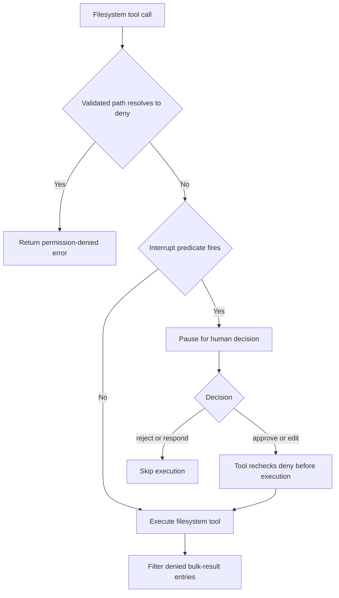

# Permissions & Human Approval

This page distinguishes three related but different controls:

- **Tool visibility** determines which tool schemas the model can call. It is not authorization.
- **Filesystem permissions** enforce `allow`, `deny`, or `interrupt` for paths when filesystem tools run.
- **Human-in-the-loop (HITL) interrupts** pause a configured call for a decision; `ask_user` is instead a tool the agent uses to ask questions.

See [filesystem tools](/openwiki/concepts/tools-filesystem.md) for the tool interface, [backends](/openwiki/concepts/backends.md) for where operations execute, [middleware stack](/openwiki/architecture/middleware-stack.md) for composition, and [security](/openwiki/operations/security.md) for operational boundaries.

## Security boundary and visibility

Deep Agents follows a “trust the LLM” model: an agent can do what its available tools allow. Deployers must enforce boundaries at the tool or sandbox layer, rather than rely on a model to self-police. In particular, HITL is opt-in; it is not a default safety guarantee. The default `StateBackend` has no shell execution capability, whereas `LocalShellBackend` is an explicit, powerful opt-in.

A permission rule is **enforcement, not schema hiding**. A filesystem tool can remain available to the model even if a particular invocation is denied. The tool then returns a permission-denied error instead of doing the operation, and the model can react to that error. This does not mean protected paths are generally disclosed: bulk read results are filtered to remove entries denied by their individual paths.

## `FilesystemPermission` rules

`FilesystemPermission` has `operations` (`read` and/or `write`), absolute glob `paths`, and a `mode`:

| Mode | Meaning |
| --- | --- |
| `allow` | Default; the matching operation proceeds. |
| `deny` | The tool returns a permission-denied error and does not perform the operation. |
| `interrupt` | Graph assembly configures HITL so a matching call pauses for a human decision. |

Patterns must start with `/`; patterns containing a `..` component are rejected, including after normalizing backslashes; and `~` is rejected as unsupported. Rule resolution is ordered and first-match-wins: rules for another operation are skipped, and no match defaults to `allow`. Put more specific exceptions before broad rules when using normal read/write resolution.

Filesystem tools validate a path, check permission before calling the backend, and turn `deny` into an error. This is separate from interruption: `FilesystemMiddleware` itself enforces denials and result filtering; it does not pause a graph.

### Bulk reads and recursive delete

`ls`, `glob`, and `grep` may return many paths. Their result helpers remove entries whose individual read permission resolves to `deny`; interrupt-mode entries remain because approval, if required, occurred before tool execution. A direct call whose root itself is denied returns an error rather than a partial operation.

`delete` is deliberately stricter. If the target may be a directory, any deny-write glob that could match the target or a descendant blocks deletion regardless of rule order. An earlier broad `allow` cannot safely override a later protected descendant. Only after the backend confirms a plain leaf file does deletion use first-match resolution. Wildcard overlap logic preserves safe sibling cases such as a denied `/work/*.log` while deleting `/work/notes.txt`, but fails closed where a match might be affected.

## Permission-derived HITL

`_build_interrupt_on_from_permissions` bridges interrupt-mode filesystem rules into the `interrupt_on` mapping consumed by `HumanInTheLoopMiddleware`. If there are no interrupt rules it returns `{}`. Otherwise it creates a configuration for each relevant filesystem tool with `approve`, `edit`, `reject`, and `respond` available, and a per-call `when` predicate.

`create_deep_agent` merges this mapping with caller-provided `interrupt_on` for the main agent and its general-purpose subagent. It installs one `HumanInTheLoopMiddleware` when the merged mapping is non-empty, while passing the original permission list separately to `FilesystemMiddleware`. Thus an interrupt prompt is not the filesystem authorization implementation; the filesystem tool still owns its deny check.

### Scope-aware predicates

Exact-path tools—`read_file`, `write_file`, and `edit_file`—interrupt only if the validated path resolves to `interrupt` under normal first-match rules. Consequently, an earlier matching `deny` prevents a prompt and the tool returns denial.

Bulk tools—`ls`, `glob`, `grep`, and `delete`—can affect a subtree, so they interrupt whenever the search root can overlap an interrupt-rule anchor. Missing bulk paths interrupt conservatively. Current-directory aliases normalized to `/.` are treated as `/`, preventing `path="."` from bypassing a protected subtree. `glob` additionally examines its `pattern`: absolute patterns can ignore the supplied search path, and relative patterns containing `..` are conservatively gated.

Caption: Verified filesystem flow: tool-level denial and graph-level interruption are separate gates.

Approval or edit does not override a denial: the resumed call re-enters the tool and repeats its pre-execution check. `respond` returns a human response without executing the tool.

## dcode approval modes

Dcode applies a session-level policy to its gated tools. `ApprovalMode` defines:

- **`manual`**: gated calls require human approval.
- **`auto`**: the Auto middleware applies deterministic policy and classifier review. It can resume classifier-allowed calls, explicitly deny policy or unavailable-classifier cases, and send calls requiring human review to HITL. A graph without eligible Auto support treats a live Auto mode as Manual for the stock interrupt predicate.
- **`yolo`**: gated calls bypass approval, except controls such as hook denials that route separately.

Invalid mode values coerce to `manual`. Shift+Tab cycles Manual → Auto → YOLO → Manual when both optional modes are available; Auto is omitted when ineligible, YOLO is omitted when `startup.yolo_switcher` is disabled, and leaving YOLO always returns to Manual. YOLO requires explicit acknowledgement to enter; disabling the switcher removes it from the cycle but still allows Shift+Tab to exit a session launched in YOLO.

The live mode is stored per thread in the LangGraph Store namespace `("deepagents_code", "approval_mode")`. `approval_mode_key` uses SHA-256 of the thread id rather than placing the raw id in the store key. Missing stores, invalid keys, malformed records, and read failures yield `None`, which callers interpret as Manual. Typed Auto and YOLO context values require a valid live-store key; this prevents an untrusted context snapshot from activating autonomous mode.

### Dcode gated tools and routing

`_add_interrupt_on` registers `execute`, filesystem mutation tools, web tools, `task`, async-subagent controls, and non-read-only MCP tools. Dcode’s configurations expose `approve` and `reject` decisions. Their shared predicate first respects an explicit pre-tool hook decision, then resolves the current mode. YOLO does not interrupt; Auto bypasses the stock prompt only where its classifier-capable graph is eligible; otherwise the call interrupts.

`AsyncApprovalHITLMiddleware` reads the live mode asynchronously after the model response, then supplies a transient `_RoutingDecision` to stock HITL routing. The marker is a private in-process type in a shallow routing-state copy, not checkpointed data, so serialized graph input cannot forge it. A synchronous invocation warns and falls back to Manual behavior.

Auto is not merely a visibility toggle or a blanket “safe tool” list. `AutoModeHITLMiddleware` performs deterministic policy and classifier review over proposed calls; only classifier-allowed calls resume automatically, policy-denied or classifier-unavailable calls receive error messages, and `require_human` calls are escalated.

Patch-Tool-Calls host-bridge calls are outside `interrupt_on` and HITL. Dcode therefore constrains them with a separate budget rather than representing them as per-call human approvals.

## `ask_user` is a separate interruption

`AskUserMiddleware` adds an `ask_user` tool so the agent can ask text, multiple-choice, or multi-select questions during execution. The tool calls LangGraph `interrupt()` from within tool execution and resumes by converting the reply into a `ToolMessage`; it is not a permission prompt for another tool.

`_parse_answers` makes resume semantics explicit. A mismatched answer count is an error, not padding or truncation; cancellation creates `(cancelled)` answers and remains a successful user choice; malformed responses create explicit error answers and an error status. Non-string answers are shown after coercion but do not gain authorization trust.

A valid answered exchange can carry an `AskUserAuthorizationReceipt`, bound to trusted thread, turn, and tool-call identity and bounded string answers. It is withheld for cancellations, errors, coercions, mismatched counts, or untrusted identity. Auto mode uses this receipt rather than treating arbitrary answer text as authorization. Because `interrupt()` raises `GraphInterrupt` inside the tool-call middleware chain, exception-handling middleware must re-raise `GraphBubbleUp` rather than swallow the interruption.

## Operating and testing the controls

When configuring filesystem policy, use absolute, literal-leading anchors such as `/secrets/**`; leading-wildcard patterns collapse to a root anchor for bulk interruption and can prompt far more often than intended. Test both the direct target and bulk roots, especially `.`/missing paths and `glob` patterns that are absolute or contain `..`. Test recursive delete separately from leaf-file deletion because its fail-closed overlap rule is intentionally different.

Relevant focused tests include `libs/deepagents/tests/unit_tests/test_permissions.py` for rule validation, precedence, bulk bypass cases, and delete overlap; `libs/code/tests/unit_tests/test_approval_mode.py` for Store fail-closed behavior; `libs/code/tests/unit_tests/test_agent.py` for live-mode and routing-marker behavior; and `libs/code/tests/unit_tests/test_ask_user_middleware.py` for resume and receipt semantics.
