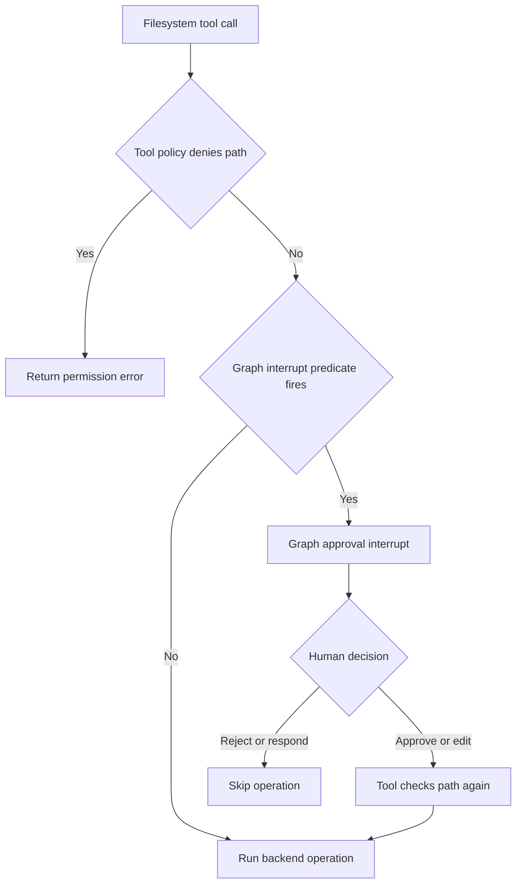
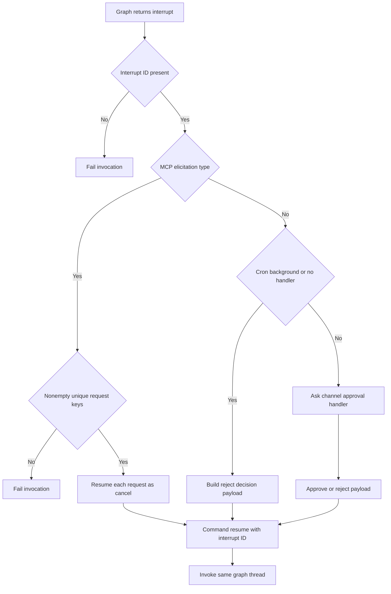

# Permissions and Human Approval

Permissions, approval prompts, and tool availability are separate controls. A tool can be visible to the model yet reject a particular call at execution time; an interrupt can pause an otherwise permitted call; and an approval is not a sandbox boundary. See [filesystem tools](/openwiki/concepts/tools-filesystem.md), [MCP integration](/openwiki/integrations/mcp.md), [Talon](/openwiki/integrations/talon.md), [security](/openwiki/operations/security.md), and the [testing guide](/openwiki/testing/testing-guide.md).

## Control boundaries

Deep Agents follows a **trust-the-LLM** model: the agent can do what its installed tools permit. Put containment in a tool implementation, backend, or sandbox, not in model instructions. HITL is opt-in and only covers calls selected for interruption. `StateBackend` does not execute shell commands; choosing `LocalShellBackend` is an explicit higher-power opt-in.

| Question | Control | Boundary / enforcement point |
| --- | --- | --- |
| Can the model propose a call? | Installed tool schemas | Agent construction |
| May an operation affect a filesystem path? | `FilesystemPermission` | Filesystem middleware and tool implementation before backend execution |
| Must a person decide before a selected call proceeds? | `HumanInTheLoopMiddleware` / `interrupt_on` | Graph routing and LangGraph interrupt/resume |
| Is an MCP tool requesting structured input? | MCP elicitation interrupt | MCP adapter and runtime's elicitation-specific resume path |
| May an MCP OAuth flow talk to an operator? | Authorization context and callback | Host-mediated authorization outside model context |
| How is a Talon approval decision obtained? | `ToolApprovalHandler` | Origin channel host and runtime |

An approval does not grant a general permission. In particular, a resumed or edited filesystem call enters the tool again and remains subject to tool-level denial checks. Conversely, a policy with no graph gate does not make a tool safe: it simply means the graph will not pause before that call.

## Filesystem permissions and derived HITL

A `FilesystemPermission` has read and/or write `operations`, absolute glob `paths`, and a `mode`. Patterns are validated as absolute; resolution is ordered and first-match-wins, with `allow` as the default. A `deny` is enforced before backend execution. Bulk reads filter denied entries, while recursive or potentially recursive deletion uses conservative subtree-overlap handling so a protected descendant cannot be bypassed by an earlier broad allow.

`interrupt` is deliberately separate from `deny`. At graph construction, filesystem interrupt rules are converted into `HumanInTheLoopMiddleware` routing. Exact-path tools use normal first-match interrupt resolution. Bulk tools conservatively interrupt for intersecting subtrees and for inputs which cannot safely be localized, including omitted paths, current-directory forms, absolute globs, and parent traversal. The eventual approved or edited call is still executed through the filesystem tool and its denial enforcement.

Caption: Filesystem denial is tool enforcement, while filesystem `interrupt` is pre-execution graph routing.

## dcode: approval mode is not containment

In dcode, approval mode is per thread and fails closed to Manual. Its HITL predicate routes side-effecting tools through that mode, while `AutoModeHITLMiddleware` combines deterministic policy, classifier review, denial errors, and escalation to a human. `ask_user` is a different interaction: it pauses during its own tool execution to collect an answer, validates resumed answers before attaching an authorization receipt, and must allow `GraphBubbleUp` through exception-catching middleware so the graph interrupt is not swallowed.

## Talon approval policy and graph HITL

Talon's `ToolApprovalStore` is a persisted exact-tool-name boolean policy, not an authorization credential. It validates and stores a bounded JSON file that must be regular and non-symlinked. Enabled names become approve/reject graph interrupt configuration; disabled or absent names do not. Updates use a locked revision compare-and-swap operation. The runtime captures a snapshot for each invocation, so a successful save is available to a later invocation rather than changing the policy that authorizes the in-flight graph.

Changing approval policy is itself protected: Talon requires active invocation context and trusted operator context. This is distinct from its external authorization callback. The host accepts channel approval replies only from the sender who initiated a run when known; a reaction must also match the provider, conversation, approval-prompt message, and sender.

### Resuming the right kind of interrupt

`DeepAgentRuntime` invokes the graph and examines `__interrupt__` values. An interrupt ID is required to resume. It builds an explicit LangGraph `Command(resume=...)`, invokes again with the same conversation thread, and limits the loop to `DEFAULT_MAX_APPROVAL_ROUNDS` (50). An ID-less interrupt or a batch with no resumable IDs is an error, not implicit approval.

Not every graph interrupt is a tool approval. A normal HITL interrupt contains action requests and reaches `_approval_decision`: cron, background delivery, or a request without an approval handler is rejected; otherwise the handler receives the conversation ID, interrupt ID, and action requests and returns approve or reject.

An MCP elicitation interrupt is a separate protocol interaction. Talon recognizes its MCP interrupt type before attempting approval handling, validates that it has a nonempty list of uniquely keyed requests, and resumes each request with `{ "action": "cancel" }`. Therefore it **does not call** `ToolApprovalHandler`, does not display an approve/reject prompt, and lets the MCP server continue with cancelled input until Talon has an elicitation UI. A malformed elicitation interrupt fails rather than being mistaken for an approval.

Caption: Talon separates MCP input elicitation from graph tool approval before constructing an explicit resume command.

## MCP tool calls, elicitation, and OAuth are distinct

Talon marks loaded MCP tools with `_deepagents_talon_mcp`. `talon_mcp_middleware` only wraps those marked calls: it normalizes arguments by omitting empty strings only for optional string-like fields, then runs the tool under an authorization context bound to the exact tool-call ID. The context is reset after the call. An `MCPError` becomes a model-visible error `ToolMessage` containing code and message rather than server-provided error data; unrelated failures propagate.

This authorization context supports an MCP OAuth flow; it is not a graph approval decision and it is not model context. During an authorized MCP operation, the channel OAuth handler requires a live authorization handler, the current tool-call ID, and an authorization attempt. It creates a binding with server name, invocation ID, and expiry; authorization URLs, device instructions, callback requests, and completion/failure notices are delivered through the host callback. The callback URL is parsed only if its scheme, authority, and path match the configured redirect endpoint and it includes `code` and `state`.

The proactive `authenticate_mcp_server` capability uses the same authorization mechanism. It is exposed only for configured OAuth servers, restricts its argument to those servers, and schedules a tool refresh after successful authorization. Authorization, config reload, and policy updates affect a subsequent graph/tool snapshot; they do not mutate capabilities within a running invocation.

## Channel-mediated decision lifecycle

For an attended channel turn, `TalonHost` supplies an approval callback in `AgentRequest`. It records a pending future by agent conversation, sends the action information, and resolves that future from an accepted text reply or reaction. That decision returns to the runtime, which constructs the graph's decision payload; the channel does not directly execute or authorize the underlying tool.

For OAuth, the host likewise mediates messages but maintains a different pending authorization flow. Treating approval replies, elicitation input, and OAuth callbacks as interchangeable would cross security boundaries: they have different payloads, validation, state owners, and resume effects.

## Operations and focused tests

- Treat `interrupt_on` and `tools.json` as selective graph-pausing policy, not sandboxing or tool-level authorization. Keep meaningful deny checks and backend containment in the tool/backend layer.
- Expect gated Talon calls from cron, background delivery, or handler-less requests to be rejected. Ensure an interactive channel supplies stable sender, conversation, provider, and prompt-message identity if reactions are enabled.
- Do not route MCP elicitation to approval UI. Today Talon cancels valid elicitation requests; malformed request lists or duplicate/missing keys are failures.
- Keep MCP authorization handlers out of model context. A missing callback handler or binding makes channel authorization unavailable rather than granting access.
- Test the boundaries: Talon's approval-runtime tests cover policy snapshot isolation and auto-denial; `test_mcp_adapter.py` exercises real adapter invocation and cancellation/resume of elicitation; `test_mcp_middleware.py` covers marked-tool scoping, normalization, context cleanup, and protocol-error redaction; and `test_mcp_callbacks.py` verifies callback issuer preservation.
