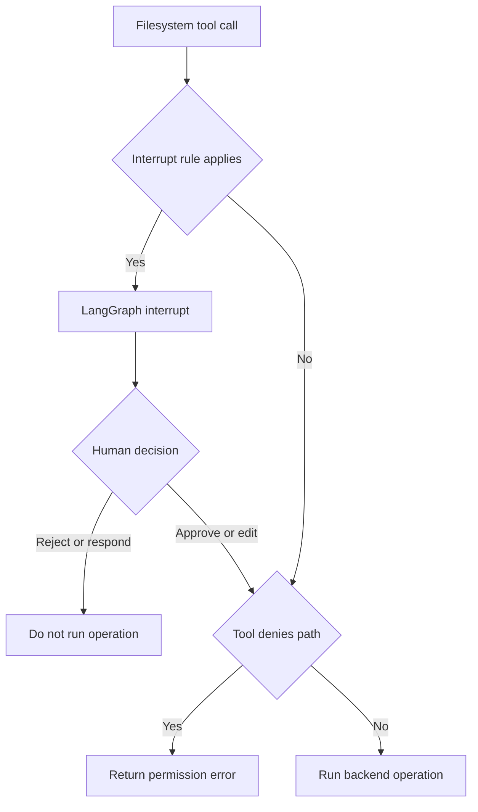
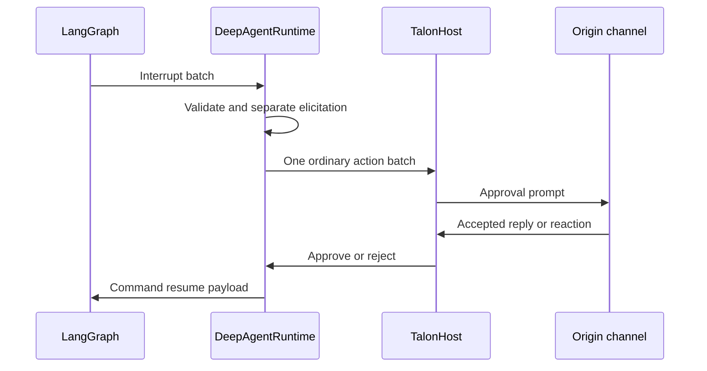

# Permissions, Approval, and HITL

Tool exposure, a tool-level permission check, a graph interrupt, a human decision, and runtime containment answer different questions. A tool may be visible yet deny a particular call; a permitted call may pause; and approving a call is neither a sandbox nor a durable authorization grant. See [filesystem tools](/openwiki/concepts/tools-filesystem.md), [runtime behavior](/openwiki/architecture/runtime-behavior.md), [channel admission](/openwiki/concepts/talon-channel-admission.md), [ACP](/openwiki/integrations/acp.md), and [security](/openwiki/operations/security.md).

> **Talon is experimental.** It is alpha-status, may change or be removed, and is not intended for production or enterprise use. Talon does **not** provide complete production-grade HITL policy, channel-administrator controls, or tenant isolation. Channel approval prompts are an experimental convenience, not a complete security boundary; channel access should be treated as direct access to the operator's agent, credentials, MCP tools, and local host resources. Its opt-in sandbox does not cover MCP tools.

## Choose the right control

| Need | Mechanism | It does not provide |
| --- | --- | --- |
| Restrict a filesystem operation | `FilesystemPermission` | A human prompt or OS isolation |
| Pause a selected SDK tool call | `HumanInTheLoopMiddleware` and `interrupt_on` | A deny rule or durable authorization |
| Select interaction behavior for an ACP session | `SessionMode` interpreted by the agent | A standardized authorization or sandbox policy |
| Require Talon review for a named tool | `tools.json` / `ToolApprovalStore` | A wildcard policy, availability grant, or sandbox |
| Permit a Talon policy edit | `APPROVAL_OPERATOR` and `ACTIVE_APPROVALS` | Permission to execute arbitrary tools |
| Obtain a Talon decision | `ToolApprovalHandler` through the origin channel | Execution by the channel or a general identity grant |

Deep Agents follows a **trust-the-LLM** model: containment belongs in installed tool implementations, backends, or a sandbox—not in prompts or a review dialog. HITL is opt-in and covers only selected calls. `StateBackend` does not execute shell commands; choosing `LocalShellBackend` is an explicit higher-power opt-in.

## Three distinct ways to configure an interrupt

### SDK policy: filesystem enforcement and graph routing

`FilesystemPermission` rules have read and/or write operations, absolute glob paths, and an `allow`, `deny`, or `interrupt` mode. Patterns must be absolute, cannot contain `..`, and do not support `~`. Rules are evaluated in declaration order: the first matching rule decides, and unmatched access is allowed. A deny is enforced before backend execution; bulk reads filter denied results. Potentially recursive deletes use conservative overlap checks so an earlier broad allow cannot expose a protected descendant.

`interrupt` is separate from `deny`. Graph construction converts interrupt-mode filesystem rules into `HumanInTheLoopMiddleware` routing. Exact-path tools use ordinary first-match resolution. Bulk tools pause when their search scope may intersect an interrupt rule; routing deliberately treats omitted paths, current-directory aliases, absolute `glob` patterns, and relative patterns containing parent traversal conservatively. Filesystem-derived interrupts allow `approve`, `edit`, `reject`, and `respond`. An approved or edited call still enters the filesystem tool and its deny enforcement.

```mermaid
flowchart TD
    Call["Filesystem tool call"] --> Gate{"Interrupt rule applies"}
    Gate -->|Yes| Pause["LangGraph interrupt"]
    Pause --> Decision{"Human decision"}
    Decision -->|Reject or respond| Stop["Do not run operation"]
    Decision -->|Approve or edit| Check
    Gate -->|No| Check{"Tool denies path"}
    Check -->|Yes| Denied["Return permission error"]
    Check -->|No| Run["Run backend operation"]
```

Caption: Interrupt routing pauses before execution, while the filesystem tool remains the denial enforcement point.

### ACP session mode: application-selected UX policy

ACP's `SessionMode` is a session-facing choice, not a shared authorization model. In the demo agent, the `AgentSessionContext.mode` selects an `interrupt_on` map while building the graph: `ask_before_edits` gates edits, writes, plans, and `execute`; `accept_edits` gates only plans and `execute`; and `accept_everything` supplies no interrupts. The advertised mode names and descriptions communicate that behavior to the ACP client. An ACP integration can define different modes and mappings, so neither a mode ID nor a client selection itself proves authorization, containment, or identity.

### dcode: live, thread-scoped approval behavior

dcode stores an `ApprovalMode` per LangGraph thread: `manual`, `auto`, or `yolo`. Missing, malformed, unavailable, or untrusted typed-mode context resolves to Manual. `AsyncApprovalHITLMiddleware` rereads the mode after model completion and uses a private in-process routing marker, so checkpointed graph state cannot forge an autonomous approval decision. `yolo` bypasses gated interruptions; `auto` does so only in eligible classifier-backed graphs. `AutoModeHITLMiddleware` combines the interrupt map with deterministic policy, classifier review, denial errors, and escalation to human review; its worktree boundary and optional narrow shell allowlist do not replace backend containment.

`ask_user` is a different interrupt: it pauses from its own tool execution to obtain an answer, validates the resumed answer before attaching an authorization receipt, and depends on exception-catching middleware preserving `GraphBubbleUp`. Swallowing that exception also swallows the graph interrupt.

## Talon: exact-name routing policy, not an ACL

Talon keeps an assistant-local `tools.json` mapping of **exact tool names** to booleans. An enabled entry produces approve/reject `interrupt_on` configuration; an absent or `false` entry produces no prompt. Names are not patterns. On first creation, defaults enable `update_tool_approvals`, `delete_conversations`, `update_mcp_server`, `start_async_task`, and `send_message`; a valid existing policy is retained unchanged.

This is graph routing, not an availability or authorization ACL. Disabling a prompt does not make a tool available, authorize its use, or provide OS/sandbox containment. In particular, `update_tool_approvals` checks operator authority and invocation context even if its own approval prompt is disabled.

`ToolApprovalStore` accepts a bounded regular non-symlink JSON file, rejects malformed and duplicate entries, and freezes validated contents in an `ApprovalSnapshot`. Its revision is SHA-256 over persisted bytes. Updates validate the whole batch, lock the path, compare the expected revision, merge only on a match, and atomically replace the file. Conflicts and storage failures report errors rather than overwriting policy. The read tool distinguishes persisted from active revisions and reports inactive saved changes; a successful update reports `next_invocation` availability.

At invocation start, `DeepAgentRuntime` reads the snapshot under its tools lock, rebuilds the graph if it differs from the active snapshot, and binds graph and snapshot in context variables. An in-flight graph and its policy-management closures therefore retain their starting snapshot. Saved changes apply on a subsequent invocation; an invalid saved policy prevents that next invocation rather than silently reusing an older policy.

### Policy self-edit has two gates

1. The **pre-edit** snapshot controls whether `update_tool_approvals` itself interrupts. Disabling that name cannot remove the interruption installed in the running graph.
2. The update tool requires both `APPROVAL_OPERATOR` and `ACTIVE_APPROVALS`; it returns an authorization error without either.

The host derives `APPROVAL_OPERATOR` from trusted channel `ChannelExposure`, not inbound route or message metadata. A message needs an identified sender and either a configured operator ID or, for `self` exposure, a host-recognized `from_self` message. The runtime clears this authority for cron and background delivery. Prompt approval and operator authority are independent: the former resolves a routed action batch; the latter protects policy administration.

## From graph interrupt to channel decision

When the graph interrupts, Talon requires every item to have a unique nonempty resumable ID. It handles MCP elicitation separately by placing a cancellation response for every valid elicitation in the resume payload. Ordinary interrupts must have a nonempty sequence of action-request mappings. Talon flattens ordinary actions into one `ToolApprovalRequest`, identified by the first ordinary interrupt ID, asks its `ToolApprovalHandler` for one `approve` or `reject`, then fans that outcome out into explicit decisions and resumes the graph with one `Command(resume=...)`. Invalid IDs/actions fail before calling a handler, and the 50-round limit fails rather than implicitly resuming.

```mermaid
sequenceDiagram
    participant Graph as LangGraph
    participant Runtime as DeepAgentRuntime
    participant Host as TalonHost
    participant Origin as Origin channel
    Graph->>Runtime: Interrupt batch
    Runtime->>Runtime: Validate and separate elicitation
    Runtime->>Host: One ordinary action batch
    Host->>Origin: Approval prompt
    Origin->>Host: Accepted reply or reaction
    Host->>Runtime: Approve or reject
    Runtime->>Graph: Command resume payload
```

Caption: Talon aggregates ordinary actions into one channel decision while cancelling valid MCP elicitation separately.

The host owns the pending decision, not the graph: it keeps one pending future per agent conversation, prompts through the originating channel, and removes the entry when the future resolves. When the originating sender is known, another sender's text reply cannot resolve it. A reaction also must match provider, conversation, prompt message, and sender. The channel conveys a decision; it neither runs the tool nor grants general authorization.

## Unattended and delegated work fails closed

Protected ordinary actions are rejected for cron, background-result delivery, or a request without an approval handler. The runtime applies this even when a caller injects a handler. The host withholds both approval and OAuth authorization handlers for background-result delivery, and scheduled runs likewise have no interactive handlers. These paths do not wait for a person who is absent.

Detached background subagents clear operator and authorization context. If one reaches a protected action, its result reports that the action did not run. Cron-only inline delegation runs within its already-unattended scheduled caller, disallows nested delegation, and cannot inherit interactive approval or authorization. This fail-closed behavior applies only to calls actually routed through the approval mechanism; it is not a claim that every possible tool or integration is protected.

## Operating and testing safely

- Treat channel exposure, tool availability, filesystem denial, graph interruption, channel decision, operator authority, and backend/sandbox isolation as separate layers.
- For ACP, document the concrete `SessionMode`-to-`interrupt_on` mapping supplied by that agent. Do not describe an ACP mode as a security grant.
- Use exact names in Talon's `tools.json`. Persisted edits need a new invocation; use the revision from `get_tool_approvals` when updating.
- Preserve the invocation snapshot and active-snapshot/operator checks when changing policy-management tools. Do not trust request metadata as proof of operator identity.
- Build a Talon approval UI around one ordinary-action batch decision and validate interrupts before calling an external handler. Keep MCP elicitation out of that UI.
- Test policy validation, defaults, CAS conflicts, and active-versus-saved snapshots in `test_tool_approvals.py`; test batch fan-out and unattended rejection in the tool-approval runtime and batch tests; test trusted sender/reaction matching and channel-derived authority in host authorization tests; and test unattended delivery wiring in `test_host.py`.
