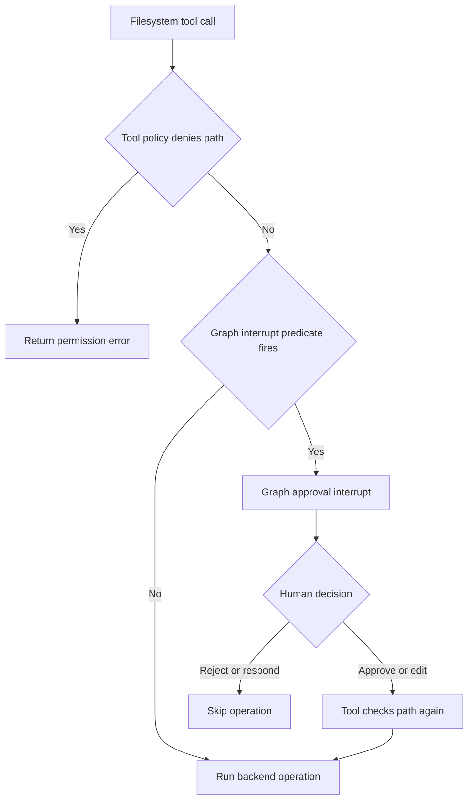
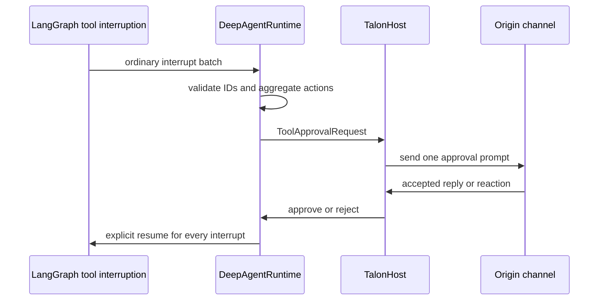

# Permissions and Human Approval

Permissions, approval prompts, and tool availability are separate controls. A model may see a tool but have a particular invocation rejected at execution; a graph interrupt may pause an otherwise permitted invocation; and an approval is not a sandbox boundary. See [filesystem tools](/openwiki/concepts/tools-filesystem.md), [security](/openwiki/operations/security.md), [runtime behavior](/openwiki/architecture/runtime-behavior.md), and [running a dcode session](/openwiki/workflows/run-dcode-session.md).

## Security boundaries

Deep Agents follows a **trust-the-LLM** model: an agent can do what its installed tools allow. Put containment in tool implementations, a backend, or a sandbox—not in model instructions or an approval prompt. HITL is opt-in and only covers calls selected for interruption. `StateBackend` does not execute shell commands; selecting `LocalShellBackend` is an explicit higher-power opt-in.

| Question | Control | Enforcement boundary |
| --- | --- | --- |
| Can the model propose a call? | Installed tool schemas | Agent construction and tool exposure |
| May a filesystem operation affect a path? | `FilesystemPermission` | Filesystem middleware/tool before backend execution |
| Must a person decide before a selected call proceeds? | `HumanInTheLoopMiddleware` / `interrupt_on` | Graph routing and LangGraph interrupt/resume |
| Is an MCP tool asking for structured input? | MCP elicitation interrupt | MCP adapter and Talon's elicitation cancellation path |
| May an MCP OAuth flow communicate with an operator? | Authorization context and callback | Host-mediated authorization outside model context |
| How is a Talon approval decision obtained? | `ToolApprovalHandler` | Origin channel host and runtime |

An approval is not a general permission grant. An approved or edited filesystem call re-enters the tool and is still subject to its denial checks. Conversely, a policy with no graph gate does not make a tool safe; it only means the graph does not pause before that call.

## Filesystem policy and derived HITL

A `FilesystemPermission` has read and/or write `operations`, absolute glob `paths`, and a `mode`. Patterns must be absolute, may not contain `..`, and do not support `~`. Resolution is ordered and first-match-wins, with `allow` as the default; `deny` is enforced before backend execution. Bulk reads filter denied entries. Recursive or potentially recursive deletion uses conservative subtree-overlap handling, so a protected descendant cannot be bypassed by an earlier broad allow.

`interrupt` is intentionally distinct from `deny`. During graph construction, filesystem interrupt rules become `HumanInTheLoopMiddleware` routing. Exact-path tools use normal first-match interrupt resolution. Bulk tools interrupt conservatively when their search subtree intersects an interrupt rule and when scope cannot safely be localized—for example omitted paths, current-directory forms, absolute glob patterns, or parent traversal. The approved or edited call still runs through the filesystem tool and its deny enforcement.

```mermaid
flowchart TD
    Call["Filesystem tool call"] --> DenyCheck{"Tool policy denies path"}
    DenyCheck -->|Yes| Denied["Return permission error"]
    DenyCheck -->|No| Gate{"Graph interrupt predicate fires"}
    Gate -->|No| Run["Run backend operation"]
    Gate -->|Yes| Pause["Graph approval interrupt"]
    Pause --> Decision{"Human decision"}
    Decision -->|Approve or edit| Recheck["Tool checks path again"]
    Decision -->|Reject or respond| Skip["Skip operation"]
    Recheck --> Run
```

Caption: Filesystem denial is tool enforcement, while filesystem `interrupt` is pre-execution graph routing.

## Talon approval policy, authority, and containment

Talon keeps one assistant-local `tools.json` policy. It is a flat JSON mapping of **exact tool names** to booleans: `true` adds an approve/reject graph interruption, while an absent or `false` entry adds no prompt. The default policy covers `update_tool_approvals`, `delete_conversations`, `update_mcp_server`, and `start_async_task`. This is approval-routing policy—not an access-control list: a `false` entry is not an authorization grant, does not make a tool available, and does not provide sandbox or OS containment.

`ToolApprovalStore` validates a bounded regular, non-symlink JSON file and freezes each read as an `ApprovalSnapshot`. Updates merge a validated batch under a path lock and use the persisted byte revision as compare-and-swap input. `get_tool_approvals` reports both saved and active revisions; a successful update says it is available on the next invocation. The runtime reads a fresh snapshot before an invocation, rebuilds its graph if needed, and binds that snapshot to the invocation. Consequently, a policy edit cannot alter the graph or read/update tool closures already in flight; an invalid policy or failed replacement blocks the next invocation rather than silently retaining an older policy.

Policy edits have two independent gates:

1. The **pre-edit snapshot** routes `update_tool_approvals` through HITL when that exact name was enabled. Disabling that entry cannot make the same in-flight self-edit skip its already-built interruption.
2. The tool itself also requires `APPROVAL_OPERATOR` and an active snapshot. Thus a disabled prompt still does not authorize an edit.

The host, not inbound metadata, establishes that operator context. It derives identity from the channel's trusted `ChannelExposure`: an identified configured operator qualifies, and `self` exposure may qualify a self-authored message. Allowlisted conversations, mention matching, open exposure, and fields supplied in message or route metadata do not independently create policy-edit authority. This authorization is intentionally narrow: it protects policy changes, not arbitrary tool execution. Keep tool availability, an approval prompt, operator authorization, and sandbox/OS containment as separate controls.

### Tool interruption and trusted host resumption

`ToolApprovalRequest` is the runtime-to-host boundary. It contains the agent conversation ID, the first ordinary LangGraph interrupt ID, and every ordinary action request in the batch. `ToolApprovalHandler` returns exactly one `approve` or `reject`; it cannot edit individual calls. The runtime validates nonempty, unique interrupt IDs and valid action lists before it calls the host, flattens ordinary actions into one request, fans the decision back out by action count, and resumes the same graph thread with one explicit `Command(resume=...)`. Missing or duplicate IDs, malformed actions, and more than 50 approval rounds fail rather than being implicitly resumed.

```mermaid
sequenceDiagram
    participant Graph as LangGraph tool interruption
    participant Runtime as DeepAgentRuntime
    participant Host as TalonHost
    participant Channel as Origin channel
    Graph->>Runtime: ordinary interrupt batch
    Runtime->>Runtime: validate IDs and aggregate actions
    Runtime->>Host: ToolApprovalRequest
    Host->>Channel: send one approval prompt
    Channel->>Host: accepted reply or reaction
    Host->>Runtime: approve or reject
    Runtime->>Graph: explicit resume for every interrupt
```

Caption: A trusted host collects one channel decision for a validated ordinary tool-interruption batch, and the runtime alone resumes the graph.

The host maintains one pending approval future per agent conversation and removes it on resolution. Where a sender is known, a text reply must be from that initiating sender. A reaction must also match the provider, conversation, prompt message, and sender. These checks bind the decision to the channel interaction; the channel never executes the tool or confers general authorization.

MCP elicitation is different from ordinary tool approval. After unique interrupt-key validation, Talon cancels valid `mcp_elicitation` requests with `{ "action": "cancel" }`; it does not send them to `ToolApprovalHandler`. A mixed batch combines those cancellation entries with the ordinary-action decision in the one resume payload.

### Scheduled, delivery, and detached execution fail closed

Interactive approval and authorization require an attended host turn. On `trigger: "cron"`, `background_delivery: true`, or no approval handler, the runtime rejects protected ordinary actions without calling a handler. This includes a caller that injects an approval handler or operator-looking metadata. A scheduled job is invoked without handlers. A background-result delivery is a new unattended turn marked `background_delivery`; the host clears operator authority and withholds both approval and OAuth handlers. These flows reject protected actions instead of waiting for a person.

Detached background subagents similarly clear operator and authorization context. If their graph interrupts for approval, their result states that the protected action did not run. Cron-only inline delegation remains in the already unattended caller, prevents nested delegation, and cannot inherit interactive approval or authorization.

## Model selection is host authority, not a tool approval

`/model` without a selectable `provider:model` argument lists the current model or catalog, and catalog listing is available to non-operators. A change—including `/model default`—requires a trusted channel operator. The host validates and prepares a requested selectable model before persisting a selection per conversation root; the selected model applies to later turns of that chat and survives `/new` and restart. If a saved selection can no longer be resolved, the runtime falls back to its default for the turn. Model-switch authority is separate from `tools.json` and never comes from channel metadata.

## MCP calls and OAuth are not HITL approval

Talon marks loaded MCP tools with `_deepagents_talon_mcp`. `talon_mcp_middleware` wraps only marked calls, omits empty arguments only for optional string-like fields, and binds the exact tool-call ID in task-local authorization context during invocation. An MCP protocol error becomes a redacted model-visible `ToolMessage`; unrelated failures propagate.

That authorization context supports MCP OAuth, not graph approval and not model context. A channel OAuth operation requires a live authorization handler, the current tool-call ID, and an authorization attempt. Its binding includes server name, invocation ID, and expiry. Authorization URLs, device instructions, callback input, and completion or failure notifications use the host callback. Callback processing validates the configured endpoint and required `code` and `state` values. The proactive `authenticate_mcp_server` capability is exposed only for configured OAuth servers, restricts its argument to them, and schedules a tool refresh after successful authorization.

## dcode interaction note

In dcode, approval mode is per thread and fails closed to Manual. Its HITL predicate routes side-effecting tools through that mode, while `AutoModeHITLMiddleware` combines deterministic policy, classifier review, denial errors, and escalation to human review. `ask_user` is a different interaction: it pauses during its own tool execution to collect an answer, validates resumed answers before attaching an authorization receipt, and exception-catching middleware must preserve `GraphBubbleUp` so the graph interrupt is not swallowed.

## Operations and focused tests

- Treat installed-tool visibility, `FilesystemPermission`, `interrupt_on`, Talon channel approval, operator authorization, OAuth, and backend/sandbox isolation as separate layers. Do not describe any one as a substitute for the others.
- Treat `tools.json` and `interrupt_on` as selective graph-pausing policy, not sandboxing or tool-level authorization. A `false` policy entry only disables a prompt; keep meaningful deny checks and backend containment at the tool/backend layer.
- Protect `update_tool_approvals` with both the pre-edit approval snapshot and trusted host-derived operator identity. Never treat inbound metadata, allowlisting, or an earlier approval as a general authorization grant.
- Permit catalog-only `/model` queries where desired, but preserve the operator check for a model switch and persist selection only after validation. This command authority is separate from tool approval policy.
- Do not build an approval UI that assumes one prompt per interrupt. A handler sees one flattened ordinary-action batch, identified by its first ordinary interrupt ID, and its decision applies to the whole batch.
- Preserve fail-closed validation when extending interrupt protocols: duplicate or missing interrupt IDs, malformed ordinary actions, and malformed elicitation keys must fail before a handler is called.
- Do not route MCP elicitation to approval UI. Talon currently cancels valid requests. Keep elicitation payloads and resume entries distinct from ordinary action decisions.
- Expect protected cron, background-delivery, and handler-less calls to be rejected. Do not rely on request metadata to grant operator authority or on a later approval prompt for detached work.
- Focus tests on `test_tool_approval_batch.py` for mixed batches, one-decision fan-out, malformed inputs, and unattended rejection; `test_tool_approval_runtime.py` for multiple tool calls, policy snapshots, pre-edit self-disable, and injected-handler denial; `test_tool_approval_authorization.py` for trusted operator derivation; `test_model_selection.py` for operator-only switching and public catalog listing; and `test_host.py` for stripped handlers on background delivery. Keep filesystem permission/interrupt tests separate from Talon's channel and resume contract.
