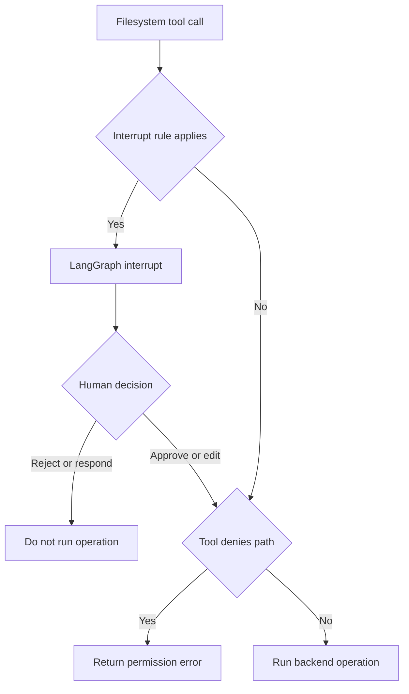
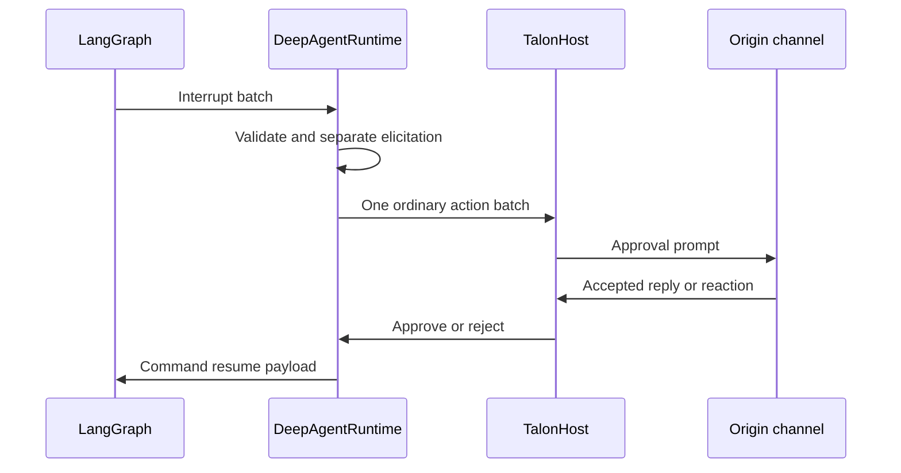

# Approvals and Human Intervention

Tool exposure, a tool-level permission check, a graph interrupt, a human decision, and runtime containment answer different questions. A tool may be visible yet deny a particular call; a call that is otherwise permitted may pause; and approving a call is not a sandbox or a durable authorization grant. See [filesystem tools](/openwiki/concepts/tools-filesystem.md), [runtime behavior](/openwiki/architecture/runtime-behavior.md), [channel admission](/openwiki/concepts/talon-channel-admission.md), and [security](/openwiki/operations/security.md).

## Choose the right control

| Need | Mechanism | What it does not provide |
| --- | --- | --- |
| Restrict a filesystem operation | `FilesystemPermission` | A human prompt or OS isolation |
| Pause a selected tool call | `HumanInTheLoopMiddleware` and `interrupt_on` | A tool-level deny rule or durable authorization |
| Set interactive dcode behavior | Per-thread `ApprovalMode` | Talon's persisted policy or channel identity checks |
| Require Talon review for a named tool | `tools.json` / `ToolApprovalStore` | A wildcard policy, availability grant, or sandbox |
| Permit a Talon policy edit | `APPROVAL_OPERATOR` plus an active invocation snapshot | Permission to execute arbitrary tools |
| Obtain an approval response | `ToolApprovalHandler` through the origin channel | Execution by the channel or a general identity grant |

Deep Agents follows a **trust-the-LLM** model: containment belongs in installed tool implementations, backends, or a sandbox—not in prompts or a review dialog. HITL is opt-in and only covers selected calls. `StateBackend` does not execute shell commands; choosing `LocalShellBackend` is an explicit higher-power opt-in.

## Deep Agents: enforcement and graph routing

`FilesystemPermission` rules have read and/or write operations, absolute glob paths, and an `allow`, `deny`, or `interrupt` mode. Patterns must be absolute, cannot contain `..`, and do not support `~`. Rules are evaluated in declaration order: the first matching rule decides, and unmatched access is allowed. A deny is enforced before the backend executes; bulk reads filter denied results. Potentially recursive deletes use conservative overlap checks so an earlier broad allow cannot expose a protected descendant.

`interrupt` has a separate role from `deny`. Graph construction derives `HumanInTheLoopMiddleware` routing from interrupt-mode filesystem rules. Exact-path tools use the ordinary first-match result. Bulk tools pause if their search scope may overlap an interrupt rule; the routing is intentionally conservative for omitted paths, current-directory aliases, absolute `glob` patterns, and relative glob patterns containing parent traversal. The derived filesystem configuration accepts `approve`, `edit`, `reject`, and `respond`. An edited or approved call still enters the filesystem tool and is subject to its deny checks.

```mermaid
flowchart TD
    Call["Filesystem tool call"] --> Gate{"Interrupt rule applies"}
    Gate -->|Yes| Pause["LangGraph interrupt"]
    Pause --> Decision{"Human decision"}
    Decision -->|Reject or respond| Stop["Do not run operation"]
    Decision -->|Approve or edit| Check
    Gate -->|No| Check{"Tool denies path"}
    Check -->|Yes| Denied["Return permission error"]
    Check -->|No| Run["Run backend operation"]
```

Caption: Interrupt routing pauses before execution, while the filesystem tool remains the enforcement point for denial.

## dcode: a live, thread-scoped approval mode

dcode stores an `ApprovalMode` per LangGraph thread: `manual`, `auto`, or `yolo`. Invalid, missing, malformed, or unavailable mode records resolve to Manual, and the thread key is a hash of the thread ID. Typed `auto` and `yolo` modes require a trusted live Store key; absent or mismatched context falls back to Manual. `AsyncApprovalHITLMiddleware` re-reads the mode after model completion and passes an in-process-only routing marker to the stock HITL middleware, so checkpointed state cannot forge an autonomous decision. `yolo` bypasses gated-tool interruption; `auto` bypasses it only where classifier-backed Auto is eligible.

When Auto is configured, `AutoModeHITLMiddleware` replaces the stock HITL middleware by name and combines the shared interrupt map with deterministic policy, classifier review, denial errors, and escalation to human review. Its trusted worktree boundary and optional narrow shell allowlist are inputs to that decision, not a replacement for backend containment. For an interactive dcode workflow, see [running a dcode session](/openwiki/workflows/run-dcode-session.md).

`ask_user` is a different interrupt: it pauses from within its own tool execution to obtain an answer, validates a resumed answer before attaching an authorization receipt, and depends on exception-catching middleware preserving `GraphBubbleUp`. Swallowing that exception would swallow the graph interrupt.

## Talon: persisted routing policy and an invocation snapshot

Talon keeps an assistant-local `tools.json` mapping of **exact tool names** to booleans. An enabled entry produces an approve/reject `interrupt_on` configuration; an absent or `false` entry produces no prompt. Names are not patterns. On first creation, defaults enable `update_tool_approvals`, `delete_conversations`, `update_mcp_server`, `start_async_task`, and `send_message`; an existing policy is not overwritten with defaults.

This is a graph-routing policy, not an ACL. Disabling a prompt neither makes a tool available nor authorizes it, and it does not provide OS or sandbox containment. `update_tool_approvals` separately checks operator authority and invocation context even when its own approval prompt is disabled.

`ToolApprovalStore` reads a bounded regular, non-symlink JSON file, rejects malformed or duplicate entries, and freezes valid contents in `ApprovalSnapshot`. The snapshot revision is the SHA-256 hash of persisted bytes. Updates validate the whole batch, take the path lock, compare the expected revision, merge only on a match, and replace the file atomically. A conflict or storage failure returns an error rather than overwriting policy. The read tool reports the persisted and active revisions, including whether saved changes are inactive; a successful update reports `next_invocation` availability.

At invocation start, `DeepAgentRuntime` reads the snapshot under its tools lock, rebuilds the graph when it differs from the active snapshot, and binds both graph and snapshot in context variables for the invocation. Thus an in-flight graph and its policy-management tool closures stay on their starting snapshot. A saved edit applies only to a subsequent invocation; an invalid saved policy prevents starting the next invocation rather than silently using an older policy.

### Policy self-edit needs two gates

A request to change `tools.json` is protected twice:

1. The **pre-edit** invocation snapshot controls whether `update_tool_approvals` itself interrupts. Disabling that name cannot remove the interruption already installed in the running graph.
2. The update tool requires both `APPROVAL_OPERATOR` and `ACTIVE_APPROVALS`. It returns an authorization error without either condition.

The host derives `APPROVAL_OPERATOR` from the trusted channel's `ChannelExposure`, not from inbound route or message metadata. A message needs an identified sender and either a configured operator ID, or—in `self` exposure—a host-recognized `from_self` message. The runtime also clears this authority for cron and background delivery. A prompt approval and operator authority are intentionally independent: the former decides whether a routed tool batch resumes, while the latter protects policy administration.

## From interrupt to channel decision

When the graph produces interrupts, Talon validates that every item has a unique, nonempty resumable ID. It recognizes MCP elicitation separately and places a cancellation response for each valid elicitation into the resume payload. Ordinary interrupts must contain a nonempty sequence of action-request mappings. Talon flattens all ordinary actions into one `ToolApprovalRequest`, identified by the first ordinary interrupt ID, and asks its `ToolApprovalHandler` for one `approve` or `reject` decision. It fans that result into explicit decisions for every action and resumes the same graph thread with one `Command(resume=...)`. Invalid IDs or actions fail before a handler is invoked, and exceeding 50 approval rounds fails instead of implicitly resuming.

```mermaid
sequenceDiagram
    participant Graph as LangGraph
    participant Runtime as DeepAgentRuntime
    participant Host as TalonHost
    participant Channel as Origin channel
    Graph->>Runtime: Interrupt batch
    Runtime->>Runtime: Validate and separate elicitation
    Runtime->>Host: One ordinary action batch
    Host->>Channel: Approval prompt
    Channel->>Host: Accepted reply or reaction
    Host->>Runtime: Approve or reject
    Runtime->>Graph: Command resume payload
```

Caption: Talon aggregates ordinary actions for one channel decision while cancelling valid MCP elicitation separately.

The host owns the pending decision, not the graph. It stores one pending future per agent conversation, sends the formatted prompt through the originating channel, and removes the entry when the future resolves. If the originating sender is known, text replies from another sender cannot resolve the future. Reactions are accepted only when provider, conversation, prompt message ID, and sender all match; other replies and reactions are ignored or cause the prompt to be repeated. The channel conveys a decision but neither runs the tool nor grants general authorization.

## Unattended and delegated work fails closed

Protected ordinary actions are rejected when the request is cron-triggered, marked as background delivery, or has no approval handler. The runtime applies these checks even if a caller tries to inject a handler, while the host withholds approval and OAuth handlers for a background-result delivery and clears its operator context. A scheduled job invokes without interactive handlers. These paths do not wait for a person who is not present.

Detached background subagents clear operator and authorization context; if an approval interrupt occurs, their result reports that the protected action did not run. Cron-only inline delegation instead remains within its already unattended caller, disallows nested delegation, and cannot inherit interactive approval or authorization.

## Operating and testing safely

- Treat exposure, tool availability, filesystem denial, graph interruption, channel decision, operator authority, and sandbox/backend isolation as separate layers.
- Use exact names in Talon's `tools.json`; do not expect glob matching. Persisted changes need a new invocation, and clients should use the revision from `get_tool_approvals` when updating.
- Preserve the pre-edit graph snapshot and the active-snapshot/operator checks when changing policy-management tools. Do not trust request metadata as evidence of operator identity.
- Build approval interfaces around one decision for an ordinary action batch, not one decision per interrupt. Preserve validation before invoking an external handler.
- Keep MCP elicitation out of a tool-approval UI: valid elicitation is cancelled in the resume payload.
- Test storage validation, revision conflicts, default creation, and active-versus-saved snapshots in `test_tool_approvals.py`; test runtime snapshot binding, self-edit behavior, batch fan-out, and unattended rejection in the tool-approval runtime and batch tests; and test trusted sender/reaction matching and channel-derived authority in the host authorization tests.
