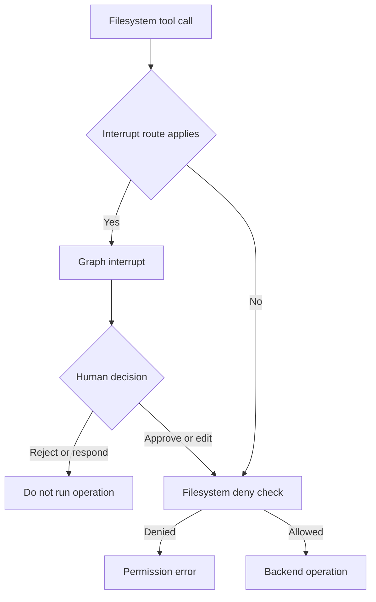
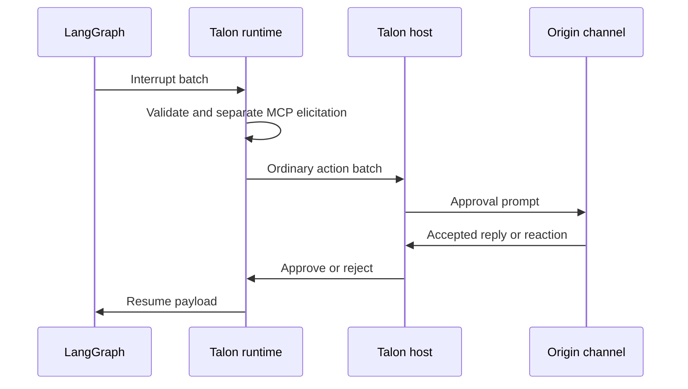

# Permissions and Human-in-the-Loop

Tool visibility, tool-level permission enforcement, a graph interrupt, a human decision, and backend containment answer different questions. A visible tool can deny one call; an allowed call can pause; and a human approval is neither an operating-system sandbox nor a durable authorization grant. See [filesystem tools](/openwiki/concepts/tools-filesystem.md), [middleware stack](/openwiki/architecture/middleware-stack.md), [subagents and skills](/openwiki/concepts/subagents-skills.md), and [security](/openwiki/operations/security.md).

> **Talon is experimental.** Talon is an alpha runtime, not a production or enterprise security boundary. It lacks complete production-grade HITL policy, channel-administrator controls, and multi-tenant isolation. Its opt-in sandbox does not cover MCP tools. Channel prompts and channel exposure are therefore not complete security boundaries; treat channel access as access to the agent, its credentials, MCP tools, and host resources.

## Choose the control that matches the need

| Need | Mechanism | It does not provide |
| --- | --- | --- |
| Hide a tool from the model and reject calls by that name | Harness profile `excluded_tools` | A sandbox or policy for direct backend use |
| Deny selected built-in filesystem operations | `FilesystemPermission(mode="deny")` | A human prompt or OS isolation |
| Pause selected SDK tool calls | `HumanInTheLoopMiddleware` / `interrupt_on` | A deny rule or durable authorization |
| Require a Talon decision for an exact tool name | `ToolApprovalStore` policy and Talon runtime | Tool availability, wildcard matching, or sandboxing |
| Restrict what code can do after a tool runs | A constrained tool/backend or sandbox | Protection supplied by a prompt or approval dialog |

Deep Agents follows a **trust-the-LLM** model: containment belongs in installed tools, backends, or sandboxes. HITL is opt-in and protects only calls routed through it. `StateBackend` has no shell execution; using `LocalShellBackend` is an explicit higher-power choice.

## Filesystem permissions: enforce at the tool boundary

A `FilesystemPermission` has read and/or write operations, absolute glob paths, and `allow`, `deny`, or `interrupt` mode. Paths must start with `/`; `..` is rejected and `~` is unsupported. Rules use declaration-order, first-match semantics, with `allow` when no rule matches.

`FilesystemMiddleware` enforces `deny` for its built-in filesystem tools before backend execution. Listing, globbing, and grep results remove denied entries rather than exposing them. Recursive or potentially recursive `delete` is deliberately more conservative: a deny pattern that could overlap the removed subtree blocks deletion even where a preceding broad allow would otherwise win. Permissions are tool middleware, **not** a backend-wide access-control layer: direct backend calls do not acquire these rules.

### Interrupt is routing, not enforcement

An `interrupt` rule does not deny access. During `create_deep_agent` assembly, filesystem interrupt rules are transformed into `HumanInTheLoopMiddleware` `interrupt_on` entries with per-call `when` predicates. A caller's explicit `interrupt_on` entry wins for the same tool name, so it can deliberately replace the generated filesystem routing; deny enforcement remains in `FilesystemMiddleware` either way.

Exact tools (`read_file`, `write_file`, and `edit_file`) use ordinary first-match permission resolution. Bulk tools (`ls`, `glob`, `grep`, and `delete`) interrupt when their search or deletion scope may intersect an interrupt-pattern anchor. Missing bulk paths, current-directory aliases, absolute `glob` patterns, and relative glob patterns with `..` receive conservative treatment to avoid routing around review. Generated filesystem interrupts allow `approve`, `edit`, `reject`, and `respond`; approved and edited calls still re-enter the tool, where deny rules are checked.

```mermaid
flowchart TD
    Call["Filesystem tool call"] --> Gate{"Interrupt route applies"}
    Gate -->|Yes| Pause["Graph interrupt"]
    Pause --> Decision{"Human decision"}
    Decision -->|Reject or respond| Halt["Do not run operation"]
    Decision -->|Approve or edit| Check["Filesystem deny check"]
    Gate -->|No| Check
    Check -->|Denied| Denied["Permission error"]
    Check -->|Allowed| Run["Backend operation"]
```

Caption: HITL routes a call to review before execution; the filesystem middleware remains the denial enforcement point.

## Subagents: inheritance is explicit and type-dependent

For declarative `SubAgent` specifications, omitted `permissions` inherits the parent list; a supplied list, including `[]`, replaces it completely. The graph constructs each declarative subagent with its own `FilesystemMiddleware` and builds filesystem-derived interrupt routing from that subagent's effective rules. The auto-added general-purpose subagent also uses the parent permissions.

Top-level `interrupt_on` is inherited by declarative subagents unless their specification supplies its own map. The effective map merges generated filesystem interrupts first and then user configuration, so the relevant user map takes precedence on name conflicts. In contrast, `CompiledSubAgent` and remote `AsyncSubAgent` graphs do not inherit the parent `interrupt_on`; configure their approval behavior in the compiled or remote graph. Do not infer a common enforcement boundary merely because the parent delegates work.

A default declarative subagent is isolated and receives the delegated task rather than the parent conversation. Experimental `mode="fork"` continues the parent conversation and state, rebuilds prompt-producing middleware, appends the fork's prompt, and cannot define separate skills. This is a context and composition decision, not a privilege reduction; choose tools, permissions, and HITL for each subagent deliberately.

## Profile exclusion is separate from permissions

A harness profile's `excluded_tools` appends `_ToolExclusionMiddleware` after tool-injecting middleware. It removes matching names from the model request and returns an unavailable-tool error if a tool call still names one. This is useful for controlling the model-facing capability set, but it is expressly not a security surface or a substitute for backend containment.

Profile `excluded_middleware` is a different mechanism again: it removes selected middleware instances by exact class or name. Core `FilesystemMiddleware` and `SubAgentMiddleware` are protected scaffolding and cannot be excluded; attempting to do so raises instead of producing a silently degraded graph. Consequently, do not use visibility exclusion as a claim that a path is denied, or use a filesystem rule as a claim that an arbitrary custom tool is unavailable.

## Talon approvals: persisted exact-name interrupt policy

Talon maintains an assistant-local `tools.json` map of exact tool names to booleans. Enabled entries generate approve/reject `interrupt_on` configuration; absent or false entries generate no prompt. Names are not patterns. When the file is first missing, the defaults enable `update_tool_approvals`, `delete_conversations`, `update_mcp_server`, `start_async_task`, and `send_message`; an existing valid file is retained.

This policy selects graph routing, not an ACL. Disabling a prompt neither exposes a tool nor authorizes it, and it does not contain the tool's effects. Policy self-edit remains separately protected: `update_tool_approvals` requires both active invocation policy context and operator context.

`ToolApprovalStore` validates a bounded regular, non-symlink JSON file and freezes its exact-name boolean policy in an `ApprovalSnapshot`; its revision hashes persisted bytes. Updates lock the file, validate the complete update, compare the expected revision, and atomically replace only on a match. The active snapshot is fixed for an invocation: runtime graph rebuilding and policy-management closures use the snapshot read at invocation start. Saved changes therefore take effect on a later invocation, while invalid saved policy prevents that invocation rather than silently retaining an old graph.

## From interruption to a channel decision

Talon validates unique nonempty resumable IDs before seeking approval. It cancels valid MCP elicitation separately, aggregates ordinary interrupted action requests into one `ToolApprovalRequest`, obtains one approve/reject decision, expands that decision into explicit resume payloads, and resumes the graph. Malformed batches and the 50-round ceiling fail rather than being implicitly resumed.

```mermaid
sequenceDiagram
    participant Graph as LangGraph
    participant Runtime as Talon runtime
    participant Host as Talon host
    participant Channel as Origin channel
    Graph->>Runtime: Interrupt batch
    Runtime->>Runtime: Validate and separate MCP elicitation
    Runtime->>Host: Ordinary action batch
    Host->>Channel: Approval prompt
    Channel->>Host: Accepted reply or reaction
    Host->>Runtime: Approve or reject
    Runtime->>Graph: Resume payload
```

Caption: Talon makes one channel decision for ordinary actions while cancelling valid MCP elicitation separately.

The host holds one pending approval future per agent conversation and removes it after resolution. A known initiating sender is required for text reply approval; reaction approval additionally matches provider, conversation, prompt message, and sender. That binds a response to a pending prompt, not to general tool authorization.

Operator authority for policy changes is also separate from the approval handler. The host derives it from trusted channel exposure rather than inbound request metadata, and the runtime requires active invocation context. It clears this authority for cron and background delivery.

## Unattended and delegated work fails closed

For cron, background-result delivery, or requests without an approval handler, Talon rejects protected ordinary actions rather than waiting for an unavailable person; this holds even if a handler is injected for an unattended request. The host withholds interactive approval and OAuth paths for scheduled and background-result work.

Detached background subagents clear operator and authorization context and report an interrupted protected action as not run. Cron-only inline delegation instead runs in its already unattended caller, disallows nested delegation, and cannot inherit an interactive approval or authorization handler. This fail-closed behavior applies to calls that the active policy routes through approval; it is not a blanket claim that every tool or integration is protected.

## Operating and testing safely

- Treat tool visibility, permission denial, interrupt routing, channel approval, operator authority, and sandbox/backend containment as independent layers.
- Give interrupt rules literal leading anchors where possible. Broad patterns such as `/**/secrets` intentionally over-interrupt bulk tools.
- Review every declarative subagent's replacement `permissions` and `interrupt_on`; configure compiled and remote agents independently.
- Use exact names and the revision from `get_tool_approvals` when changing Talon policy. Expect a new invocation before saved changes apply.
- Keep Talon approval UIs batch-oriented and validate interrupt IDs and actions before calling an external handler. Do not treat a channel decision as an identity or authorization system.
- Focus regression coverage on `test_permissions.py` for path, delete, bulk-routing, and inheritance behavior; on Talon's tool-approval tests for policy validation, snapshots, batch fan-out, and unattended rejection; and on host authorization tests for trusted sender and reaction matching.
