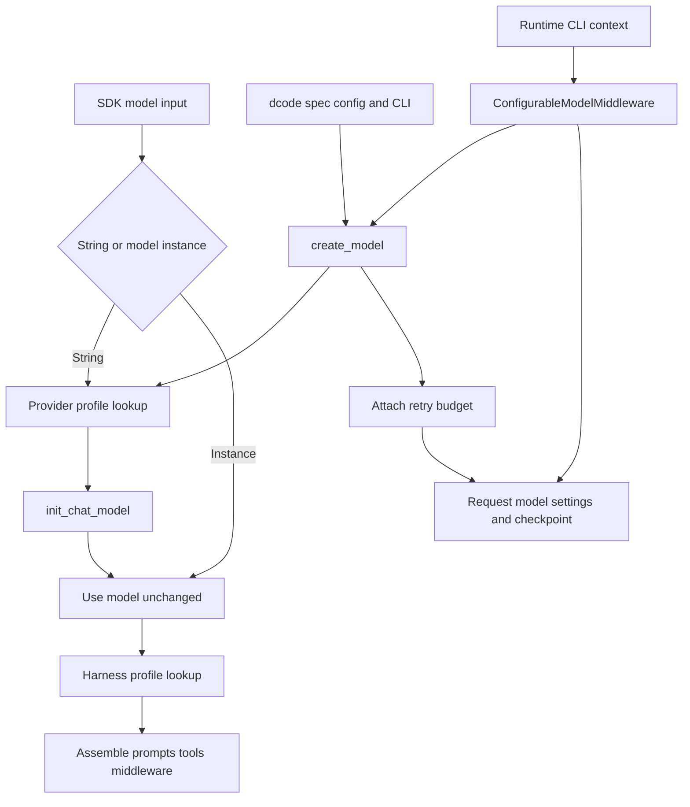

# Models, Profiles, and Retries

Three layers deliberately have different ownership:

1. **SDK provider profiles** adapt construction of a string model specification.
2. **SDK harness profiles** adapt the agent runtime after a model is available.
3. **dcode configuration and middleware** select, construct, switch, persist, and retry models for a CLI session.

A provider profile is not session policy or an interactive runtime hook. A harness profile does not change how a provider client is constructed. dcode consumes SDK provider profiles, but its TOML, CLI, and runtime-context settings are not registrations in the SDK's process-global profile registries.

## Resolution paths and ownership



Caption: SDK profiles govern construction or harness assembly; dcode chooses the concrete model and can change it per request.

## SDK model and provider profiles

`resolve_model` accepts `str | BaseChatModel`. A supplied `BaseChatModel` is returned unchanged. A string is passed to `init_chat_model` with kwargs from `apply_provider_profile`; provider-profile constructor tuning consequently does not retrofit a pre-built instance.

### Lookup, composition, and precedence

A `ProviderProfile` supplies static `init_kwargs`, an optional `pre_init` hook, and an optional `init_kwargs_factory`. `apply_provider_profile` is the construction entrypoint: it looks up the profile, optionally runs `pre_init`, invokes the factory, and produces a new kwargs dictionary.

```text
profile init_kwargs < factory output < caller kwargs
```

Caller input is authoritative. With no match, the helper returns a copy of caller kwargs. Hook and factory failures propagate, so construction cannot silently continue with a partially applied profile.

Provider and harness registries accept a provider key or one `provider:model` key. Lookup tries an exact key, then the provider prefix, and returns no profile for malformed specifications before consulting a registry. For a qualified specification with both registrations, the model-level profile is layered over the provider-level profile.

Provider-profile re-registration is additive: static kwargs merge; `pre_init` hooks run base then override; and both factories run for each resolution, with later output winning. A registration is therefore a layer rather than a wholesale replacement—set a conflicting value explicitly to override a built-in or earlier registration.

## Harness profiles: runtime shaping, not construction

`create_deep_agent` applies a `HarnessProfile` once the model is resolved. Its runtime controls include prompt slots, tool-description overrides, tool and middleware exclusions, extra middleware, and changes to the automatic general-purpose subagent. The file-friendly `HarnessProfileConfig` represents the declarative subset; it cannot serialize runtime `extra_middleware` and rejects an export that would silently lose it.

For a pre-built model, lookup derives a `provider:identifier` key from model metadata. A bare identifier is deliberately not consulted as a registry key, avoiding accidental application of a provider profile to a proxy or custom model with a colliding name. Prompt suffixes are appended after user and base prompt content. When overriding the `task` description, retain `{available_agents}` so the generated subagent list remains visible to the model.

### Exclusion rules and ordering

`excluded_middleware` removes matching assembled middleware by its stable name. It applies to caller-provided middleware as well as defaults, rejects invalid or unmatched exclusions, and cannot remove required filesystem and subagent scaffolding. To remove the `task` tool, disable the general-purpose subagent and do not provide synchronous subagents; async subagents are separate.

`excluded_tools` is a model-visible tool-surface control, not an authorization boundary. Deep Agents appends `_ToolExclusionMiddleware` after custom and tool-injecting middleware, so the excluded names are removed from the main agent, general-purpose subagent, and declarative synchronous subagents after those stacks are assembled. A custom model-call wrapper cannot restore them.

## dcode construction and precedence

`create_model` is dcode's concrete-model construction entrypoint. It accepts a qualified spec, infers a provider for a bare model name, or resolves a default. Its allowlist gate runs after canonical provider inference but before credential bridging, profile hooks, and provider imports. A denied model therefore cannot copy stored credentials into the environment or trigger profile side effects.

For an admitted model, dcode validates credentials early except for implicit-auth providers, obtains configured provider kwargs and stored credential wiring, and then applies the SDK provider profile. CLI model params are final:

```text
SDK provider profile defaults < config.toml provider and model params plus credential wiring < --model-params
```

Within a provider's `params`, flat values are provider-wide and a model-named table shallow-merges on top. Config and CLI `profile_overrides` modify the resolved model object's capability `profile` metadata; they are not SDK `HarnessProfile` registrations. The returned `ModelResult` carries the model, resolved provider and model name, context/modality metadata, and retry metadata. dcode stamps the retry budget on the concrete model; a custom slotted model that rejects the attribute remains usable and retry middleware falls back to its startup budget.

Provider-profile hook or factory failures are converted to `ModelConfigError` with installation/update and explicit-kwargs guidance. This keeps arbitrary plugin failures behind dcode's user-facing configuration-error boundary.

## Runtime switching and session state

`ConfigurableModelMiddleware` is normally outside provider-specific middleware. On every model call it reads `runtime.context`:

- `model` requests replacement through `create_model`. A normal resolution failure falls back to the construction-time model unless `strict_model_resolution` is set; an allowlist denial is always propagated.
- `model_params` shallow-merges into that request's `model_settings` without mutating the shared model.
- Provider-specific cache settings are adjusted for the target request.

After a successful parent-agent call, the middleware returns a private checkpoint `Command`. It stores the resolved specification and **runtime-only** `model_params` for resume. Cache endpoint identity and cache-relevant effective parameters are stored separately. This separation is an invariant: writing configured defaults into session overrides would pin old temperatures, headers, or retry settings into resumed threads after configuration changes. Failed calls produce no update, and subagent instances disable parent-thread persistence.

## Retry ownership and lifecycle

`CodeModelRetryMiddleware` owns dcode model-node retries, rather than retrying completed tools. The retry budget is resolved in descending precedence from `--max-retries`, provider retry configuration, global retry configuration, and a default of five; zero disables retries. After kwargs merge, dcode disables a known provider SDK retry parameter to avoid nested retry multiplication. It warns instead of guessing an unknown provider control.

Retryability honors a direct `ModelError` verdict, retries selected HTTP statuses (408, 409, 429, and 5xx), known SDK errors, and selected transport faults, and searches exception groups plus cause/context chains when there is no direct verdict. `GraphBubbleUp` is re-raised as graph control flow. A usable `Retry-After` is honored up to 60 seconds; otherwise the middleware uses jittered exponential backoff beginning at 0.2 seconds, factor 2, capped at 10 seconds.

The middleware emits correlated attempt start/complete and retry stream events. A retry event records whether visible output may have begun, allowing clients to mark a superseded partial response incomplete instead of treating it as a complete answer. Auxiliary calls use the selected model's stamped budget and may enforce a cumulative-delay guard, surfacing the provider error when further waiting would exceed that caller's limit.

## Change and test guidance

- Put reusable model-constructor behavior in a provider profile and reusable SDK runtime adaptation in a harness profile. These profile APIs are beta.
- Put operator policy in `config.toml`, CLI model/profile options, and retry settings. Use runtime context only for an invocation-specific model or request settings.
- Preserve order-sensitive boundaries: policy before credentials/profile imports; provider-profile defaults beneath configuration and CLI kwargs; tool exclusion after tool injection; and retry middleware around model calls rather than tools.
- Focus tests at the owner: registry key validation and profile merge order; allowlist-before-side-effects and constructor precedence; runtime fallback versus strict resolution and checkpoint separation; and retry classification, `Retry-After`, graph interrupts, streamed partial output, and delay caps. `test_model_retry.py` exercises the retry predicate, control-flow propagation, timing, streaming, and event behavior.

## Related pages

- [Middleware stack](/openwiki/architecture/middleware-stack.md)
- [SDK construction & execution](/openwiki/architecture/sdk-construction-execution.md)
- [Configuration layering](/openwiki/concepts/config-layering.md)
- [Context management](/openwiki/concepts/context-management.md)
- [Build a Deep Agent](/openwiki/workflows/build-a-deep-agent.md)
