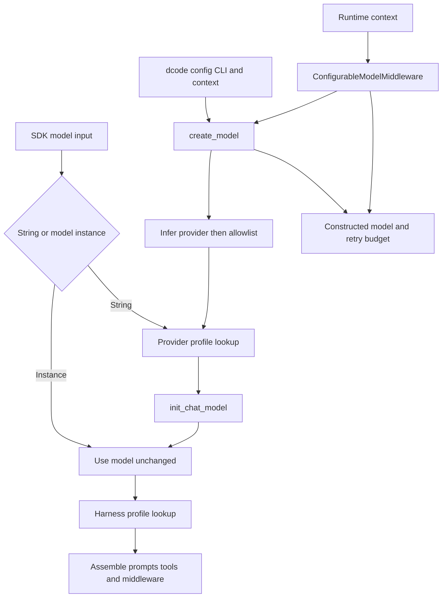
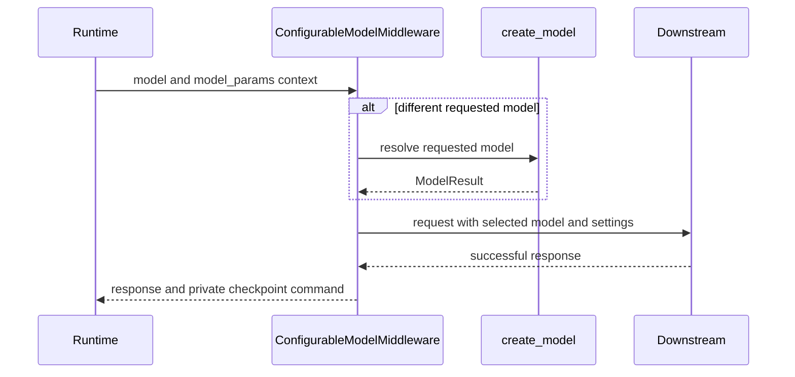

# Profiles and Model Resolution

Two SDK profile systems and dcode configuration have distinct ownership:

- A **provider profile** changes constructor preparation for an SDK string model specification.
- A **harness profile** shapes a Deep Agents runtime stack after a model is selected.
- **dcode** selects and constructs the concrete model from its configuration, CLI options, and per-request context. Its model and profile overrides are not SDK registry registrations.

Keeping these boundaries separate is important. A pre-built model is not retrofitted by a provider profile, and a dcode `profile_overrides` setting changes a model object's capability metadata rather than selecting an SDK `HarnessProfile`.

## Resolution overview



Caption: SDK profiles adapt construction or agent assembly, while dcode owns configured selection and per-call switching.

## SDK provider profiles

`resolve_model` accepts `str | BaseChatModel`. It returns a supplied `BaseChatModel` unchanged. For a string, it calls `init_chat_model` with the kwargs yielded by `apply_provider_profile`; consequently, profile constructor defaults apply only when the SDK constructs from a string.

A `ProviderProfile` can contribute static `init_kwargs`, a `pre_init` callable, and an `init_kwargs_factory`. `apply_provider_profile` is the construction-facing API: it finds a profile, runs `pre_init` unless suppressed, then creates a new kwargs dictionary in this precedence order:

```text
profile init_kwargs < factory output < caller kwargs
```

Caller-supplied configuration therefore wins. With no match, it returns a copy of the caller kwargs. Hook and factory failures propagate from the SDK helper; dcode catches them at its construction boundary and presents a `ModelConfigError` that points operators to provider installation or explicit `--model-params`.

### Keys, lookup, and additive registration

Profiles may be registered for a bare provider or a `provider:model` key. Only the first colon separates the provider, so model identifiers may themselves contain colons. Empty specs and specs with an empty provider or model half do not query the registry. A lookup first finds an exact key, then a provider-level key; when both exist, the exact profile layers over the provider profile.

Provider-profile merging is field-aware: static kwargs merge per key, base `pre_init` runs before the override, and both factories run at resolution time with override factory output winning on conflicts. Re-registering a profile is therefore additive rather than a wholesale replacement.

## SDK harness profiles and exclusions

A `HarnessProfile` is consumed during `create_deep_agent` stack assembly. It can replace or append system prompt content, override tool descriptions, exclude tools or middleware, append runtime middleware, and configure the general-purpose subagent. For a model instance, harness lookup uses the provider and model identifier reported by that model; a bare identifier alone is not treated as a profile key.

Provider-level and exact-model harness profiles merge rather than choose one wholesale: scalar fields inherit when the exact profile leaves them unset, tool-description mappings merge with the exact entry winning per key, excluded tools and middleware union, middleware instances merge by concrete type, and general-purpose-subagent fields merge independently.

### Tool and middleware exclusions

`excluded_tools` controls the model-visible tool set, not authorization. `_ToolExclusionMiddleware` is appended after custom and tool-injecting middleware, so it can hide both user tools and tools injected by middleware; a custom `wrap_model_call` cannot restore an excluded name. The same profile exclusion applies to the main stack, the general-purpose subagent, and declarative synchronous subagents.

`excluded_middleware` instead filters the fully assembled stacks by exact middleware class or exact `.name`, including caller-provided middleware. `FilesystemMiddleware` and `SubAgentMiddleware` are required scaffolding and cannot be excluded; invalid entries and entries matching no assembled middleware fail fast. To remove the `task` tool, disable the general-purpose subagent and supply no synchronous subagents rather than excluding `SubAgentMiddleware`.

`extra_middleware` is runtime-only: `HarnessProfileConfig` cannot serialize it. It is materialized for stacks built locally by `create_deep_agent` (main, general-purpose, and declarative synchronous subagent stacks), not for precompiled or remote asynchronous subagents.

## dcode model construction

`create_model` is dcode's construction entrypoint. It accepts a qualified `provider:model` spec, detects a provider for a bare name, or takes a default model. Its allowlist check occurs after provider inference creates the canonical resolved spec but before credential bridging, provider-profile hooks, or provider imports. A rejected model therefore cannot trigger those side effects.

For an allowed model, provider configuration supplies constructor parameters and credential wiring, then the SDK provider profile is composed underneath those values. CLI `--model-params` are applied last:

```text
SDK provider profile defaults < config.toml provider and model params plus credential wiring < --model-params
```

Within `[providers.<provider>.params]`, flat keys are provider-wide and a table named for the model shallow-merges on top. A configured `class_path` bypasses generic `init_chat_model`; the OAuth-backed Codex route also constructs its specialized model directly so it can use its token provider. After construction, dcode applies config then CLI capability `profile_overrides`, and returns model identity, capability-derived context/modality metadata, and retry metadata.

## Per-call switching and checkpoint state

`ConfigurableModelMiddleware`, normally outside provider-specific middleware, reads `runtime.context` on each model call. A different `model` invokes `create_model`; `model_params` shallow-merge into that request's `model_settings` without mutating the shared model. A failed ordinary runtime switch falls back to the current model, but a policy denial always propagates and `strict_model_resolution=True` propagates construction errors.



Caption: Runtime selection is per call; persistence is emitted only after the downstream call succeeds.

The checkpoint records the resolved model spec and runtime-only model parameters for resume. Cache endpoint and cache-identity effective parameters use separate fields. This separation prevents configured defaults such as temperature, retry counts, or headers from becoming stale per-session overrides on resume. Subagent middleware can disable this parent-thread persistence, and failed calls return no checkpoint update.

## Retry ownership

dcode resolves its model-node retry budget in this order: `--max-retries`, provider retry configuration, global retry configuration, then a default of five. It stamps the result on the concrete model and disables a known provider SDK retry parameter after kwargs are merged, preventing nested retry loops from multiplying attempts. If a custom slotted model rejects the private metadata attribute, it remains usable and retry middleware falls back to its startup budget.

`CodeModelRetryMiddleware` owns retries around model nodes. It preserves `GraphBubbleUp` as graph control flow, recognizes selected provider and transport failures, and searches exception groups plus cause/context chains when there is no authoritative direct `ModelError` verdict. It honors a valid `Retry-After` up to 60 seconds; otherwise it uses capped jittered exponential backoff.

## Change and test guidance

- Register a provider profile for reusable construction behavior and a harness profile for reusable SDK runtime shaping. Use TOML, CLI options, and runtime context for dcode operator and session policy.
- Preserve the allowlist-before-side-effects ordering when changing construction. Preserve exclusion-last ordering when adding tool-injecting middleware.
- Focus tests on exact versus provider profile merging, colon-containing model identifiers, provider-profile error translation, allowlist side-effect isolation, runtime fallback versus strict mode and policy denial, and checkpoint separation. `test_configurable_model.py` covers the switching and persistence cases; `test_models.py` covers SDK model resolution and profile behavior.

## Related pages

- [SDK construction & execution](/openwiki/architecture/sdk-construction-execution.md)
- [Configuration layering](/openwiki/concepts/config-layering.md)
- [Tools and filesystem](/openwiki/concepts/tools-filesystem.md)
- [Middleware stack](/openwiki/architecture/middleware-stack.md)
- [Cost and sessions](/openwiki/operations/cost-and-sessions.md)
