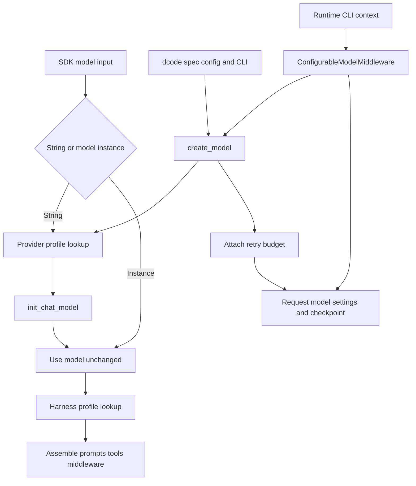

# Models, Providers, and Harness Profiles

Three layers have intentionally different ownership:

1. **SDK provider profiles** adapt construction of a *string* model specification.
2. **SDK harness profiles** adapt the agent runtime after its model is available.
3. **dcode configuration and middleware** choose, construct, switch, persist, and retry models for a CLI session.

A provider profile cannot choose a session's model or install behavior that depends on interactivity. A harness profile cannot alter a provider client's construction. Conversely, dcode consumes SDK provider profiles, but its TOML, CLI, and runtime-context settings are not registrations in the process-global SDK registries.

## Resolution paths and ownership



Caption: SDK profiles govern construction or harness assembly; dcode chooses the concrete model and can change it per request.

## SDK model and provider profiles

`resolve_model` accepts `str | BaseChatModel`. A supplied `BaseChatModel` is returned unchanged. A string is sent to `init_chat_model` with kwargs from `apply_provider_profile`, so provider-profile constructor tuning does not retrofit a pre-built instance. Model inspection is deliberately tolerant: identifiers may be `model_name` or `model`, and unavailable provider metadata is logged rather than terminating execution. Provider-aware comparison normalizes aliases and spelling, but can use an identifier-only match for custom models whose provider cannot be inspected.

### Lookup, composition, and precedence

`ProviderProfile` supplies static `init_kwargs`, an optional `pre_init` hook, and an optional `init_kwargs_factory`. `apply_provider_profile` is the construction entrypoint: it looks up the profile, runs `pre_init` unless explicitly suppressed, invokes the factory, and returns a new kwargs dictionary.

```text
profile init_kwargs < factory output < caller kwargs
```

Caller input therefore remains authoritative. With no matching profile, the helper returns a copy of caller kwargs. A hook or factory exception is not swallowed: construction does not continue with an incompletely applied profile.

Both provider and harness registries accept a provider key or one `provider:model` key. Lookup rejects empty or malformed keys before consulting a registry. For a valid qualified spec it combines a provider-wide profile with an exact-model profile; the exact profile wins where a field conflicts. Provider-profile re-registration is additive: static kwargs merge, `pre_init` functions run base then override, and both factories run at each resolution with later output winning. This makes a user or plugin registration a layer, not a replacement—supply a conflicting value explicitly when overriding a built-in.

### Lazy bootstrap and optional integrations

The registries bootstrap lazily at first registration or lookup, not when `deepagents.profiles` is imported. A condition coordinates concurrent access: other threads wait rather than observe a partial registry, and same-thread bootstrap re-entry is allowed for plugins that call the public registration APIs. Built-ins register first; an error rolls the registries back and is raised. Third-party entry points in `deepagents.provider_profiles` and `deepagents.harness_profiles` load afterward, but enumeration, import, non-callable, and registration failures are isolated and reported so one distribution does not disable profiles globally. Plugin ordering is intentionally not a stable override contract.

Provider-specific code keeps optional dependencies at integration boundaries. For example, the retry classifier imports `httpx` lazily; if it is absent or broken, `httpx` transport failures simply are not recognized as retryable and a debug trace is emitted. dcode converts provider-profile failures—including a missing or outdated provider package needed by a profile hook—into actionable `ModelConfigError` messages, rather than exposing a raw hook exception.

## Harness profiles: runtime shaping, not construction

A `HarnessProfile` is applied by `create_deep_agent` to the model-specific agent stack. Its declarative and runtime knobs include:

- `base_system_prompt` and `system_prompt_suffix` prompt slots;
- `tool_description_overrides`;
- `excluded_tools` and `excluded_middleware`;
- `extra_middleware`; and
- `general_purpose_subagent` changes.

`HarnessProfileConfig` is the file-backed declarative subset. It cannot export runtime `extra_middleware`; attempting to do so raises rather than silently dropping middleware. `extra_middleware` is materialized for the stacks the constructor creates (main, general-purpose, and declarative synchronous subagents), not already-compiled or remote async subagents.

For a pre-built model, harness lookup derives `provider:identifier` from model metadata. A bare identifier is not treated as a registry key; this prevents a proxy/custom model accidentally inheriting a profile merely because names collide. Prompt suffixes apply after user and base content and are added to applicable main and subagent stacks. A `task` description override should retain `{available_agents}`, otherwise the model loses the generated subagent list.

### Exclusion rules and ordering

`excluded_middleware` filters the fully assembled stack by exact middleware class or by `.name`. It can remove caller-provided middleware as well as defaults, but required `FilesystemMiddleware` and `SubAgentMiddleware` may not be removed; invalid names and exclusions that match nothing fail fast. It is an assembly constraint, not a way to remove the `task` tool—disable the general-purpose subagent and avoid synchronous subagents for that outcome.

`excluded_tools` has different ordering. Deep Agents appends `_ToolExclusionMiddleware` after custom and tool-injecting middleware, so it removes both user and middleware-added tools and a custom `wrap_model_call` cannot restore them. The exclusion set applies to the main agent, general-purpose subagent, and declarative synchronous subagents. It calibrates the model-visible tool surface; it is **not** authorization or a security boundary.

The dcode GLM-5.2 integration demonstrates the separation. It registers a prompt-only profile for exact Fireworks, OpenRouter, and Baseten specs, without overwriting an existing suffix. A Fireworks terminal-stall recovery is instead installed only for headless CLI stacks: the interactive/headless decision exists only during CLI assembly. On the measured Fireworks model, one tool-free response that ended due to the output cap is retried once with reasoning disabled and a forced tool call; OpenRouter and Baseten do not receive that recovery.

## dcode construction and precedence

`create_model` is dcode's concrete-model construction entrypoint. It accepts an explicit qualified spec, detects a provider for a bare model name, or uses a default. It runs the allowlist gate after canonical provider inference but before credential bridging, profile hooks, and provider imports. A denied model thus cannot copy stored credentials to environment variables or trigger profile side effects.

For an admitted model, dcode validates credentials early except for providers using implicit authentication, obtains configured provider kwargs and stored credential wiring, then applies the SDK provider profile. CLI model params are final:

```text
SDK provider profile defaults < config.toml provider and model params plus credential wiring < --model-params
```

Within a provider's `params`, flat values are provider-wide and a model-named table shallow-merges on top. Effective request kwargs additionally insert the resolved `base_url` before runtime overrides. dcode can construct a configured `class_path` directly; its OAuth-backed Codex route also bypasses generic `init_chat_model` so its token provider is installed. Config and CLI `profile_overrides` modify the resolved model object's capability `profile` metadata (for example, context limit), not an SDK `HarnessProfile`.

The result holds the model, resolved provider/model name, context limit, unsupported modalities, and retry metadata. dcode places retry metadata on the concrete model as a private attribute. A custom slotted model may reject that attribute and remains usable; retry middleware logs the condition and uses its startup fallback.

## Runtime switching and session state

`ConfigurableModelMiddleware` is normally outside provider-specific middleware. On each model call it reads `runtime.context`:

- `model` requests a replacement through `create_model`; a normal resolution failure falls back to the construction-time model unless `strict_model_resolution` is set.
- `model_params` shallow-merges into that request's `model_settings` without mutating the shared model.
- Thread-aware provider adjustments add prompt-cache settings where applicable and remove Anthropic-only settings when the target is no longer Anthropic.

After a successful parent-agent call, the middleware emits a private checkpoint `Command`. It records the resolved spec and **runtime-only** `model_params` for resume, while cache endpoint identity and cache-relevant effective parameters use distinct fields. Keeping configuration defaults out of the resumed session override is an invariant: otherwise an old thread would pin stale provider defaults such as temperature, retries, or headers. Failed calls create no update, and subagent instances disable parent-thread persistence.

## Retry ownership and lifecycle

The dcode model-node retry layer, `CodeModelRetryMiddleware`, owns the user-visible retry budget. Precedence is `--max-retries`, provider retry configuration, global retry configuration, then a default of five; zero means no retries. At construction, dcode disables a known provider SDK retry parameter after kwargs merge, avoiding nested retries multiplying the configured attempts. For unknown provider controls it warns rather than guessing an unsafe constructor argument.

It retries retryable `ModelError`s, selected HTTP statuses (408, 409, 429, and 5xx), known provider SDK failures, and selected transport faults. Classification traverses exception groups and cause/context chains, while preserving an authoritative non-retryable model error. A valid `Retry-After` is honored up to 60 seconds; otherwise the delay is jittered exponential backoff from 0.2 seconds with factor 2 and a 10-second cap. `GraphBubbleUp` is re-raised as graph control flow, not treated as a provider failure.

Retry status is surfaced to streaming clients. If an attempt may already have emitted output, the retry path marks that partial output incomplete before replay; exhausted retries likewise produce a terminal incomplete marker rather than presenting truncation as a valid answer. Auxiliary calls use the currently selected model's stamped budget and can enforce a cumulative-delay cap so the actual provider error, rather than an unrelated deadline, remains visible.

## Change and test guidance

- Register a provider profile only for reusable model-constructor behavior; register a harness profile only for reusable SDK runtime adaptation. These profile APIs are beta and additive.
- Use `config.toml`, CLI model/profile options, and retry settings for operator policy. Use runtime context for an invocation-specific model or request settings.
- Test at the owning boundary: registry key validation and merge/pre-init order; policy-before-side-effects and constructor precedence; runtime fallback versus strict resolution and checkpoint separation; and retry classification, `Retry-After`, graph interrupts, partial streaming, and delay caps. `test_configurable_model.py` exercises runtime context handling and checkpoint behavior; related dcode configuration and retry tests cover their respective owners.

## Related pages

- [SDK construction & execution](/openwiki/architecture/sdk-construction-execution.md)
- [Configuration layering](/openwiki/concepts/config-layering.md)
- [Middleware catalog](/openwiki/concepts/middleware-catalog.md)
- [Cost and sessions](/openwiki/operations/cost-and-sessions.md)
