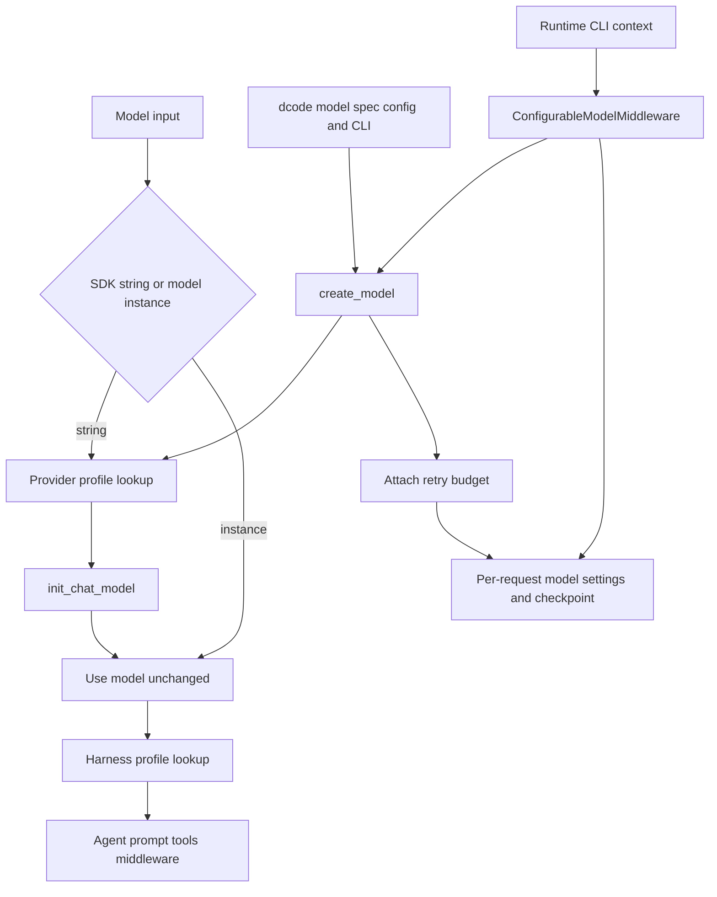

# Models, Providers & Profiles

There are three deliberately separate layers:

1. **Deep Agents SDK provider profiles** modify construction of a *string* model spec.
2. **Deep Agents SDK harness profiles** modify the agent runtime built around a resolved model.
3. **dcode configuration and middleware** select, construct, swap, persist, and retry models for a CLI/session. dcode consumes SDK provider profiles but is not the SDK profile registry.

This boundary matters: a provider profile cannot select a model for a session or install session-aware behavior; a harness profile cannot control a provider client's constructor; and dcode's TOML/CLI/session settings are not process-global SDK profile registrations.

## Resolution paths and ownership



Caption: SDK profiles govern construction or harness assembly, while dcode chooses the concrete model and changes it per request through runtime context.

## SDK profiles: global, lazy registries

`resolve_model` normalizes a `str | BaseChatModel`: an existing instance is returned unchanged, whereas a string is passed to `init_chat_model` with `apply_provider_profile` kwargs. Therefore provider-profile defaults never retrofit a caller-supplied model instance. Helpers inspect a model tolerantly: identifiers may be `model_name` or `model`; provider comes from `_get_ls_params().ls_provider`; unavailable provider metadata logs rather than breaking execution. `model_matches_spec` normalizes provider spelling and aliases, but permits identifier-only matching when a custom model's provider cannot be inspected.

### Provider profiles: construction only

A frozen `ProviderProfile` supplies static `init_kwargs`, an optional raw-spec `pre_init`, and an optional runtime `init_kwargs_factory`. Static kwargs are copied into a read-only mapping. At resolution, `pre_init` runs before the factory and construction; an exception aborts both. `apply_provider_profile` returns a fresh merge in this precedence order:

```text
static profile kwargs < factory output < caller kwargs
```

No profile returns a copy of caller kwargs unchanged. Exact `provider:model` and provider-level registrations combine, with the exact entry winning. Re-registration layers a profile rather than replacing it: kwargs merge, `pre_init` chains base then override, and both factories run on every resolution with later output winning.

Built-ins load only on first registry access. The bootstrap is thread-safe and rolls registry state back if a built-in fails; built-ins run before entry-point plugins (`deepagents.provider_profiles`, `deepagents.harness_profiles`). Plugin discovery/load/registration failures are isolated and logged. Valid registry keys are a provider or a single-colon `provider:model`; malformed lookups do not fall through to provider defaults.

The built-in `openai` profile defaults `use_responses_api=True`; NVIDIA adds the `X-BILLING-INVOKE-ORIGIN: DeepAgents` attribution header; OpenRouter checks its package version and derives attribution defaults plus Azure routing avoidance, subject to its documented environment opt-out.

### Harness profiles: agent runtime only

A `HarnessProfile` is consumed after model resolution by `create_deep_agent`. It controls base/suffix prompt slots, tool-description overrides, excluded tools and middleware, extra middleware, and the general-purpose subagent. File-backed `HarnessProfileConfig` intentionally excludes runtime `extra_middleware`; exporting such a runtime profile raises instead of silently losing behavior.

Harness lookup has the same exact-then-provider matching and field-aware merge model as provider profiles. A string supplied by the caller is looked up directly. For a pre-built model, the SDK reconstructs `provider:identifier`; it will only use an identifier-only lookup if that identifier itself contains a colon, then tries a provider fallback. It never treats a bare model identifier as a registry key, avoiding accidental inheritance by a proxy model.

`system_prompt_suffix` occupies the final suffix position for the main agent and applicable subagents. `excluded_middleware` validates eagerly: required filesystem/subagent scaffolding cannot be removed and unmatched entries fail. `excluded_tools` instead is applied late via `_ToolExclusionMiddleware`, after tool injection and custom middleware, across the main agent and synchronous subagents. It calibrates the model-visible tool surface, **not** authorization or security.

Built-in examples include exact Anthropic Claude guidance profiles and OpenAI Codex profiles, which add fresh `TodoListMiddleware` because their suffix refers to TODO reconciliation. The downstream `deepagents_code` GLM-5.2 profile is prompt-only across three exact specs; its Fireworks terminal-stall recovery is intentionally headless-only middleware rather than a global harness profile because interactivity is known only while the CLI agent stack is assembled.

## dcode: configuration creates a concrete model

dcode's `create_model` is its construction entrypoint. It accepts a qualified spec, a bare model name for provider detection, or a default. Its policy gate runs after canonical provider inference but **before** credential bridging, provider profiles, and provider imports, so a blocked model cannot trigger those side effects. For an admitted provider, dcode checks credentials early, composes the inputs below, and either uses a configured `class_path` or `init_chat_model` (with a dedicated OAuth-backed Codex path).

```text
SDK provider profile defaults < config.toml provider/model params and credential wiring < --model-params
```

Provider `params` can have provider-wide flat keys and per-model tables, with the model table winning. `base_url` is included before runtime overrides in `get_effective_kwargs`. Separately, dcode applies config and CLI `profile_overrides` to the resolved model object's `profile`; these are model capability metadata such as context limit, not SDK `HarnessProfile` settings.

`create_model` returns a `ModelResult` containing the concrete model plus provider, model name, context limit, unsupported modalities, and retry metadata. It stamps the resolved retry budget on the model rather than forwarding it as provider API configuration. A custom model that rejects that private attribute remains usable, with middleware falling back to its startup budget and logging a warning.

## Per-session selection and checkpointing

`ConfigurableModelMiddleware` is normally outside provider-specific model middleware. For each model call it reads `runtime.context` as `CLIContextSchema`:

- `model` requests a `provider:model` replacement. If different from the current model, it calls `create_model`; normal resolution failure falls back to the construction-time model unless `strict_model_resolution` is enabled.
- `model_params` shallow-merges into that request's `model_settings`; it does not mutate the shared constructed model.
- A thread ID permits provider-specific prompt-cache routing hints: Fireworks receives missing session settings; OpenAI receives `prompt_cache_key` unless the dcode config opt-out disabled it. When swapping away from Anthropic, Anthropic-only settings are stripped before they can reach another provider.

After a successful parent-agent call, the middleware emits a private checkpoint `Command`. It persists the resolved spec and runtime-only `model_params` for resume, while cache endpoint identity and cache-relevant effective parameters use separate fields. This separation prevents configuration defaults such as temperature or headers from becoming stale per-session overrides when a thread resumes. Failed calls return no checkpoint update; subagents disable parent-thread state persistence.

## Retry ownership in dcode

dcode owns the user-visible model-node retry loop (`CodeModelRetryMiddleware`) rather than using the provider's retry loop. The budget precedence is `--max-retries`, provider `[retries.<provider>]`, global `[retries]`, then the default of five; zero disables retries. `create_model` disables a known provider SDK retry kwarg after construction kwargs are merged, preventing nested retries from multiplying the configured attempt count.

The retry middleware retries transient `ModelError`s, selected HTTP status codes (408, 409, 429, and 5xx), known provider SDK transport errors, and supported transport failures, including errors nested in exception groups/cause chains. It honours a valid `Retry-After` up to 60 seconds or uses jittered exponential backoff (0.2 seconds, factor 2, capped at 10 seconds). It bypasses `GraphBubbleUp` control flow. Auxiliary calls use the model's stamped budget and may impose a cumulative delay cap so a deadline surfaces the real provider error rather than an unrelated timeout.

Retry lifecycle events provide status to streaming clients. If a failed attempt may already have emitted text, the retry machinery marks that partial output as incomplete before replay; an exhausted budget similarly leaves a terminal incomplete marker rather than presenting truncation as a valid answer.

## Safe extension and test focus

- Use `register_provider_profile` only for reusable constructor behavior, and `register_harness_profile` only for reusable SDK runtime shaping. Both APIs are beta and additive, so explicitly supply a conflicting value when overriding a built-in.
- Use dcode `config.toml`, `--model-params`, `--profile-override`, and `[retries]` for operator/session deployment choices; use runtime context for invocation-specific selection.
- Test a change at its owning boundary: SDK profile lookup/merge and pre-init ordering; `create_model` policy-before-side-effects, config precedence, custom constructor, credentials, and retry stamping; configurable middleware fallback/strict behavior and checkpoint separation; retry classification, `Retry-After`, graph interrupts, partial streaming, and delay caps. Representative coverage is in `libs/code/tests/unit_tests/test_config.py`, `test_configurable_model.py`, and `test_model_retry.py`.

## Related pages

- [Code agent architecture](/openwiki/architecture/code-agent.md)
- [SDK construction & execution](/openwiki/architecture/sdk-construction-execution.md)
- [Configuration layering](/openwiki/concepts/config-layering.md)
- [Cost and sessions](/openwiki/operations/cost-and-sessions.md)
