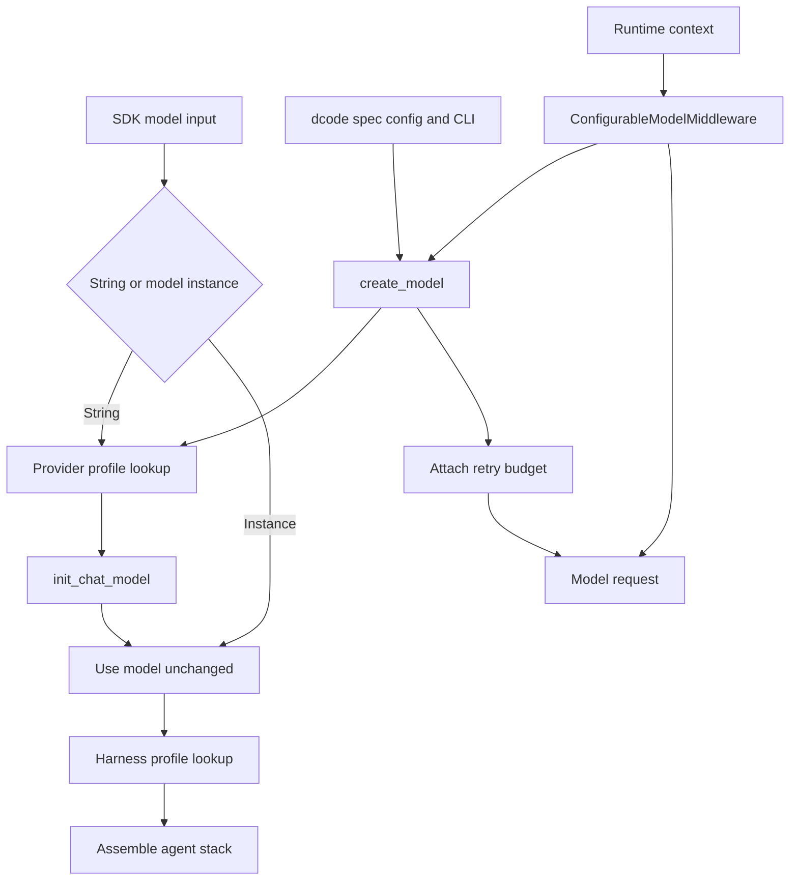

# Models, Profiles, and Retries

Deep Agents has three deliberately separate concerns:

1. **Provider profiles** add reusable behavior while a string model specification is constructed.
2. **Harness profiles** adapt the agent assembled around an already resolved model.
3. **dcode** applies operator configuration, request-scoped changes, session metadata, and the retry policy for CLI model calls.

A provider profile is not a session model selector, and a harness profile is not a provider-client configuration mechanism. dcode consumes the SDK provider-profile extension point, but dcode TOML, CLI flags, and runtime context do not register SDK profiles.

## Resolution and ownership



Caption: provider profiles affect construction, harness profiles affect assembled agent behavior, and dcode owns selection and retry policy for its calls.

## SDK provider profiles

`resolve_model` accepts `str | BaseChatModel`. A supplied model instance is returned unchanged. For a string, it calls `apply_provider_profile` and passes the resulting kwargs to `init_chat_model`; consequently, construction tuning is never retrofitted to an already-created model.

A `ProviderProfile` can provide static `init_kwargs`, a `pre_init(spec)` hook, and an `init_kwargs_factory()`. `apply_provider_profile` is the construction entrypoint: it finds the profile, runs the hook unless `run_pre_init=False`, obtains dynamic kwargs, and returns a fresh dictionary. Its precedence is:

```text
static profile kwargs < factory output < caller kwargs
```

Thus config or explicit caller settings always override profile defaults. With no match it returns a copy of caller kwargs. Hook and factory errors abort that construction path rather than leaving a partly applied profile.

### Keys, matching, and additive registration

Profiles are registered under either a provider key or a single `provider:model` key. Invalid keys and lookup specs—empty strings, more than one colon, or an empty side of a colon—do not consult the registry. A valid qualified lookup combines a provider profile with an exact-model profile, with the latter layered on top.

Re-registration is additive. Static kwargs merge by key; base `pre_init` runs before override `pre_init`; and two factories run on every resolution, with override factory output winning on collisions. The same layering model means a registration extending a built-in must explicitly set a conflicting value to replace it.

Bootstrap is lazy: importing `deepagents.profiles` alone does not populate the registries. The first lookup or registration loads built-ins and then entry-point plugins. Concurrent callers wait for bootstrap, while same-thread re-entry permits a plugin to call the public registration API. A failure in built-in bootstrap restores the prior registry state and propagates; third-party plugin enumeration, loading, target-type, and registration failures are isolated and reported. Plugin enumeration order is not a safe override contract.

## Harness profiles: agent shaping after construction

`create_deep_agent` resolves the model first and then obtains the applicable `HarnessProfile`. A string uses the original specification; for a pre-built model, lookup derives a `provider:identifier` key from model metadata. A bare identifier from a pre-built model is intentionally not used as a registry key, avoiding accidental matches against a provider-wide registration. If metadata cannot support a match, normal defaults are used.

Harness settings govern prompt composition, tool descriptions and visibility, middleware, and the automatic general-purpose subagent. `HarnessProfileConfig` is the YAML/JSON-friendly declarative subset; it can be registered directly and is converted to a runtime profile. Runtime-only `extra_middleware` cannot be exported through this config representation, so exporting such a profile raises instead of silently discarding behavior.

Provider- and model-level harness profiles merge field-wise: scalar prompt fields use an explicitly set model value, tool-description mappings merge with the model value winning per key, and exclusion sets union. Extra middleware is merged by concrete type: an override replaces the corresponding base instance in place, and a new type is appended. General-purpose-subagent settings also merge per field.

### Stack exclusions and ordering

`excluded_middleware` accepts an exact middleware class or a string equal to `AgentMiddleware.name`. It filters the assembled stack, including caller-provided middleware. Required `FilesystemMiddleware` and `SubAgentMiddleware` cannot be excluded. Invalid names, ambiguity where a string matches distinct classes, and exclusions that match no assembled stack fail fast. To remove the `task` tool, disable the automatic general-purpose subagent and do not configure synchronous subagents; async subagents are independent.

`excluded_tools` is applied differently. `create_deep_agent` appends `_ToolExclusionMiddleware` after custom and tool-injecting middleware in main, general-purpose, and declarative synchronous-subagent stacks. It removes names from the model request and rejects calls using those names, so later custom middleware cannot re-advertise the excluded tools. This makes the visible and executable tool surfaces consistent, but it is model-facing calibration rather than an authorization boundary.

A prompt profile may replace a base prompt and/or append a suffix. The suffix is applied after the applicable prompt base. When overriding the `task` description, retain its `{available_agents}` placeholder or the generated list of available subagents will not reach the model.

## dcode construction, configuration, and compatibility

`create_model` accepts a qualified spec, attempts provider inference for a bare model name, or selects a default when none is given. It canonicalizes the resolved provider/model before enforcing `models.allowed`. That allowlist gate comes before stored-credential bridging, provider-profile hooks, and provider imports, so a denied model cannot trigger those side effects.

For an admitted model, dcode applies credential handling, gathers provider/model TOML parameters, and invokes the SDK provider profile. CLI `--model-params` are final:

```text
SDK provider profile defaults < config.toml provider and model params plus credential wiring < --model-params
```

Within a provider `params` table, flat values are provider defaults and a model-named subtable shallow-merges on top. The effective-request helper then adds the resolved `base_url` before runtime overrides. Provider-profile hook or factory errors are translated to `ModelConfigError` with guidance to install/update the provider package or use explicit `--model-params`.

A configured `class_path` is instantiated directly. The Codex route is also special: it constructs its dedicated model so an OAuth token provider is wired, rather than allowing generic `init_chat_model` to select API-key behavior. dcode's `profile_overrides` are distinct from an SDK `HarnessProfile`: they merge into the resolved model object's capability `profile`. TOML profile values apply first and CLI overrides apply afterward. Capability validation is best effort when no profile exists, but explicitly `tool_calling=False` terminates agent startup because tool calling is required.

The resulting `ModelResult` records the concrete model, provider/model identity, capability-derived context and modality metadata, and retry information. dcode stamps retry metadata on the model for downstream middleware. A custom slotted model may reject that advisory attribute; it remains usable and retry middleware falls back to its startup budget.

## Runtime overrides and session state

`ConfigurableModelMiddleware` normally wraps provider-specific model middleware. Every model call reads `runtime.context`:

- `model` requests a replacement through `create_model` when it does not match the current model.
- `model_params` shallow-merges into the request's `model_settings`, without mutating the shared model.
- A normal `ModelConfigError` during a requested switch falls back to the current model unless `strict_model_resolution=True`.
- A `ModelNotAllowedError` is never swallowed by that fallback, so an administrator policy denial remains visible.

After a successful parent-agent call, the middleware returns a private checkpoint `Command`. It persists the **resolved** model spec and runtime-only model parameters for resume. Cache timing, endpoint identity, and a cache-identity projection of effective parameters are stored separately. This separation prevents configured defaults such as temperature, headers, or retry settings from becoming durable session overrides that mask later configuration changes. A failed handler call produces no checkpoint, and subagent middleware instances can disable parent-thread persistence.

## Retry ownership and behavior

`CodeModelRetryMiddleware` owns retries at dcode's model-node layer. Its retry budget resolves in this order: `--max-retries`, provider retry configuration, global retry configuration, then the default of five; zero disables retries. After constructor kwargs are merged, dcode disables a known provider SDK retry parameter to avoid a nested retry loop multiplying the user-visible attempt budget. When it cannot identify a provider retry control safely, it warns instead of guessing.

The predicate honors a direct `ModelError.is_retryable` verdict. Otherwise it recognizes selected HTTP statuses—408, 409, 429, and 5xx—known transient SDK exceptions, and selected transport failures. It walks exception-group members and cause/context chains where no direct verdict settles the branch. `GraphBubbleUp` is re-raised as graph control flow, not retried as a provider error.

For each retry, a valid `Retry-After` is honored up to 60 seconds. Otherwise the middleware uses capped, jittered exponential backoff beginning at 0.2 seconds with factor 2 and a 10-second cap. Sync and async paths share this policy. They re-raise non-retryable failures and exhausted retry failures rather than manufacturing a model response. Auxiliary calls use the selected model's stamped budget, or the standard fallback budget if it is unavailable.

## Change and test guidance

- Put reusable client-construction defaults, checks, and dynamic constructor values in `ProviderProfile`; put reusable prompt, tool, middleware, and subagent adaptation in `HarnessProfile`. Both are beta APIs.
- Use TOML and CLI options for dcode operator policy; use runtime context only for an invocation-specific target model or request parameters.
- Preserve the allowlist-before-side-effects ordering and the one-owner retry invariant when adding a provider.
- Test the owning boundary: profile key validation and merge/hook ordering; middleware exclusion coverage and final tool filtering; constructor precedence and policy denials; runtime fallback versus strict resolution and checkpoint separation; and retry classification, `Retry-After`, graph interrupts, and budget exhaustion. `test_configurable_model.py` covers the sync and async override paths, policy-denial propagation, and the resume/cache metadata distinction.

## Related pages

- [SDK construction & execution](/openwiki/architecture/sdk-construction-execution.md)
- [Configuration layering](/openwiki/concepts/config-layering.md)
<!-- openwiki: broken internal link [/openwiki/concepts/middleware-stack.md] file "/openwiki/concepts/middleware-stack.md" does not exist. Fix the href or restore the target, then delete this comment. -->
- [Middleware catalog](/openwiki/concepts/middleware-stack.md)
- [Runtime behavior](/openwiki/architecture/runtime-behavior.md)
