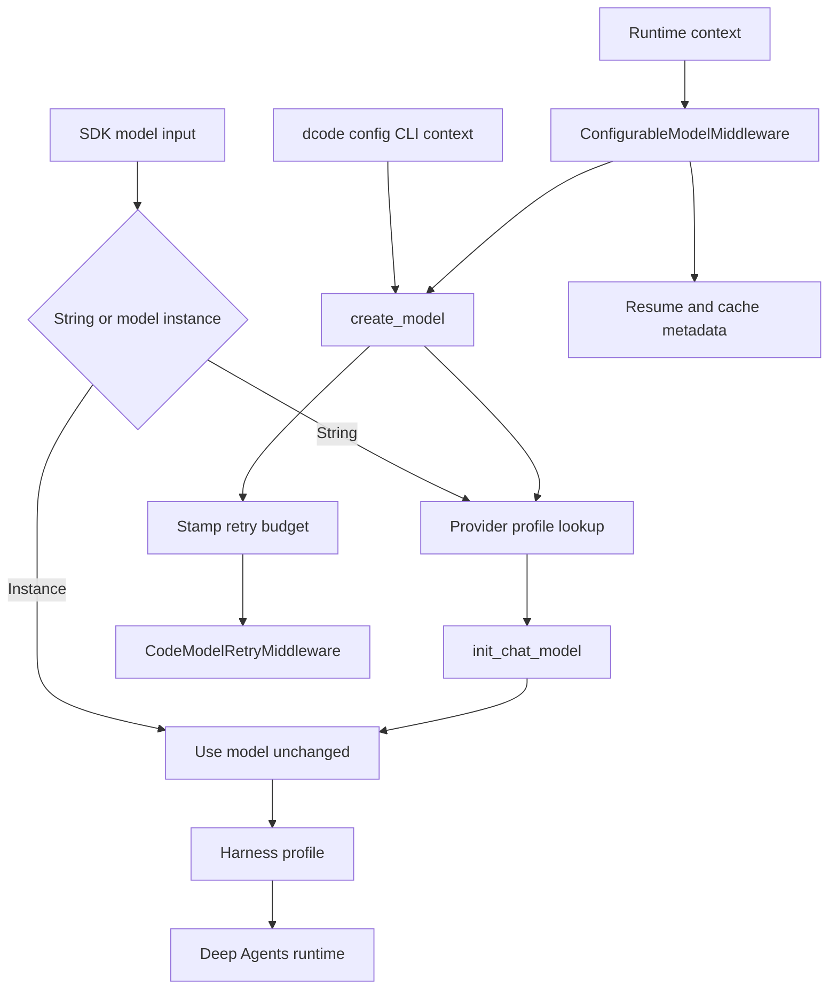

# Models, Profiles, and Retries

Model behavior is split deliberately across three owners:

1. **SDK provider profiles** adapt construction of a model named by a string.
2. **SDK harness profiles** adapt the Deep Agents runtime after the model is available.
3. **dcode** selects a concrete model for a session or request, supplies its operational configuration, persists request state, and owns retry behavior.

This separation is important when changing behavior. A provider profile is reusable constructor policy, not a way to select a session model. A harness profile shapes prompts, tools, middleware, and subagents, not the provider client. dcode consumes provider profiles but its TOML, CLI, and runtime context are separate configuration layers.

## Resolution and request flow



Caption: SDK profiles supply construction or runtime shaping, while dcode chooses and operates the model used by a request.

## SDK model resolution and provider profiles

`resolve_model` accepts `str | BaseChatModel`. A supplied `BaseChatModel` is returned as-is. For a string, it calls `apply_provider_profile` and passes the resulting kwargs to `init_chat_model`. Consequently profile construction tuning applies only while resolving a string; it does not retrofit a prebuilt model.

A `ProviderProfile` is a beta extension point with three construction-time controls:

- static `init_kwargs`;
- `pre_init(spec)` for checks or other side effects before construction; and
- `init_kwargs_factory()` for values derived when resolution occurs.

`apply_provider_profile` is the construction entrypoint rather than merely an inspection helper. It looks up the profile, optionally runs `pre_init`, invokes the factory, and makes a fresh kwargs mapping. Its precedence is:

```text
profile init_kwargs < factory output < caller kwargs
```

Thus config and explicit callers can override reusable profile defaults. No matching profile yields a copy of caller kwargs. A failing hook or factory aborts construction; it is not safe to continue with a partially applied profile.

### Keys, lookup, and layering

Provider and harness profile keys are either provider-wide (`openai`) or model-specific (`openai:gpt-5.4`). Malformed keys or specs—empty values, multiple colons, or an empty side of a colon—do not fall through to provider-wide lookup. For a valid qualified spec, resolution combines the provider profile and exact-model profile when both exist, with the exact entry taking precedence.

Profile registration is additive. For provider profiles, static kwargs merge by key; existing `pre_init` runs before the new hook; and both factories run on each resolution, with the newer factory's value winning on a collision. Register a conflicting key explicitly to override a built-in default. `ProviderProfile` also defensively copies and exposes its static kwargs read-only, so mutation of a source mapping cannot silently change a registered profile.

## Harness profiles shape the agent runtime

`HarnessProfile` is orthogonal to `ProviderProfile`: it is consumed by `create_deep_agent` after model construction. It can shape base and suffix prompts, tool-description overrides, excluded tools and middleware, extra middleware, and the default general-purpose subagent. `HarnessProfileConfig` is the file-friendly subset for YAML or JSON; use the runtime profile for `extra_middleware` or class-form middleware exclusions.

Harness registrations use the same provider/exact-model lookup convention and are additive. Incoming fields layer on the existing profile, while tool exclusions union, middleware sequences merge by concrete type, and general-purpose-subagent settings merge field by field. This supports a narrowly scoped model override without copying all provider defaults.

A harness profile is runtime adaptation, not an authorization boundary. In particular, tool exclusion controls the tool surface presented to the model; security-sensitive tool access must still be enforced by the applicable runtime policy and middleware.

## dcode construction: policy and precedence

`create_model` is dcode's concrete-model entrypoint. It accepts an explicit `provider:model` spec, infers a provider for a bare name, or obtains a default. After inference it gates the canonical resolved spec against `models.allowed` **before** stored credentials are bridged into the environment, profile hooks run, or provider packages are imported. A blocked model therefore cannot trigger those side effects.

For an admitted model, dcode obtains provider and per-model params, credential wiring, then applies the SDK provider profile. CLI model params are final:

```text
SDK provider profile defaults < config.toml provider and model params plus credential wiring < --model-params
```

Within `[providers.<name>.params]`, flat keys are provider defaults and a model-named table shallow-merges over them. `get_effective_kwargs` additionally inserts the configured `base_url` before per-request overrides; consumers that need request identity, such as cache logic, should use that effective view rather than inspect one layer alone.

Provider-profile hook and factory failures are translated to `ModelConfigError` with advice to install or update the package or supply explicit `--model-params`. That maintains a usable configuration-error boundary instead of surfacing arbitrary plugin exceptions. dcode can also construct a configured custom `class_path`, while its Codex provider follows a dedicated OAuth-backed constructor path.

`profile_overrides` are different from an SDK `HarnessProfile`: dcode applies config overrides and then CLI `--profile-override` to the resolved model's capability `profile` metadata. The returned `ModelResult` carries the resolved provider and name, context limit, unsupported modalities, and retry metadata.

## Runtime model switching and persisted state

`ConfigurableModelMiddleware` is typically the outer model middleware so it can act before provider-specific middleware. On each call it reads `runtime.context`:

- `model` requests a replacement via `create_model` when it does not match the current model;
- `model_params` shallow-merges into that request's `model_settings`; and
- a cross-provider swap away from Anthropic removes Anthropic-only request settings.

A policy denial (`ModelNotAllowedError`) is always propagated. Other `ModelConfigError` failures fall back to the current model by default, or propagate when `strict_model_resolution` is enabled. The async route constructs the replacement in a worker thread.

After a successful parent-agent call, the middleware returns a private checkpoint `Command`. It records the **resolved** model spec and only runtime `model_params` for resume. Cache endpoint identity and the cache-relevant projection of effective params are stored separately. This division prevents configured defaults such as headers, temperature, or retry values from becoming stale session overrides when a thread resumes, while allowing cache-identity comparison to include configured cache knobs. Failed calls do not create this completion update, and subagent middleware instances can disable parent-thread persistence.

## Retry ownership and lifecycle

`CodeModelRetryMiddleware` owns dcode's model-node retry budget. Construction resolves it in this order: `--max-retries`, provider retry configuration, global retry configuration, then the default of five. The resolved budget is stamped on the concrete model so a runtime model switch carries its own policy; a model that rejects the private attribute remains usable and causes retry middleware to use its startup fallback.

dcode disables a known provider SDK retry kwarg after merging constructor kwargs. This avoids multiplying model-node attempts with nested SDK retries. If dcode cannot identify a provider retry control, it warns rather than guessing an argument.

The retry predicate treats a direct `ModelError.is_retryable` decision as authoritative. Otherwise it recognizes selected HTTP statuses (408, 409, 429, and 5xx), known provider SDK errors, and narrow transport signals, including relevant failures nested in exception groups or cause/context chains. `GraphBubbleUp` is re-raised as graph control flow.

For a retryable failure, a valid positive `Retry-After` is used up to 60 seconds; otherwise the layer uses jittered exponential backoff beginning at 0.2 seconds, doubling with a 10-second cap. A retry guard can impose a cumulative sleep ceiling for calls under an enclosing deadline, refusing the retry so the original provider error remains visible. The same shared policy is available to auxiliary calls through `retry_model_call` and `aretry_model_call`.

The middleware emits correlated attempt start/complete and retry stream events. If a retry supersedes an attempt after visible output may have begun, the event communicates that fact so clients can mark the partial response incomplete rather than display it as a completed answer. Event readers validate untrusted counters and correlation fields before rendering them.

## Change and test guidance

- Put reusable provider-client defaults, preflight checks, or dynamic constructor kwargs in `ProviderProfile`; put prompts, tool visibility, middleware, and default subagent changes in `HarnessProfile`.
- Put operator policy in `config.toml`, CLI options, and retry settings; use runtime context only for an invocation-specific model or request settings.
- Preserve ordering boundaries: allowlist before credentials and hooks; profile defaults beneath config and CLI kwargs; and retry ownership above known SDK retry loops.
- Focus tests on lookup and merge order, malformed keys, allowlist side-effect ordering, strict versus fallback model resolution, checkpoint separation, retry classification and `Retry-After`, graph interrupts, visible partial streaming, and cumulative delay caps. dcode's `test_configurable_model.py` and `test_model_retry.py` cover the middleware owners.

## Related pages

- [Code agent](/openwiki/architecture/code-agent.md)
- [Middleware stack](/openwiki/architecture/middleware-stack.md)
- [Configuration layering](/openwiki/concepts/config-layering.md)
- [State persistence](/openwiki/concepts/state-persistence.md)
