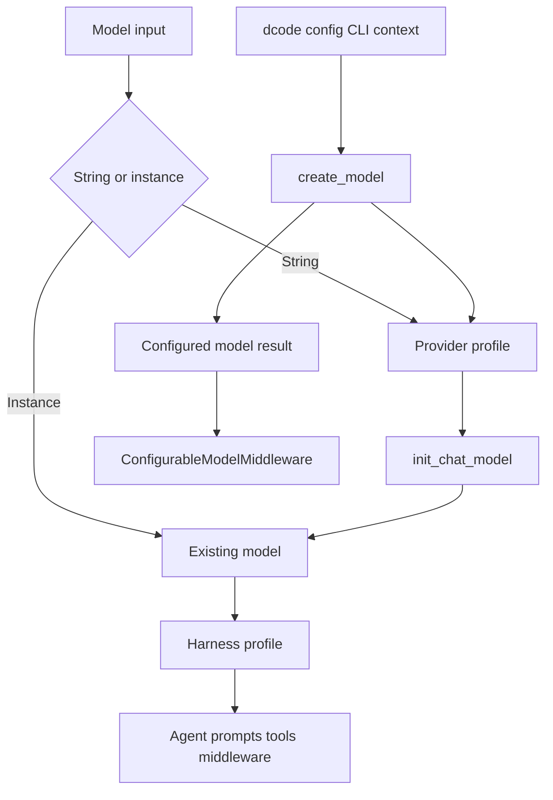

# Models and Profiles

Deep Agents separates two deliberately different extension points:

- A **provider profile** controls construction of a chat-model client: static and dynamic `init_chat_model` kwargs plus a pre-construction hook.
- A **harness profile** controls the agent assembled around an already resolved model: prompts, visible tools, middleware, and the default subagent.

dcode builds on the provider-profile layer but adds operator-facing configuration, credentials, allowlisting, request-time switching, and resume metadata. A dcode `profile_overrides` setting modifies a model object's capability `profile`; it is not a `HarnessProfile` registration.

## Resolution and profile ownership



Caption: provider profiles precede client construction, while harness profiles shape agent assembly; dcode can select a different constructed model for an individual call.

`resolve_model` accepts either a string specification or a `BaseChatModel`. It returns an instance unchanged, whereas it resolves a string through `init_chat_model` after applying its provider profile. Consequently, provider-profile defaults do not retrofit a model that the caller already constructed. Model identity inspection accommodates both `model_name` and `model`; for a qualified match it compares normalized provider names, but falls back to identifier-only matching when a custom model does not expose provider metadata.

## Provider profiles: construction-time layers

Register a `ProviderProfile` under a provider key such as `openai`, or under a qualified key such as `openai:gpt-5.4`. The first colon is structural: model identifiers may themselves contain colons, including Bedrock-style identifiers. Empty keys, empty halves, leading/trailing whitespace, and whitespace adjacent to the first colon are rejected at registration.

A provider profile can provide:

- immutable `init_kwargs` defaults;
- `pre_init(spec)`, for a validation or other required pre-construction side effect; and
- `init_kwargs_factory()`, for values that must be calculated at resolution time, such as environment-derived settings.

`apply_provider_profile` is the construction helper. It looks up the profile, runs `pre_init` by default, obtains dynamic kwargs, and produces a new dictionary. Its precedence is:

```text
profile init_kwargs < factory output < caller kwargs
```

Set `run_pre_init=False` only for inspection/dry-run style paths that must not perform the hook's side effects. Hook and factory failures stop profile application; dcode converts unexpected such failures to a `ModelConfigError` with guidance to install/update the provider package or use `--model-params`.

Lookup checks an exact key and then its provider default. If both exist, the exact entry is layered over the provider entry. Re-registration is also additive: static kwargs merge with the later value winning, pre-init hooks run base then override, and both factories run on every resolution with later output winning. This supports a plugin or application overlay without copying built-in defaults.

### Bootstrap and plugin boundary

The provider and harness registries bootstrap lazily on their first lookup or registration, rather than when `deepagents.profiles` is imported. Built-ins load first; third-party zero-argument entry points from `deepagents.provider_profiles` and `deepagents.harness_profiles` load afterward and therefore layer on top. Bootstrap coordinates concurrent callers so they do not see a partial registry, permits same-thread re-entry from plugin registration, and restores both registries if built-in bootstrap fails. A broken third-party entry point is reported and skipped; consumers must not rely on entry-point ordering for overrides.

## Harness profiles: agent-runtime shaping

`create_deep_agent` resolves the model and then selects a `HarnessProfile` for the original string specification or, for a pre-built model, from its provider and identifier. A profile can set a replacement base prompt or a suffix, rewrite selected tool descriptions, exclude tools or middleware, add middleware, and alter the auto-added `general-purpose` subagent.

Provider-level and exact-model harness entries merge field by field. Single prompt fields inherit unless explicitly set by the exact model; tool-description mappings are key-wise with exact-model values winning; exclusion sets union; and general-purpose-subagent fields merge independently. Extra middleware merges by concrete type: an overriding instance replaces the base instance at its position, and new types append. Use a factory when each assembled stack needs fresh middleware instances.

The constructor applies the selected profile to the main stack and to the stacks it builds for the general-purpose and declarative synchronous subagents. It does not inject local profile middleware into a supplied compiled subagent or a remote asynchronous subagent, because those have their own already-defined runtime.

### Prompts, tools, and middleware safeguards

A profile prompt overlay replaces a stack's base only when `base_system_prompt` is set, then appends `system_prompt_suffix`. Thus a suffix is applied closest to the conversation after the caller/base prompt. A `task` description override should retain `{available_agents}` so `SubAgentMiddleware` can expose the available-subagent list.

`excluded_tools` is model-surface calibration, not authorization. `_ToolExclusionMiddleware` is appended after custom and tool-injecting middleware, allowing it to remove both caller tools and injected tools from the assembled stacks. It also rejects a model-emitted call to an excluded tool rather than executing it.

`excluded_middleware` is a stricter assembly constraint. It can match an exact middleware class or an instance `.name`, filters the fully assembled stack (including caller middleware), and fails when an entry matches nothing. Required `FilesystemMiddleware` and `SubAgentMiddleware` cannot be excluded. To remove the `task` tool, disable the default general-purpose subagent and provide no synchronous subagents; asynchronous subagents are independent.

`HarnessProfileConfig` is the YAML/JSON-friendly subset. It represents middleware exclusions as names and intentionally cannot serialize `extra_middleware`; exporting a runtime profile with such middleware raises instead of silently dropping runtime behavior.

## dcode model construction

`create_model` accepts a qualified `provider:model` spec, infers a provider from a bare model name, or obtains a default spec. It canonicalizes that result and applies `models.allowed` **before** credential bridging, provider-profile hooks, or provider imports. A rejected runtime selection must propagate as `ModelNotAllowedError`, rather than silently falling back to the current model.

For an admitted model, dcode obtains provider/per-model parameters, bridges stored credentials when applicable, applies the SDK provider profile, and finally applies CLI/request kwargs. The effective constructor ordering is:

```text
SDK provider profile defaults < config.toml provider and model params plus credential wiring < --model-params
```

Within a provider `params` table, scalar entries are provider-wide and a model-named table shallow-merges on top. `get_effective_kwargs` additionally inserts a resolved `base_url` before per-request overrides; cache-related consumers should use it instead of reconstructing precedence. dcode supports a configured custom `class_path`, while the Codex provider constructs its OAuth-aware model directly so it can use its token provider rather than an API-key client.

After construction, config and CLI profile overrides are layered into the model's capability metadata. dcode derives the returned `ModelResult`'s context limit and unsupported modalities from that metadata, and attaches retry metadata to the concrete model. A slotted custom model may reject that private attribute; construction remains successful and retry middleware uses its startup fallback.

## Per-call model selection and resume state

`ConfigurableModelMiddleware` is normally outside provider-specific middleware. For each model call it reads the validated runtime context:

- a different `model` specification is constructed through `create_model`;
- `model_params` shallow-merge into that call's `model_settings`, without mutating a shared model; and
- a cross-provider switch away from Anthropic removes Anthropic-only settings such as `cache_control`.

A failed ordinary model resolution logs and retains the current model unless `strict_model_resolution=True`; an allowlist denial is always re-raised. When a replacement succeeds, the middleware also updates the Model Identity prompt section from that `ModelResult`, avoiding stale provider, name, context, or modality information.

After a successful parent call, the middleware returns an `ExtendedModelResponse` carrying a private checkpoint `Command`. Resume fields record the *resolved* spec and runtime-only `model_params`; effective cache identity parameters and endpoint identity are stored in separate fields. This separation is important: writing merged configuration defaults into `_model_params` would turn old defaults into a persistent session override after configuration changes. Calls that fail do not create this update, and subagent middleware instances can disable parent-thread persistence. The async path runs model construction and cache/config reads off the event loop.

## Focused change and test guidance

- Put reusable client construction behavior in a provider profile and reusable agent behavior in a harness profile; both APIs are beta and merge additively.
- Test qualified keys with colon-containing model identifiers, exact-versus-provider layering, hook/factory ordering, and plugin failure isolation.
- Test harness behavior through `create_deep_agent`: profile selection for pre-built models, prompt/tool placement, required-middleware rejection, and profile scope across main and subagent stacks. `test_graph.py` covers representative profile lookup, tool-description, subagent, extra-middleware, and exclusion behavior.
- For dcode, test the allowlist before credentials/hooks/imports, constructor precedence, strict versus fallback switch failures, preservation of policy denials, and checkpoint separation between runtime overrides and cache identity.

## Related pages

- [Middleware stack](/openwiki/architecture/middleware-stack.md)
- [SDK construction and execution](/openwiki/architecture/sdk-construction-execution.md)
- [Configuration layering](/openwiki/concepts/config-layering.md)
- [Build a Deep Agent](/openwiki/workflows/build-a-deep-agent.md)
- [Run a dcode session](/openwiki/workflows/run-dcode-session.md)
