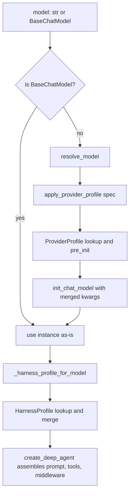

# Profiles & Model Resolution

Deep Agents accepts a model as either a `provider:model` string (e.g.
`"openai:gpt-5.4"`) or a pre-built `BaseChatModel` instance. Turning that input
into a running agent involves two distinct, orthogonal phases, each governed by
its own profile registry:

- **Provider profiles** control the **model-construction** phase — how
  `resolve_model` builds the chat model (the `init_chat_model` kwargs,
  pre-initialization side effects, and kwargs derived from runtime state).
- **Harness profiles** control the **runtime** phase — how `create_deep_agent`
  shapes the agent *after* the model is built (prompt assembly, tool visibility,
  middleware, and default-subagent behavior).

Both registries are keyed identically (a `provider` key or a full
`provider:model` key), share the same validation and lookup grammar, and use the
same additive-merge semantics. But they are consulted at different times and
tune different things.

## Two-phase resolution flow

Caption: A model string flows through provider-profile-aware construction, then
the resolved model is matched to a harness profile that tunes the runtime stack.

## Model resolution: `resolve_model`

`resolve_model` is the single entry point that normalizes a model argument into a
`BaseChatModel`. If the argument is already a `BaseChatModel`, it is returned
unchanged; a string is passed to LangChain's `init_chat_model`, composed with any
matching provider profile's kwargs via `apply_provider_profile(model)`.

Because a pre-built instance bypasses provider profiles entirely, provider-level
construction tuning only applies to string specs.

Alongside resolution, `_models.py` provides inspection helpers used throughout
the system:

- `get_model_identifier` extracts the provider-native model id, tolerating that
  providers disagree on the field name (`model_name` vs `model`).
- `get_model_provider` reads `ls_provider` from `_get_ls_params()`; a missing,
  raising, or non-mapping result is logged at INFO and treated as "provider
  unavailable" rather than raising, so a custom integration silently misses its
  profile instead of crashing.
- `model_matches_spec` decides whether an already-built model already matches a
  string spec (used, for example, by the runtime model-override middleware).
  Provider comparison is normalized through `_normalize_provider` so case,
  hyphen/underscore spelling, and known aliases (`azure_openai`→`azure`,
  `mistralai`→`mistral`) do not read as mismatches; when the model's provider
  cannot be inspected, it falls back to identifier-only matching.

## Provider profiles (model construction)

A `ProviderProfile` is a frozen dataclass declaring three model-construction
concerns:

- `init_kwargs` — static kwargs forwarded to `init_chat_model`. They are frozen
  into a read-only `MappingProxyType` on construction and copied into the
  registry, so neither the caller's original dict nor the registered profile can
  be mutated after the fact.
- `pre_init` — an optional callable invoked with the raw spec *before*
  construction. It runs before the factory and before `init_chat_model`; if it
  raises, no model is built. It exists for side-effectful checks such as
  minimum-version enforcement.
- `init_kwargs_factory` — an optional zero-arg factory that produces dynamic
  kwargs at resolution time (e.g. reading environment variables).

`apply_provider_profile` composes these: it looks up the profile, runs
`pre_init` (unless suppressed), and returns a fresh dict combining
`init_kwargs`, `init_kwargs_factory()` output, and any caller-supplied kwargs.
Precedence within a single profile is factory-over-static; caller-supplied kwargs
sit on top of everything, so config-file or explicit values are never silently
replaced. When no profile matches, it returns the caller kwargs unchanged, making
it safe to call unconditionally.

`get_provider_profile` is the inspection-only counterpart; the docs steer callers
who intend to actually build a model toward `apply_provider_profile`, which fuses
lookup, `pre_init`, and merge into one call.

### Built-in provider profiles

Three provider profiles ship with the SDK, registered directly (not via entry
points) during lazy bootstrap:

- `openai` — sets `use_responses_api=True`, enabling the OpenAI Responses API by
  default for all `openai:*` models.
- `nvidia` — a factory that injects the `X-BILLING-INVOKE-ORIGIN: DeepAgents`
  header (via `default_headers`) for NVIDIA NIM app attribution.
- `openrouter` — a `pre_init` that enforces a minimum `langchain-openrouter`
  version, plus a factory that injects `app_url`/`app_title` attribution defaults
  (deferring to `OPENROUTER_APP_URL`/`OPENROUTER_APP_TITLE` when set) and
  `openrouter_provider={"ignore": ["azure"]}` to avoid routing reasoning calls
  through Azure's stateless `/responses` beta. The Azure ignore is opt-out via
  `DEEPAGENTS_OPENROUTER_ALLOW_AZURE`.

## Harness profiles (runtime shaping)

A `HarnessProfile` is a frozen dataclass consumed by `create_deep_agent` after
the model exists. Its fields tune four runtime concerns:

- `base_system_prompt` / `system_prompt_suffix` — the `BASE` and `SUFFIX` slots
  in prompt assembly. Most built-in profiles set only `system_prompt_suffix`, so
  the suffix lands last (closest to conversation history) while each stack keeps
  its own base prompt. The suffix is applied uniformly to the main agent,
  declarative subagents, and the auto-added general-purpose subagent.
- `tool_description_overrides` — per-tool description replacements keyed by tool
  name. Applied only where a stable description hook exists (built-in filesystem
  tools, the `task` tool, `BaseTool`/dict tools); stale keys silently no-op.
- `excluded_tools` — tool names to remove from the visible tool set (see below).
- `excluded_middleware` — middleware classes or `.name` strings to strip from the
  fully assembled stack, including instances passed via
  `create_deep_agent(middleware=[...])`. Required scaffolding
  (`FilesystemMiddleware`, `SubAgentMiddleware`) cannot be excluded — this is
  validated at `HarnessProfile` construction so typos fail fast. Entries that
  match nothing are also rejected as likely typos.
- `extra_middleware` — middleware appended to every stack the profile applies to
  (a static sequence or a factory). It is runtime-only and intentionally absent
  from the file-backed `HarnessProfileConfig`.
- `general_purpose_subagent` — edits to the auto-added `general-purpose`
  subagent, including a three-state `enabled` flag that can disable it (dropping
  the `task` tool when no other synchronous subagents exist).

`HarnessProfileConfig` is the declarative, file-friendly subset for YAML/JSON
profiles; `to_harness_profile`/`from_harness_profile` convert between the two.
The conversion is intentionally asymmetric: config→profile is lossless, but
profile→config *raises* when a runtime profile carries `extra_middleware`, rather
than silently dropping it.

### Built-in harness profiles

Deep Agents ships harness profiles for several frontier specs, all keyed at the
exact `provider:model` level so behavior of sibling models is untouched:

- `anthropic:claude-sonnet-4-6`, `anthropic:claude-opus-4-7`, and Haiku carry
  Anthropic's universal Claude guidance suffix (parallel tool calls, grounded
  answers, post-tool-result reflection); Opus 4.7 adds overlays that counter its
  documented under-use of tools and subagents. The Sonnet 4.6 module deliberately
  ships only the universal suffix and documents *why* no model-specific overlay
  applies.
- `openai:gpt-5.1-codex` / `5.2-codex` / `5.3-codex` share a Codex behavior
  suffix and add a fresh `TodoListMiddleware` (the `write_todos` tool) via
  `extra_middleware`, because the suffix references reconciling TODOs.

## Profile matching and merge semantics

Both registries resolve a spec the same way (`get_provider_profile` /
`_get_harness_profile`):

1. **Exact match** on the full spec.
2. **Provider prefix** (everything before the first `:`), when the spec contains a
   colon with non-empty halves.
3. `None` when neither matches.

When both an exact-model profile and a provider-level profile exist, they are
**merged**, with the exact-model entry overriding the provider-level entry.
Malformed specs (empty, more than one `:`, or a colon with an empty half) return
`None` without consulting the registry, so `"openai:"` never silently matches the
provider-wide `"openai"` registration.

Merge semantics are field-appropriate and additive rather than replacing:

- Provider profiles: `init_kwargs` merge (override wins per key); `pre_init`
  callables **chain** (base then override); `init_kwargs_factory` callables both
  run at every resolution and their outputs merge (override wins).
- Harness profiles: single-value fields (`base_system_prompt`,
  `system_prompt_suffix`) take the override when set else the base;
  `tool_description_overrides` merge per key; `excluded_tools` and
  `excluded_middleware` are **unioned**; `extra_middleware` merges by class type;
  `general_purpose_subagent` fields merge one at a time so a model-level
  `enabled=True` can re-enable what a provider-level `enabled=False` disabled.

Re-registering under an existing key is also additive: `register_provider_profile`
and `register_harness_profile` merge the incoming profile on top of the existing
one rather than replacing it.

### Matching a pre-built model

When the caller passes a model *string*, `create_deep_agent` uses that string
directly for harness lookup. When the caller passes a pre-built instance (no
spec), `_harness_profile_for_model` reconstructs a canonical `provider:identifier`
key from the model's inspected provider and identifier, then falls back to an
identifier-only lookup (only when the identifier itself is in `provider:model`
shape) and finally a provider-only lookup. A *bare* identifier is deliberately
never consulted, so an in-house proxy whose `model_name` happens to equal a
registered provider key does not accidentally inherit that provider's profile.
When nothing matches, an empty `HarnessProfile()` null object is returned; a miss
against a non-empty registry logs at WARNING to surface the common "my profile
isn't applying" failure.

## How `excluded_tools` narrows the tool surface

`excluded_tools` is applied by appending a `_ToolExclusionMiddleware` to the
assembled stack. It runs **after** all tool-injecting middleware and after any
caller-supplied custom middleware, so it can remove both user-supplied tools and
tools added by Deep Agents middleware, and a custom `wrap_model_call` cannot
restore an excluded name. The same exclusion set is applied to the main agent,
the general-purpose subagent, and declarative synchronous subagents whose model
resolves to the profile.

Exclusions are explicitly documented as **model-facing calibration resolved per
model — not a security surface**. To hide required scaffolding's tools without
removing the middleware itself, `excluded_tools` is the sanctioned path (since
`excluded_middleware` refuses to strip scaffolding).

## Registration lifecycle and extension

Built-in profiles are not registered at import time; they load lazily on first
registry access via `_ensure_builtin_profiles_loaded`. Bootstrap runs two phases:
built-in `register()` functions first (a broken built-in raises loudly), then
third-party plugins discovered through `importlib.metadata` entry points in the
`deepagents.provider_profiles` and `deepagents.harness_profiles` groups (plugin
failures are logged and skipped so one bad distribution cannot break import).
Bootstrap is guarded to run exactly once per interpreter, is thread-safe (other
threads block until it finishes; same-thread re-entry from a plugin's
registration short-circuits), and rolls the registries back on failure. Because
built-ins load first, third-party or user registrations under the same key layer
on top via the additive merge.

Extension points, then, are: `register_provider_profile` /
`register_harness_profile` for programmatic use, `HarnessProfileConfig` for
file-backed profiles, and the two entry-point groups for packaged plugins.

## Concrete customization: the `deepagents_code` package

The code harness (`deepagents_code`) demonstrates profile customization at scale.
Its `model_config.py` and `configurable_model.py` are large modules that manage
model configuration from TOML and support switching the model per invocation
through LangGraph runtime context (via `model_matches_spec` and the model
inspection helpers from `_models`).

`_glm_5p2_profile.py` is a focused example of a downstream harness profile:

- It registers a prompt-only `HarnessProfile` (an execution-focused
  `system_prompt_suffix`) for three exact GLM-5.2 specs across the Fireworks,
  OpenRouter, and Baseten providers.
- Registration is idempotent and *defensive*: because
  `register_harness_profile` merges with the incoming profile winning on scalar
  conflicts, it explicitly skips any spec that already carries a suffix so a
  user override or built-in is not clobbered.
- The measured Fireworks-only terminal-stall recovery is kept **out** of the
  process-global profile and instead installed as a separate middleware
  (`_GlmTerminalStallRecovery`) only in headless mode, because whether a session
  is interactive is known only when `create_cli_agent` assembles its stack. That
  middleware retries a capped, tool-free turn at most once with reasoning
  disabled and a forced tool call — illustrating the boundary between
  process-wide profile tuning and context-dependent runtime middleware.

## Related pages

- [Middleware stack](/openwiki/architecture/middleware-stack.md) — where
  `_ToolExclusionMiddleware`, prompt caching, and `extra_middleware` land in the
  assembled order.
- [SDK construction & execution](/openwiki/architecture/sdk-construction-execution.md)
  — how `create_deep_agent` consumes the resolved model and harness profile.
- [Tools & filesystem](/openwiki/concepts/tools-filesystem.md) — the tools that
  `excluded_tools` and `tool_description_overrides` target.
