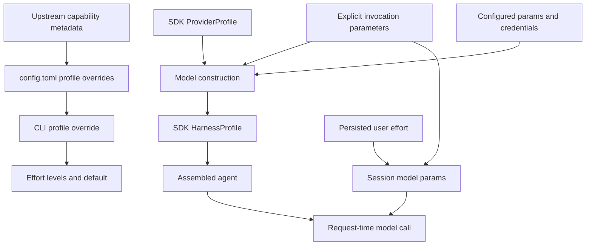
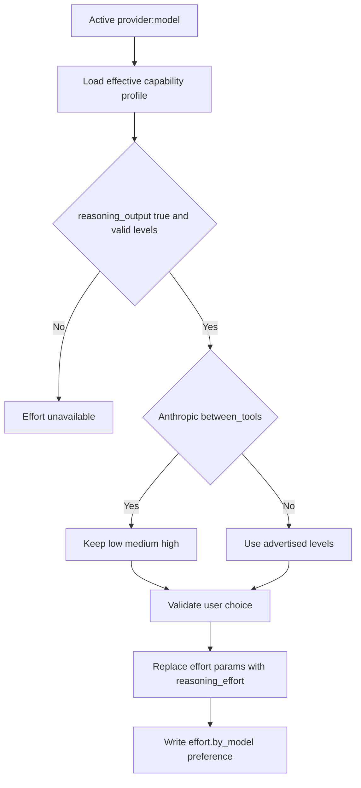
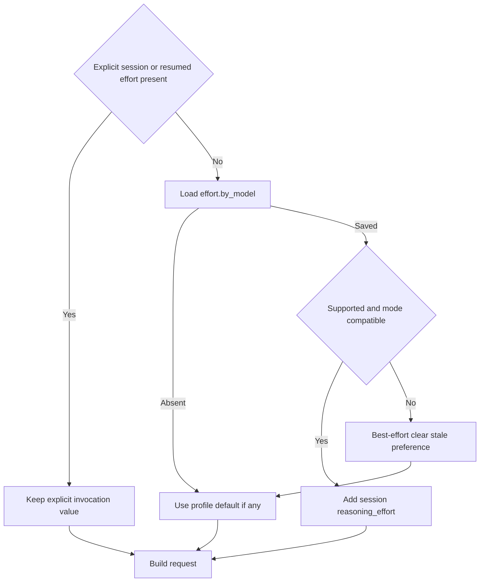

# Models and Harness Profiles

Deep Agents has two deliberately separate extension layers:

- A **`ProviderProfile`** affects construction of a model from a string: validation before construction, static constructor defaults, and dynamically generated constructor kwargs.
- A **`HarnessProfile`** affects assembly of an already resolved model into a Deep Agents graph: prompts, tool descriptions and visibility, middleware, and the general-purpose subagent.

These are not LangChain capability metadata. A model's `profile` describes capabilities such as context size, modalities, and reasoning-effort support. dcode can overlay that metadata from configuration or `--profile-override`; it does not turn it into a harness profile.


```mermaid
flowchart TD
    Cap["Upstream capability metadata"] --> CapConfig["config.toml profile overrides"]
    CapConfig --> CapCli["CLI profile override"]
    CapCli --> Effort["Effort levels and default"]
    Provider["SDK ProviderProfile"] --> Construct["Model construction"]
    Config["Configured params and credentials"] --> Construct
    Invoke["Explicit invocation parameters"] --> Construct
    Construct --> Harness["SDK HarnessProfile"]
    Harness --> Agent["Assembled agent"]
    Saved["Persisted user effort"] --> Session["Session model params"]
    Invoke --> Session
    Session --> Request["Request-time model call"]
    Agent --> Request
```

Caption: Capability metadata, construction profiles, harness overlays, configuration, explicit request settings, and saved user preferences have different owners and precedence rules.

## Resolution boundaries

`resolve_model` returns a supplied `BaseChatModel` unchanged. For a string specification, it calls `apply_provider_profile(model)` and passes the resulting kwargs to `init_chat_model`. Provider construction tuning therefore applies to string specs, not retroactively to a prebuilt instance. `create_deep_agent` resolves the model before it resolves and applies a harness profile.

Provider and harness registries recognize provider keys such as `openai` and qualified keys such as `openai:gpt-5.4`. An exact model overlay is merged over the provider default, and the first colon alone separates the provider: model identifiers may contain further colons. Empty specs and empty halves do not match. This allows a provider baseline with narrow model-specific changes.

For provider profiles, registration is additive: static kwargs merge by key, hooks run base then override, and both kwargs factories run at resolution with the latter output winning. At application time, the order is:

```text
ProviderProfile init_kwargs < ProviderProfile factory output < caller kwargs
```

A profile miss returns a copy of caller kwargs. dcode converts hook or factory failures into `ModelConfigError`, rather than exposing an arbitrary plugin exception to the interactive error path.

## Harness overlays are not constructor settings

A `HarnessProfile` is selected after model resolution. It can set or suffix the system prompt, override tool descriptions, exclude tools or middleware, add runtime middleware, and configure the general-purpose subagent. Its serializable `HarnessProfileConfig` deliberately excludes runtime-only extra middleware.

Harness merging keeps a provider baseline while expressing model intent: scalar prompt fields and conflicting tool descriptions prefer the model overlay; exclusions union; middleware is merged by concrete type; and subagent fields merge independently.

Tool exclusion deserves a security distinction. `create_deep_agent` appends the exclusion middleware after custom and tool-injecting middleware. It filters excluded tools from each outbound model request and rejects a later call to one, aligning advertised and executable tools for that request. It is not authorization. Middleware exclusions can remove matching caller middleware but cannot remove `FilesystemMiddleware` or `SubAgentMiddleware`, and unmatched exclusions fail rather than silently doing nothing.

## dcode configuration and capability metadata

`create_model` infers or parses a provider, then enforces `models.allowed` before credential bridging, provider-profile hooks, or provider imports. For normal model construction, the relevant precedence is:

```text
SDK ProviderProfile defaults
  < config.toml provider params
  < config.toml per-model params and credential wiring
  < explicit CLI or runtime model parameters
```

Within a provider `params` table, flat keys are provider-wide and a model-named table shallow-merges over them. This constructor-parameter chain is independent of capability metadata. dcode merges upstream capability profiles with config profile overrides and then `--profile-override`; the latter applies to every profile entry and wins per key. `create_model` also applies configured and CLI capability overrides to the concrete model's `profile`, then records usable context-limit and explicitly unsupported modality information in `ModelResult`.

`openai_codex` is a construction exception: dcode uses its OAuth-aware builder rather than generic `init_chat_model`. OpenAI and Codex also have an effort-shape compatibility step: when a high-priority flat `reasoning_effort` accompanies an existing native `reasoning` mapping, dcode writes it into `reasoning.effort` and removes the flat key. An explicit native `reasoning.effort` supplied at the same high-priority layer wins instead.

## Profile-driven reasoning effort

`/effort` obtains the advertised levels and default from the effective capability profile, not from a provider-name list. A profile is eligible only when `reasoning_output` is exactly `True`. `reasoning_effort_levels` must be a list of strings; malformed profile data is warned about and treated as no selectable effort. A configured or CLI profile override can therefore add or replace the reasoning fields used by the UI.

The selector's available choices are further constrained by effective request mode. For Anthropic with `thinking.type = "between_tools"`, only `low`, `medium`, and `high` remain available; other thinking modes preserve the advertised levels. The status row reports, in order, an explicit session/native effort, the profile default, or `effort?` when choices exist but the provider default is unknown.


```mermaid
flowchart TD
    Start["Active provider:model"] --> Profile["Load effective capability profile"]
    Profile --> Check{"reasoning_output true and valid levels"}
    Check -->|No| Unavailable["Effort unavailable"]
    Check -->|Yes| Mode{"Anthropic between_tools"}
    Mode -->|Yes| Filter["Keep low medium high"]
    Mode -->|No| Levels["Use advertised levels"]
    Filter --> Choice["Validate user choice"]
    Levels --> Choice
    Choice --> Apply["Replace effort params with reasoning_effort"]
    Apply --> Save["Write effort.by_model preference"]
```

Caption: `/effort` derives choices from profile metadata and rejects a choice incompatible with the active Anthropic thinking mode.

### Native parameter compatibility

The UI stores its session override in the portable flat form, `reasoning_effort`, while preserving unrelated model parameters. Before setting one, it removes known canonical and provider-native effort forms. The compatibility reader and cleanup recognize these locations:

| Provider | Read precedence / native locations |
|---|---|
| OpenAI and `openai_codex` | `reasoning.effort`, then `reasoning_effort` |
| Anthropic | `effort`, then `reasoning_effort`, then `output_config.effort` |
| Google GenAI | `thinking_level`, then `reasoning_effort`, then `thinking_config.thinking_level` |
| Fireworks | `reasoning_effort` or `model_kwargs.reasoning_effort` |
| xAI | `reasoning_effort` or `extra_body.reasoning_effort` |

For Fireworks, both recognized forms present at once are treated as conflicting: dcode warns and reports no current value, although their presence still blocks restoration of a saved preference. Clearing an Anthropic effort also removes the legacy adaptive-thinking object only when it exactly matches the legacy shape; it does not remove unrelated siblings or thinking configuration.

### Persistence and precedence

A successful `/effort <level>` changes this session immediately and attempts to write `[effort.by_model]` in `~/.deepagents/config.toml`, keyed by canonical `provider:model`. Reads use effective managed-plus-user configuration; writes are lock-protected read-modify-write operations with a temporary file and rename. A save failure is visible to the user but does not roll back the active session setting. `/effort clear` removes both the session effort forms and the saved preference; its persistence failure is likewise reported after the session change.

At startup and after model resolution, dcode restores a saved effort only when the active session or resumed-thread `model_params` contain no canonical or native effort parameter. It then rejects and best-effort clears a saved label that the current profile no longer supports, and does not restore one that is incompatible with the active `between_tools` mode. Explicit invocation parameters and resumed request parameters therefore beat persisted user preferences.


```mermaid
flowchart TD
    Params{"Explicit session or resumed effort present"}
    Params -->|Yes| Keep["Keep explicit invocation value"]
    Params -->|No| Load["Load effort.by_model"]
    Load -->|Absent| Default["Use profile default if any"]
    Load -->|Saved| Valid{"Supported and mode compatible"}
    Valid -->|Yes| Restore["Add session reasoning_effort"]
    Valid -->|No| Clear["Best-effort clear stale preference"]
    Restore --> Request["Build request"]
    Keep --> Request
    Default --> Request
    Clear --> Default
```

Caption: Explicit invocation and resume state override persisted effort; a saved preference is only a validated fallback.

## Request-time model switching

`ConfigurableModelMiddleware` reads `model` and `model_params` from runtime context on each model call. A changed model spec is constructed through `create_model`; otherwise, request parameters are merged into the call. In the normal interactive path a `ModelConfigError` from a replacement logs and retains the current model, while policy denials and strict-resolution failures propagate. Async construction runs outside the event loop.

After a successful parent call, the middleware persists the resolved model and runtime-only model parameters for resume, while it stores cache endpoint and effective cache-identity parameters separately. This avoids replaying configured defaults—such as a temperature, headers, or retry settings—as stale session overrides. Main-agent middleware persists this state; subagent stacks disable it; rubric grading enables strict runtime resolution.

## Change guidance and focused tests

Put reusable SDK-client construction behavior in a `ProviderProfile`; put reusable Deep Agents graph behavior in a `HarnessProfile`; put capability facts and effort labels in model `profile` metadata; use configured params for operational defaults; and use runtime context for one invocation or resumed-session overrides. Do not use tool exclusions as an access-control boundary.

`libs/code/tests/unit_tests/test_reasoning_effort.py` covers profile override restoration, persisted preference precedence, persistence failures, unknown defaults, and the Anthropic `between_tools` constraint. When adding a provider integration, test both its native parameter reader/cleanup path and the final constructor shape, in addition to profile metadata and persistence behavior.

## Related pages

- [Code agent](/openwiki/architecture/code-agent.md)
- [Middleware stack](/openwiki/architecture/middleware-stack.md)
- [Configuration layering](/openwiki/concepts/config-layering.md)
- [Run a dcode session](/openwiki/workflows/run-dcode-session.md)
