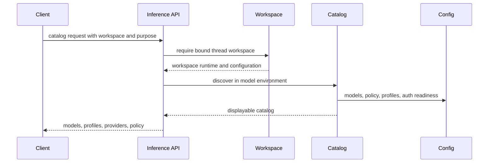
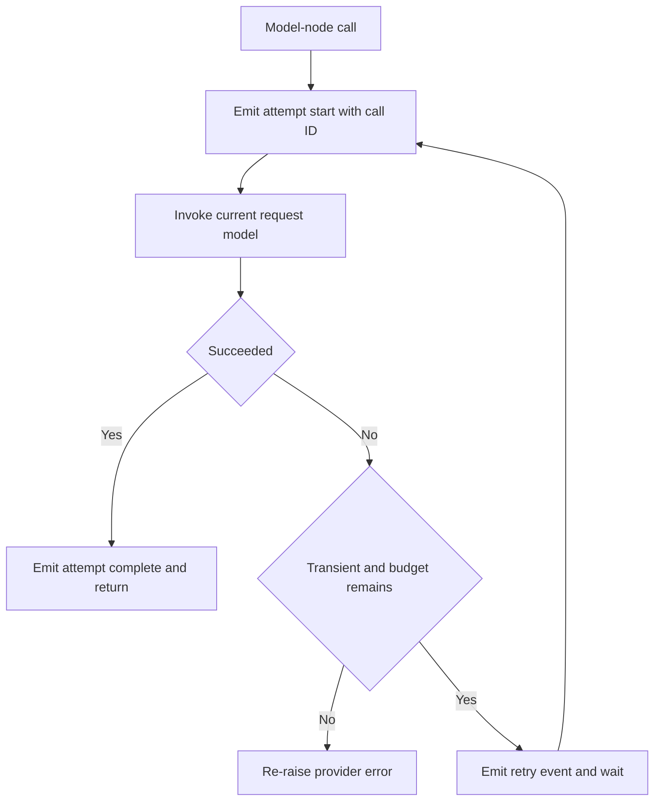
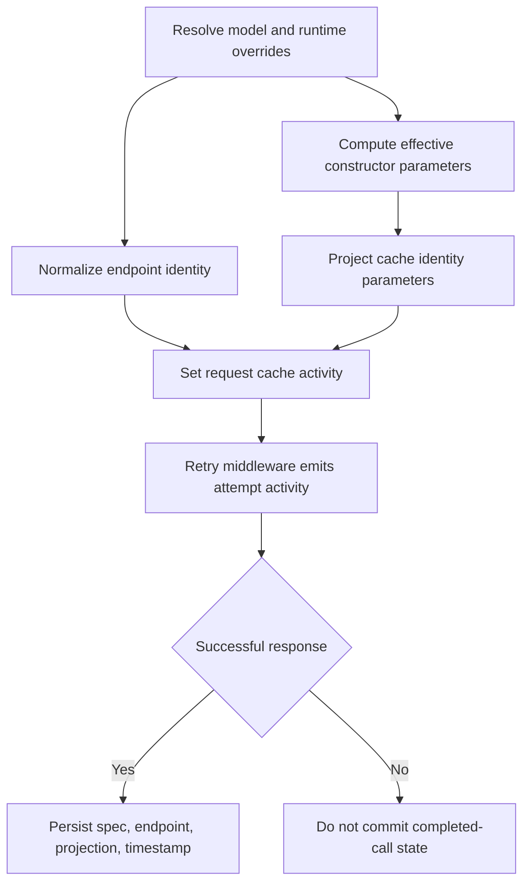

# Models and Harness Profiles

Model selection is an inference-host responsibility. The client may ask to discover or validate a model, but it does not load its own provider configuration, inspect credentials, import a provider package, or construct a model. This matters when the interactive client and the process that performs inference have different environments or workspace bindings.

A **capability profile** is not a constructor configuration. It describes facts used for display and behavior—such as context capacity, supported inputs, tool calling, structured output, and reasoning output. Constructor parameters, credential values, endpoint settings, and executable custom-provider configuration remain server-side.

## Ownership and safe presentation projection

`load_model_catalog()` runs in the environment that constructs models. It discovers available models, applies the effective allowlist, keeps an enabled recommended or current model when appropriate, and returns provider readiness and model profile display data. It also includes enabled known providers that have no discovered models so the picker can guide installation or authentication.

The `ModelCatalog` response is intentionally a narrow projection:

- A model profile contains only approved scalar display fields and the subset of those fields overridden by configuration.
- A provider contains readiness state, credential *source category*, an environment-variable name, detail text, display labels, and an optional install extra—not a credential value.
- The catalog carries the effective allowlist and whether it came from managed policy. `presentation_config()` reconstructs only labels and policy information for the client.
- Strict Pydantic models reject unknown response fields. Provider readiness is also validated: a `configured` state must identify a source, and other states must not.


```mermaid
sequenceDiagram
    participant Client
    participant API as Inference API
    participant Workspace
    participant Catalog
    participant Config
    Client->>API: catalog request with workspace and purpose
    API->>Workspace: require bound thread workspace
    Workspace-->>API: workspace runtime and configuration
    API->>Catalog: discover in model environment
    Catalog->>Config: models, policy, profiles, auth readiness
    Catalog-->>API: displayable catalog
    API-->>Client: models, profiles, providers, policy
```

Caption: Catalog discovery is bound to the inference workspace; only presentation and policy data cross to the client.

The metadata endpoints use the same boundary. `GET /dcode/model` returns cached launch metadata without binding a conversation thread. The thread-scoped metadata endpoint validates a small request schema, requires the thread's workspace binding, and either returns the active runtime metadata or resolves a requested model in a worker thread without committing a switch or running inference. Invalid input and model/configuration failures are `422`, a workspace conflict is `409`, unavailable runtime state is `503`, and unexpected resolution failures are logged and returned as `503`.

`ModelMetadata` validates the server payload before the client accepts it: nonempty model name, string provider, a positive integer context limit when present, a list of modality strings, and an optional boolean structured-output flag. Its JSON projection contains no model object or credentials; applying it updates only client runtime display state.

## Construction, policy, and capability precedence

`create_model()` parses or infers a provider and turns the requested model into a concrete `BaseChatModel` plus a `ModelResult`. The allowlist is checked after provider inference but before stored credentials are bridged, provider hooks run, or provider packages are imported. A denied request therefore has no credential or provider-initialization side effect.

For ordinary constructors, static provider parameters and per-model parameter-table entries form configuration defaults, with the per-model table winning per key; runtime or CLI `extra_kwargs` then win. Provider profiles may contribute construction defaults before that merge. Stored credentials are resolved on the inference host and wired into construction rather than returned to the client. `openai_codex` uses its OAuth-aware builder; a configured `class_path` is an explicit extension point and executes user-configured Python, so the configuration file must be trusted.

Capability metadata has a separate precedence chain:

```text
upstream model profile < config.toml profile override < CLI or workspace profile override
```

Later fields replace earlier fields by key. The effective profile is applied to the resolved model and is used to derive `ModelResult` context and unsupported-modality metadata. It must not be confused with constructor kwargs or with a harness profile that changes graph assembly.

## Request-time switching and session state

`ConfigurableModelMiddleware` is normally outside provider-specific middleware. On every model call it reads `model` and `model_params` from runtime context. A different model spec is constructed through `create_model`; otherwise the supplied parameters are shallow-merged into the request settings. On a cross-provider move away from Anthropic it strips Anthropic-only settings such as `cache_control`, and it replaces the model identity section of the system prompt from the resolved `ModelResult`.

The ordinary interactive path logs a failed `ModelConfigError` and continues with the current model. It does not swallow `ModelNotAllowedError`, and strict callers re-raise configuration failures. Async construction and cache-identity resolution are offloaded so blocking configuration and credential reads do not run on the event loop.

The middleware can add a thread-specific cache routing hint without overwriting an explicit user setting: OpenAI gets `prompt_cache_key` unless `models.openai_prompt_cache_key` is disabled, while Fireworks gets session-affinity settings. Those are provider request settings, not catalog metadata.

After a successful main-agent call, private checkpoint state records the resolved spec and runtime-only override parameters for resume. It separately records request start time, cache endpoint identity, and the effective cache-identity parameter projection. This separation is an invariant: writing merged configured defaults into `_model_params` would turn current configuration into stale session overrides on resume. Subagents can disable this persistence and cannot overwrite the parent thread's cache state.

## Retry ownership and visible attempts

Dcode owns retries at the model-node boundary, rather than retrying the complete agent turn. Completed tool calls are therefore not replayed after a transient model failure. `create_model()` stamps the resolved provider-specific retry budget on the concrete model; the retry middleware reads that budget for each request, so a runtime model change carries the new provider's budget. Known provider SDK retry loops are disabled at construction where their retry parameter is known, preventing nested retries from multiplying attempts.

A failure is retried only when it is transient: LangChain retryable model errors, selected transport failures, retryable HTTP codes (`408`, `409`, `429`, and `5xx`), and known provider SDK transient classes qualify. The classifier walks exception groups and cause/context chains, while a definite non-retryable verdict remains authoritative for its branch. Graph control-flow exceptions propagate immediately. Backoff starts at 0.2 seconds, doubles with modest jitter, caps at 10 seconds, and honors a usable `Retry-After` value up to 60 seconds; interactive calls also have a cumulative 60-second sleep ceiling.


```mermaid
flowchart TD
    Call["Model-node call"] --> Start["Emit attempt start with call ID"]
    Start --> Invoke["Invoke current request model"]
    Invoke --> Success{"Succeeded"}
    Success -->|Yes| Complete["Emit attempt complete and return"]
    Success -->|No| Classify{"Transient and budget remains"}
    Classify -->|No| Raise["Re-raise provider error"]
    Classify -->|Yes| Delay["Emit retry event and wait"]
    Delay --> Start
```

Caption: A retry wraps one model-node attempt, reports lifecycle events, and re-raises terminal failures rather than manufacturing a model answer.

Each attempt shares an opaque call ID. Start and completion events let clients associate streamed chunks with an attempt. When a failed attempt may already have emitted visible output, its retry event identifies the superseded attempt so the client can mark the partial reply as incomplete rather than presenting it as a finished answer. Event consumers validate counters, IDs, phases, and correlation fields before rendering them; malformed payloads degrade to safe generic status text.

Auxiliary non-streaming calls use the same classifier and attached budget. An unstamped model falls back to the normal default budget with a warning. A caller under a deadline can set a smaller cumulative sleep budget; when the next delay would exceed it, the original provider error is surfaced instead of turning into a timeout.

## Prompt-cache identity and cold-cache state

Prompt-cache state tracks whether a costly prefix can plausibly be reused; it is not a general fingerprint of all model settings. A `CacheActivity` records the request start time, resolved `provider:model` spec, opaque endpoint identity, and cache-affecting parameter projection. Checkpoint parsing rejects malformed timestamps, missing identifiers, or non-dictionary parameters rather than trusting old state.

The projection includes `prompt_cache_key`, `prompt_cache_options`, and `prompt_cache_retention`. For OpenAI, Codex, and Anthropic it also canonicalizes the effective reasoning effort across native and flat parameter shapes. It deliberately excludes unrelated controls such as temperature and max tokens, preventing false “identity changed” warnings. Endpoint identity normalizes an HTTP endpoint while retaining routing-significant path and a digest of the query; malformed endpoints are represented by a digest, and absent endpoints become `default`, so credentials in query strings are not copied into checkpoint state.


```mermaid
flowchart TD
    Resolve["Resolve model and runtime overrides"] --> Effective["Compute effective constructor parameters"]
    Effective --> Project["Project cache identity parameters"]
    Resolve --> Endpoint["Normalize endpoint identity"]
    Endpoint --> Activity["Set request cache activity"]
    Project --> Activity
    Activity --> Attempt["Retry middleware emits attempt activity"]
    Attempt --> Result{"Successful response"}
    Result -->|Yes| Checkpoint["Persist spec, endpoint, projection, timestamp"]
    Result -->|No| NoCheckpoint["Do not commit completed-call state"]
```

Caption: Cache identity is derived from the effective request and checkpointed only after a successful model call.

Cache policy is conservative. It applies only to documented Anthropic and OpenAI behavior on their official endpoint or a user-declared trusted endpoint. Cross-wire-format routes, untrusted gateways, unsupported providers, malformed identity state, and prefixes below a provider minimum produce no policy or estimate. Anthropic uses the effective five-minute middleware TTL. OpenAI GPT-5.6 and newer uses a 30-minute minimum-retention policy; older supported OpenAI behavior depends on `prompt_cache_retention` (`in_memory` or `24h`). A cold-cache estimate compares synthetic warm and cold input usage through the normal pricing path and returns nothing when pricing is unavailable or unsafe.

## Focused test coverage and change guidance

- `test_model_catalog.py` verifies that a remote picker uses catalog data rather than local provider configuration, preserves server policy, retains readiness for setup flows, and rejects incoherent readiness payloads.
- `test_configurable_model.py` checks request-time overrides, failure fallback and strict behavior, checkpoint timing, cache-activity attribution, and the no-persistence subagent path.
- `test_model_retry.py` covers transient classification, exception-group traversal, `Retry-After`, total-delay guards, model-specific budgets, lifecycle events, and streamed-output supersession.
- `test_cache_expiry.py` exercises the client handoff and warning behavior around cache expiry without treating a cache warning as permission to change model state.

When adding a provider, keep the boundaries intact: expose only presentation-safe catalog fields; resolve credentials and constructor kwargs on the inference host; declare how SDK retries are disabled or report that ownership cannot be guaranteed; and add cache identity fields only when they are documented to change the reusable prefix. When adding a client feature, use server metadata validation rather than recreating provider discovery locally.

## Related pages

- [Code agent](/openwiki/architecture/code-agent.md)
- [Configuration layering](/openwiki/concepts/config-layering.md)
- [Context management](/openwiki/concepts/context-management.md)
- [Testing guide](/openwiki/testing/testing-guide.md)
- [Run a dcode session](/openwiki/workflows/run-dcode-session.md)
