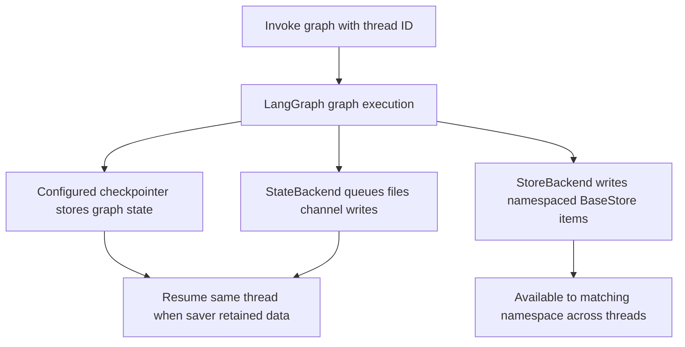
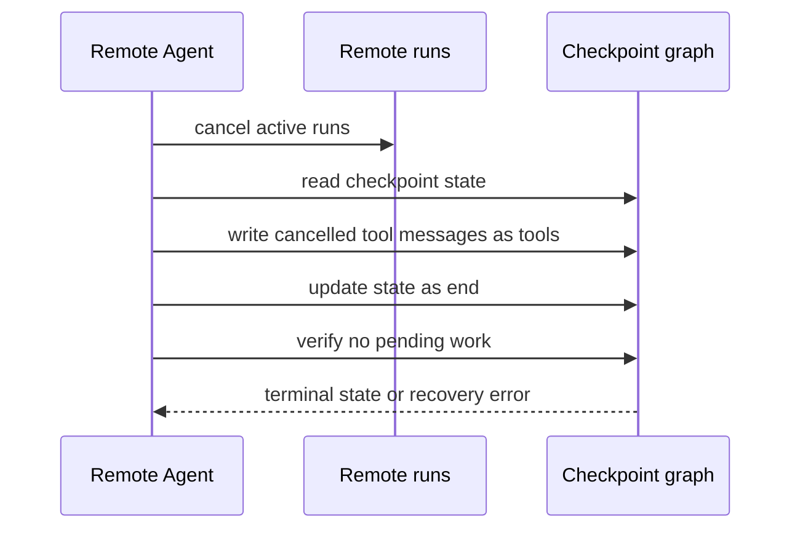
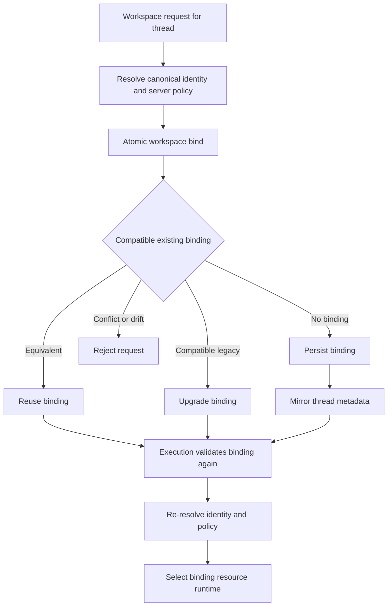

# State, Checkpoints, and Persistence

Persistence has distinct owners and scopes. Do not equate a thread ID, a checkpoint, a backend file, or a remote workspace binding:

| Owner | What it holds | Scope and durability |
| --- | --- | --- |
| LangGraph checkpointer | Graph state: messages, interrupts, middleware channels, and resume position | Per `thread_id`; restart durability depends on the configured checkpointer |
| Deep Agents backend | Files and memory | Determined by the selected backend route, not by checkpointing alone |
| dcode local session database | Local LangGraph checkpoint and write rows, plus the catalog derived from them | Local `sessions.db`; durable only to the extent that database and its storage survive |
| dcode remote workspace binding | A thread's canonical workspace identity and server-resolved policy | A separate durable authorization/resource-selection record |

An in-memory saver, `InMemoryStore`, or `StateBackend` is not a promise of restart durability. Likewise, checkpoint metadata such as `cwd` is not remote authorization. For backend choices, see [Backends](/openwiki/concepts/backends.md); for context trimming rather than persistence, see [Context management](/openwiki/concepts/context-management.md).

## Graph state is the resume authority

LangGraph checkpoints preserve conversation state, message history, interrupts, and resumability. `create_deep_agent` forwards its optional `checkpointer` and `store` to LangChain's `create_agent`; the checkpointer persists graph state between runs, while a backend that uses a store route requires a store. Select both based on the recovery guarantee that is actually needed.

`DeepAgentState` is the default graph schema. It subclasses LangChain's `AgentState` and overrides `messages` with `DeltaChannel(_messages_delta_reducer, snapshot_frequency=50)`. Deltas replace repeated full message lists, with a full snapshot every 50 Pregel steps. This makes persisted message volume grow linearly across a long thread while placing a bound on replay depth. `FilesystemState.files` uses the same delta/snapshot pattern.

The message reducer is replay-safe: LangGraph assigns stable message IDs before serialization; the reducer deduplicates/replaces by ID, honors individual removal and `REMOVE_ALL_MESSAGES`, and converts raw HTTP-style message inputs to typed messages. Do not add random ID allocation to a reducer: it would disagree when an old checkpoint is replayed.

A custom `state_schema` should be a `TypedDict` extension of `DeepAgentState`, preserving the messages channel. Because `DeepAgentState` is a `TypedDict`, this is a type-checker requirement rather than an `issubclass` runtime check. Middleware schemas are merged with the base schema. Fields marked `PrivateStateAttr` are collected and excluded from parent-to-subagent projection; however, if runtime type-hint resolution fails for a schema, its private markers cannot be collected and those fields may be forwarded. Ensure annotations used by a private schema can be resolved at runtime.

### Backend data has its own boundary

The default `StateBackend` stores `files` as graph-state channel writes via LangGraph's `CONFIG_KEY_READ` and `CONFIG_KEY_SEND`. It is thread-scoped: files checkpoint with the conversation and do not cross threads. It also requires a graph execution context. Its fresh reads apply pending writes, so a tool can read a file it wrote during the same superstep; the queued update commits at the node boundary.

`StoreBackend` is different: it writes files to a LangGraph `BaseStore` under a caller-provided namespace, so files can persist across threads according to that store's durability. Namespace factories establish the sharing/isolation boundary and are validated to reject empty and wildcard-like components. An explicit store enables direct use; otherwise the backend resolves the store and runtime from graph context. Neither backend class alone makes data durable—the concrete checkpointer or store implementation does.

This flow shows the separate checkpointed-file and store-backed-file paths; their restart behavior follows the concrete saver or store.

## dcode local sessions

The local CLI obtains an `AsyncSqliteSaver` from `sessions.get_checkpointer()`, calls `setup()`, and passes it to its CLI graphs. The database is the hardened global `DEFAULT_STATE_DIR / "sessions.db"`. Therefore LangGraph checkpoint and write rows—not a duplicate dcode transcript table—are the source for local thread listing and resume.

`list_threads` derives agent name, timestamps, Git branch, working directory, and latest checkpoint ID from checkpoint metadata; it can additionally obtain the initial prompt and visible message count from checkpoint data. Filters by agent, branch, and `cwd` operate on that metadata. `cwd` filtering is exact-string matching, with no normalization, symlink resolution, or prefix matching. dcode opportunistically creates a covering index for this query so SQLite can avoid reading large checkpoint blobs; if index creation fails, results remain correct but the table scan can be slow.

Between DeltaChannel snapshots, the latest checkpoint may omit an inline `messages` list. For thread-list counts, dcode replays root-namespace `messages` writes ordered by checkpoint ID, task ID, and write index, excluding subgraph writes under the same thread. It deliberately includes pending writes because the normal state read exposes them. This whole-history fold is correct for dcode's append-only head usage; external forked or abandoned checkpoint branches may over-count.

### Resume facts and safe cancellation

`ResumeStateMiddleware` defines `PrivateStateAttr` checkpoint channels for session facts. Following a successful model call, middleware writes context-token and effective model/request/cache information with that turn's graph checkpoint. The TUI can write accepted goal/rubric choices through `aupdate_state`; pending proposals and agent-driven status updates are graph-written. These values are checkpoint-versioned: restoring a specific checkpoint restores facts from that point, rather than a thread-wide aggregate.

When remote work was interrupted, do not resume a checkpoint that is poised to execute an old tool call unless that is intended. `RemoteAgent.aabandon_pending_work` first cancels active runs, reads the state, writes error `ToolMessage` cancellations for dangling tool calls as the `tools` node, then advances state as `__end__` and verifies that no pending work remains. The focused integration test sets a checkpoint whose next node is `tools` and proves cancellation ends the graph without executing the side-effecting tool.

This recovery path discards pending tool work rather than replaying it; it is the safe boundary after cancellation.

### State-directory migration

At command startup after argument parsing, dcode best-effort migrates legacy internal state from `~/.deepagents/` to `~/.deepagents/.state/`. It moves a fixed set of entries, including `sessions.db` and its `-wal` and `-shm` sidecars. Move or back up the SQLite database and sidecars together.

Migration is idempotent and fail-soft: missing sources are ignored, an existing destination is preserved and reported, and errors on individual entries are logged while startup continues. A reported collision needs manual inspection; it is intentionally not overwritten.

## Remote dcode: a binding precedes execution

Remote execution maintains a separate workspace binding per thread. It contains canonical `cwd` and project-root identity, schema version, generation, resource key, configuration fingerprint, and server-resolved resource policy. The initial path is untrusted and must be a nonempty absolute existing directory without traversal before canonical resolution. Client claims to project workspace policy are rejected; the server resolves policy itself.

This flow separates the durable bind from later metadata mirroring and from every execution-time validation.

Binding uses an immediate SQLite transaction and `INSERT OR IGNORE`, then compares the stored and proposed records. Equivalent claims are idempotent; a different workspace or protected policy raises `WorkspaceConflictError`. Version-3 bindings support controlled upgrade of compatible older rows only after identity and recorded session-policy checks; current rows reject configuration drift instead of changing a thread's authority.

Before remote graph execution, `make_graph` requires a nonempty LangGraph thread ID and workspace context. It validates the context against the durable binding, re-resolves workspace identity, resolves current server policy, and rejects identity, schema, policy, or configuration drift. The workspace endpoint binds before mirroring remote thread metadata. Thus a metadata-mirror failure returns 503 after a durable bind; callers must treat this as a split outcome and retry reconciliation rather than assume the bind did not occur.

## Operational checklist

- Configure a restart-durable checkpointer before advertising restart-safe resume; an in-memory saver does not provide it.
- Use `StateBackend` only for checkpoint-scoped, thread-local files. Use a deliberately namespaced, durable store or filesystem/service backend when files must outlive or cross threads.
- Preserve `DeepAgentState.messages` delta behavior in custom state, and make checkpoint-inspection tools tolerate a missing inline message snapshot.
- Back up and migrate `sessions.db`, `sessions.db-wal`, and `sessions.db-shm` as a unit. Investigate migration collisions before deleting either copy.
- After interrupted remote work, use pending-work abandonment when old tool execution must not be replayed.
- Treat remote workspace conflict and policy drift as safety controls. Use a new thread for a different workspace or resolve server policy explicitly; never infer authorization from checkpoint metadata.
