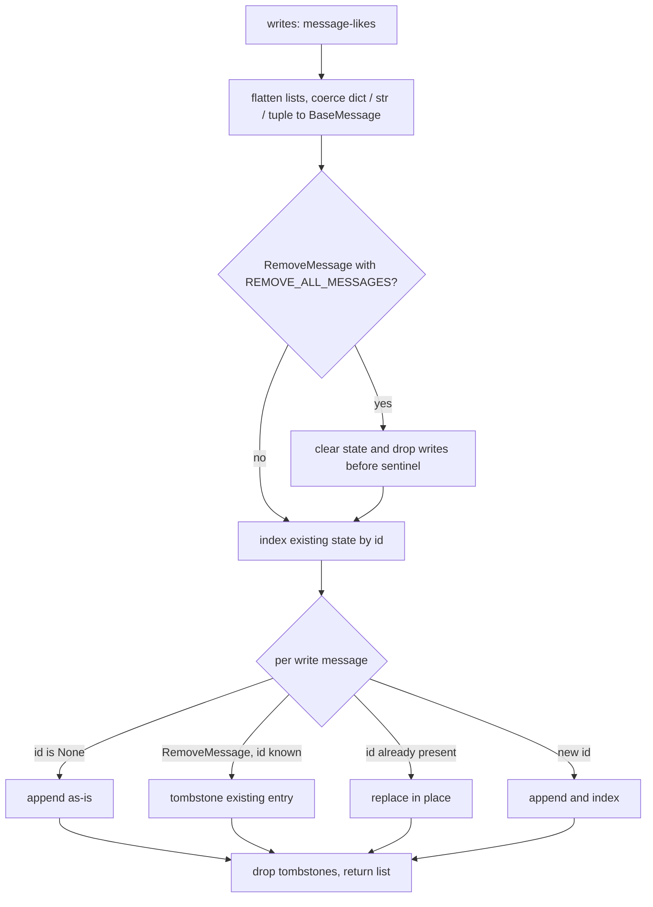
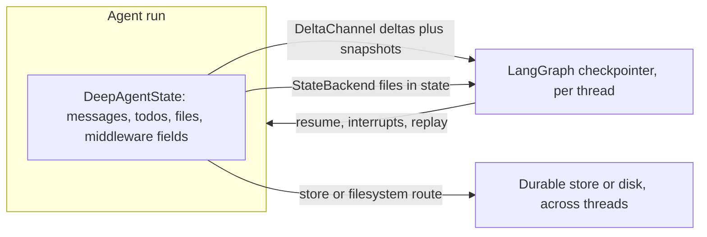

# State & Persistence

Deep Agents keeps almost none of its own runtime state. The authoritative state
container is LangGraph's graph state, which Deep Agents extends with a small
`TypedDict` (`DeepAgentState`) and a specialized reducer for the `messages`
channel. Persistence then splits into two independent axes: **LangGraph
checkpoints**, which preserve conversation/message history, interrupts, and
resumability, and **backend filesystem/memory**, which decides whether files
survive a thread and where they physically live.

This page explains the state schema, the `DeltaChannel` reducer that keeps
checkpoint growth linear, how middleware contributes state without leaking
private fields into subagents, and how the two persistence axes relate. For how
long message histories are compacted or offloaded (a consumer of this state
model), see [Context management](/openwiki/concepts/context-management.md). For
the backend routes that back the filesystem axis, see
[Backends](/openwiki/concepts/backends.md).

## The state schema: DeepAgentState

`DeepAgentState` subclasses LangChain's `AgentState`. Its only override is the
`messages` field, which is annotated with a `DeltaChannel` reducer instead of
the default `add_messages` reducer:

```python
class DeepAgentState(AgentState):
    messages: Required[Annotated[list[AnyMessage], DeltaChannel(_messages_delta_reducer, snapshot_frequency=50)]]
```

The class docstring states the reason directly: the `DeltaChannel` on `messages`
reduces checkpoint growth from O(N²) to O(N). Every other field a running agent
relies on — `todos`, `files`, `structured_response`, and middleware-specific
fields — is contributed by middleware state schemas rather than declared here.

`DeepAgentState` is the default `state_schema` that `create_deep_agent` forwards
to `langchain.agents.create_agent`. Because it is a `TypedDict`, the requirement
that a custom `state_schema` subclass `DeepAgentState` is enforced only by the
type checker; there is no runtime `issubclass` check.

## Why DeltaChannel: linear checkpoint growth

With the default append reducer, every checkpoint stores the full message list,
so a thread of N steps writes roughly N + (N-1) + ... = O(N²) message copies
across all checkpoints. `DeltaChannel` instead persists deltas and writes a full
snapshot only every `snapshot_frequency` steps (50). Replay reconstructs the
current value from the most recent snapshot plus the deltas after it, so total
persisted volume grows linearly with thread length while bounding replay depth.

The same `DeltaChannel(..., snapshot_frequency=50)` pattern is applied to the
`files` state key on `FilesystemState`, for the same reason: state-backed files
can be large and change often, so snapshots every ~50 pregel steps bound read
depth.

## The messages delta reducer

`_messages_delta_reducer` is a batch reducer designed specifically for use with
`DeltaChannel` on the `messages` key. Its responsibilities are narrow and its
invariants matter:

- **Flatten and coerce writes.** Each write is either a list of message-likes or
  a single message-like; only lists are flattened. Raw `dict` / `str` / `tuple`
  inputs are coerced to typed `BaseMessage` via `convert_to_messages`, so
  HTTP-driven graphs work without a separate coercion step. A fast path skips
  coercion when the input is already typed `BaseMessage`.
- **Dedup and update by ID.** Messages are indexed by `id`. A write whose `id`
  already exists replaces the existing entry in place; a new `id` is appended.
- **Tombstone via RemoveMessage.** A `RemoveMessage` whose id matches an existing
  message removes it. A `RemoveMessage` carrying the `REMOVE_ALL_MESSAGES`
  sentinel resets the whole list, discarding prior state and any writes before
  the sentinel.
- **`id=None` messages are appended as-is** rather than deduped.
- **Tolerate `state is None` on replay.** `DeltaChannel.replay_writes` can pass
  `state=None` for threads whose earliest checkpoint did not seed `messages: []`;
  the reducer treats that as the empty list.

The reducer intentionally does **not** assign message IDs. LangGraph's
`ensure_message_ids` hook stamps stable UUIDs on all `BaseMessage` writes before
they are serialized to the checkpoint, so by the time the reducer runs a message
already has a stable ID. Assigning IDs inside the reducer would be redundant and
fragile, because the reducer also runs on replay, where a freshly random ID would
diverge from the one stored in the checkpoint. Tests assert the end-to-end
property this enables: `get_state()` always returns messages with stable,
non-None IDs — both within a single invocation and across resumed threads, and
for both `BaseMessage` and dict-style (over-the-wire) input.

This reducer is a Deep Agents-local adaptation of langgraph's upstream
`_messages_delta_reducer`. Unlike upstream, it deliberately skips coercing
`BaseMessageChunk` writes to full messages, because Deep Agents never writes
chunks to the `messages` channel (`create_agent` appends full `AIMessage`
objects, and streaming operates on the output side via `astream_events`).



Control flow of `_messages_delta_reducer` for one batch of writes.

## Middleware-owned state vs custom state_schema

There are two ways state fields enter the graph, and choosing between them is an
architectural decision:

- **Middleware-owned state.** Middleware declare their own `state_schema`
  (`FilesystemState.files`, the planning `todos` field, etc.). `create_deep_agent`
  collects `mw.state_schema` from every assembled middleware and merges them into
  the graph schema. Prefer this when a field is only meaningful to the middleware
  that owns it, so it stays scoped to that middleware's hooks and tools.
- **Custom `state_schema`.** A caller passes a `TypedDict` subclass of
  `DeepAgentState` as `state_schema`. It becomes the base graph schema, is merged
  with middleware schemas, and is forwarded when compiling declarative `SubAgent`
  specs for the `task` tool so subagents see the same custom fields as the parent.
  Prefer this when tools or multiple middleware need a shared graph-level field.

`CompiledSubAgent` runnables do not inherit a custom `state_schema` (they are
already compiled), and remote `AsyncSubAgent` specs use the schema configured on
the remote graph.

## Private fields must not leak into subagents

Middleware state fields can be marked private with `PrivateStateAttr`.
`private_state_field_names` scans every state schema (the custom schema plus each
middleware's schema) and returns the frozenset of field names carrying that
marker. `create_deep_agent` computes this set and assigns it to the subagent
middleware's `private_state_keys`.

The `task` tool then enforces the boundary in both directions:

- **On the way in**, parent state is filtered to drop `_EXCLUDED_STATE_KEYS`
  (`messages`, `todos`, `structured_response`) and every private key before the
  subagent is invoked with a fresh `HumanMessage`.
- **On the way back**, the subagent's result is filtered by the same exclusions
  and private keys before it is merged into parent state; only the final message
  is forwarded as a `ToolMessage`.

`private_state_field_names` resolves annotations at runtime with
`get_type_hints`. A schema whose `PrivateStateAttr` annotation references a
`TYPE_CHECKING`-only name cannot be resolved; that schema is skipped with a
warning rather than failing the whole agent. This is a real hazard, not cosmetic:
a skipped schema keeps **none** of its private fields, so they will be forwarded
to and merged back from subagents. Keep names used in `PrivateStateAttr`
annotations importable at runtime.

## Two persistence axes

Persistence in Deep Agents is two related but separate mechanisms. Conflating
them is a common source of confusion when debugging why data did or did not
survive.

| Axis | Owner | Preserves | Scope |
| --- | --- | --- | --- |
| Graph state / checkpoints | LangGraph checkpointer | conversation state, message history, interrupts, resumability | per thread |
| Filesystem / memory | Deep Agents backends | files and long-term memory | depends on backend route |

**LangGraph checkpoints** are configured by passing a `checkpointer` to
`create_deep_agent`, which forwards it to `create_agent`. Checkpoints save the
graph state (including `messages`, `todos`, and state-backed `files`) after each
step, enabling interrupts and thread resumption. The `DeltaChannel` reducer above
is what makes this checkpointing cheap over long threads.

**Backend persistence** is a separate axis. The default `StateBackend` stores
files inside agent state, so they are checkpointed with the thread but persist
only *within* that conversation thread, not across threads. It reads and writes
through LangGraph's `CONFIG_KEY_READ` / `CONFIG_KEY_SEND` config keys, so it only
works inside a graph execution. Store-backed or filesystem-backed routes make
files durable across threads or map them to disk / sandbox storage; a `store`
passed to `create_deep_agent` is required when a backend uses a store route. See
[Backends](/openwiki/concepts/backends.md) for the route model and
[Cost and sessions](/openwiki/operations/cost-and-sessions.md) for how thread
scoping affects sessions.



The two persistence axes: checkpoints capture thread state, while store or disk
routes make backend files durable beyond a single thread.

## Practical implications

- Long threads stay affordable to checkpoint because `messages` (and state-backed
  `files`) persist as deltas with periodic snapshots, not full copies per step.
- Message IDs are stable across resumes; do not rely on the reducer to mint IDs.
- If you add application state, prefer middleware-owned state for
  middleware-local fields and a custom `state_schema` (subclassing
  `DeepAgentState`) for shared graph-level fields — and remember `messages` must
  keep the `DeltaChannel` reducer.
- If subagents unexpectedly see or overwrite internal fields, check that the
  fields are annotated `PrivateStateAttr` and that
  `private_state_field_names` could resolve the schema (no `TYPE_CHECKING`-only
  names in the annotation).
- Files in the default `StateBackend` disappear when you start a new thread; use a
  store- or filesystem-backed route for cross-thread durability.
