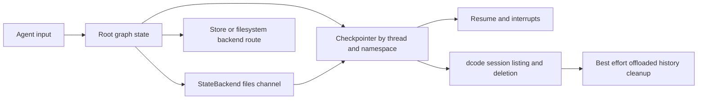
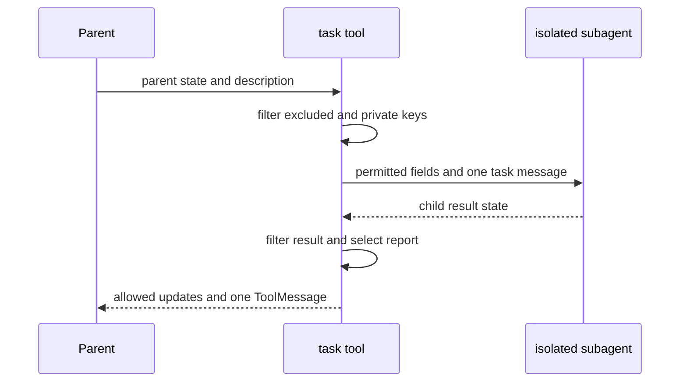
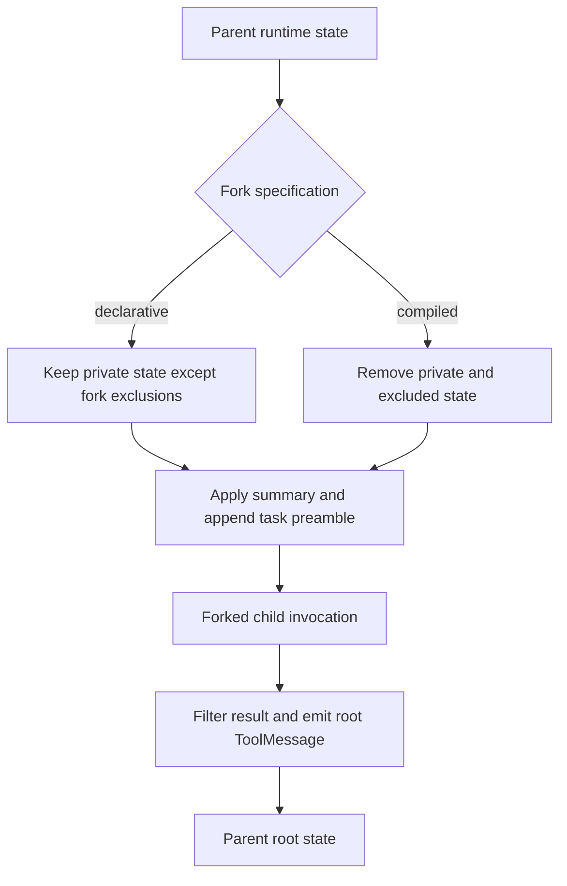
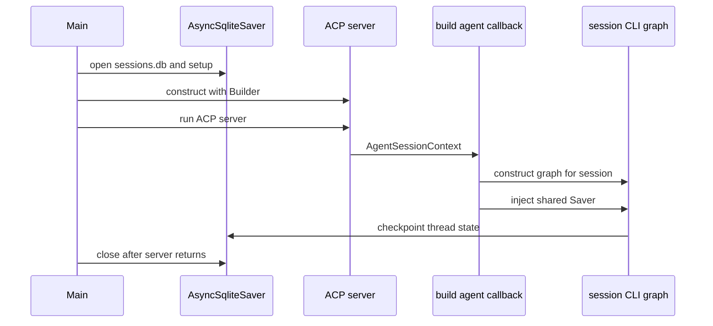

# State Persistence

Deep Agents separates three concerns that are easy to conflate:

1. **Graph state and checkpoints** are owned by LangGraph. A checkpointer preserves a thread's channel values, interrupts, and resumability.
2. **Backend data** is owned by the selected Deep Agents backend route. Its durability is independent of checkpointing, except for state-backed files that are themselves a graph-state channel.
3. **dcode session catalog data** is not a second session store: it is a local view and maintenance layer over the checkpoint database and, separately, best-effort offloaded history.

Message reduction controls the checkpoint representation of one channel; it is not a separate durability policy. Likewise, subagent transfer projects state into an invocation and projects an allowed result back; it does not make the child and parent share mutable root state.

A task subagent can nevertheless leave a transcript in the *parent checkpointer* under a `tools:` checkpoint namespace. Checkpoint storage and root-state visibility are therefore different boundaries.

For context compaction, see [Context management](/openwiki/concepts/context-management.md). For backend durability choices, see [Backends](/openwiki/concepts/backends.md); for subagent configuration, see [Subagents and skills](/openwiki/concepts/subagents-skills.md); and for the protocol surface, see [ACP](/openwiki/integrations/acp.md).

## Checkpoint, backend, and catalog ownership

`create_deep_agent` forwards `checkpointer` and `store` to LangChain's `create_agent`. The checkpointer is optional and preserves graph state between runs. A `store` is separately required for a backend route that uses a store.

| Concern | Owner | Scope and durability |
| --- | --- | --- |
| Conversation state, interrupts, and resume | LangGraph checkpointer | A graph thread and its checkpoint namespaces |
| Files and memory data | Deep Agents backend | Determined by the selected route |
| Thread listing and deletion | dcode `sessions.py` | Reads and deletes local SQLite checkpoint/write rows; not independent catalog records |
| Offloaded conversation history | dcode offload storage | Separate archive cleanup is best-effort |

The default `StateBackend` reads and queues writes to the `files` channel through LangGraph's `CONFIG_KEY_READ` and `CONFIG_KEY_SEND`. Its files are checkpointed within a thread, do not cross threads, and the backend rejects use outside graph execution. Store- and filesystem-backed routes have their own durability boundaries; a checkpointer alone does not make those resources durable.

This diagram distinguishes checkpointed channels, separately durable backend routes, and dcode's checkpoint-derived session operations.

## DeepAgentState and delta reduction

`DeepAgentState` subclasses LangChain's `AgentState` and overrides `messages` with `DeltaChannel(_messages_delta_reducer, snapshot_frequency=50)`. It is the default schema used when `create_deep_agent` receives no custom `state_schema`.

`DeltaChannel` persists message deltas and only periodically writes a full snapshot, every 50 pregel steps. This changes long-thread checkpoint growth from repeated full histories to linear persisted volume while bounding replay depth. `FilesystemState.files` applies the same delta-channel and snapshot-frequency pattern.

A custom schema is expected to subclass `DeepAgentState` so it retains this messages channel, but that constraint is type-only: `TypedDict` prevents an `issubclass` runtime validation. Middleware schemas are merged with the caller's base schema, which lets middleware own fields used by its hooks and tools while a custom schema supplies graph-wide application fields.

### Reducer invariants

`_messages_delta_reducer` receives a batch of writes for `DeltaChannel` and reconstructs `messages` as follows:

- It flattens list writes and coerces raw dictionaries, strings, and tuples to typed messages.
- It replaces or appends by message ID, appends `id=None` messages unchanged, and tombstones an identified message with `RemoveMessage`.
- The last `RemoveMessage(REMOVE_ALL_MESSAGES)` resets prior state and discards earlier writes in the batch.
- `state=None` is treated as an empty list, supporting replay of old threads whose earliest checkpoint did not seed `messages: []`.

Message IDs are deliberately not assigned in the reducer. LangGraph's `ensure_message_ids` stamps stable IDs before checkpoint serialization, which prevents replay from manufacturing IDs different from persisted ones. Focused tests cover non-`None`, stable IDs returned by `get_state()` for object and dictionary-style inputs across resumed invocations. The local adaptation does not coerce `BaseMessageChunk`, because Deep Agents writes full `AIMessage` values to state and streams on the output-event path.

This is channel-value reconstruction; `DeltaChannel` decides whether a checkpoint contains a snapshot or writes only.

## Middleware privacy and subagent state transfer

`private_state_field_names` finds `PrivateStateAttr` annotations across the assembled state schemas, and `create_deep_agent` assigns the resulting keys to `SubAgentMiddleware`. The task tool removes private keys on both input and result projection. This is a confidentiality boundary, not merely an output-schema preference.

Annotation resolution happens at runtime. If `get_type_hints` cannot resolve a schema because an annotation references a `TYPE_CHECKING`-only name, the schema is skipped with a warning. None of that schema's private fields are then protected, so they can cross the task boundary. Ensure names used by private annotations are imported at runtime.

A custom base `state_schema` is forwarded while declarative `SubAgent` specifications are compiled; a precompiled `CompiledSubAgent` and remote `AsyncSubAgent` own their schemas and do not inherit it.

### Isolated is the default; `handoff` is legacy

The current default mode is `"isolated"`. `"handoff"` remains an accepted legacy alias for the same behavior; neither mode forks the parent. For either mode, the task tool starts with permitted parent fields, removes `messages`, `todos`, `structured_response`, the fork marker, and private keys, and sets `messages` to one `HumanMessage` containing the task description.

On return, the result must contain `messages`. The tool filters the same excluded and private keys from state updates, then adds exactly one root `ToolMessage`: serialized `structured_response` when present, otherwise the last non-empty `AIMessage` text. Thus a parent receives an allowed state update and report, not the child's working transcript or todo list.

This is the isolated task-transfer flow. Private keys are filtered in both directions.

### Fork inherits input context but not root-state visibility

`mode="fork"` is experimental and explicitly opts into inherited context. A declarative fork receives parent state except `structured_response`, summarization event, and summarization session ID; it receives a fork marker and a message list made from the effective, including applied summarization, parent conversation plus a task preamble. It mirrors parent prompt-producing middleware, appends its own system prompt rather than replacing the inherited prompt, and cannot define `skills`.

A forked `CompiledSubAgent` is deliberately narrower because its runnable is opaque: it receives inherited non-private permitted state and the prepared conversation, but private keys remain excluded. The fork marker causes nested `task` calls to be refused, preventing recursive delegation. In either kind of fork, output projection remains the normal filtered return path.

This diagram shows input inheritance by fork kind; it does not imply shared state.

### Checkpoint namespaces versus output projection

The `task` tool invokes a subagent directly rather than registering it as a graph node. Nevertheless, when the parent has a checkpointer, focused integration coverage shows the child transcript can be recovered by listing that checkpointer with the same thread configuration and selecting its `tools:` checkpoint namespace. It is not available through the parent's root-state projection: ordinary streaming excludes child intermediates unless `subgraphs=True`, and the root receives only the resulting `ToolMessage`.

Treat these facts separately when building observability or retention tooling: use checkpoint namespaces, or `subgraphs=True` streaming, to inspect child execution; use root state to model what the parent can continue from.

## dcode sessions, ACP, and resume facts

Local dcode obtains an `AsyncSqliteSaver` over the hardened global `sessions.db`. The database contains LangGraph checkpoint and writes rows; `list_threads` derives its `ThreadInfo` view from checkpoint metadata, including agent name, timestamps, Git branch, working directory, latest checkpoint ID, and optionally checkpoint-derived prompt and visible-message-count data. It can filter by agent, branch, and exact `cwd`.

### ACP server lifetime and session-local graphs

In ACP mode, `main` enters `async with get_checkpointer()`, calls `setup()`, and keeps that context open while `run_acp_agent(server)` runs. The same open `AsyncSqliteSaver` is passed into the `build_agent` callback. The callback constructs a CLI graph from each supplied `AgentSessionContext`, including that context's selected model and working directory, then injects the shared checkpointer. Consequently, checkpoint durability spans ACP sessions through the SQLite database, but a compiled graph is constructed for a session callback rather than being one process-global graph reused for every session. `load_sessions=True` asks the ACP server to load sessions; it does not turn the dcode thread view into a separate persistence system.

This shows that the saver lives for the running ACP server and each callback builds the graph used for its session.

`ResumeStateMiddleware` contributes private, checkpointed resume facts. After a successful model turn it writes context-token usage from the latest `AIMessage`; configurable-model middleware writes effective model, parameters, and cache-request facts after successful calls. Accepted goal/rubric choices may be written by the client via `aupdate_state`; pending proposals and agent-driven status updates are graph-written. Reading a checkpoint gives the facts at that checkpoint, not a thread-wide aggregate.

A delta checkpoint can omit an inline `messages` snapshot. For message counts, dcode uses an inline list when available; otherwise it replays root-namespace message writes ordered by checkpoint, task, and index, deliberately excluding subgraph writes that share the thread ID. This keeps the thread browser's visible count about the root conversation rather than task-subagent transcripts. Decode or reduction failure is isolated to the affected count rather than failing the complete thread list.

Deleting a local thread removes its checkpoint and writes rows and clears relevant caches, then attempts offloaded conversation-history cleanup. The Boolean result reflects checkpoint deletion only; history cleanup is a separate best-effort operation and may fail without changing that result. An orphaned archive is still cleaned even if no checkpoint rows exist.

## Safe extension checklist

- Supply a checkpointer for resumable graph threads; choose a backend route independently for file durability.
- Preserve `DeepAgentState.messages` when supplying custom state, and use middleware state for middleware-local behavior.
- Mark sensitive middleware fields with `PrivateStateAttr`, import annotation names at runtime, and test both incoming and outgoing task projections.
- Treat `isolated`, and legacy `handoff`, as a fresh task context. Use experimental `fork` only when inherited conversation/state semantics are intended, and account for the declarative-versus-compiled privacy distinction.
- Do not equate root visibility with retention: child transcripts can reside in a `tools:` checkpoint namespace even though normal parent state and output only contain the final tool report.
- In ACP mode, keep the checkpointer context alive for the server run and avoid assuming one compiled graph owns all sessions.
- For dcode thread tools, distinguish a missing delta snapshot from an empty conversation and use the writes-aware root-namespace reconstruction path.
