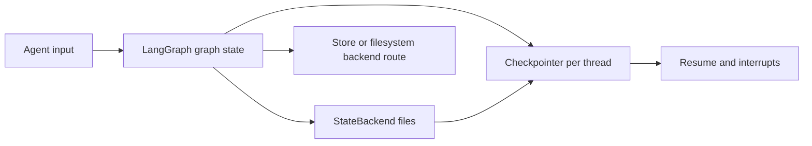
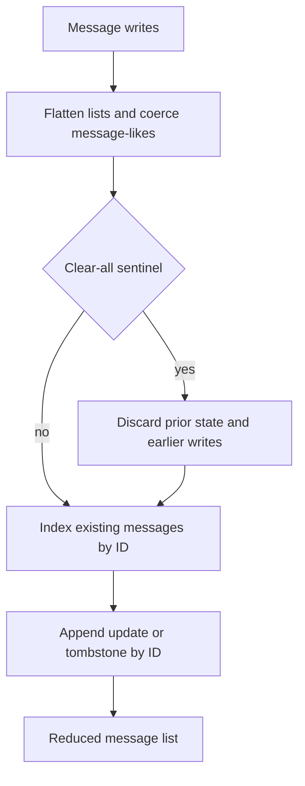
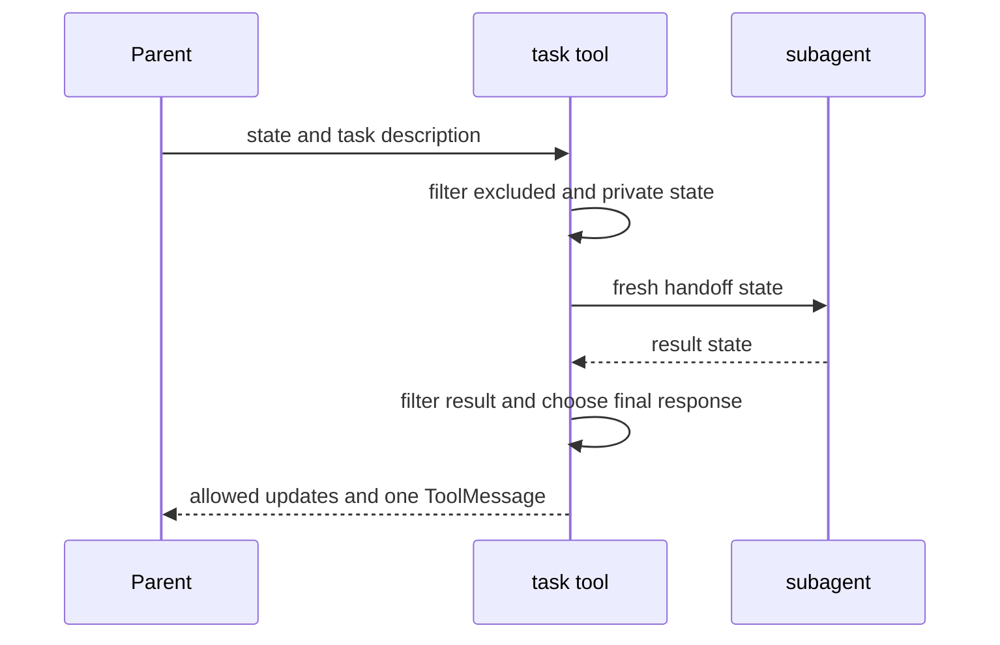

# State Persistence

Deep Agents has three deliberately separate concerns:

1. **Graph state and checkpoints** are LangGraph's responsibility. A checkpointer preserves a graph thread's channel values and enables resume and interrupts.
2. **Message reduction** is a storage-efficiency mechanism on the `messages` channel. It controls how that one channel is represented across checkpoints; it is not a durability policy.
3. **Subagent transfer** is an invocation boundary. It decides which parent values form a subagent input and which returned values may merge back; it does not make subagent state part of the parent checkpoint.

dcode builds on the SDK model with an SQLite-backed checkpointer, resume-only private channels, and a thread browser. For context compaction rather than state durability, see [Context management](/openwiki/concepts/context-management.md). For running and resuming dcode, see [Run a dcode session](/openwiki/workflows/run-dcode-session.md).

## SDK graph state and checkpoint ownership

`create_deep_agent` passes its `checkpointer` and `store` through to LangChain's `create_agent`. The optional checkpointer persists graph state between runs; a `store` is required when the selected backend uses a store route. This is distinct from the backend that implements file and memory operations.

| Concern | Owner | Scope and implication |
| --- | --- | --- |
| Graph state, interrupts, resume | LangGraph checkpointer | A checkpointed thread; state is restored at the selected/latest checkpoint. |
| Files and memory data | Deep Agents backend | Route-dependent: state-backed files follow the thread; store or filesystem routes can outlive it. |
| dcode session catalog | `sessions.py` over the checkpoint database | Reads checkpoint rows and metadata to list, filter, resume, and delete local threads. |

The default `StateBackend` keeps files in agent state through LangGraph's `CONFIG_KEY_READ` and `CONFIG_KEY_SEND`. Those files therefore travel with checkpoints within one thread, cannot be used outside graph execution, and do not become cross-thread data. A filesystem- or store-backed route has a different durability boundary; do not infer it from the presence of a checkpointer.

Checkpoint durability and backend file durability are independent axes.

## DeepAgentState and message reduction

`DeepAgentState` subclasses LangChain's `AgentState` and only overrides `messages`. It assigns that field `DeltaChannel(_messages_delta_reducer, snapshot_frequency=50)`, replacing the normal full-list accumulation behavior. It is the default `state_schema` passed to `create_agent` unless the caller supplies one.

`DeltaChannel` stores writes as deltas and periodically writes a full snapshot (every 50 pregel steps). Thus a long message history grows linearly in persisted volume rather than repeatedly storing the full growing list, while replay needs only the latest snapshot plus the bounded tail of writes. `FilesystemState.files` uses the same channel and frequency.

The custom schema contract is type-level only: a caller should subclass `DeepAgentState` so the message reducer remains present, but `TypedDict` prevents runtime `issubclass` validation. A schema that replaces `messages` without the channel can lose this storage behavior.

### Reducer invariants

`_messages_delta_reducer` accepts batched writes and reconstructs a message list:

- It flattens list writes, treats other inputs as one message-like value, and coerces raw dictionaries, strings, and tuples with `convert_to_messages`.
- Existing IDs index the accumulated list: a repeated ID replaces in place, a new ID appends, and an `id=None` value appends without deduplication.
- `RemoveMessage` tombstones an identified message. The `REMOVE_ALL_MESSAGES` sentinel clears current state and ignores every write preceding the last sentinel in the batch.
- Replay may begin with `state=None`; the reducer treats this as an empty list, which supports old threads whose first checkpoint did not seed `messages: []`.

Message IDs are not minted in this reducer. LangGraph's `ensure_message_ids` assigns stable IDs before serialization, avoiding new IDs during replay. Reducer tests cover stable, non-`None` IDs returned by `get_state()` for both object and over-the-wire dictionary input, including resumed threads. The local reducer intentionally does not convert `BaseMessageChunk`: Deep Agents writes full `AIMessage` objects to state and streams on the output-event path.

The reducer reconstructs channel value; `DeltaChannel` decides whether a checkpoint carries a snapshot or only writes.

## Middleware state, custom schemas, and privacy

The final graph schema combines a caller-provided base `state_schema` with every assembled middleware's `state_schema`. Middleware-owned fields are appropriate for data meaningful only to that middleware's hooks and tools; use a custom schema for an application field shared across graph components.

A declarative `SubAgent` is compiled with the parent's custom base schema, so it can declare the same custom fields. A precompiled `CompiledSubAgent` and a remote `AsyncSubAgent` are owned elsewhere and do not inherit it.

`PrivateStateAttr` marks middleware channels that must not cross the ordinary subagent boundary. `private_state_field_names` resolves every participating schema's annotations, and `create_deep_agent` supplies the resulting key set to `SubAgentMiddleware`. Annotation resolution is operationally important: if a schema refers to a name available only under `TYPE_CHECKING`, `get_type_hints` fails, the schema is skipped with a warning, and none of that schema's private fields are protected.

### Handoff is isolation, not checkpoint sharing

For the default `mode="handoff"`, the `task` tool builds a fresh subagent input. It removes `messages`, `todos`, `structured_response`, the fork marker, and all private keys, then supplies exactly one `HumanMessage` containing the task description. On return, it removes the same excluded/private keys from the subagent result, requires a `messages` key, merges only allowed state updates, and returns one `ToolMessage` based on structured output or the last non-empty AI response. The parent sees neither intermediate work nor the subagent's message history.

`mode="fork"` is the explicit exception and is experimental. A declarative fork gets the parent's effective conversation and state, including private keys, plus a marker and a task preamble; its prompt-producing middleware is mirrored. A forked compiled runnable is treated more conservatively because it is opaque: private keys remain excluded. Forks cannot define `skills`, and the fork marker prevents recursive use of `task`.

Normal handoff state transfer is filtered input/output projection, not shared mutable state or parent-checkpoint continuation.

## dcode sessions: SQLite checkpoints and resume state

In local dcode mode, `get_checkpointer()` opens the hardened global `sessions.db` and yields `AsyncSqliteSaver`; startup calls `setup()` before constructing the CLI graph. Thread IDs generated for new sessions are UUID7 strings, although the browser tolerates legacy short IDs. `ThreadInfo` is derived from checkpoint metadata and can include the agent name, created/updated time, Git branch, working directory, first prompt, message count, and latest checkpoint ID. `list_threads` supports agent, branch, and exact-`cwd` filters and orders by update or creation time.

`ResumeStateMiddleware` contributes private checkpoint channels used to rehydrate dcode without replaying or re-tokenizing history. After a successful model turn it records context-token usage from the latest `AIMessage`; configurable-model middleware writes the effective model and parameters and cache-request facts on the successful model checkpoint. Goal/rubric state has distinct ownership: accepted goal and sticky rubric choices can be written by the TUI using `aupdate_state`, while proposed criteria and agent-driven goal status are graph-written. Reading a particular checkpoint returns the values as they were at that checkpoint, not thread-wide aggregates.

When opening a thread, the TUI obtains `aget_state` by `thread_id`; remote mode first idempotently registers the thread so the remote graph can reconstruct delta channels. It projects serialized messages for display and reads the private resume values. This is why resume facts are channels rather than a separate dcode side database.

### Listing and deletion caveats

A delta-channel checkpoint between snapshots may omit an inline `messages` value. To populate a visible message count, dcode reads the latest checkpoint when it has an inline list; otherwise it replays root-namespace `messages` writes in checkpoint/task/index order. It intentionally excludes subgraph writes under the same thread ID. Cached counts and initial prompts are keyed by the latest checkpoint ID (or update time fallback), so a new checkpoint invalidates them.

Deleting a local thread deletes its `checkpoints` rows and `writes` rows, clears relevant in-memory entries, and then makes a best-effort cleanup of its per-thread offloaded conversation-history archive. The Boolean result reports checkpoint deletion only: failure to remove the archive is logged and does not make deletion fail. Therefore session deletion is authoritative for graph resume state but archive cleanup is a separate, best-effort lifecycle concern.

## Safe extension and operations checklist

- Pass a checkpointer when an SDK graph must resume; select a backend route separately for files that must survive across threads.
- Subclass `DeepAgentState` for custom graph state and preserve its `messages` annotation. Prefer middleware state for middleware-local behavior.
- Mark internal middleware data with `PrivateStateAttr`, ensure every annotation name imports at runtime, and test both task input and result filtering.
- Do not treat normal subagents as resumable children of the parent. Send required context in the task description; choose experimental `fork` only when its inherited-state semantics are intended.
- For dcode thread UI or tooling, tolerate a missing inline message snapshot and use the writes-aware reconstruction path rather than interpreting it as an empty conversation.
- Treat a successful thread deletion as deletion of checkpoint state; monitor/log any offloaded-history cleanup failure when retention matters.
