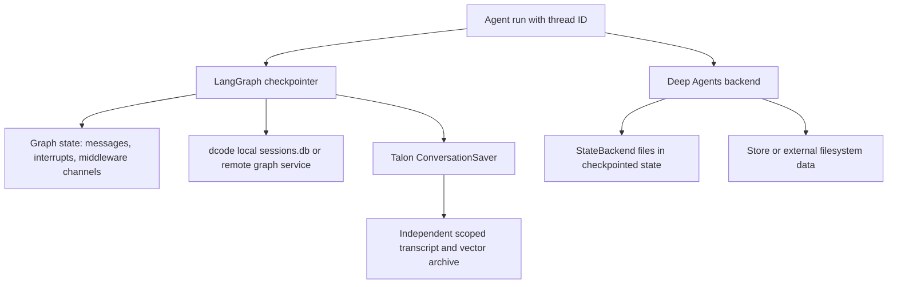

# State, Checkpoints, and Persistence

Persistence is a set of separate ownership boundaries, not one database or one lifecycle. A `thread_id` identifies a LangGraph conversation, but it does not by itself make files shared, preserve an external store, authorize a remote workspace, or provide searchable history.

This shows distinct persistence layers: a graph checkpointer is the resume authority for graph state; a backend determines file and memory durability; Talon's archive is a separate retrieval-oriented history store. The local dcode database is one checkpointer implementation, while a remote workspace binding is a separate authorization record. See [Backends](/openwiki/concepts/backends.md), [Context management](/openwiki/concepts/context-management.md), [Runtime behavior](/openwiki/architecture/runtime-behavior.md), [ACP](/openwiki/integrations/acp.md), and [Talon](/openwiki/integrations/talon.md).

## Graph state and checkpoints

`create_deep_agent` forwards its optional `checkpointer` and `store` to LangChain's `create_agent`. The checkpointer persists graph state between runs; a backend using a store route separately needs `store`. Configure these independently: restart-safe resume requires a durable saver, while file/memory lifetime and sharing follow the selected backend.

`DeepAgentState` is the default graph schema. It replaces only LangChain `AgentState.messages` with `DeltaChannel(_messages_delta_reducer, snapshot_frequency=50)`. The channel writes message deltas and snapshots every 50 pregel steps, avoiding full-history duplication on every checkpoint while bounding replay depth. `FilesystemState.files` follows the same delta/snapshot pattern.

The message reducer normalizes raw message-like input, deduplicates or replaces messages by ID, removes tombstoned messages, and honors `REMOVE_ALL_MESSAGES`. It intentionally does not assign IDs: LangGraph assigns stable IDs before checkpoint serialization, avoiding unstable IDs during replay. Custom schemas should extend `DeepAgentState` to retain this channel behavior, but that constraint is type-checker-only because `TypedDict` schemas cannot be validated with `issubclass` at runtime. Middleware may contribute additional typed state channels.

The default `StateBackend` is thread-scoped rather than a durable shared filesystem. It uses LangGraph's `CONFIG_KEY_READ` and `CONFIG_KEY_SEND` to read and queue `files` channel updates; checkpointing therefore keeps files within one conversation thread, not across threads. It is valid only during graph execution. Its fresh reads apply pending writes, so a tool can read its own file update in the same superstep.

## dcode threads: local checkpoints and remote state

In local dcode, `sessions.get_checkpointer()` hardens the state directory and opens `DEFAULT_STATE_DIR / "sessions.db"` as an `AsyncSqliteSaver`; CLI startup calls `setup()` before it constructs agent graphs with that saver. The LangGraph checkpoint and write rows are consequently the local source of truth for thread listing and resume, rather than a duplicated transcript table.

`list_threads` derives agent name, timestamps, Git branch, working directory, and the latest checkpoint ID from checkpoint metadata, with optional checkpoint-derived prompt and message-count data. It filters agent, branch, and `cwd`; `cwd` is deliberately an exact stored string comparison. dcode attempts to create a covering index so this catalog query avoids scanning the large checkpoint blobs; failure only makes the correct query slower.

A delta checkpoint can omit an inline `messages` list. For that case dcode reconstructs visible message counts by replaying root-namespace `messages` writes in checkpoint, task, and write-index order, excluding subgraph writes. This models dcode's append-only head-of-thread usage and includes pending writes visible from current state; externally created forks or abandoned branches may over-count.

`ResumeStateMiddleware` adds private, checkpoint-versioned channels for resume facts. Successful model calls graph-write model/context facts; accepted goals and rubrics can be client-written with `aupdate_state`, while pending proposals and agent status changes are graph-written. Selecting an older checkpoint restores the facts at that checkpoint rather than a thread-wide aggregate.

On startup, dcode makes a best-effort, idempotent migration from `~/.deepagents/` to `~/.deepagents/.state/`. It preserves destination collisions and moves `sessions.db` with its WAL and shared-memory sidecars. Treat those three files as one SQLite unit when backing up or moving local state.

### Remote client and workspace binding

`RemoteAgent` is a thin `RemoteGraph` wrapper: it delegates server-side streaming, state management, and SSE handling, converts streamed message dictionaries for the Textual adapter, and leaves state snapshots serialized by the server. A remote call requires `config.configurable.thread_id`; `aget_state` returns `None` for a missing or still-empty remote thread. On an `aupdate_state` conflict, the client cancels active runs and retries once, which prevents a recently cancelled stream from leaving the UI unable to write recovery state.

Remote dcode also persists a server-authoritative workspace binding per thread. It binds canonical workspace identity and a server-resolved resource-policy fingerprint atomically. Equivalent binds are idempotent; a changed workspace, protected policy, identity, schema, or configuration drift is rejected. Compatible pre-version-3 rows are upgraded only after identity and session-policy checks.

The workspace endpoint resolves policy on the server and rejects client claims to project policy. It binds before mirroring metadata to the remote thread, so a metadata-mirror failure can return 503 even though the binding remains durable. Before graph execution the server requires the thread ID and context, compares them to the binding, re-resolves workspace identity, and rejects a mismatch. Checkpoint metadata such as `cwd` is therefore descriptive, not remote authorization.

## Talon: durable archive beyond the active graph

Talon's experimental `ConversationSaver` composes an async LangGraph checkpointer with an independently owned `StoreConversationArchive`. It delegates checkpoint reads, listing, pending writes, and delta-history reconstruction to the underlying saver. For a root graph checkpoint carrying trusted Talon channel/chat metadata, it archives committed message revisions after the checkpoint write and records the acknowledged checkpoint. Nested graph namespaces and unscoped checkpoints are not archived.

There is intentionally no cross-store transaction. If archiving fails after checkpoint persistence, the failure propagates and a retry of the same checkpoint is designed to repair the archive without duplicate revisions. The wrapper serializes operations and completes both writes before propagating cancellation, preventing reset from racing an incomplete archive write.

`StoreConversationArchive` stores scoped transcript chunks, session summaries, and recovery metadata in a caller-owned LangGraph Store. It registers a session to a trusted channel/chat scope and performs idempotent chunk writes using message ID, revision, and part deduplication. Optional vector storage must be a separate Store from metadata. Text remains readable as scoped transcript data; semantic indexing is limited to user messages and replies marked as delivered, so a search result reports whether semantic retrieval/indexing is disabled, pending, unknown, or available.

Deletion is likewise a lifecycle across independent stores. `ConversationSaver` deletes checkpoint thread data before removing its archive registration; a failure leaves the registration available for retry. The archive deletes vectors before transcript records and persists deletion state so an interrupted deletion can resume after reopening. Operators should stop chat workers before bulk history clearing and retry failed deletions rather than assuming an all-or-nothing erase.

## Operational guidance

- Use a durable checkpointer before promising restart-safe graph resume; a `StateBackend` file is only as durable and scoped as that thread's checkpoints.
- Choose a store or filesystem backend when data must outlive or cross threads. Do not mistake a checkpoint for an external filesystem or semantic-history database.
- Preserve the `DeepAgentState.messages` delta contract in custom state, and make checkpoint-inspection tools tolerate a missing inline message snapshot.
- Back up or migrate `sessions.db`, `sessions.db-wal`, and `sessions.db-shm` together. Resolve automatic-migration collisions manually.
- Bind a remote workspace before execution and treat a conflict or drift rejection as safety behavior; use a new thread for a different workspace or protected policy.
- For Talon, operate the checkpointer and archive as separately durable systems: retry archive and deletion failures, preserve trusted scope boundaries, and do not claim semantic search completeness while indexing is pending or unknown.
