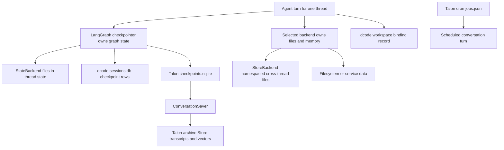

# State, Checkpoints, and Durable Records

“Persistent” has several deliberately independent meanings in this system. A LangGraph checkpoint versions the execution state of one thread; a Deep Agents backend owns files or memories; dcode adds local session catalog and remote workspace-authority records; Talon adds a user-facing conversation archive and scheduled-job file. Do not infer the lifetime, visibility, or deletion of one from another.

This data flow separates ownership: checkpoint state is not automatically a global file store, and Talon's archive is not the checkpoint database. dcode's durable workspace binding is an execution-authorization record, not conversation state.

## Checkpointed graph state

Persistence in Deep Agents has two separate axes: LangGraph checkpoints preserve conversation state, message history, interrupts, and resumability per thread, while Deep Agents backends handle filesystem and memory persistence whose durability depends on the backend route. `create_deep_agent` forwards its optional `checkpointer` and `store` to LangChain `create_agent`; a backend using a store route needs a `store` independently of the checkpointer.

`DeepAgentState` is the default state schema. It subclasses LangChain `AgentState` and overrides only `messages`, using `DeltaChannel(_messages_delta_reducer, snapshot_frequency=50)`. Deltas plus periodic snapshots make persisted message volume grow linearly through a long thread rather than repeatedly storing the whole list, while limiting reconstruction depth. `FilesystemState.files` uses the same 50-step delta/snapshot pattern.

A custom `state_schema` should extend `DeepAgentState` to retain that message-channel contract. This is a static typing requirement: because `DeepAgentState` is a `TypedDict`, the code cannot enforce it through runtime `issubclass`. Prefer middleware-owned fields when their lifetime should remain local to that middleware.

## Backend data is a separate durability decision

The default `StateBackend` writes its `files` channel through LangGraph `CONFIG_KEY_READ` and `CONFIG_KEY_SEND`. Those files are checkpointed with the graph, thread-local rather than cross-thread, and usable only during graph execution. Its fresh read applies pending writes, providing read-your-writes behavior inside a superstep.

`StoreBackend` is the contrasting durable route: it keeps files in a caller-selected LangGraph `BaseStore`, scoped by a validated namespace factory, and is intended to persist across threads. A store can be supplied explicitly or resolved from graph context. The namespace is therefore the isolation boundary, not a `thread_id`.

Other backends retain their own ownership semantics. `FilesystemBackend` changes the actual filesystem and its writes are permanent outside checkpoints; it is intended for trusted local or sandboxed use, not a web server. `ContextHubBackend` persists against a LangSmith Hub agent repository. `CompositeBackend` can route different path prefixes to different backends, so a single agent can intentionally combine ephemeral state files and durable memory files.

## dcode: checkpoints, session catalog, workspace authority, and offload

Local dcode uses LangGraph checkpoint persistence rather than a separate transcript table. Startup hardens the state directory, opens the global `sessions.db` through `get_checkpointer`, calls `setup`, and supplies its `AsyncSqliteSaver` to CLI graphs. `list_threads` derives its catalog from checkpoint metadata, including agent, timestamps, Git branch, working directory, and newest checkpoint ID; optional prompt and count inspection reads checkpoint data. Its covering index avoids reading large checkpoint blobs when possible, but a failed index creation only makes the correct query slower.

When a delta checkpoint has no inline `messages` snapshot, dcode derives the visible count by replaying root-namespace message writes in checkpoint, task, and write-index order. It intentionally excludes subgraph writes sharing the thread ID. This is a catalog reconstruction mechanism, not a second persistent message model.

`ResumeStateMiddleware` stores resume facts in private checkpoint channels. Successful model calls graph-write model-turn facts; accepted goal or rubric choices may be client-written with `aupdate_state`; pending proposals and agent-status changes are graph-written. Restoring an earlier checkpoint restores the facts at that checkpoint.

At command startup, dcode best-effort migrates legacy internal state from `~/.deepagents/` to `~/.deepagents/.state/`. It is idempotent, preserves collisions, and moves `sessions.db` with its WAL and shared-memory sidecars. Back up or move those three SQLite files together.

Remote dcode adds a distinct durable workspace binding per thread. The server resolves canonical workspace identity and resource policy, binds atomically, permits equivalent requests idempotently, and rejects changed identity or protected policy. Before graph execution and remote offload it requires a thread ID and matching workspace context, re-resolves identity, and rejects policy, schema, or configuration drift. The workspace endpoint binds before mirroring thread metadata; if that later mirror fails, the binding can remain durable although the response is 503.

### dcode offload archive persistence is conditional

The remote `/offload` route is not itself a general persistent archive. It reads an idle, checkpointed thread, rejects pending graph work or a thread that advances during compaction, and allowlists the checkpoint channels it may update—specifically preventing message writes. If the selected offload execution has no archive, it commits only its checkpoint update.

When the execution supplies an archive writer, dcode first commits the checkpoint update, then writes the archive, and finally records an archive-path summarization event in a follow-up checkpoint update. There is no cross-store transaction: an archive append failure leaves the summary state reserved but no archive path; a failed path link is rolled back when confirmed absent; an unreadable confirmation produces an indeterminate error. Thus an `archive_path` in a completed result is evidence of a linked archive, but users must not assume every dcode offload has external durable archive content.

## Talon: durable checkpoint, readable archive, and scheduler records

Talon namespaces local state per assistant under its configured home. Its normal modeled host opens `checkpoints.sqlite` with `AsyncSqliteSaver`, initializes it, opens a history archive, and wraps both in `ConversationSaver`. A directly constructed `DeepAgentRuntime` without a supplied saver instead defaults to `InMemorySaver`, so same-conversation history survives only while that runtime lives.

`ConversationSaver` couples, but does not merge, two stores. It writes the checkpoint first and then appends committed message revisions to `StoreConversationArchive`, recording acknowledgment only after archive persistence. Archive failure propagates after the checkpoint already exists; retrying the same call repairs the archive without duplicate revisions. Cancellation waits for the write sequence to settle. Pending checkpoint writes are not archived until their next checkpoint commits. Only root conversation checkpoints with trusted `talon_history_channel` and `talon_history_chat` metadata are archived; subgraph namespaces are excluded.

The archive is a portable `BaseStore` record structure, normally local SQLite but selectable by `DEEPAGENTS_TALON_HISTORY_URI`. It scopes each session to a trusted channel/chat pair, chunks eligible human, AI, and tool messages, deduplicates by message identity, revision, and chunk, and supports bounded text retrieval. Optional vectors use a separate Store so embedding/index work does not block checkpoint writes. Vector indexing occurs only for user messages and replies marked as successfully delivered; delivery can promote a reply to indexable content.

Archive writes use a bounded redo journal: persist the journal, apply idempotent batch writes, and clear it only after success. Recovery runs under the archive's in-process lock before access. This assumes one active writer per namespace and a Store with read-after-write consistency, no TTL; it is not a distributed lock.

Deletion is likewise ordered and retryable. `ConversationSaver` deletes the LangGraph thread before archive registration. Archive deletion removes vectors before transcript records and marks the session deleting so it is hidden while interrupted work can resume. A missing vector Store after vectors were enabled prevents text deletion rather than leaving vector search data behind. The archive contract tests cover idempotent append, scope isolation, semantic retrieval, and removal from transcript and vector storage.

Talon cron is separate durable state: `CronJobStore` stores assistant-scoped schedules and their origin conversation in `cron/jobs.json`. It atomically replaces and fsyncs the JSON file, keeps the directory at `0700` and file at `0600`, and is explicitly single-writer rather than cross-process coordinated. The scheduler claims and persists the next run before executing, records success or failure afterward, and retries future scans after a ticker exception; a crash after claiming can therefore advance a run before its delivery completes.

At host startup Talon creates the scheduler when channels are present. A scheduled turn uses a dedicated cron conversation identity and sends a non-silent result to the origin channel, but it is not archived into that chat's history. Cleanup prunes completed cron records after `DEEPAGENTS_TALON_CRON_RETENTION_DAYS` (30 days by default) and inbound media after `DEEPAGENTS_TALON_INBOUND_MEDIA_RETENTION_HOURS` (24 hours by default).

## Operational checklist

- Choose the checkpointer for restart-safe graph resume; choose the backend/store independently for file and memory lifetime.
- Keep custom state schemas compatible with `DeepAgentState` and make checkpoint readers tolerate delta checkpoints without inline messages.
- Treat `StateBackend` as thread-local; use a namespaced store or an external backend for sharing or data that must outlive threads.
- For dcode, preserve SQLite database and sidecars together and regard remote workspace bindings as immutable authority, not editable metadata.
- For dcode offload, distinguish checkpoint compaction from an optional linked archive and surface indeterminate outcomes for manual inspection.
- For Talon, provision and back up checkpoint and archive storage separately; archive deletion and scheduled-job cleanup have their own lifecycle and retention controls.

See [Runtime behavior](/openwiki/architecture/runtime-behavior.md), [Context management](/openwiki/concepts/context-management.md), [Talon](/openwiki/integrations/talon.md), and [Cost and sessions](/openwiki/operations/cost-and-sessions.md).
