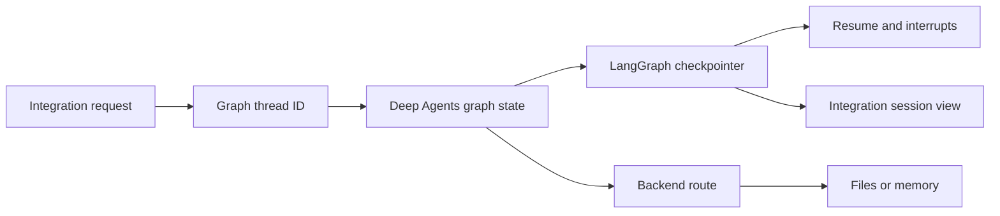
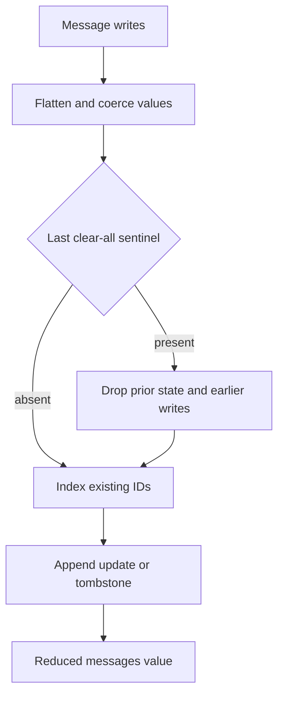
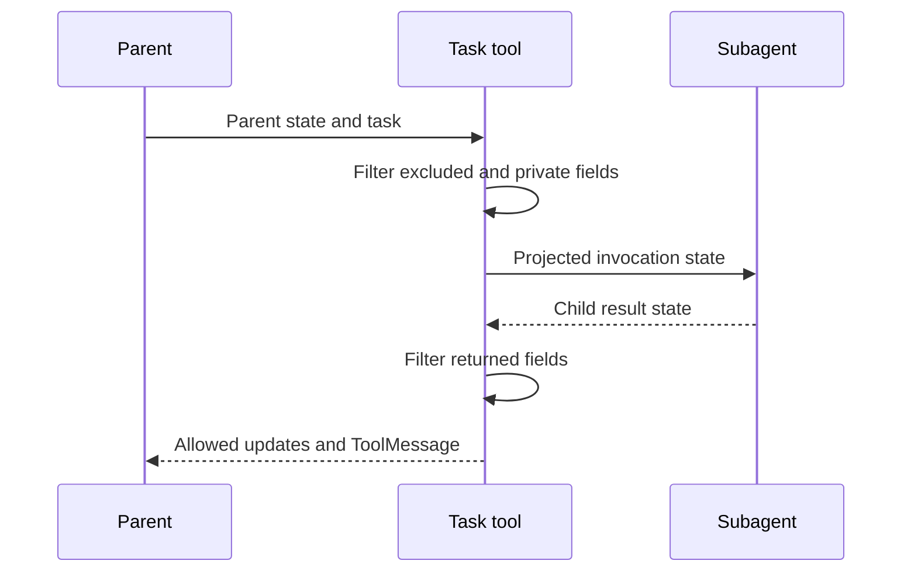

# State, Sessions & Persistence

Deep Agents has several persistence boundaries that should not be conflated:

1. **LangGraph checkpoints** preserve versioned graph state for a `thread_id`: conversation channels, interrupts, and resumability.
2. **Deep Agents backends** own files and memory. Their durability follows the selected backend route, not the mere presence of a checkpointer.
3. **Integration sessions** map a product-level session or conversation onto graph threads, and may add their own catalog, workspace, archive, or replay semantics.

A checkpoint can retain data that is not projected into the root agent output. For example, a task subagent can write a transcript to the parent checkpointer under a `tools:` checkpoint namespace while the parent root `messages` receives only the resulting tool report.

See [Backends](/openwiki/concepts/backends.md) for backend choices, [The code agent](/openwiki/architecture/code-agent.md) for dcode architecture, [ACP](/openwiki/integrations/acp.md), [Talon](/openwiki/integrations/talon.md), and [Cost and sessions](/openwiki/operations/cost-and-sessions.md) for operational guidance.

## Checkpoints are graph state, not all persistence

`create_deep_agent` passes its optional `checkpointer` and `store` through to LangChain's `create_agent`. The checkpointer persists graph state between runs; a `store` is separately required for a backend that uses a store route.

| Concern | Owner | Scope and durability |
| --- | --- | --- |
| Conversation state, interrupts, resume | LangGraph checkpointer | One thread and its checkpoint namespaces; only durable when the configured saver is durable |
| Files and memory | Deep Agents backend | The selected route determines whether data is in checkpoint state, a store, or a filesystem |
| dcode local session data | `sessions.db` | Local SQLite checkpoint rows plus thread metadata and workspace bindings |
| ACP session | ACP server plus its graph | Protocol session ID is the LangGraph thread ID; loading requires a restart-surviving saver |
| Talon conversation | Talon runtime | Conversation ID is the graph thread ID; the host may wrap SQLite checkpoints with a separate archive |

This flow separates checkpointed graph channels from backend resources and the integration-specific view of a session.

The default `StateBackend` reads and queues writes to the `files` channel through LangGraph's `CONFIG_KEY_READ` and `CONFIG_KEY_SEND`. Consequently its files are checkpointed within a thread, do not cross threads, and it can run only in graph execution. A store- or filesystem-backed route has its own persistence boundary; adding a checkpointer does not itself make that route durable.

## DeepAgentState and delta checkpoints

`DeepAgentState` subclasses LangChain's `AgentState` and only overrides `messages`, annotating it with `DeltaChannel(_messages_delta_reducer, snapshot_frequency=50)`. It is the default `state_schema` when no custom schema is supplied to `create_deep_agent`.

Rather than repeatedly persisting full message histories, `DeltaChannel` persists deltas and emits a full snapshot every 50 pregel steps. This makes persisted message volume linear in a long thread while bounding the replay depth. `FilesystemState.files` uses the same delta-channel and snapshot-frequency pattern.

A custom `state_schema` is expected to be a `TypedDict` subclass of `DeepAgentState` so it retains this message channel. This is a type-checker constraint, not an `issubclass` runtime check. `create_deep_agent` merges the base schema with schemas contributed by assembled middleware, allowing middleware to own typed fields for its hooks and tools. It forwards the custom base schema when it compiles declarative `SubAgent` specifications; precompiled `CompiledSubAgent` runnables and remote `AsyncSubAgent` specifications retain their own schemas.

### Message reducer invariants

`_messages_delta_reducer` reduces batches for the `messages` delta channel:

- It flattens list writes and coerces dictionaries, strings, and tuples into typed messages.
- It deduplicates and replaces messages by ID, appends messages with `id=None` unchanged, and removes an identified entry for `RemoveMessage`.
- The last `RemoveMessage(REMOVE_ALL_MESSAGES)` resets prior state and discards writes earlier in that batch.
- It treats `state=None` as an empty list, which supports replay when an old thread's earliest checkpoint did not seed `messages: []`.

LangGraph's `ensure_message_ids` gives `BaseMessage` writes stable IDs before checkpoint serialization. The reducer intentionally does not generate IDs, since doing so during replay could diverge from the persisted IDs. It also deliberately does not turn `BaseMessageChunk` values into full messages: Deep Agents writes full `AIMessage` values to the state channel and uses `astream_events` for output streaming. Focused tests cover stable, non-`None` message IDs returned by `get_state()` for object and dictionary-style input within invocations and after thread resumption.

This is value reconstruction; `DeltaChannel` separately decides whether a checkpoint carries a full snapshot or only writes.

## State transfer and checkpoint namespaces

Middleware can mark schema fields with `PrivateStateAttr`. `private_state_field_names` resolves those annotations across all state schemas, and `create_deep_agent` assigns the resulting set to subagent middleware. The task tool filters private keys when projecting state into a child and again when merging results back.

This protection depends on runtime annotation resolution. If a schema references a `TYPE_CHECKING`-only name, it is skipped with a warning; none of that schema's private fields enter the protected-key set and they may cross the subagent boundary. Import annotation names at runtime.

The normal task mode is `"isolated"`; `"handoff"` is its legacy alias. Both pass a fresh task `HumanMessage` and permitted parent fields, filter excluded/private result fields, and return a root `ToolMessage` rather than the child working transcript. Experimental `"fork"` instead inherits prepared parent context. Declarative forks retain private channels except their fork exclusions, whereas opaque compiled forks exclude private keys. A fork marker prevents nested task delegation.

This is a state projection boundary, not shared mutable state.

A task subagent is directly invoked rather than registered as a graph node. Yet a checkpointed parent can retain its transcript in the same saver under a `tools:` checkpoint namespace. Root output projection normally hides those intermediate messages; inspect checkpoint namespaces or stream with `subgraphs=True` when observability requires the child execution rather than only the parent-visible result.

## dcode: local SQLite sessions and workspace identity

The local dcode CLI opens an `AsyncSqliteSaver` over the hardened global `sessions.db`, calls `setup()`, and supplies that saver while building CLI agent graphs. This is the correction to a common shorthand: `main.py` does not itself persist an independent session object—the LangGraph saver owns the graph checkpoints, while `sessions.py` queries and manages their SQLite rows.

`list_threads` derives its catalog from checkpoint metadata: agent name, timestamps, Git branch, working directory, latest checkpoint ID, and optionally prompt and message-count data. Filtering supports agent, branch, and exact `cwd`. When a delta checkpoint has no inline messages snapshot, dcode reconstructs its visible root-conversation count by replaying root-namespace message writes in checkpoint, task, and index order. It intentionally excludes subgraph writes that share the thread ID. The implementation assumes dcode's linear append-only history; an externally created forked or abandoned branch can over-count.

`ResumeStateMiddleware` adds private checkpoint channels for resume facts. Successful model turns record token usage, and configurable-model middleware records effective model/request facts after successful calls. The client may use `aupdate_state` for accepted goal and rubric choices, while pending proposals and agent status updates are graph-written. They are versioned facts at the selected checkpoint, not thread-wide aggregates.

Deleting a local thread deletes checkpoint and writes rows, clears relevant caches, and then invokes offloaded-history cleanup. When that cleanup completes, the Boolean result reports whether checkpoint rows were deleted. Because cleanup is called after the database commit rather than guarded as best effort, a cleanup exception is propagated even though the checkpoint rows may already be gone.

### Remote dcode workspace bindings

Remote dcode adds a distinct, durable **workspace binding** to a thread. The workspace endpoint validates a client claim against server policy, canonicalizes the `cwd` and project root, fingerprints workspace identity and resource policy, and atomically stores the binding in `dcode_thread_workspaces`. A later bind of the same thread to a different workspace or policy fails with `WorkspaceConflictError`.

Before remote graph execution, the server requires both a thread ID and workspace context, verifies that payload and policy against the persisted binding, and resolves the workspace again to detect identity changes. The binding is therefore not conversation state and does not restore files; it is an authorization and routing invariant that prevents a thread from silently running in another workspace. The server can mirror selected workspace metadata to its remote thread service, but a mirror failure is reported after the durable binding already exists.

## ACP: protocol sessions are optional checkpoint-backed sessions

`AgentServerACP` creates a random session ID and uses it as the LangGraph `thread_id`; it keeps operational mode, model, plan, cwd, MCP-server, and approval data in server-side maps while the process is live. ACP advertises `session/load` only when constructed with `load_sessions=True`.

When durable loading is enabled, creating a session writes ACP metadata into its checkpoint thread. Loading rebuilds or selects the session graph, requires a checkpointer, verifies the ACP marker and that the supplied `cwd` matches the persisted metadata, restores persisted model/mode options, and replays checkpoint-history messages as ACP session updates. Thus ACP itself is a protocol bridge, not a storage engine: `session/load` can survive a restart only if the configured graph saver does. The development test entrypoint uses `MemorySaver`, which is not restart durable.

## Talon: conversation thread plus optional archive

`DeepAgentRuntime` maps `AgentRequest.conversation_id` to LangGraph's `thread_id`. Its library default is `InMemorySaver`, so turns in a running conversation share history but do not survive process loss. A caller can inject another checkpointer. On shutdown, the runtime first cancels background subagents and then closes the saver when it exposes `close`.

The Talon host path with a configured model opens an `AsyncSqliteSaver`, initializes it, and wraps it in `ConversationSaver` with a `SQLiteConversationArchive` at `config.checkpoint_path`. The wrapper delegates checkpoint reads and pending writes to the saver and archives committed root-namespace messages only when trusted channel/chat scope metadata is present. This archive enables conversation-history tools and history reset; it is an additional index/retention layer, not the source of graph resumability.

Checkpoint persistence and archive persistence are intentionally not one cross-store transaction. `ConversationSaver` saves the checkpoint and archives message revisions under a lock; an archive failure propagates after the checkpoint save, and retry is designed to repair the idempotent archive without duplicate revisions. Clearing history deletes the owned backend threads before archive registrations, so failure leaves remaining registrations available for retry. Subgraph checkpoint namespaces are excluded from archive scope.

## Safe extension checklist

- Choose a durable checkpointer when a graph thread must resume; independently choose a backend route for durable files or memory.
- Preserve `DeepAgentState.messages` in custom state and test reducer behavior, including clear-all and replay, if changing message writes.
- Mark sensitive middleware channels with `PrivateStateAttr`, make annotation names resolvable at runtime, and test both directions of task state projection.
- Do not confuse a root state view with storage retention: checkpoint namespaces can hold subagent transcripts that root output does not expose.
- For dcode, treat `sessions.db` checkpoint rows, resume facts, offloaded history, and remote workspace bindings as different resources. Do not accept a changed workspace context for an existing remote thread.
- Enable ACP `session/load` only with a restart-durable saver and preserve its `cwd` validation when changing the server.
- In Talon, select an injected durable saver or the host's SQLite path when restart persistence is required; treat archive failure and checkpoint success as a recoverable split outcome.
